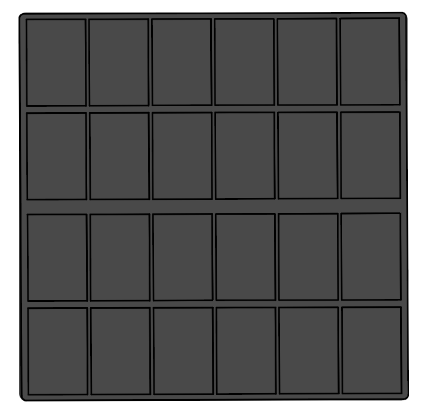

太阳能板
=======================

太阳能板是将阳光转化为电能的设备。它们由光伏（PV）电池组成，这些电池由半导体材料（如硅）制成。当阳光照射到光伏电池时，会将其原子中的电子击出。这些电子流过电池，产生电流。

太阳能板可用于为各种用途发电，包括为家庭、企业甚至整个社区供电。它们是清洁的可再生能源，有助于减少我们对化石燃料的依赖。

**特性**

* 输出功率：6V/660mA
* 充满电池所需时间：7.2 小时（理论值，假设阳光强烈）
* 尺寸：170mm x 170mm
* 线缆：灰色和黑色，24AWG，200mm
* 连接器：白色，XH2.54-2P
