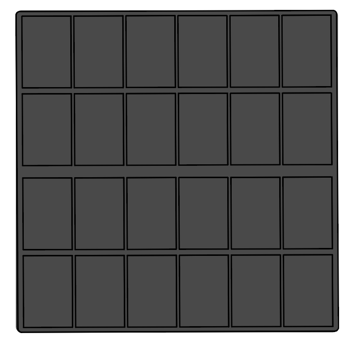

Panel Solar
=======================

Los paneles solares son dispositivos que convierten la luz solar en electricidad. Están compuestos por células fotovoltaicas (PV), fabricadas con materiales semiconductores como el silicio. Cuando la luz solar incide sobre una célula fotovoltaica, libera electrones de sus átomos. Estos electrones fluyen a través de la célula, generando una corriente eléctrica.

Los paneles solares se pueden utilizar para generar electricidad con diversos fines, incluyendo alimentar hogares, empresas e incluso comunidades enteras. Son una fuente de energía limpia y renovable que puede ayudar a reducir nuestra dependencia de los combustibles fósiles.

**Características**

* Potencia de salida: 6V/660mA
* Tiempo para cargar completamente la batería: 7.2h (valor teórico, asumiendo luz solar intensa)
* Tamaño: 170mm x 170mm
* Cables: Gris y Negro, 24AWG, 200mm
* Conector: Blanco, XH2.54-2P