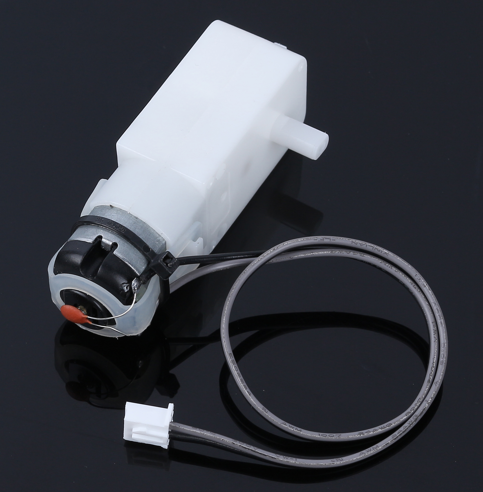
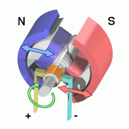
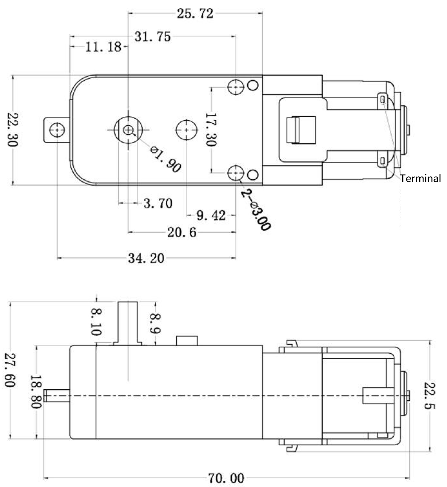

.. note:: 

    你好，欢迎加入 SunFounder 树莓派、Arduino 和 ESP32 爱好者社区！与其他爱好者一起，深入探索树莓派、Arduino 和 ESP32。

    **为什么加入？**

    - **专家支持**：通过社区和团队的帮助解决售后问题和技术挑战。
    - **学习与分享**：交流技巧和教程，提升你的技能。
    - **独家预览**：提前体验新产品发布和独家内容。
    - **专属折扣**：享受最新产品的专属优惠。
    - **节庆促销与赠品**：参与节日促销和赠品活动。

    👉 准备好与我们一起探索和创造了吗？点击 [|link_sf_facebook|] 即刻加入！

.. _cpn_tt_motor:

TT 电机
==============

这是一个 TT 直流齿轮电机，齿轮比为 1:120。它配备了两根 250mm 的导线，并带有 XH2.54-2P 连接器，工作电压为 3VDC。

**电机的工作原理**

电机是机器的心脏，能够将电能转化为机械能。这一转化使各种设备得以运转，从儿童玩具、家用电器到大型车辆。

工作过程如下：

当电流流入电机时，它会产生一个磁场。这个磁场与电机内的其他磁铁相互作用，促使电机旋转。这一旋转动作类似于陀螺旋转，进而驱动机器中轮子、螺旋桨或其他运动部件的转动。

TT 齿轮电机是一种特殊类型的电机，它将标准电机与一系列齿轮结合，并全部封装在耐用的塑料外壳中。

随着电机的旋转，齿轮将旋转运动有效传递到我们的探测车轮子上。齿轮的结合至关重要，因为它能够放大扭矩。这种增强的扭矩能力使电机能够驱动更大更重的负载，这是许多应用中必不可少的能力。

.. image:: img/motor_internal.gif
    :align: center
    :width: 600

**特性**

* 推荐电压：3V~4.5V DC
* 轴数：单轴
* 齿轮比：1:120
* 空载电流：130mA
* 空载转速：38rpm±8%
* 起始电压：2V（最大）在无负载情况下
* 输出扭矩：3V ≥1.2kgf·cm
* 使用寿命：70-120小时
* 转动方向：双向
* 机身尺寸：70 x 22.5 x 36.6mm
* 导线：灰色和黑色，24AWG，250mm
* 连接器：白色，XH2.54-2P
* 重量：28.5g

**尺寸图**

单位：mm

