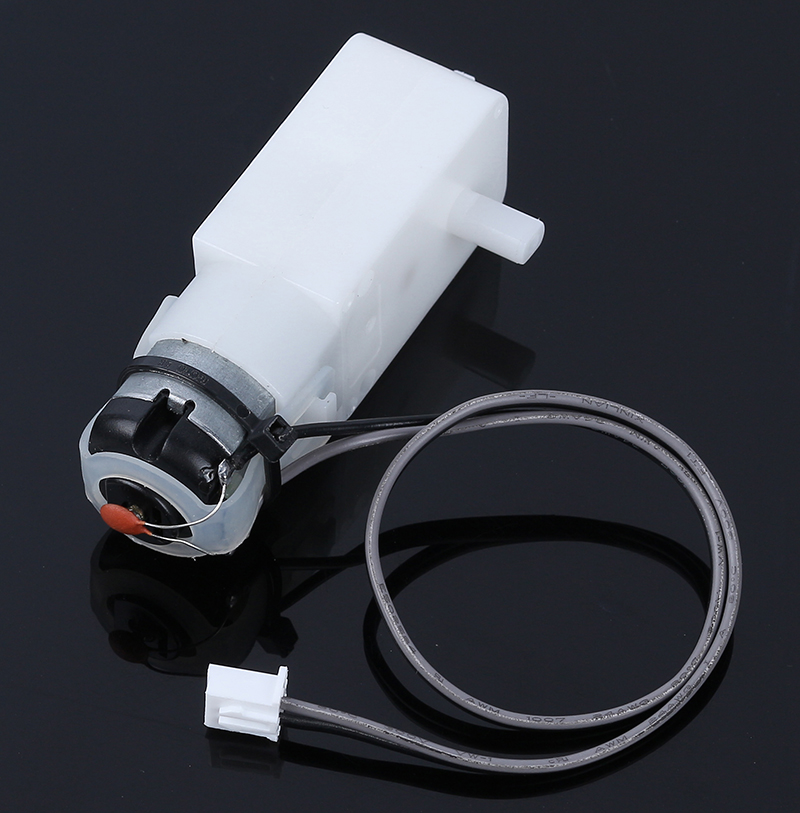
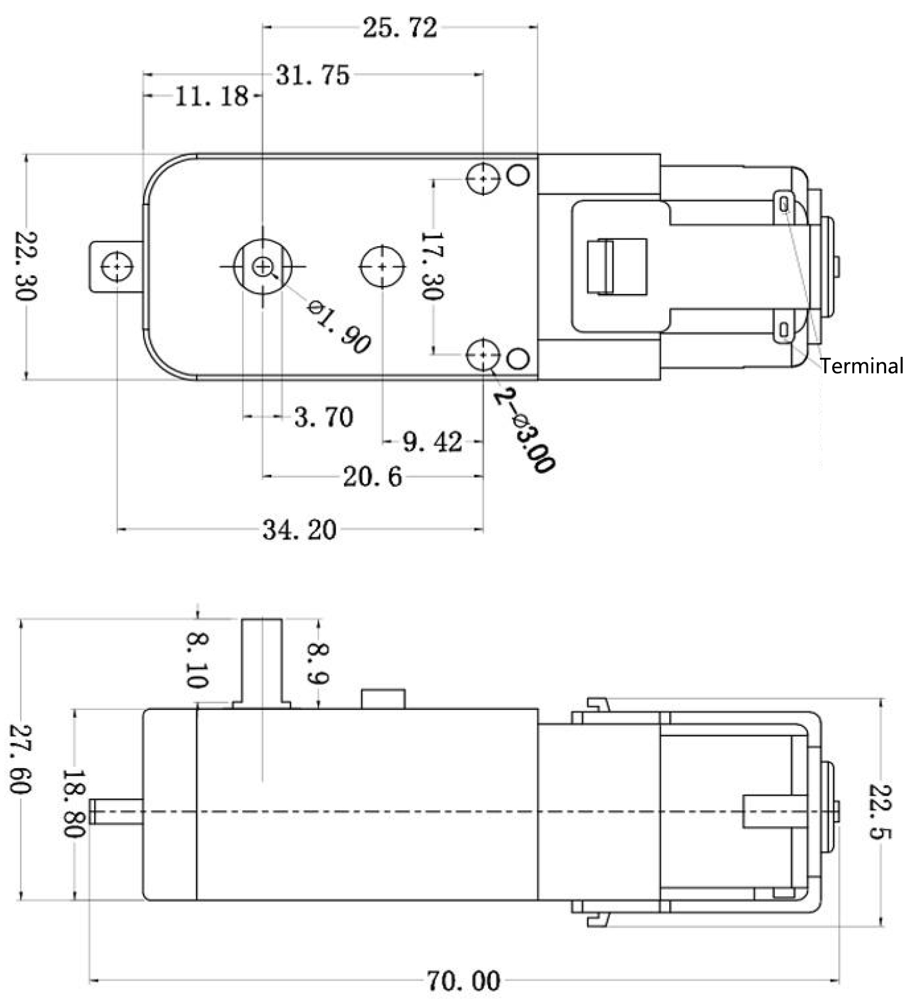

.. _cpn_tt_motor:

TT 电机
==============

这是一款 TT 直流减速电机，减速比为 1:120。附带两根 250mm 线缆，带有 XH2.54-2P 连接器。可使用 3VDC 供电。

**电机工作原理**

电机作为机器的心脏，将电能转化为机械能。这种转换使各种设备得以运行，从儿童玩具、家用电器到大型车辆。

过程如下：

当电流流入电机时，会产生磁场。该磁场与电机内部的其他磁铁相互作用，促使其旋转。这种旋转类似于陀螺的转动，然后可以驱动机器中的轮子、螺旋桨或其他运动部件。

.. image:: img/motor_rotate.gif
    :align: center

TT 减速电机是一种特殊类型的电机。它将标准电机与一系列齿轮组合在一起，全部封装在耐用的塑料外壳内。

当电机旋转时，齿轮有效地将这种旋转运动传递到我们火星车的车轮上。齿轮的集成至关重要，因为它放大了扭矩。这种增加的扭矩容量使电机能够驱动更大、更重的负载，这在各种应用中都是一项重要能力。

.. image:: img/motor_internal.gif
    :align: center
    :width: 600

**特性**

* 建议电压：3V~4.5V 直流
* 轴数：单轴
* 减速比：1:120
* 空载电流：130mA
* 空载转速：38rpm±8%rpm
* 启动电压：2V（最大值），空载条件下
* 输出扭矩：3V ≥1.2kgf.cm
* 使用寿命：70-120H
* 旋转方向：双向
* 机身尺寸：70 x 22.5 x 36.6mm
* 线缆：灰色和黑色，24AWG，250mm
* 连接器：白色，XH2.54-2P
* 重量：28.5g

**尺寸图**

单位：mm

