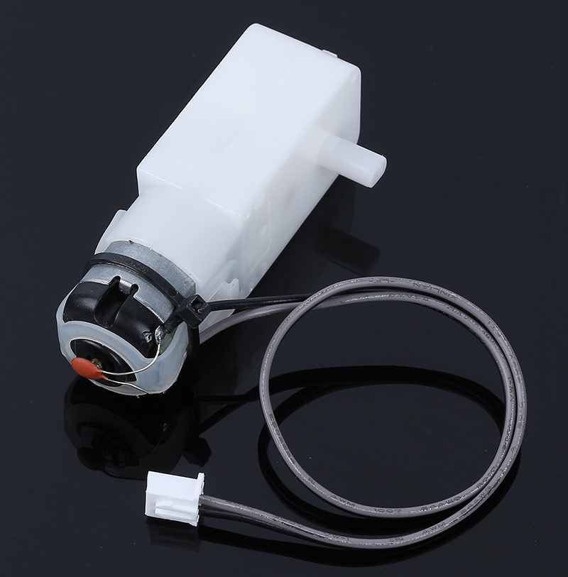
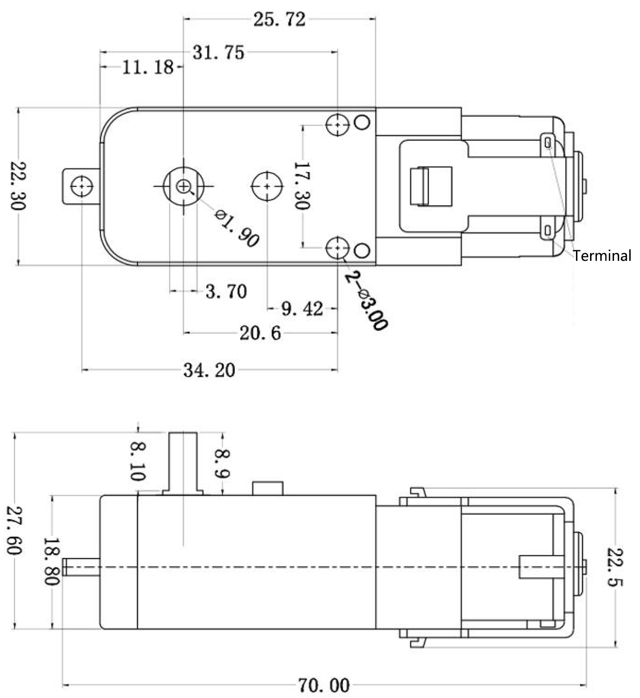

TT Motor
==============

Este es un motorreductor DC TT con una relación de transmisión de 1:120. Viene con dos cables de 250 mm con un conector XH2.54-2P. Puede alimentarse con 3 VDC.

**Cómo funcionan los motores**

Un motor funciona como el corazón de una máquina, transformando la energía eléctrica en energía mecánica. Esta conversión da vida a diversos dispositivos, desde juguetes infantiles y electrodomésticos hasta grandes vehículos.

Este es el proceso:

Cuando la electricidad fluye hacia un motor, genera un campo magnético. Este campo interactúa con otros imanes dentro del motor, haciendo que gire. Esta acción giratoria, similar a la de un trompo, puede entonces impulsar el movimiento de ruedas, hélices u otras partes móviles en una máquina.

.. image:: img/motor_rotate.gif
    :align: center

El motorreductor TT es un tipo especializado de motor. Combina un motor estándar con una serie de engranajes, todo alojado dentro de una carcasa de plástico duradero.

A medida que el motor gira, los engranajes transmiten eficazmente este movimiento rotatorio a las ruedas de nuestro rover. La integración de engranajes es fundamental, ya que amplifica el torque. Esta mayor capacidad de torque permite al motor maniobrar cargas más grandes y pesadas, una capacidad esencial en diversas aplicaciones.

.. image:: img/motor_internal.gif
    :align: center
    :width: 600

**Características**

* Voltaje sugerido 3V~4.5V DC
* Número de ejes: Eje simple
* Relación de transmisión: 1:120
* Corriente sin carga: 130mA
* Velocidad sin carga: 38rpm±8%rpm
* Voltaje de arranque: 2V (máx.) sin carga
* Torque de salida: 3V —.2kgf.cm
* Vida útil: 70-120H
* Dirección de giro: Bidireccional
* Dimensiones del cuerpo: 70 x 22.5 x 36.6mm
* Cables: Gris y negro, 24AWG, 250mm
* Conector: Blanco, XH2.54-2P
* Peso: 28.5g

**Dibujo dimensional**

Unidad: mm

