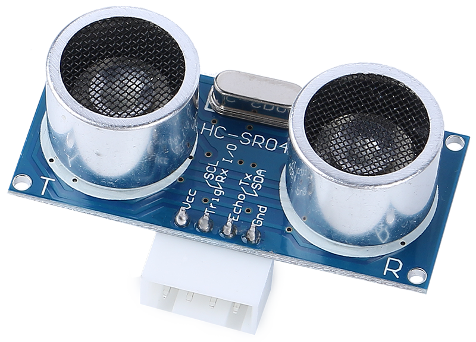


超声波模块
================================

* **TRIG** ：触发脉冲输入
* **ECHO** ：回波脉冲输出
* **GND** ：接地
* **VCC** ：5V 电源

这是 HC-SR04 超声波距离传感器，提供 2 cm 到 400 cm 的非接触式测量，测距精度高达 3 mm。模块上包含一个超声波发射器、一个接收器和一个控制电路。

你只需连接 4 个引脚：VCC（电源）、Trig（触发）、Echo（接收）和 GND（接地），即可轻松用于你的测量项目。

**特性**

* 工作电压：DC5V
* 工作电流：16mA
* 工作频率：40Hz
* 最大量程：500cm
* 最小量程：2cm
* 触发输入信号：10uS TTL 脉冲
* 回波输出信号：输入 TTL 电平信号，与距离成比例
* 连接器：XH2.54-4P
* 尺寸：46x20.5x15 mm

**原理**

基本原理如下：

* 使用 IO 触发，发送至少 10us 的高电平信号。
* 模块以 40 kHz 发送 8 个周期的超声波脉冲，并检测是否接收到脉冲信号。
* 如果信号返回，Echo 将输出高电平；高电平的持续时间即为从发射到返回的时间。
* 距离 = (高电平时间 x 声速 (340M/S)) / 2

    .. image:: img/ultrasonic_prin.jpg
        :width: 800

**应用注意事项**

* 此模块不应在通电状态下连接，如有必要，请先连接模块的 GND。否则会影响模块的工作。
* 被测物体的面积应至少为 0.5 平方米，并尽可能平整。否则会影响测量结果。
