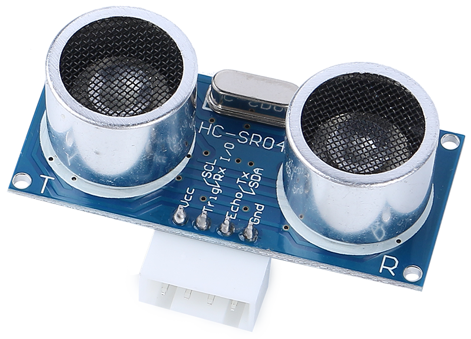

.. include:: /index.rst
   :start-after: start_hello_message
   :end-before: end_hello_message

超音波モジュール
================================

* **TRIG**: トリガーパルス入力
* **ECHO**: エコーパルス出力
* **GND**: グランド
* **VCC**: 5V 電源

これは HC-SR04 超音波距離センサーで、2 cm から 400 cm までの非接触測定を最大 3 mm の範囲精度で提供します。モジュールには、超音波送信機、受信機、および制御回路が含まれています。

VCC（電源）、Trig（トリガー）、Echo（受信）、GND（グランド）の 4 つのピンを接続するだけで、測定プロジェクトに簡単に使用できます。

**特徴**

* 動作電圧: DC5V
* 動作電流: 16mA
* 動作周波数: 40Hz
* 最大範囲: 500cm
* 最小範囲: 2cm
* トリガー入力信号: 10uS TTL パルス
* エコー出力信号: 入力 TTL レベル信号と範囲に比例
* コネクタ: XH2.54-4P
* 寸法: 46x20.5x15 mm

**原理**

基本的な原理は次のとおりです:

* IO トリガーを使用して、少なくとも 10us の High レベル信号を送信します。
* モジュールは 40 kHz で 8 サイクルの超音波バーストを送信し、パルス信号が受信されるかどうかを検出します。
* 信号が返ってきた場合、Echo は High レベルを出力します。High レベルの持続時間は、送信から返信までの時間です。
* 距離 = (High レベル時間 x 音速（340M/S）) / 2

    .. image:: img/ultrasonic_prin.jpg
        :width: 800

**アプリケーションノート**

* このモジュールは電源投入時に接続しないでください。必要な場合は、モジュールの GND を最初に接続してください。そうしないと、モジュールの動作に影響を与えます。
* 測定対象物の面積は少なくとも 0.5 平方メートル以上で、できるだけ平らである必要があります。そうしないと、結果に影響を与えます。
