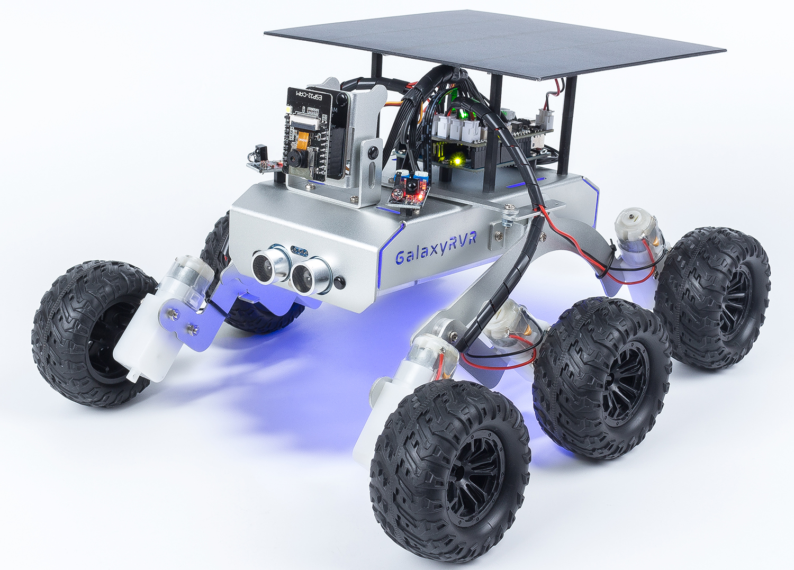

.. note::

    こんにちは、SunFounderのRaspberry Pi & Arduino & ESP32愛好家コミュニティへようこそ！Facebook上でRaspberry Pi、Arduino、ESP32についてもっと深く掘り下げ、他の愛好家と交流しましょう。

    **参加する理由は？**

    - **エキスパートサポート**：コミュニティやチームの助けを借りて、販売後の問題や技術的な課題を解決します。
    - **学び＆共有**：ヒントやチュートリアルを交換してスキルを向上させましょう。
    - **独占的なプレビュー**：新製品の発表や先行プレビューに早期アクセスしましょう。
    - **特別割引**：最新製品の独占割引をお楽しみください。
    - **祭りのプロモーションとギフト**：ギフトや祝日のプロモーションに参加しましょう。

    👉 私たちと一緒に探索し、創造する準備はできていますか？[|link_sf_facebook|]をクリックして今すぐ参加しましょう！

|link_Mars_Rover_Kit| - SunFounder社の火星探査ローバーキット
========================================================

* |link_GalaxyRVR|

SunFounder |link_Mars_Rover_Kit|をお選びいただき、ありがとうございます。

.. note::
    このドキュメントは以下の言語で利用可能です。

        * |link_german_tutorials|
        * |link_jp_tutorials|
        * |link_en_tutorials|
        * |link_fr_tutorials|
        * |link_es_tutorials|
        * |link_it_tutorials|
        * |link_cn_tutorials|

    ご希望の言語でドキュメントにアクセスするために、それぞれのリンクをクリックしてください。

NASAのエンジニアが夢見る、荒涼とした火星の地形を探査するローバーの操縦を想像してみてください。未知との遭遇、異世界の風景を探索するのは、まるで夢のようですよね？

でも、それはもう夢ではありません。

GalaxyRVRの世界へようこそ。これはSunFounderから提供される火星探査ローバーキットで、宇宙探査のスリルをあなたのリビングルームに持ち込むことを目指しています。

NASAの本物の火星探査ローバーに使われているユニバーサルロッカーボギーシステムを採用したGalaxyRVRは、岩だらけの山々、砂浜、草原など、あらゆる地形を横断する能力を持っています。このサスペンションシステムは、スムーズな移動を保証し、火星の異世界を家のように感じさせます。

高解像度のカメラモジュールを装備しているGalaxyRVRは、まるで赤い惑星を実際にナビゲートしているかのような没入感のある一人称視点を提供します。進化した障害物回避モジュールと超音波モジュールにより、障害物を避けながら、自律性と復元力の精神を体現しています。

**宇宙への深い探究：コース**

* :ref:`play_mode`：すぐに始めたいですか？プレイモードは、火星の旅に待ちきれない人向けに設計されています。工場出荷時にプリロードされたコードを使用して、GalaxyRVRを組み立て、便利なアプリで制御して、多様な機能を探索しましょう。

* :ref:`course_mode`：その基盤となる技術に興味がありますか？コースモードは、より深く探究したい人向けです。GalaxyRVRの設計背景を理解し、コーディングを学び、ローバーにさまざまなエキサイティングな機能を付加しましょう。

このドキュメンテーションは、GalaxyRVRの複雑さを探究するためのガイドです。詳細な組み立て手順、プログラミングガイド、火星探査ローバーの動作原理への洞察など、あなたの好奇心を刺激し、創造力を育むための内容が含まれています。

GalaxyRVRは単なるおもちゃではなく、火星への入り口、教育ツール、そして無限の想像力の触媒です。GalaxyRVRで今日から宇宙の旅を始めて、あなたの世界を火星の一部にしましょう。

.. toctree::
    :maxdepth: 2

    このキットについて <self>
    assemble_video
    play_mode
    course_mode
    hardware/hardware
    faq

**著作権に関するお知らせ**

このマニュアルに含まれるテキスト、画像、コードなどのすべての内容はSunFounder社が所有しています。これらの内容は、著者および関連する権利保有者の合法的な権利を侵害することなく、個人的な学習、研究、楽しみ、その他の非営利目的のためにのみ使用してください。許可なく商業的な利益のためにこれらの内容を使用する個人または団体に対しては、会社は法的措置をとる権利を留保します。

