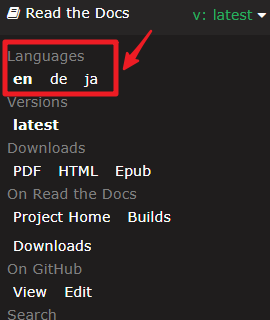

GalaxyRVR - SunFounder Mars Rover Kit
========================================================

Thanks for choosing our GalaxyRVR.

.. note::
    This document is available in the following languages.

        * |link_german_tutorials|
        * |link_jp_tutorials|
        * |link_en_tutorials|
    
    Please click on the respective links to access the document in your preferred language.

Imagine piloting a rover on the desolate terrain of Mars, exploring alien landscapes and confronting the unknown. Sounds like a dream for NASA engineers, right?

Not anymore.

Welcome to the world of the GalaxyRVR, a Mars Rover kit from SunFounder, designed to bring interplanetary exploration right into your living room.

.. image:: img/galaxyRVR.jpg
    :width: 600
    :align: center

Built upon the same universal rocker-bogie system employed by NASA's real Mars rovers, GalaxyRVR is capable of traversing all kinds of terrains – be it rocky mountains, sandy beaches, or grassy fields. The suspension system ensures smooth mobility, making the alien world of Mars feel just like home.

Equipped with a high-definition camera module, GalaxyRVR offers a first-person view, providing an immersive piloting experience as if 
you're truly navigating the Red Planet. Its advanced obstacle avoidance module and ultrasonic module ensure it can dodge obstacles, embodying a spirit of autonomy and resilience.

**Delve into the Cosmos: The Courses**

* :ref:`play_mode`: Want a quick start? Play Mode is designed for those who can't wait to start their Martian journey. With factory-preloaded code, simply assemble your GalaxyRVR and control it using the convenient app to explore its multitude of functions.

* :ref:`course_mode`: Intrigued by the underlying technology? Course Mode is for those who want to delve deeper. Understand the principles behind the GalaxyRVR's design, learn to code, and empower your rover with a variety of exciting features.

This documentation is your guide to exploring the intricacies of GalaxyRVR. It includes detailed assembly instructions, programming guides, and insights into the working principles of a Mars Rover, all aimed to stimulate your curiosity and foster creativity.

The GalaxyRVR isn't just a toy, but a gateway to Mars, an educational tool, and a catalyst for limitless imagination. Start your cosmic journey today with GalaxyRVR, and let your world become an extension of Mars.

.. toctree::
    :maxdepth: 2

    About this Kit <self>
    assemble_video
    play_mode
    course_mode
    hardware/hardware
    faq

**About the display language**

This document is available in other languages as well. To switch the display language, kindly click on the **Read the Docs** icon located in the lower left corner of the page.

    
If you have any questions, please send an email to service@sunfounder.com and we will respond as soon as possible.

**Copyright Notice**

All contents including but not limited to texts, images, and code in this manual are owned by the SunFounder Company. You should only use it for personal study,investigation, enjoyment, or other non-commercial or nonprofit purposes, under therelated regulations and copyrights laws, without infringing the legal rights of the author and relevant right holders. For any individual or organization that uses these for commercial profit without permission, the Company reserves the right to take legal action.

