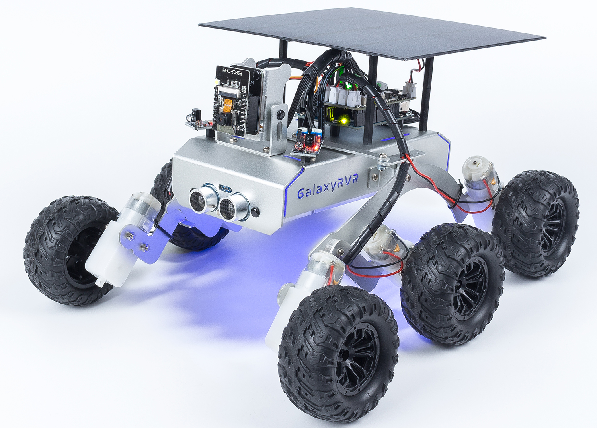

.. note::

    Hello, welcome to the SunFounder Raspberry Pi & Arduino & ESP32 Enthusiasts Community on Facebook! Dive deeper into Raspberry Pi, Arduino, and ESP32 with fellow enthusiasts.

    **Why Join?**

    - **Expert Support**: Solve post-sale issues and technical challenges with help from our community and team.
    - **Learn & Share**: Exchange tips and tutorials to enhance your skills.
    - **Exclusive Previews**: Get early access to new product announcements and sneak peeks.
    - **Special Discounts**: Enjoy exclusive discounts on our newest products.
    - **Festive Promotions and Giveaways**: Take part in giveaways and holiday promotions.

    👉 Ready to explore and create with us? Click [|link_sf_facebook|] and join today!

|link_Mars_Rover_Kit| - SunFounder Mars Rover Kit
========================================================

* |link_GalaxyRVR|

Thanks for choosing our |link_Mars_Rover_Kit|.

.. note::
    This document is available in the following languages.

        * |link_german_tutorials|
        * |link_jp_tutorials|
        * |link_en_tutorials|
        * |link_fr_tutorials|
        * |link_es_tutorials|
        * |link_it_tutorials|
        * |link_cn_tutorials|
    
    Please click on the respective links to access the document in your preferred language.

Imagine piloting a rover on the desolate terrain of Mars, exploring alien landscapes and confronting the unknown. Sounds like a dream for NASA engineers, right?

Not anymore.

Welcome to GalaxyRVR, a Mars Rover kit from SunFounder, bringing interplanetary exploration into your living room.

Built on NASA's rocker-bogie system, GalaxyRVR can traverse rocky mountains, sandy beaches, and grassy fields with smooth mobility, making Mars feel like home.

Equipped with a high-definition camera, GalaxyRVR provides a first-person view for an immersive piloting experience. Its advanced obstacle avoidance and ultrasonic modules ensure it can dodge obstacles autonomously.

Choose your path based on your interests and skill level:

* :ref:`quick_start`: Get started right away by controlling the GalaxyRVR with the RoboPilot App, or quickly run example codes in Arduino IDE and Mammoth Coding — ideal for beginners who want fast, hands-on control.  

* :ref:`programming_arduino`: Delve deeper into the code, understand each function, and customize the GalaxyRVR with Arduino programming. Ideal for those seeking in-depth knowledge and experimentation.

* :ref:`programming_scratch`: Use Scratch to program the GalaxyRVR. A visual and block-based language perfect for beginners and those new to coding.

.. toctree::
    :maxdepth: 2

    About this Kit <self>
    assemble_video
    update_firmware
    quick_start/quick_start
    arduino/programming_arduino
    scratch/scratch
    hardware/hardware
    faq

**Copyright Notice**

All contents including but not limited to texts, images, and code in this manual are owned by the SunFounder Company. You should only use it for personal study,investigation, enjoyment, or other non-commercial or nonprofit purposes, under therelated regulations and copyrights laws, without infringing the legal rights of the author and relevant right holders. For any individual or organization that uses these for commercial profit without permission, the Company reserves the right to take legal action.

