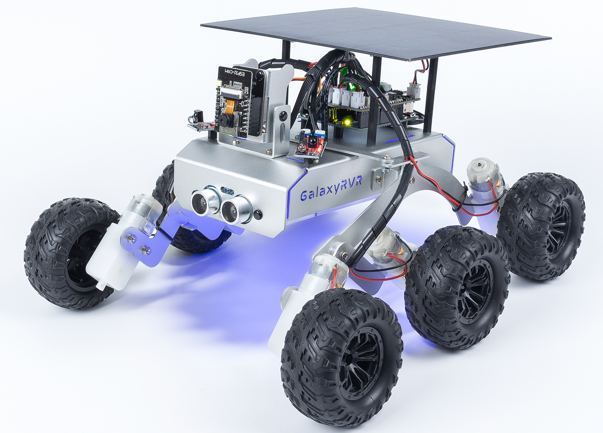

.. start_hello_message

.. note::

    SunFounderのRaspberry Pi & Arduino & ESP32愛好家Facebookコミュニティへようこそ！仲間の愛好家と一緒に、Raspberry Pi、Arduino、ESP32をより深く探求しましょう。

    **参加する理由**

    - **エキスパートサポート**：コミュニティとチームの助けを借りて、販売後の問題や技術的な課題を解決します。
    - **学びと共有**：スキルを向上させるためのヒントやチュートリアルを交換しましょう。
    - **限定プレビュー**：新製品の発表や先行公開にいち早くアクセスできます。
    - **特別割引**：最新製品を特別割引価格でご購入いただけます。
    - **お祭りキャンペーンとプレゼント**：プレゼント企画やホリデープロモーションに参加しましょう。

    👉 一緒に探求し創造する準備はできましたか？ [|link_sf_facebook|] をクリックして今すぐ参加しましょう！

.. end_hello_message

|link_Mars_Rover_Kit| - SunFounder マーズローバーキット
========================================================

* |link_GalaxyRVR|

|link_Mars_Rover_Kit| をお選びいただき、ありがとうございます。

.. note::
    このドキュメントは以下の言語でご利用いただけます。

        * |link_german_tutorials|
        * |link_jp_tutorials|
        * |link_en_tutorials|
        * |link_fr_tutorials|
        * |link_es_tutorials|
        * |link_it_tutorials|
        * |link_cn_tutorials|

    お好みの言語のリンクをクリックして、ドキュメントをご覧ください。

荒涼とした火星の地形をローバーで操縦し、異星の風景を探索し、未知の世界に立ち向かう——そんな夢を想像したことはありますか？まるでNASAのエンジニアのようですね。

もう夢ではありません。

GalaxyRVR へようこそ。SunFounder のマーズローバーキットが、惑星間探査をあなたのリビングルームにお届けします。

NASA のロッカーボギーシステムを採用した GalaxyRVR は、岩山、砂浜、芝生の上でもスムーズに走行し、まるで火星が故郷のように感じられます。

高解像度カメラを搭載した GalaxyRVR は、一人称視点での没入感あふれる操縦体験を提供します。高度な障害物回避モジュールと超音波モジュールにより、自律的に障害物を回避できます。

興味やスキルレベルに応じて、以下のパスをお選びください：

* :ref:`quick_start` : RoboPilot アプリで GalaxyRVR をすぐに操作したり、Arduino IDE や Mammoth Coding でサンプルコードを素早く実行できます。すぐにハンズオンで操作したい初心者に最適です。

* :ref:`programming_arduino` : コードを深く掘り下げ、各機能を理解し、Arduino プログラミングで GalaxyRVR をカスタマイズできます。深い知識と実験を求める方に最適です。

* :ref:`programming_scratch` : Scratch を使用して GalaxyRVR をプログラミングします。初心者やコーディングに初めて挑戦する方に最適なビジュアルブロック型言語です。

.. toctree::
    :maxdepth: 2

    About this Kit <self>
    assemble_video
    update_firmware
    quick_start/quick_start
    arduino/programming_arduino
    scratch/scratch
    hardware/hardware
    faq

**著作権表示**

本マニュアルに含まれるテキスト、画像、コードを含むがこれらに限らないすべての内容は、SunFounder 社に帰属します。これらは、関連する規制および著作権法に基づき、個人の学習、調査、楽しみ、またはその他の非商業的・非営利的目的にのみ使用するものとします。著作者および関連権利者の法的権利を侵害しない範囲でご利用ください。許可なく商業的利益を目的としてこれらを使用する個人または組織に対して、当社は法的措置を取る権利を留保します。
