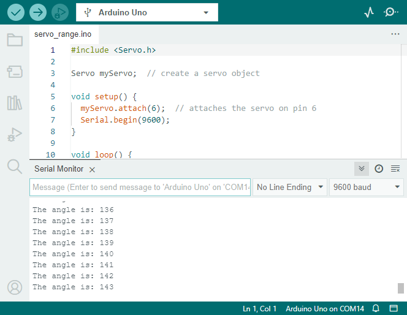

レッスン10：火星ローバーの視覚システム - サーボとチルトメカニズムの探求
===================================================================================

若い探検家の皆さん、お帰りなさい！今日の冒険では、火星ローバーの魅力的な視覚システムについて深く掘り下げます。
私たちの目と首が連携して周囲を見たりナビゲートしたりするように、ローバーにも火星の危険な地形をナビゲートするための同様のシステムが必要です。そして、今日はそれを作ることになります！

ローバーの視覚システムには二つの主要な部分があります：「目」として機能するカメラと、「首」として機能し、上下に見ることを可能にするチルトメカニズムです。このレッスンの終わりまでに、ローバーに「見る」と「うなずく」能力を与えましょう！

まず、チルトメカニズムを作ります - ローバーのカメラを保持し、垂直に回転させる装置です。
これは、ローバーに首を与え、その「頭」またはカメラを上下にうなずかせるようなものです！

次に、チルトメカニズムを動かす小さくて強力な「筋肉」であるサーボについて学びます。
その動作原理と、Arduinoプログラミングを使用してどのように制御するかを理解しましょう。

首の筋肉が私たちの頭を動かして目がより良い視界を得られるように、サーボがチルトメカニズムを動かしてローバーのカメラが火星の地形をより良く調査できるようにします。

では、探検家の皆さん、ベルトを締めて、ローバーに独自の視覚システムを装備するミッションを始めましょう！

.. raw:: html

    <video width="600" loop autoplay muted>
        <source src="_static/video/servo_range.mp4" type="video/mp4">
        お使いのブラウザーはビデオタグをサポートしていません。
    </video>

学習目標
----------------

* 火星ローバーモデルにチルトメカニズムを取り付け、操作する方法を実践する。
* サーボの動作原理とアプリケーションを理解する。
* Arduinoプログラミングを通じてサーボの動きを制御する方法を学ぶ。

材料
---------------

* Arduino UNO開発ボード
* サーボ
* ジンバルとカメラ
* 火星ローバーモデル（TTモーター、サスペンションシステム、超音波および赤外線障害物回避モジュール、RGB LEDストリップ装備）
* Arduino IDE
* コンピューター

手順
-----------

**ステップ1：サーボとは何か？**

人形劇を見たことがありますか？もし見たことがあれば、人形使いがいくつかの糸を引くだけで、人形の腕、足、頭をスムーズに動かす方法に驚いたかもしれません。ある意味で、サーボモーターは私たちの人形使いのようなものです。

.. image:: img/puppet_show.png
    :width: 200
    :align: center

サーボモーターは、車輪のようにぐるぐる回る通常のモーターとは異なります。代わりに、特定の位置に動かしてその位置を保持することができます。例えば、「サイモンが言う、腕を90度の角度に上げろ！」というゲームをしているとします。それができますよね？サーボのように、腕をどれだけ動かすかを正確に制御できるからです。

.. image:: img/servo.png
    :align: center

* 茶色の線：GND
* オレンジの線：シグナルピン、メインボードのPWMピンに接続。
* 赤い線：VCC

あなたが特定の位置に腕を動かすように制御できるのと同様に、サーボモーターを使用してプロジェクトの中で物体の正確な位置を制御することができます。火星ローバーでは、サーボを使用してチルトメカニズムの上下の動きを制御します。これは、あなたが頭を上下にうなずくのと同じようなものです。

次のステップでは、サーボモーターの内部を詳しく探り、その動作原理を理解します。ワクワクしますね？さあ、行きましょう！

**ステップ2：サーボはどのように動くのか？**

サーボはどのようにしてその魔法を発揮するのでしょうか？サーボの中を興味深く探検してみましょう！

サーボの内部を覗いてみると、いくつかの部品が見えます。サーボの中心には、通常のモーターがあり、それは火星ローバーの車輪を回すモーターと非常に似ています。モーターの周りには大きな歯車があり、モーターシャフト上の小さな歯車と接続されています。これにより、モーターの高速で円を描く動きが、より遅くて力強い動きに変換されます。

.. image:: img/servo_internal.png
    :align: center

しかし、それがサーボを特別なものにしているわけではありません。魔法は「potentiometer」と「control circuitry」の小さな電子部品で起こります。こう動きます：サーボが動くと、ポテンショメーターが回転して抵抗が変わります。制御回路はこの抵抗の変化を測定し、サーボがどの位置にあるかを正確に知ることができます。賢いですね？

サーボを制御するためには、「パルス幅変調」信号またはPWMを送ります。これらのパルスの幅を変えることで、サーボがどれだけ動くかを正確に制御し、その位置で保持することができます。

次のステップでは、Arduinoを使用してサーボを制御する方法を学びます。コードの形での魔法の呪文の準備はできましたか？さあ、行きましょう！

**ステップ3：Arduinoを使用してサーボを制御する**

さて、探検家の皆さん、サーボの動作原理がわかったので、魔法の杖であるArduinoを使用して制御する方法を学びましょう！

サーボを制御することは、それに指示を与えるようなものです。先ほど言及したパルス幅変調（PWM）信号を覚えていますか？それらを使用してサーボにどこに移動するかを伝えます。

幸いなことに、Arduinoには ``Servo`` という組み込みライブラリがあり、これにより作業が簡単になります。このライブラリを使用して ``Servo`` オブジェクトを作成し、それにピンをアタッチ（サーボが接続されているピン）し、 ``write()`` という単純なコマンドを使用して角度を設定できます。

コードのスニペットは次のようになります：

.. code-block:: arduino

    #include <Servo.h> 

    Servo myServo;  // create a servo object

    void setup() {
        myServo.attach(6);  // attaches the servo on pin 6
    }

    void loop() {
        myServo.write(90);  // tell servo to go to 90 degrees
    }

このコードでは、 ``myServo`` はサーボオブジェクトで、 ``attach(6)`` はサーボがピン6に接続されていることをArduinoに伝え、 ``write(90)`` はサーボに90度に動くよう指示します。

よくやりました、探検家の皆さん！Arduinoを使用してサーボモーターを制御する方法を学びました。さまざまな角度で実験してみてください！

**ステップ4：視覚システムの組み立て**

これで、ローバーの視覚システムの組み立ての準備が整いました。

.. note::

    * ESP32 CAMをカメラアダプターに挿入する際は、その向きに注意してください。ESP32アダプターに正しく合わせる必要があります。

    .. image:: img/esp32_cam_direction.png
        :width: 300
        :align: center
    
.. raw:: html

    <iframe width="600" height="400" src="https://www.youtube.com/embed/h43JVI3xLqE?si=Q7-RvRvZOusK7vPo" title="YouTube video player" frameborder="0" allow="accelerometer; autoplay; clipboard-write; encrypted-media; gyroscope; picture-in-picture; web-share" allowfullscreen></iframe>

**ステップ5：チルトメカニズムの限界を理解する**

サーボは0度から180度の間で回転するように設計されていますが、ある地点（例えば150度を超えた後）で反応しなくなることに気付くかもしれません。なぜこのようなことが起こるのか、疑問に思ったことはありませんか？次の冒険で一緒にこの謎を探りましょう！

鳥が首をあまりにも曲げて自分の体にぶつかり、これ以上動けなくなるのを想像できますか？ローバーのチルトメカニズムも同様の状況に直面します。サーボがメカニズムを下に動かすと、ローバーの本体にぶつかり、ある角度を超えることができなくなります。

コード内で手の届かない角度を書き込んで、この地点を超えて動かそうとすると、小さなサーボ鳥は詰まってしまい、さらには自身を傷つける可能性があります！それは望まないことですよね？ですので、ちょっとした実験をして、その動きの限界を理解しましょう。

サーボを0度から180度まで回転させるためにforループを使用し、シリアルモニターで角度を記録します。

.. raw:: html

    <iframe src=https://create.arduino.cc/editor/sunfounder01/848c7a3a-16b2-4a7e-8d66-bb91848bc6d9/preview?embed style="height:510px;width:100%;margin:10px 0" frameborder=0></iframe>

* ESP32-CAMとArduinoボードは、同じRX（受信）およびTX（送信）ピンを共有しています。したがって、コードをアップロードする前に、ESP32-CAMを右側にスライドさせて解放し、競合や潜在的な問題を避ける必要があります。

    .. image:: img/camera_upload.png
        :width: 600

* このコードをアップロードした後、 **Serial Monitor** を開きます。情報が表示されない場合は、GalaxyRVRシールド上の **Reset button** を押してコードを再度実行します。

* サーボが回転し、シリアルモニターに角度が表示されます。

.. raw:: html

    <video width="600" loop autoplay muted>
        <source src="_static/video/servo_range.mp4" type="video/mp4">
        お使いのブラウザーはビデオタグをサポートしていません。
    </video>
    
私のローバーでは、チルトメカニズムは約140°まで上がりましたが、ローバーの本体にぶつかり、それ以上進むことができませんでした。

ですので、探検家の皆さん、ローバーを安全で機能的に保つために、その限界を尊重することを常に忘れないでください！

**ステップ6：共有と反省**

よくやりました、探検家の皆さん！今日、あなたはローバーにチルトメカニズムを構築しただけでなく、サーボを制御して動かす方法も理解しました。これは、火星ローバーミッションにおける大きな一歩です。

さて、今日の経験を共有し、学んだことを反省しましょう。

チルトメカニズムの設定やサーボのプログラミング中に何か課題に遭遇しましたか？それらはどのように乗り越えましたか？

乗り越えた課題は私たちをより賢くし、ローバーをより良くします。ですので、あなたの話、アイデア、解決策を共有することをためらわないでください。あなたの革新的な解決策が、他の探検家の旅を助けるかもしれません！
