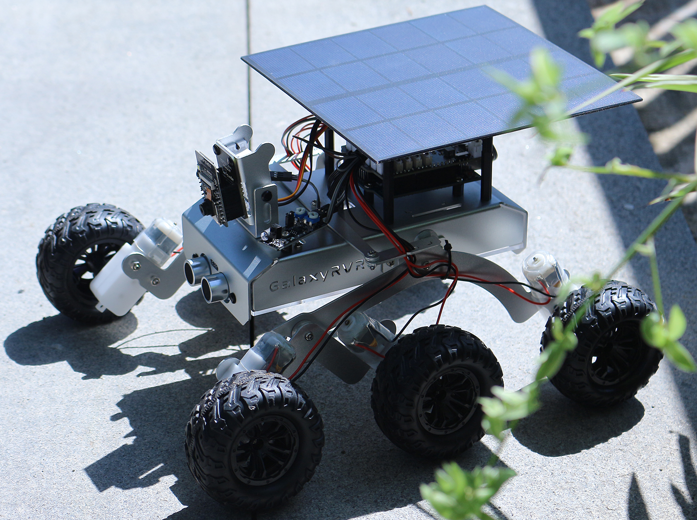
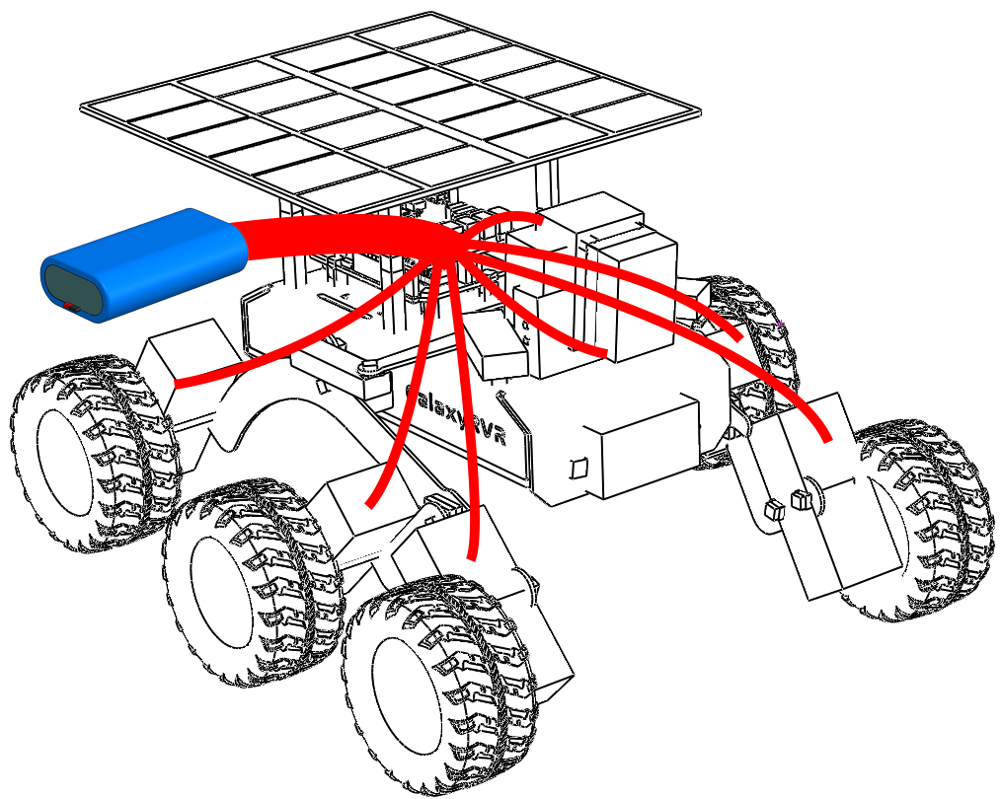
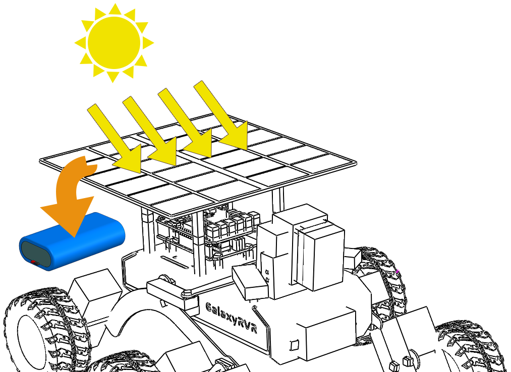

.. note::

    Ciao, benvenuto nella community SunFounder Raspberry Pi & Arduino & ESP32 Enthusiasts su Facebook! Approfondisci Raspberry Pi, Arduino e ESP32 con altri appassionati.

    **Perché unirti?**

    - **Supporto da esperti**: Risolvi problemi tecnici e post-vendita con l'aiuto della nostra community e del nostro team.
    - **Impara e Condividi**: Scambia suggerimenti e tutorial per migliorare le tue competenze.
    - **Anteprime esclusive**: Ottieni accesso anticipato a nuovi annunci di prodotto e anteprime.
    - **Sconti speciali**: Approfitta di sconti esclusivi sui nostri prodotti più recenti.
    - **Promozioni e giveaway festivi**: Partecipa a concorsi e promozioni durante le festività.

    👉 Pronto a esplorare e creare con noi? Clicca [|link_sf_facebook|] e unisciti oggi stesso!

Lezione 13: Esplorare il sistema energetico del Mars Rover
=================================================================

Benvenuto all'ultima lezione del nostro viaggio di esplorazione con il Mars Rover. 
Questa volta, ci addentreremo nel cuore del rover: il suo sistema energetico.

Quando si pensa all'esplorazione di pianeti lontani come Marte, uno degli aspetti 
più critici da considerare è l'energia. Come si alimentano questi rover in ambienti 
così ostili e remoti? In questa lezione, esploreremo questo affascinante tema e 
scopriremo come i rover, incluso il nostro modello di Mars Rover, raccolgono e gestiscono l'energia.

Esamineremo i principi di funzionamento della batteria e del pannello solare e metteremo 
in pratica l'installazione e l'uso di queste fonti di energia sul nostro modello di rover. 
Inoltre, porteremo le nostre competenze a un livello superiore utilizzando Arduino per 
monitorare il livello della batteria.

Alla fine della lezione, saremo in grado di visualizzare queste importanti statistiche 
energetiche direttamente sulla nostra APP, permettendoci di monitorare in tempo reale lo 
stato energetico del rover. Pronti a dare energia alla nostra esplorazione? Iniziamo!

Obiettivi di apprendimento
---------------------------------

* Comprendere i principi di funzionamento della batteria e del pannello solare.
* Praticare l'installazione del pannello solare sul modello di Mars Rover.
* Imparare a utilizzare Arduino per monitorare il livello della batteria e lo stato di carica del pannello solare.
* Visualizzare il livello della batteria sull'APP.

Materiali necessari
------------------------

* Modello di Mars Rover (dotato di tutti i componenti, eccetto il pannello solare e la piastra inferiore)
* Pannello solare e piastra inferiore
* Arduino IDE
* Computer
* Tablet o smartphone con l'app SunFounder Controller installata

Passaggi del corso
----------------------

**Step 1: Introduzione al sistema energetico del Mars Rover**

Proprio come il nostro corpo ha bisogno di un apporto costante di energia per funzionare, anche il nostro Mars Rover ha bisogno di un modo per immagazzinare e generare energia per le sue missioni esplorative. Immagina il sistema energetico del Rover come il cuore del nostro corpo. Proprio come il cuore pompa il sangue a tutte le parti del corpo, fornendo ossigeno e nutrienti, il sistema energetico del Rover mantiene l'energia che scorre in ogni parte del rover, garantendo che possa svolgere le sue funzioni senza intoppi.

I componenti principali di questo sistema energetico sono le batterie e i pannelli solari, che lavorano insieme per garantire che il Rover possa operare in qualsiasi momento, sia di giorno che di notte.

Il ruolo delle batterie nel sistema energetico del Rover è simile a quello dell'accumulo di energia nel nostro corpo. Proprio come dobbiamo immagazzinare energia per le attività, il Rover ha bisogno di un modo per accumulare energia per le sue missioni esplorative. L'energia immagazzinata nelle batterie viene continuamente distribuita a varie parti del Rover, consentendogli di svolgere i suoi compiti in modo efficiente.

Ma cosa succede quando l'energia delle batterie si esaurisce? Come si ricaricano? È qui che entrano in gioco i pannelli solari.

Proprio come gli alberi assorbono la luce solare per la fotosintesi e producono nutrimento, il nostro Mars Rover utilizza i pannelli solari per catturare l'energia del Sole, convertendola in elettricità che viene immagazzinata nelle batterie per un uso successivo. Ogni pannello solare è composto da molte piccole celle solari. Queste celle sono realizzate in un materiale che può convertire la luce in elettricità, attraverso un processo chiamato effetto fotovoltaico. Quando la luce solare colpisce le celle, esse generano una corrente elettrica che può essere utilizzata immediatamente o immagazzinata nelle batterie del Rover per un utilizzo futuro.

Tuttavia, sfruttare l'energia solare su Marte non è così semplice come sembra. Le tempeste di polvere possono ridurre la quantità di luce solare che raggiunge i pannelli e la luce solare marziana, più debole rispetto a quella terrestre, significa che i pannelli generano meno energia di quanto farebbero sulla Terra. Nonostante queste sfide, l'energia solare rimane il metodo più pratico ed efficiente per alimentare il nostro Mars Rover.

Ma come facciamo a sapere quando i pannelli solari stanno facendo il loro lavoro e quando le batterie si stanno scaricando? Qui entra in gioco Arduino. Nella prossima sezione, impareremo a utilizzare Arduino per monitorare la carica e la scarica delle batterie del Rover.

**Step 2: Installazione del pannello solare sul Mars Rover**

Prima di iniziare questo passaggio, dobbiamo avere il nostro modello di Mars Rover, un pannello solare e i cavi necessari per collegare il pannello al sistema di alimentazione del Rover.

Questo è un processo che ci permette di mettere in pratica la teoria e di apprezzare davvero il fascino dell'educazione STEM (Scienza, Tecnologia, Ingegneria e Matematica). Iniziamo!

.. raw:: html

    <iframe width="600" height="400" src="https://www.youtube.com/embed/-Vj-dcniFrA" title="YouTube video player" frameborder="0" allow="accelerometer; autoplay; clipboard-write; encrypted-media; gyroscope; picture-in-picture; web-share" allowfullscreen></iframe>

**Step 3: Programmazione per monitorare la tensione e la carica della batteria**

Ora che abbiamo installato i pannelli solari sul nostro modello di Mars Rover, il passaggio successivo è monitorare la tensione e la carica della batteria attraverso la programmazione.

.. raw:: html

    <iframe src=https://create.arduino.cc/editor/sunfounder01/2e85e234-9575-4a1f-982b-2f9aba8e3156/preview?embed style="height:510px;width:100%;margin:10px 0" frameborder=0></iframe>

Questo codice crea efficacemente un semplice monitor della batteria, particolarmente utile in applicazioni come il Mars Rover, dove la gestione dell'energia è cruciale. Ti permetterà di monitorare lo stato della batteria, aiutandoti a capire quando il Rover deve essere ricaricato o quando è necessario pianificare attività che consumano energia.

Esaminiamo ora le varie parti di questo codice:

* Questa riga definisce ``BATTERY_PIN`` come il pin analogico A3, da cui verrà letta la tensione della batteria.

    .. code-block:: arduino

        #define BATTERY_PIN A3

* Questa funzione calcola la tensione della batteria. Prima legge il valore analogico da ``BATTERY_PIN``, quindi lo converte in tensione. Poiché il convertitore analogico-digitale (ADC) di Arduino funziona su una scala da 0 a 1023, dividiamo la lettura grezza per 1023. Moltiplichiamo poi per 5 (la tensione di riferimento di Arduino) e per 2 (presumendo un divisore di tensione 2:1) per convertire il valore in tensione.

    .. code-block:: arduino
        :emphasize-lines: 5

        float batteryGetVoltage() {
            // Legge il valore analogico dal pin della batteria
            int adcValue = analogRead(BATTERY_PIN);
            // Converte il valore analogico in tensione
            float adcVoltage = adcValue / 1023.0 * 5 * 2;
            // Arrotonda la tensione a due cifre decimali
            float batteryVoltage = int(adcVoltage * 100) / 100.0;
            return batteryVoltage;
        }
    

    La lettura ADC grezza viene divisa per 1023 per convertirla in una frazione, quindi moltiplicata per 5 per tradurla in tensione, poiché Arduino utilizza una tensione di riferimento di 5 volt.

    Tuttavia, poiché la tensione della batteria è superiore alla tensione massima in ingresso di Arduino, viene utilizzato un resistore per proteggere Arduino. Pertanto, moltiplichiamo la tensione dell'ADC per 2 per compensare l'effetto del resistore e ottenere la tensione corretta della batteria.

* Questa funzione calcola la percentuale di carica della batteria in base alla sua tensione. Usa la funzione ``map`` per mappare il valore di tensione (compreso tra 6.6 e 8.4 volt) in una percentuale (da 0 a 100).

    .. code-block:: arduino

        uint8_t batteryGetPercentage() {
            float voltage = batteryGetVoltage();  // Ottiene la tensione della batteria
            // Mappa la tensione in una percentuale.
            int16_t temp = map(voltage, 6.6, 8.4, 0, 100);
            // Garantisce che la percentuale sia compresa tra 0 e 100
            uint8_t percentage = max(min(temp, 100), 0);
            return percentage;
        }

**Passo 4: Mettere alla prova il sistema energetico del Mars Rover: test indoor e outdoor**

Ora che abbiamo programmato il sistema di monitoraggio della batteria, è il momento di mettere in azione il Mars Rover. 
Inizia caricando completamente il Rover e pianifica due missioni esplorative di 30 minuti ciascuna: una in ambiente chiuso e un'altra all'aperto, sotto la luce solare. Registra il livello iniziale della batteria prima di ogni missione e confrontalo con la percentuale di batteria alla fine di ogni test. 
La seguente tabella serve come modello utile per registrare i tuoi risultati:

.. list-table:: Power Test
   :widths: 50 25 25
   :header-rows: 1

   * - 
     - Sotto il sole
     - In casa
   * - Percentuale di batteria iniziale
     - 
     - 
   * - Percentuale di batteria finale
     - 
     - 

Osserva le differenze nei livelli di batteria dopo ogni test. La batteria del Rover è durata di più quando era esposta alla luce solare? Quali conclusioni possiamo trarre sull'efficacia del pannello solare da queste osservazioni?

Comprendere queste variazioni ci aiuterà a capire meglio come l'energia solare possa alimentare efficacemente un Mars Rover, anche in ambienti remoti e ostili come quelli presenti sulla superficie marziana.

**Passo 5: Visualizzare il livello della batteria nell'app**

Naturalmente, sarebbe poco pratico caricare nuovo codice sul Mars Rover ogni volta che desideri controllare il livello di batteria rimanente. Potrebbe essere piuttosto scomodo.

Invece, possiamo inviare il livello della batteria a un'app, permettendoci di monitorare facilmente quanto tempo di gioco rimane mentre ci divertiamo!

Dalle lezioni precedenti, abbiamo appreso che, quando vogliamo visualizzare dei dati nel SunFounder Controller o controllare il Mars Rover utilizzando i widget, dobbiamo prima aggiungere questi widget.

Tuttavia, il widget per la visualizzazione del livello della batteria è speciale. Ha una chiave dedicata (``BV``), e la sua visualizzazione non è collocata nelle aree contrassegnate da A a Q. Invece, è rappresentata da un'icona della batteria nell'angolo in alto a destra.

Ecco come includerlo nel nostro codice:

.. code-block:: Arduino

    ...
    // Questo pin legge la tensione della batteria
    #define BATTERY_PIN A3
    ...

    void setup() {
        ...
        // Imposta il pin della batteria come input
        pinMode(BATTERY_PIN, INPUT);
    }

    // Funzione da eseguire quando vengono ricevuti dati dal Controller
    void onReceive() {
        ...
        // mostra la tensione della batteria
        aiCam.sendDoc["BV"] = batteryGetVoltage();
    }   

    ...

    // Questa funzione legge la tensione della batteria
    float batteryGetVoltage() {
        // Legge il valore analogico dal pin della batteria
        int adcValue = analogRead(BATTERY_PIN);
        // Converte il valore analogico in tensione
        float adcVoltage = adcValue / 1023.0 * 5 * 2;
        // Arrotonda la tensione a due cifre decimali
        float batteryVoltage = int(adcVoltage * 100) / 100.0;
        return batteryVoltage;
    }

Trova il codice completo qui:

.. raw:: html

    <iframe src=https://create.arduino.cc/editor/sunfounder01/8b6e0dbd-6fcc-45ac-8408-e8aa706a4bf3/preview?embed style="height:510px;width:100%;margin:10px 0" frameborder=0></iframe>

Dopo aver caricato con successo il codice, avvia il SunFounder Controller. Vedrai il livello della batteria mostrato nell'angolo in alto a destra.

Completando questo passaggio, avremo padroneggiato il sistema energetico del Mars Rover e acquisito la capacità di monitorare in tempo reale i suoi livelli di energia.

Ora che abbiamo imparato come sfruttare l'energia del sole per far funzionare efficacemente il Mars Rover, possiamo iniziare a pianificare esplorazioni più ampie del nostro giardino o persino avventurarci in terreni più impegnativi!

**Passo 6: Riflessione**

Durante questa lezione, ci siamo concentrati sulla comprensione del ruolo cruciale del sistema energetico nel Mars Rover e dei meccanismi per monitorare l'energia rimanente del Rover. Il sistema energetico basato su pannelli solari non solo alimenta il Rover, ma sottolinea anche l'importanza delle fonti di energia rinnovabile nell'esplorazione spaziale.

Con le conoscenze acquisite, pensa alle implicazioni reali di questo sistema. Considera le sfide che un sistema solare potrebbe affrontare su Marte. Come potrebbero le temperature estreme, le tempeste di polvere o lunghi periodi di oscurità influire sull'approvvigionamento energetico? Quali soluzioni potresti proporre per affrontare questi ostacoli?

**Passo 7: Guardando avanti**

Ora che abbiamo dato al nostro Mars Rover la capacità di muoversi, è tempo di lasciarlo iniziare il suo viaggio esplorativo! Puoi lasciarlo vagare su diversi terreni che imitano l'ambiente marziano.

Ad esempio, puoi farlo arrampicare su una pila di pietre.

.. raw:: html

   <video width="600" loop autoplay muted>
      <source src="_static/video/move_stone.mp4" type="video/mp4">
      Your browser does not support the video tag.
   </video>

Oppure fargli attraversare un fitto tratto erboso.

.. raw:: html

   <video width="600" loop autoplay muted>
      <source src="_static/video/move_grass.mp4" type="video/mp4">
      Your browser does not support the video tag.
   </video>

O impostare un percorso su un terreno ghiaioso pieno di pietre.

.. raw:: html

   <video width="600" loop autoplay muted>
      <source src="_static/video/move_stone1.mp4" type="video/mp4">
      Your browser does not support the video tag.
   </video>

Tuttavia, nota che se l'ostacolo è troppo alto, il rover potrebbe non riuscire a superarlo.

.. raw:: html

   <video width="400" height="400" loop autoplay muted>
      <source src="_static/video/move_failed.mp4" type="video/mp4">
      Your browser does not support the video tag.
   </video>

Questi terreni variati presentano sfide uniche per il rover, proprio come farebbero per un vero Mars Rover. Mentre guardi il tuo rover cercare di superare questi ostacoli, stai vivendo una piccola parte di ciò che scienziati e ingegneri della NASA sperimentano quando inviano rover su Marte!

Concludendo le nostre lezioni sul Mars Rover, è importante riflettere su ciò che abbiamo appreso. Speriamo che questo viaggio non solo abbia ampliato le tue conoscenze e competenze, ma abbia anche acceso curiosità e voglia di esplorare. Che il tuo Rover vaghi nel tuo giardino o attraverso l'immensa distesa della tua immaginazione, le scoperte che farai lungo la strada saranno sicuramente straordinarie.
