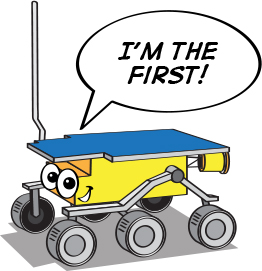
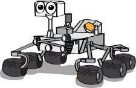

.. note::

    こんにちは、SunFounderのRaspberry Pi & Arduino & ESP32愛好家コミュニティへようこそ！Facebook上でRaspberry Pi、Arduino、ESP32についてもっと深く掘り下げ、他の愛好家と交流しましょう。

    **参加する理由は？**

    - **エキスパートサポート**：コミュニティやチームの助けを借りて、販売後の問題や技術的な課題を解決します。
    - **学び＆共有**：ヒントやチュートリアルを交換してスキルを向上させましょう。
    - **独占的なプレビュー**：新製品の発表や先行プレビューに早期アクセスしましょう。
    - **特別割引**：最新製品の独占割引をお楽しみください。
    - **祭りのプロモーションとギフト**：ギフトや祝日のプロモーションに参加しましょう。

    👉 私たちと一緒に探索し、創造する準備はできていますか？[|link_sf_facebook|]をクリックして今すぐ参加しましょう！

レッスン1 火星ローバーの紹介
========================================

レッスン1へようこそ：火星ローバーについて学ぶ。今日は、火星ローバーという赤い惑星のリモート探査機のスリリングな世界に飛び込みます。彼らの進化、機能、そして彼らが持つ技術的な驚異について学びます。さらに、独自のローバーを設計することで創造性を発揮し、ユニークなデザインを説明することでプレゼンテーションスキルを磨きます。教室から火星探索の準備をしましょう！

学習目標
-------------------------
* 火星ローバーの進化と目的についての理解を深める
* 独自の火星ローバーを設計することで創造性を表現する
* ローバーのデザインを共有し説明することでプレゼンテーションスキルを向上させる

材料
-----------
* 参考のための火星ローバーの画像と技術仕様
* 火星ローバーの歴史に関するドキュメンタリー映画
* 研究とドキュメンタリー視聴のためのインターネットアクセス付きコンピュータ
* レッスン配信用のプレゼンテーションスライドやインタラクティブホワイトボード
* ローバーデザインアクティビティ用のドローイングペーパー、鉛筆、色塗り材料
* ガイド付きノート取り、反射、デザイン計画用のワークシート

手順
--------------

**ステップ1: 火星ローバーとは？**

火星ローバーについて詳しく知る前に、まず火星自体について知りましょう。画像やモデルから分かるように、火星の表面はクレーター、山、谷、砂嵐で印象づけられており、魅力的でありながら挑戦的な風景を描いています。

    .. image:: img/mars_surface.jpg
        :width: 600
    .. image:: img/mars_surface.png
        :width: 600

想像してみてください。このような険しい地形をナビゲートするのはどのようなものでしょうか？
では、火星用のローバーを設計する任務があるとしましょう。

* 火星の地形や条件を考慮して、どのような点を重視しますか？
* 効果的に機能を果たすために、どのような特徴を装備しますか？
* あなたの火星ローバーが達成する必要があると思われるタスクは何ですか？

火星ローバーは、火星を探索し、その環境を研究し、データを地球に送り返すために設計されたロボットです。
したがって、移動、通信、電源供給、科学研究能力、火星の極端な条件下での耐久性などの側面について考えてみましょう。

少し時間をとって、アイデアをブレインストーミングし、共有しましょう。エンジニアや科学者のように考えるのは面白いですよね？
次のステップでは、実際の火星ローバーのデザインとその機能についてさらに詳しく掘り下げますので、進行中も創造的なアイデアを念頭に置いてください。

**ステップ2: 火星ローバーの歴史を探る**

次に、火星ローバーの歴史について詳しく説明したドキュメンタリーを見ながら、時間を遡る旅に出ます。
このドキュメンタリーは、残念ながら1971年に着陸に失敗したソビエト連邦の火星3号ローバーから、1997年のNASAの最初の成功した火星ローバー、ソジャーナーに至るまでを紹介します。

私たちの旅はそこで終わらず、現在までの最も進歩したローバー、スピリット、オポチュニティ、キュリオシティ、パーサヴィアランスの冒険をさらに理解するために進みます。

.. raw:: html

    <iframe width="600" height="400" src="https://www.youtube.com/embed/OO5CTBBgtXs" title="YouTube video player" frameborder="0" allow="accelerometer; autoplay; clipboard-write; encrypted-media; gyroscope; picture-in-picture; web-share" allowfullscreen></iframe>

このドキュメンタリーは、歴史的な背景を提供するだけでなく、現在の火星探査時代に至るまでの進歩的な科学的および工学的なマイルストーンを総合的に理解するためのものです。

**ステップ3：火星ローバーをまとめる**

ドキュメンタリーを視聴した後、火星に送られたさまざまなローバーについてまとめてみましょう。

* **Sojourner** （1997）

    **Sojourner** は、火星探査の先駆者として、火星パスファインダー計画の一部としてその旅を開始しました。 
    1997年7月4日、アレス・バリス地域に成功裏に着陸しました。他の惑星で走行する最初の車輪付き車両として、ソジャーナーは火星探査における重要なマイルストーンを築きました。 
    火星での稼働はわずか92火星日（ソル）でしたが、将来の探査ローバーにとっての礎を築きました。

    .. image:: img/mars_sojourner.jpg

* **Spirit** （2004–2010）と **Opportunity** （2004–2018）

    **Spirit** と **Opportunity** は、NASAの火星探査ローバー（MER）ミッションの双子のローバーです。 **Spirit** （MER）は、2004年から2010年まで火星で活動しました。
    
    一方、 **Opportunity** は、2004年から2018年まで長く稼働しました。彼らは、火星の表面と地質の歴史に関する私たちの理解を大きく拡大しました。

    .. image:: img/mars_opportunity.jpg

* **Curiosity** （2012年〜現在）:

    車サイズの火星ローバーである **Curiosity** は、NASAの火星科学研究所（MSL）ミッションの一環として、火星のゲールクレーターを探査するために設計されました。2012年の到着以来、 **Curiosity** は火星上の過去の液体水の存在など、数多くの重要な発見を行っています。

    .. image:: img/mars_curiosity.jpg

* Perseverance（2021年〜現在）:

    **Perseverance** は、最も最近火星に到着したローバーです。NASAの火星2020ミッションの一環として、ジェゼロクレーターを探査するために設計されました。 **Perseverance** は、科学的な機器と共に、火星の小型実験ヘリコプターであるインジェニュイティも搭載しており、火星探査の新たな一歩を記しています。

    .. image:: img/mars_perseverance.jpg

さて、議論しましょう。これらのローバーの進化について考えてみましょう。

* これらのローバーのデザインはどのように異なりますか？どのように似ていますか？
* ミッションの目標は、各ローバーのデザインにどのような影響を与えましたか？
* 各ローバー間でどのような技術的進歩が見られますか？
* 次の火星ローバーにはどのような特徴があるべきだと思いますか？
* あなたの考えや反省、または質問を共有してください！

**ステップ4：アートアクティビティ：自分だけの火星ローバーを描こう**

.. image:: img/spirit-opportunity.jpg
    :width: 500

.. image:: img/perseverance_rover.png

次のアクティビティでは、これまでに学んだ知識と創造性を活用して、独自の火星ローバーを設計しましょう。これまでに学んだローバーの主要な特徴を考慮しつつ、あなたのデザインに取り入れたい独自の属性についても考えてみてください。

必要な材料：

* 画用紙
* 鉛筆と消しゴム
* 色鉛筆、クレヨン、またはマーカー

描画指示：

#. ローバーのボディから始めましょう。その形は？どれくらいの大きさ？
#. 車輪について考えてみてください。あなたのローバーにはいくつの車輪がありますか？それらのサイズや形は？
#. 機器を忘れないでください。あなたのローバーはどんな科学機器を搭載しますか？カメラ、ドリル、分光計、またはまったく新しいもの？
#. 最後に、ユニークな特徴を考えてみてください。あなたのローバーには太陽電池パネルがありますか、それとも異なる電源を使用していますか？直接地球と通信できますか、それとも中継衛星が必要ですか？

みんなが描き終えたら、クラスで共有しましょう。デザインの選択と、あなたのローバーの想定ミッションについて説明してください。

**ステップ5：火星ローバーのデザインを発表する**

みんなが火星ローバーの描画を完成させたので、共有する時間です！発表する際に、あなたのデザインの背後にある思考プロセスを話しましょう。あなたのローバーのミッションは何ですか？そのデザインはどのようにしてこのミッションをサポートしますか？

この活動には間違った答えはありません。目的は、あなたの創造性を刺激し、火星ローバー技術への理解を深めることです。

**ステップ6：振り返りと結論**

火星ローバーレッスンを終えるにあたり、学んだことについて数分間振り返ってみましょう。私たちのローバーデザインは、技術の進歩と科学的目標をどのように反映していますか？本物の火星ローバーは将来どのように進化し続けるでしょうか？

宇宙探査は、STEAM分野と同様、質問をする、問題を解決する、そして創造性を使うことについてです。探求を続け、質問をし続け、好奇心を持ち続けましょう！
