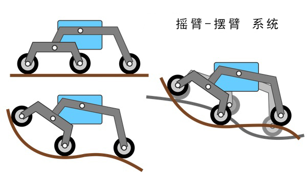
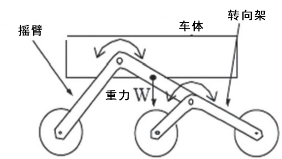

第二课 了解并制作摇臂-摆臂系统
============================================================

在上一课中，我们学习了火星漫游车及其基本结构。当我们观察火星漫游车的演变时，
一个有趣的现象是它们的悬挂系统的一致性。尽管技术不断进步，但从“旅行者号”到“毅力号”，
所有的火星漫游车都采用了相似的悬挂系统——摇臂-摆臂系统。

那么，为什么所有漫游车都采用摇臂-摆臂系统呢？这个设计对于火星探索究竟有什么独特的优势呢？

在今天的课程中，我们将深入了解摇臂-摆臂系统背后的科学与工程原理，并动手制作一个模型。

让我们踏上这段激动人心的工程之旅吧！

学习目标
----------------------

* 了解摇臂-摆臂悬挂系统的设计原理及其优点。
* 学会如何设计并制作一个基本的摇臂-摆臂悬挂系统模型。
* 运用基本的物理原理解释摇臂-摆臂悬挂系统如何应对复杂地形。

材料
-------------
* 蓝图和参考资料（如NASA火星漫游车设计图纸和摇臂-摆臂悬挂系统工作原理视频）
* 火星漫游车结构套件
* 基本工具和配件（如螺丝刀、螺丝等）

步骤
--------------

**步骤 1: 揭开摇臂-摆臂系统的面纱**

摇臂-摆臂系统就像是机械界的山羊——它的设计旨在确保漫游车的所有轮子都能保持接地，同时能够在崎岖不平的地形上行驶。它专门为应对火星那种不可预测的地形而设计，包括陡坡和大石块。这个系统没有使用弹簧，而是通过六个轮子及其相互作用的几何结构来克服复杂的地形。这是一个巧妙的机械设计范例，展示了如何克服自然环境中的障碍。

让我们来看看这个系统的两个主要部分——“摇臂”和“摆臂”。

* 系统中的“摇臂”部分就像是漫游车两侧的大腿，这些摇臂通过一个称为差速器的机构连接在一起并与车身相连。就像两条腿行走一样，摇臂相对于车身会朝相反的方向旋转，从而确保大部分轮子都能与地面保持接触。漫游车的车身维持着两个摇臂的平均角度。每个摇臂的一端连接着一个轮子，另一端连接着摆臂。

* 系统中的“摆臂”部分就像是附着在摇臂上的一个迷你四肢生物。它是一个较小的联动系统，摆臂的中心与摇臂连接，并在两端各有一个轮子。

了解了这些基本原理后，我们将进入下一步。

**步骤 2: 观看系统的实际操作**

以下是一个GIF，展示了摇臂-摆臂悬挂系统的独特功能，并说明它如何帮助火星漫游车穿越火星上充满挑战的地形。

.. image:: img/rocker_bogie.gif
    :align: center

观看完这个GIF后，我们来进行讨论！思考以下问题：

* 为什么你认为摇臂-摆臂悬挂系统适合火星探索？
* 你能用自己的话描述摇臂-摆臂系统是如何运作的吗？
* 摇臂-摆臂系统有哪些关键特性帮助漫游车在崎岖的地形上顺利行驶？

欢迎分享你对摇臂-摆臂悬挂系统的看法和见解。

**步骤 3: 开始制作**

现在我们已经了解了摇臂-摆臂系统，接下来是动手制作我们的摇臂-摆臂悬挂系统。

所需材料：

* GalaxyRVR 套件
* 螺丝刀、扳手等基本工具
* 按照 GalaxyRVR 套件中的组装说明，构建漫游车的悬挂系统。

请注意，耐心和精确非常重要，确保每个部件都正确放置并紧固。

在此过程中，可以与同学讨论每个部件的设计和功能。这样不仅有助于理解设计，还能帮助你更好地理解其在火星探索中的实际应用。

记住，如果在组装或测试过程中遇到任何问题，不必担心。这都是工程过程的一部分！排除问题是我们学习和创新的方式。

**步骤 4: 总结与反思**

在组装悬挂系统时，你有没有注意到所有活动部件都使用了自锁螺母？你是否想过为什么？

.. image:: img/self_locking_nuts.webp
    :align: center

自锁螺母是一种带有橡胶环的普通螺母。这个设计确保了在移动过程中，部件不会因为振动而松动或脱落。

此外，它还确保了部件在一定范围内能够自由旋转。

因此，在组装时，你需要先用套筒和螺丝刀将螺钉和自锁螺母拧紧，然后稍微松开一点。这确保了部件之间有足够的自由旋转空间，但又不会太松。

.. raw:: html

   <video width="600" loop autoplay muted>
        <source src="_static/video/rocker_bogie_system.mp4" type="video/mp4">
        Your browser does not support the video tag.
   </video>

在本节课中，我们不仅学习了摇臂-摆臂系统，还亲手制作了一个模型。通过这个实践，我们可以模拟火星漫游车如何在各种崎岖的地形上平稳行驶。

凭借这些知识和经验，我们现在更有信心深入探索火星的未知领域。让我们继续揭开红色星球的神秘面纱。
