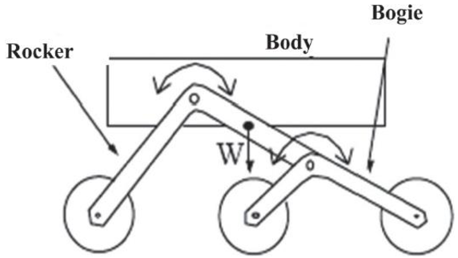
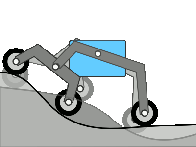
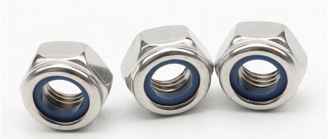

.. note::

    こんにちは、SunFounderのRaspberry Pi & Arduino & ESP32愛好家コミュニティへようこそ！Facebook上でRaspberry Pi、Arduino、ESP32についてもっと深く掘り下げ、他の愛好家と交流しましょう。

    **参加する理由は？**

    - **エキスパートサポート**：コミュニティやチームの助けを借りて、販売後の問題や技術的な課題を解決します。
    - **学び＆共有**：ヒントやチュートリアルを交換してスキルを向上させましょう。
    - **独占的なプレビュー**：新製品の発表や先行プレビューに早期アクセスしましょう。
    - **特別割引**：最新製品の独占割引をお楽しみください。
    - **祭りのプロモーションとギフト**：ギフトや祝日のプロモーションに参加しましょう。

    👉 私たちと一緒に探索し、創造する準備はできていますか？[|link_sf_facebook|]をクリックして今すぐ参加しましょう！

レッスン2 ロッカーボギーシステムの理解と作成
============================================================
前回のレッスンでは、火星ローバーとその基本構造について学びました。火星ローバーの進化を見ると、サスペンションシステムの一貫性が興味深い点です。
技術の進歩にもかかわらず、ソジャーナーからパーサヴィアランスまでのすべてのローバーは、ロッカーボギーシステムと呼ばれる同様のタイプのサスペンションシステムを使用して設計されています。

しかし、なぜロッカーボギーシステムに固執するのでしょうか？この特定のデザインが火星探査にどのような利点をもたらすのでしょうか？

.. image:: img/rocker_bogie_pic.webp

今日のレッスンでは、ロッカーボギーシステムの科学と工学について深く掘り下げ、実際に一つを作ります。

このエキサイティングなエンジニアリングの旅に出発しましょう！

学習目標
----------------------

* ロッカーボギーサスペンションシステムの設計原理とその利点を理解する。
* ロッカーボギーサスペンションシステムの基本モデルの設計と作成方法を学ぶ。
* 物理学の基本原理を適用して、ロッカーボギーサスペンションシステムが複雑な地形を克服する方法を説明する。

材料
-------------
* 設計図と参考資料（NASAの火星ローバー設計図やロッカーボギーサスペンションシステムの動作に関するビデオなど）
* 火星ローバー構造キット
* 基本的な工具とアクセサリー（例：ドライバー、ネジなど）

手順
--------------

**ステップ1：ロッカーボギーシステムの解明**

ロッカーボギーシステムは機械工学の山羊のようなもので、ローバーが荒々しい岩場の地形を越える際にすべての車輪を地面に接地させるように設計されています。火星の予測不可能な風景、例えば険しい傾斜や大きな岩場を処理するために特別に作られました。このシステムはバネを使用せず、6つの車輪の幾何学とそれらの相互作用を利用して困難な地形を克服します。環境の障害を乗り越えるための巧妙な機械設計の見事な例です。

このシステムの二つの主要な部分、「rocker」と「bogie」について詳しく見てみましょう。

* システムの「rocker」部分は、ローバーの体の両側にある二つの大きな四肢のようなものです。これらの四肢、つまりロッカーは、ディファレンシャルと呼ばれる機構を介して互いにおよびローバーのボディ、またはシャーシに接続されています。二つの脚が歩くように、ロッカーはシャーシに対して反対方向に回転し、ほとんどの車輪が地面と接触し続けることを保証します。ローバーのボディは、両方のロッカーの平均角度を維持します。ロッカーの一方の端は車輪に、もう一方の端はボギーに接続されています。

* システムの「bogie」部分は、ロッカーに取り付けられた小さな四肢のような生き物のようなものです。これは、中央でロッカーにピボットし、両端に車輪があるより小さいリンケージシステムです。

この基本的な理解を持って、私たちの冒険の次のステップに進みましょう。

**ステップ2：システムの実際の動作を見る**

以下は、ロッカーボギーサスペンションシステムのユニークな特徴を示し、火星ローバーが火星の挑戦的な地形をナビゲートするのを可能にする様子を描いたGIFです。

GIFを見た後、議論しましょう！次の質問について考えてみてください：

* なぜロッカーボギーサスペンションシステムが火星探査に適していると思いますか？
* ロッカーボギーシステムの動作方法を自分の言葉で説明できますか？
* ロッカーボギーシステムの主な特徴は何でしょうか？どのようにしてローバーが険しい地形を交渉するのに役立ちますか？

ロッカーボギーサスペンションシステムについてのあなたの考えや洞察を自由に共有してください。

**ステップ3：組み立て**

ロッカーボギーシステムについて学んだ今、私たち自身のものを作る時が来ました。

必要な材料：

* GalaxyRVRキット
* ドライバーやレンチなどの基本的な工具
* GalaxyRVRキットの組立説明書に記載されている手順に従って、ローバーのサスペンションシステムを組み立てます。

.. raw:: html

    <iframe width="600" height="400" src="https://www.youtube.com/embed/a1xtgDUEvR0" title="YouTube video player" frameborder="0" allow="accelerometer; autoplay; clipboard-write; encrypted-media; gyroscope; picture-in-picture; web-share" allowfullscreen></iframe>

ここでは忍耐と正確さが重要です。各部品を正しく配置し、しっかりと固定してください。

その間、組み立てる各部品の設計と機能について仲間と議論しましょう。これにより、設計の理解だけでなく、火星探査での実際の適用も助けられます。

組み立てやテスト中に問題が発生しても心配しないでください。
これもすべてエンジニアリングプロセスの一部です！問題をトラブルシューティングすることが、私たちが学び、革新する方法です。

**ステップ4：要約と反省**

サスペンションシステムの組み立て中に、動く部分すべてが自己ロックナットを使用していることに気づきましたか？なぜそうするのか、考えたことはありますか？

自己ロックナットは、通常のナットの内部にゴムリングを含むタイプの留め具です。この設計により、動きの際の振動で組み立てた部品が簡単に緩んで落ちることがありません。

さらに、部品が一定の範囲内で回転できることも保証します。

そのため、組み立て中にはまずソケットとドライバーでネジと自己ロックナットを締め、その後少し緩める必要があります。これにより、部品間に自由な回転が可能なスペースが確保される一方で、緩すぎない状態を保ちます。

.. raw:: html

   <video width="600" loop autoplay muted>
        <source src="_static/video/rocker_bogie_system.mp4" type="video/mp4">
        Your browser does not support the video tag.
   </video>

このレッスンでは、ロッカーボギーシステムについて学ぶだけでなく、自分たちで一つを作りました。さらに、火星ローバーがさまざまな険しい地形をスムーズに移動するのを手動でシミュレートすることもできます。

この知識と経験を得たことで、火星探査の未知の領域にさらに深く進出する準備ができました。赤い惑星の謎を解き明かし続けましょう。

