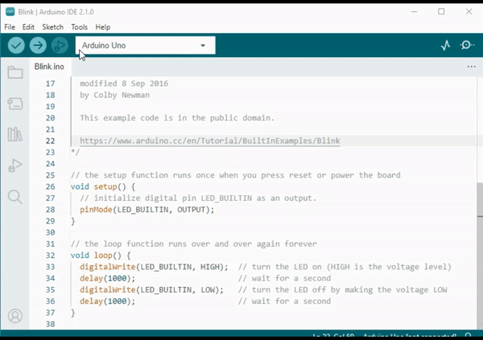
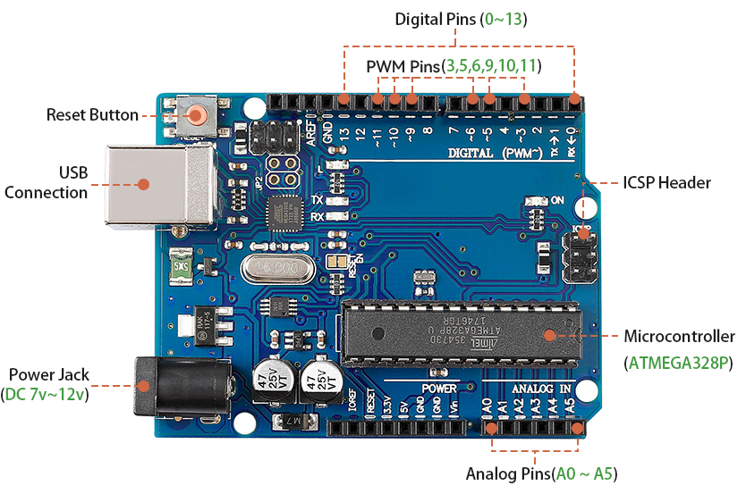
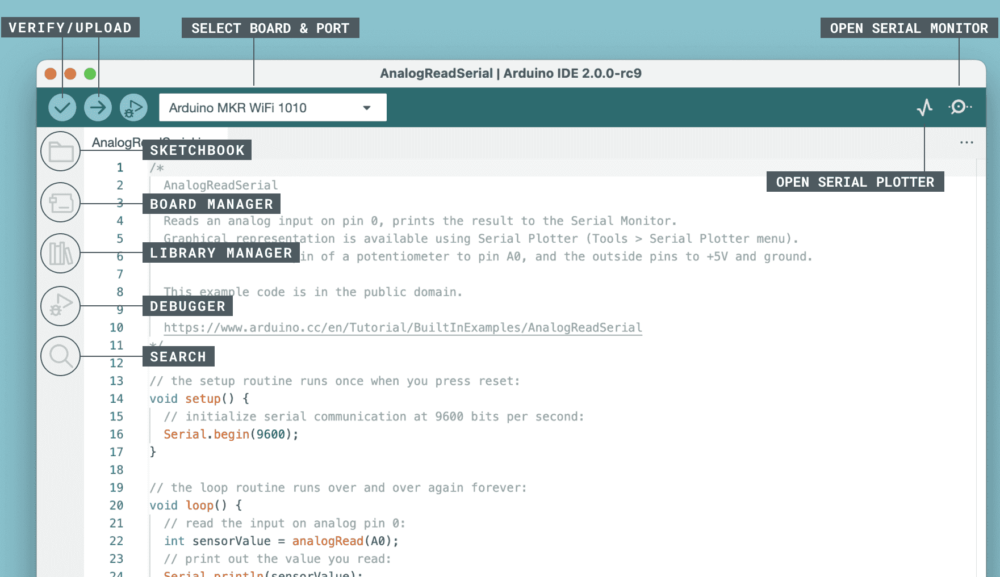

Lesson 3: Stepping into Arduino and Programming
===================================================

In our previous lesson, we successfully built the Rocker-Bogie Suspension System. 
However, to make it functional, we need to provide it with power, a control board, and programming to dictate its movements.

So in this lesson, we're going to get acquainted with the control board and the programming platform we'll be using.

Course Objectives
---------------------

* Understand the basic concepts and functions of Arduino.
* Learn about SunFounder R3 Board.
* Install Arduino IDE and get familiar with its interface.
* Learn about basic syntax rules for Arduino programming.

Course Materials
--------------------

* SunFounder R3 Board
* Arduino IDE
* USB Cable
* Computer

Steps
-----------

**Step 1: Introduction to Arduino**

You may have often heard the term "Arduino" in various contexts, but what exactly is it and why has it become so popular?

Arduino is an open-source electronics platform that is easy to use for both hardware and software applications. It's designed to make digital devices and interactive objects that can sense and control the physical world around them.

Sure, let's break it down:

* **Open-source**: Think of open-source like a community garden. Everyone can use it, everyone can contribute to it, and everyone can benefit from it. With open-source, both the designs of the physical parts (the hardware) and the programming instructions (the software) are shared freely. This means anyone can use them, improve them, or create their own versions. It's all about sharing and creativity!

    .. image:: img/arduino_oscomm.png
        :width: 400
        :align: center

* **Microcontroller**: A microcontroller is like the brain of the Arduino. It's a tiny computer that can run simple software. Although it's not as powerful as the computer you're using now, it's perfect for simple tasks like understanding messages from sensors or lighting up an LED (a small light).

    .. image:: img/arduino_micro.jpg
        :width: 500
        :align: center

* **Development Board**: Imagine the development board as the body that supports the brain. It's the board where the microcontroller sits and it contains other parts that help the microcontroller interact with the world. These parts include things like oscillators (that help with timing), voltage regulators (that control power levels), and connectors for power and data (like the plugs and switches in your house).

    .. image:: img/arduino_board.png
        :width: 600
        :align: center

* **Arduino IDE**: This is like the teaching classroom for your Arduino. It's a program that runs on your computer where you can write the instructions that tell your Arduino what to do. These instructions are written in a programming language (kind of like a secret code) based on C++. Once you've written your instructions, you can send them to the Arduino board using a USB cable, just like handing in your homework!

    .. image:: img/arduino_ide_icon.png
        :width: 200
        :align: center

Now that you understand these basic ideas, you're well on your way to becoming an Arduino expert!

Now, let's take a look at this short video to learn more about what Arduino is and how it works.

.. raw:: html

    <iframe width="600" height="400" src="https://www.youtube.com/embed/waOk9VtkCqw" title="YouTube video player" frameborder="0" allow="accelerometer; autoplay; clipboard-write; encrypted-media; gyroscope; picture-in-picture; web-share" allowfullscreen></iframe>

After the video, we'll start discussing some of the Arduino fundamentals that you'll need to understand for this course, and then we'll dive into some hands-on activities to get you acquainted with Arduino programming and engineering principles. Get ready for an exciting learning journey!

**Step 2: Getting to Know Your SunFounder R3 Board**

Inside your kit, you'll find a blue board, which might look like a small city of tiny metal towers and pathways. But don't be overwhelmed! This is called the SunFounder R3 board with almost the same functions as the Arduino Uno board. 

Let's understand its key features in simple terms:

* **14 Digital Pins**: Think of these pins like little messengers. They can be programmed to send (output) or receive (input) simple "yes" or "no" messages to other parts of your Mars Rover. These messages are actually "on" or "off" signals that the board uses to control things like lights or motors. 

    * Six of these special pins can even send messages in a kind of secret code called PWM (Pulse Width Modulation). This code can be used to control how bright a light is, how fast a motor spins, or even where a moving part positions itself.

* **6 Analog Pins**: These pins are like the board's six special senses. They can read signals from different types of sensors (like a temperature sensor) and then translate these signals into a language that the board can understand and use in its programming.

* **USB Connection**: This is like the board's umbilical cord. You can use it to connect your board to your computer. This connection allows your computer to "teach" the board what to do by sending it a program you write.

* **Power Jack**: This is the board's food supply. You can connect a power supply, like a battery or an AC-to-DC adapter, to this jack to "feed" your board the electricity it needs to work.

* **ICSP Header**: This is like a special entrance for programming the board. It can be used if you have an external programmer (a special device for "teaching" the board).

* **Reset Button**: If you press it, it's like telling the board to forget what it was just doing and start its program over from the beginning.

With these basics, you'll be all set to begin your programming adventures with the SunFounder R3 board!

**Step 3: Install Arduino IDE**

Now that we understand what Arduino and the Arduino board are, it's time to start putting that knowledge to use. We're going to install the Arduino IDE, which is the software we'll use to program our Arduino board.

The latest version of the Arduino IDE is version 2.0. It's packed with features and is super user-friendly. However, you should know that it does have some system requirements:

    * Windows - Win 10 and newer, 64 bits
    * Linux - 64 bits
    * Mac OS X - Version 10.14: "Mojave" or newer, 64 bits

To get started, follow these steps:

#. Vist |link_download_arduino| and download the IDE for your OS version.

    .. image:: img/sp_001.png

**For Windows users:**

    #. Once you've downloaded the file (it will be called something like ``arduino-ide_xxxx.exe``), double-click it to start the installation process.

    #. You'll be shown the **License Agreement**. Take a moment to read through this, and if you agree to the terms, click "I Agree".

        .. image:: img/sp_002.png

    #. Next, you'll be asked to choose installation options. Leave these as they are and click "Next".

        .. image:: img/sp_003.png

    #. Choose where you want to install the software. It's generally best to install it on a different drive than the one your system uses.

        .. image:: img/sp_004.png

    #. Click "Install" to start the installation. Once it's done, click "Finish". 

        .. image:: img/sp_005.png

**For macOS users:**

    Double-click the downloaded file (which will be called something like ``arduino_ide_xxxx.dmg``). Follow the on-screen instructions to drag the **Arduino IDE** app into the **Applications** folder. After a few seconds, the Arduino IDE will be successfully installed.

    .. image:: img/macos_install_ide.png
        :width: 800

**For Linux users:**

    You can find a detailed tutorial on installing the Arduino IDE 2.0 on a Linux system here: |link_arduino_linux|.
    

**Step 4: Discovering the Arduino Playground (IDE)**

Let's imagine together that the Arduino IDE is a magical playground filled with tools and gadgets waiting for us to explore and play with. Up next, I will guide you to understand every corner of this playground.

Here's what you'll find in your playground:

* **Verify / Upload** - Imagine this as your magic elevator. It takes the code you've written and whisks it up into your Arduino board.
* **Select Board & Port** - This is your treasure map. It automatically shows the Arduino boards you've plugged into your computer, and tells you their "secret code" (port number).
* **Sketchbook** - This is your personal library. It's where all your sketches (programs) are stored on your computer. Plus, it can connect to the Arduino Cloud, so you can fetch your sketches from the online world too.
* **Boards Manager** - Think of this as your toolkit. It's where you can find and install different packages for your Arduino. Need something for your MKR WiFi 1010 board? You'll find it here!
* **Library Manager** - This is your endless treasure chest. Thousands of libraries made by Arduino and its community are waiting for you here. Need a tool or material for your code? Dive in and find it!
* **Debugger** - Imagine you had a superpower that let you test and debug your code in real time, finding and fixing problems as they happen. That's what this is!
* **Search** - Think of this as your magnifying glass. It helps you search for keywords in your code.
* **Open Serial Monitor** - This is like your communicator device. It opens a new tab that lets your computer and Arduino board send messages back and forth.

Now that we've taken a tour of the park, let's start exploring and creating!

**Step 5: Upload Your First Sketch**

Alright, it's time to have some fun! We're going to make an LED blink - it's like saying "Hello, World!" in the world of Arduino.

Most Arduino boards have a built-in LED on pin 13, which makes this a good first experiment.

.. image:: img/1_led.jpg
    :width: 400
    :align: center

Let's break it down:

#. **Plug it in**: Connect your SunFounder R3 Board to your computer using a USB cable. This is how we're going to give our board power and send our program (also called a "sketch") to it. You might feel like you're just plugging in a computer gadget, but believe me, you're connecting to a world of possibilities!

    .. image:: img/connect_board_pc.gif

#. **Find the example sketch**: On the Arduino IDE, go to **File** -> **Examples** -> **Basic** -> **Blink**. What you see that pops up is a ready-to-use program that we're going to modify. It's like getting a ready-made cake that we're about to decorate!

    .. image:: img/open_blink.png

#. **Understand the sketch**: Look at the code in this new window. It tells Arduino to turn on the built-in LED (which is on pin 13) for one second, then turn it off for one second, and then repeat. It's like sending Morse code, but with light!

    .. image:: img/led_blink.png

#. **Upload the sketch**: Once you've selected the correct board and port, click on the upload button. It's like putting a letter in a mailbox - you're sending your instructions off to Arduino!

    .. image:: img/upload_blink.gif

#. **Watch it work**: If all goes well, you'll see the LED on your Arduino board start to blink on and off. It's like your Arduino is winking at you!

    .. image:: img/blink_led.gif

You've done a great job! You've just run your first Arduino program, making you a bona fide programmer! So what's next? We're just scratching the surface of what Arduino can do. Ready for the next challenge?

**Step 6: Some Fun Arduino Programming Facts**

Time to uncover some cool secrets about Arduino programming!

* Code Magic: ``setup()`` and ``loop()``

    An Arduino sketch, or a piece of code, is like a two-act play:

    * ``setup()``: This is Act 1, the opening scene. It only happens once, when your Arduino board first wakes up. It's used to set the stage by preparing things like pin modes and libraries.
    * ``loop()``: After Act 1, we move onto Act 2 which repeats on a loop until the final curtain (which only happens if we turn off the power or hit the reset button!). This part of the code is like the main part of our play, where the action really happens.

    But remember, even if there's no magic (code) in the ``setup()`` or ``loop()``, we still need to keep them. They're like the stage - even an empty stage is still a stage.

    .. code-block:: arduino
    
        void setup() {
            // initialize digital pin LED_BUILTIN as an output.
            pinMode(LED_BUILTIN, OUTPUT);

            digitalWrite(LED_BUILTIN, HIGH);  // turn the LED on (HIGH is the voltage level)
            delay(1000);                      // wait for a second
            digitalWrite(LED_BUILTIN, LOW);   // turn the LED off by making the voltage LOW
            delay(1000);                      // wait for a second
        }

        // the loop function runs over and over again forever
        void loop() {

        }

* Punctuation Marks in Coding

    Just like in a storybook, Arduino uses special punctuation marks to make sense of the code:

    * ``Semicolons (;)``: These are like the full stops in a story. They tell the Arduino "Okay, I'm done with this action. What's next?"
    * ``Curly Braces {}``: These are like the beginning and the end of a chapter. They wrap up pieces of code together, marking where a section starts and ends.
    
    If you happen to forget some of these punctuation marks, don't worry! The Arduino is like a friendly teacher who will check your work, point out where the mistakes are, and show you how to fix them. It's all part of the learning adventure!

    .. image:: img/blink_error.gif

* About the Functions

    Imagine these functions as magical spells. Each spell has a specific effect in our Arduino adventure:

    * ``pinMode()``: This spell decides whether a pin is an INPUT or an OUTPUT. It's like deciding if a character in our story speaks (OUTPUT) or listens (INPUT).
    * ``digitalWrite()``: This spell can turn a pin HIGH (on) or LOW (off), like switching a magic light on and off.
    * ``delay()``: This spell makes the Arduino pause for a certain amount of time, like taking a short nap in the middle of our story.
    
    Just like a spell book, you can find all these spells and many more in the |link_arduino_web|. The more spells you know, the more exciting your Arduino adventures can be!

* Comments: Our Secret Messages

    We also have a secret language in coding, called ``comments``. These are messages that we can write in our code using ``//`` or ``/* */``. The magic part? The Arduino completely ignores them! It's a great place to leave notes for yourself or others to explain what the tricky parts of the code are doing.

* Code Readability: Making Code Friendly

    While you can write your code in any manner you want (for example, placing semicolons on a separate line won't cause any errors), it's important to keep in mind the readability of the code.

    .. image:: img/blink_noerror.gif

    Just like writing a good story, the way we write code can make it either fun and easy or boring and difficult to read. Here are some ways to make your code more friendly:

    * Use proper indentation to arrange your sentences into neat paragraphs. It helps the reader understand where one section ends and another begins.
    * Use variable names that make sense. It's like calling a character by a fitting name in a story.
    * Keep your functions small and simple, like short and sweet chapters in a book.
    * Leave comments for the tricky parts. It's like leaving a footnote to explain a difficult word.

Remember, we're not only coding for machines but also for humans, so let's make sure our code tells a clear and understandable story!

**Step 7: Reflect and Improve**

Taking a moment to reflect on our journey can provide us with insights that we might miss in the flurry of exploration. Ask yourself:

* What was the most interesting part of this Arduino adventure?
* Were there any challenges along the way? How did you overcome them?
* Could you explain to a friend what Arduino is, what the Arduino IDE does, or how to run Arduino code?
* How would you describe your first Arduino programming experience?
* What more do you want to learn about Arduino?

By thinking about these questions, you are deepening your understanding and preparing yourself for future explorations. Always remember, there's no "wrong" answer in reflection – it's your personal journey after all!