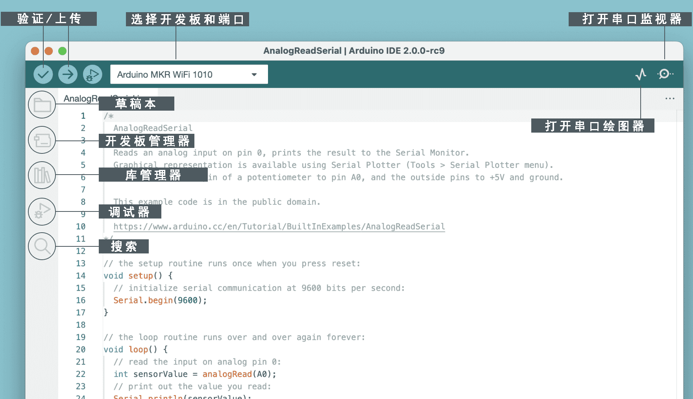

第三课 进入 Arduino 和编程的世界
=====================================================

在上一节课中，我们成功地构建了 Rocker-Bogie 悬挂系统。  
然而，要使其发挥作用，我们需要为其提供电源、控制板，并编写程序来控制其运动。

因此，在本节课中，我们将了解将要使用的控制板和编程平台。

.. image:: img/upload_blink.gif

课程目标
---------------------

* 理解 Arduino 的基本概念和功能。
* 了解 SunFounder R3 控制板。
* 安装 Arduino IDE，并熟悉其界面。
* 学习 Arduino 编程的基本语法规则。

课程材料
--------------------

* SunFounder R3 控制板
* Arduino IDE
* USB 数据线
* 计算机

Arduino 简介
------------------------------------------

你可能在各种场合听说过 "Arduino" 这个词，那么它到底是什么，为什么它如此流行？

Arduino 是一个开源的电子平台，易于用于硬件和软件应用。它旨在制作数字设备和交互式物品，这些设备可以感知并控制周围的物理世界。

让我们来详细解释一下：

* **开源**：把开源看作一个社区花园，大家都可以使用、贡献和受益。开源意味着硬件的设计和软件的编程指令都是免费的，任何人都可以使用、改进或创建自己的版本。这是一种分享和创造的精神！

    .. image:: img/arduino_oscomm.png
        :width: 400
        :align: center

* **微控制器**：微控制器就像 Arduino 的大脑，它是一个小型计算机，可以运行简单的软件。尽管它不如你现在使用的计算机强大，但它非常适合执行简单任务，如理解传感器的信号或点亮 LED（小灯）。

    .. image:: img/arduino_micro.jpg
        :width: 500
        :align: center

* **开发板**：将开发板想象成支撑大脑的身体。它是微控制器的载体，包含帮助微控制器与外界互动的其他部件，例如时钟振荡器（帮助计时）、电压调节器（控制电源）以及用于电源和数据连接的接口。

    .. image:: img/arduino_board1.png
        :width: 600
        :align: center

* **Arduino IDE**：它就像是你的 Arduino 课堂，是你在计算机上编写指令的地方，告诉 Arduino 应该做什么。这些指令是用基于 C++ 的编程语言编写的。编写完成后，你可以通过 USB 数据线将它们发送到 Arduino 板，就像交作业一样！

    .. image:: img/arduino_ide_icon.png
        :width: 200
        :align: center

了解了这些基本概念后，你就准备好成为 Arduino 专家了！

接下来，我们将深入实践，帮助你熟悉 Arduino 编程和工程原理。
准备好迎接激动人心的学习之旅吧！

认识你的 SunFounder R3 控制板
---------------------------------------------------

在你的套件中，你会找到一块蓝色的控制板，乍一看，它就像一个微小的城市，里面有许多金属塔和小路。但不要被它吓到！这就是 SunFounder R3 开发板，一款可以用来编程并控制各种电子设备和项目的 Arduino 控制板。

让我们简单了解它的主要特点：

.. image:: img/sf_r3.jpg
    :width: 800

* **14 个数字引脚**：可以把这些引脚看作小小的信使。它们可以被编程用来发送（输出）或接收（输入）简单的 "是" 或 "否" 信息到火星车的其他部分。这些信息实际上是 "开" 或 "关" 的信号，用于控制诸如灯光或电机之类的部件。

    * 其中六个特殊引脚甚至可以发送一种被称为 PWM（脉宽调制）的加密信号，这可以用来控制灯光的亮度、电机的转速，甚至是运动部件的位置。

* **6 个模拟引脚**：这些引脚就像板子的六个特殊感官，它们可以读取来自不同类型传感器的信号（例如温度传感器），然后将这些信号转化为板子可以理解并在编程中使用的语言。

* **USB 连接口**：就像板子的脐带。通过 USB 数据线连接计算机后，你的计算机可以将程序传输到控制板，就像教会 Arduino 执行任务。

* **电源接口**：这是板子的电源供应口。你可以连接电池或交流转直流适配器为板子提供所需的电力。

* **ICSP 接口**：这就像是板子的特殊编程入口。如果你有外部编程器（专门用于 "教" 板子的设备），可以使用这个接口。

* **复位按钮**：按下它，相当于告诉板子忘记刚刚的操作并重新开始。

了解了这些基础知识后，你就可以开始使用 SunFounder R3 控制板进行编程了！

安装 Arduino IDE
-----------------------------------------------

现在我们了解了 Arduino 和 Arduino 控制板的基本概念，接下来是时候把这些知识付诸实践了。我们将安装 Arduino IDE，这是我们用来编程 Arduino 控制板的软件。

最新版本的 Arduino IDE 是 2.0 版，它功能强大且非常用户友好。但你需要注意，它有一些系统要求：

    * Windows - Win 10 及以上版本，64 位
    * Linux - 64 位
    * macOS - 10.14 版本 ("Mojave") 或更高版本，64 位

按照以下步骤开始：

#. 访问 |link_download_arduino|，下载适用于你操作系统版本的 IDE。

    .. image:: img/sp_001.png

**Windows 用户：**

    #. 下载完文件后（文件名可能类似于 ``arduino-ide_xxxx.exe``），双击开始安装。

    #. 阅读 **许可协议**，如果同意协议，点击 "我同意"。

        .. image:: img/sp_02.png

    #. 选择安装选项，保持默认设置并点击 "下一步"。

        .. image:: img/sp_03.jpg

    #. 选择软件的安装位置。最好将其安装在不同于操作系统所在的驱动器上。

        .. image:: img/sp_04.jpg

    #. 点击 "安装" 开始安装，完成后点击 "完成"。

        .. image:: img/sp_05.jpg

**macOS 用户：**

    双击下载的文件（类似于 ``arduino_ide_xxxx.dmg``），按照屏幕上的指示将 **Arduino IDE** 应用拖到 **应用程序** 文件夹。几秒钟后，Arduino IDE 将成功安装。

    .. image:: img/macos_install_ide.png
        :width: 800

**Linux 用户：**

    你可以参考此教程了解如何在 Linux 系统上安装 Arduino IDE 2.0：|link_arduino_linux|。

探索 Arduino IDE
---------------------------------------------------

让我们一起想象 Arduino IDE 就像一个充满工具和小玩意的神奇游乐场，等待我们去探索和玩耍。接下来，我将引导你了解这个游乐场的每个角落。

在这里，你会发现：

* **验证 / 上传**：就像魔法电梯，把你写的代码传送到 Arduino 控制板。
* **选择板子 & 端口**：这是你的宝藏地图，自动显示你连接的 Arduino 板子以及它们的端口号。
* **草图本**：这是你个人的图书馆，所有的草图（程序）都存储在这里，还可以连接到 Arduino 云端，随时取回你的草图。
* **板子管理器**：想象它是你的工具箱，里面可以找到并安装各种 Arduino 板的包。
* **库管理器**：这是你的无尽宝库，成千上万的 Arduino 和社区开发的库都在这里等你使用。如果你需要为代码提供工具或资源，快来这里探索吧！
* **调试器**：就像拥有一个超级能力，可以实时调试你的代码，找出问题并修正它们。
* **搜索**：像放大镜一样，帮助你在代码中搜索关键词。
* **打开串口监视器**：就像你的通讯设备，可以让你的计算机和 Arduino 控制板相互发送消息。

现在，我们已经对这个游乐场有了初步了解，是时候深入探索并开始创造了！

上传你的第一个草图
-----------------------------------------------

好啦，是时候开始玩了！我们将让一个 LED 灯闪烁——这就像是 Arduino 世界中的 "Hello, World!"。

大多数 Arduino 控制板在第 13 引脚上都有一个内建的 LED，因此这是一个很好的入门实验。

.. image:: img/1_led.jpg
    :width: 400
    :align: center

让我们一步步来：

#. **连接**：使用 USB 数据线将 SunFounder R3 控制板连接到计算机。这就是我们为控制板提供电力并传输程序（也叫 "草图"）的方式。你可能觉得这只是连接一个电脑外设，但实际上，你正在连接一个充满可能性的世界！

    .. image:: img/connect_board_pc.gif

#. **查找示例草图**：在 Arduino IDE 中，点击 **文件** -> **示例** -> **基础** -> **Blink**。弹出的代码就是一个现成的程序，我们将对其进行修改。就像拿到一块现成的蛋糕，准备装饰！

    .. image:: img/open_blink.png

#. **理解草图**：看看新窗口中的代码。它告诉 Arduino 打开第 13 引脚上的内建 LED 1 秒钟，然后关闭 1 秒钟，循环执行。这就像在发送摩尔斯电码，但用光来表示！

    .. image:: img/led_blink.png

#. **上传草图**：选择好正确的板子和端口后，点击上传按钮。就像寄信一样，你将指令发送给 Arduino 控制板！大多数情况下，系统会自动检测到板子和端口。

    .. image:: img/upload_blink.gif

#. **观察效果**：如果一切顺利，你会看到 Arduino 控制板上的 LED 开始闪烁。就像 Arduino 在向你眨眼！

    .. image:: img/blink_led.gif

你做得非常棒！你已经运行了你的第一个 Arduino 程序，现在你是一个名副其实的程序员了！接下来呢？我们才刚刚开始探索 Arduino 的无限可能。准备好迎接下一个挑战了吗？

一些有趣的 Arduino 编程小知识
--------------------------------------------------------

接下来，我们要揭开一些 Arduino 编程的秘密！ 

* 代码魔法：``setup()`` 和 ``loop()``

    一个 Arduino 草图就像一个分为两幕的戏剧：

    * ``setup()``：这是第一幕，开场的场景。它只会运行一次，Arduino 控制板首次启动时执行。在这一幕中，我们会设置引脚模式和加载库等内容。
    * ``loop()``：第一幕之后进入第二幕，这一幕会一直重复，直到我们断电或按下复位按钮！这部分代码就像戏剧的主体，所有的操作都在这一幕中进行。

    记住，即使在 ``setup()`` 或 ``loop()`` 中没有实际的魔法（代码），我们仍然需要保留它们。它们就像舞台——即使没有演员，舞台仍然存在。

    .. code-block:: arduino

        void setup() {
            // 初始化数字引脚 LED_BUILTIN 为输出。
            pinMode(LED_BUILTIN, OUTPUT);

            digitalWrite(LED_BUILTIN, HIGH);  // 打开 LED（HIGH 为高电压）
            delay(1000);                      // 等待一秒钟
            digitalWrite(LED_BUILTIN, LOW);   // 关闭 LED（LOW 为低电压）
            delay(1000);                      // 等待一秒钟
        }

        // loop 函数将会一直循环执行
        void loop() {

        }

* 编程中的标点符号

    就像故事书中的标点符号，Arduino 使用特定的符号来理解代码：

    * ``分号（;）``：就像故事中的句号，告诉 Arduino "好的，我已经完成了这项任务。接下来呢？"
    * ``花括号 {}``：就像章节的开始和结束，标明代码片段的起止。

    如果你忘记了某些标点符号，别担心！Arduino 就像一个友好的老师，它会检查你的代码，指出错误并教你如何修正。

    .. image:: img/blink_error.gif

* 关于函数

    想象这些函数就像魔法咒语，每个咒语都有特定的效果：

    * ``pinMode()``：这个咒语决定某个引脚是输入（INPUT）还是输出（OUTPUT），就像决定故事中的角色是说话（输出）还是听话（输入）。
    * ``digitalWrite()``：这个咒语可以将引脚设置为 HIGH（开启）或 LOW（关闭），就像控制魔法灯的开关。
    * ``delay()``：这个咒语让 Arduino 暂停一段时间，就像故事中的小休息。

    你可以在 |link_arduino_web| 查找更多函数。掌握更多咒语，Arduino 冒险将更加精彩！

* 注释：我们的秘密语言

    在编程中，我们还有一种秘密语言叫做 ``注释``。它们是我们在代码中写的留言，使用 ``//`` 或 ``/* */`` 来标记。魔法在于：Arduino 完全忽略它们！这是留下笔记的好地方，可以解释代码的难点。

* 代码可读性：让代码更友好

    就像写一篇好故事一样，代码的写法可以让它变得有趣易懂，还是让它乏味难懂。以下是一些让代码更友好的技巧：

    * 使用适当的缩进，把代码分成整洁的段落。这有助于读者理解每个部分的开始和结束。
    * 使用合适的变量名，就像给故事中的角色起个合适的名字。
    * 保持函数简洁，就像简短精悍的章节。
    * 留下注释，解释代码中复杂的部分。

记住，我们编写的代码不仅是给机器看的，也是给人类看的。所以让我们确保代码清晰易懂！

**反思与提升**

花点时间反思我们的学习旅程，这有助于我们发现可能遗漏的宝贵经验。问问自己：

* 这次 Arduino 探险中，最有趣的部分是什么？
* 有没有遇到什么挑战？你是如何克服的？
* 你能向朋友解释 Arduino 是什么，Arduino IDE 有什么作用，或者如何运行 Arduino 代码吗？
* 你如何描述第一次编程体验？
* 你还想了解哪些 Arduino 的知识？

通过思考这些问题，你将加深对 Arduino 的理解，为未来的探索做好准备。记住，反思没有对错——它是你个人的学习旅程！ 
