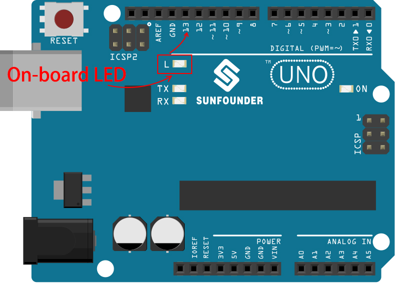

.. note::

    Hallo und willkommen in der SunFounder Raspberry Pi & Arduino & ESP32 Enthusiasten-Gemeinschaft auf Facebook! Tauchen Sie tiefer ein in die Welt von Raspberry Pi, Arduino und ESP32 mit anderen Enthusiasten.

    **Warum beitreten?**

    - **Expertenunterstützung**: Lösen Sie Nachverkaufsprobleme und technische Herausforderungen mit Hilfe unserer Gemeinschaft und unseres Teams.
    - **Lernen & Teilen**: Tauschen Sie Tipps und Anleitungen aus, um Ihre Fähigkeiten zu verbessern.
    - **Exklusive Vorschauen**: Erhalten Sie frühzeitigen Zugang zu neuen Produktankündigungen und exklusiven Einblicken.
    - **Spezialrabatte**: Genießen Sie exklusive Rabatte auf unsere neuesten Produkte.
    - **Festliche Aktionen und Gewinnspiele**: Nehmen Sie an Gewinnspielen und Feiertagsaktionen teil.

    👉 Sind Sie bereit, mit uns zu erkunden und zu erschaffen? Klicken Sie auf [|link_sf_facebook|] und treten Sie heute bei!

Lektion 3: Einstieg in die Welt von Arduino und Programmierung
==================================================================

In unserer vorherigen Lektion haben wir erfolgreich das Rocker-Bogie-Federungssystem gebaut. 
Um es jedoch funktionsfähig zu machen, müssen wir es mit Strom, einem Steuerungsboard und einer Programmierung versorgen, um seine Bewegungen zu steuern.

In dieser Lektion werden wir uns mit dem Steuerungsboard und der Programmierplattform vertraut machen, die wir verwenden werden.

.. image:: img/upload_blink.gif

Kursziele
-------------------------

* Grundkonzepte und Funktionen von Arduino verstehen.
* Über das SunFounder R3 Board lernen.
* Arduino IDE installieren und sich mit der Benutzeroberfläche vertraut machen.
* Grundlegende Syntaxregeln für die Arduino-Programmierung lernen.

Kursmaterialien
-----------------------

* SunFounder R3 Board
* Arduino IDE
* USB-Kabel
* Computer

Kursschritte
--------------

Einführung in Arduino
--------------------------

Du hast den Begriff „Arduino“ vielleicht schon oft in verschiedenen Zusammenhängen gehört, aber was genau ist es und warum ist es so beliebt geworden?

Arduino ist eine benutzerfreundliche Open-Source-Elektronikplattform für sowohl Hardware- als auch Softwareanwendungen. Sie ist darauf ausgelegt, digitale Geräte und interaktive Objekte zu erschaffen, die die physische Welt um sie herum wahrnehmen und steuern können.

Klären wir das genauer:

* **Open-Source**: Denke an Open-Source wie an einen Gemeinschaftsgarten. Jeder kann ihn nutzen, jeder kann dazu beitragen, und jeder kann davon profitieren. Bei Open-Source werden sowohl die Entwürfe der physischen Teile (die Hardware) als auch die Programmieranweisungen (die Software) frei geteilt. Das bedeutet, dass jeder sie nutzen, verbessern oder eigene Versionen erstellen kann. Es geht um Teilen und Kreativität!

    .. image:: img/arduino_oscomm.png
        :width: 400
        :align: center

* **Mikrocontroller**: Ein Mikrocontroller ist wie das Gehirn des Arduino. Es ist ein kleiner Computer, der einfache Software ausführen kann. Obwohl er nicht so leistungsfähig wie der Computer ist, den du jetzt benutzt, ist er perfekt für einfache Aufgaben wie das Verstehen von Nachrichten von Sensoren oder das Leuchten einer LED (eine kleine Lampe).

    .. image:: img/arduino_micro.jpg
        :width: 500
        :align: center

* **Entwicklungsboard**: Stell dir das Entwicklungsboard als den Körper vor, der das Gehirn unterstützt. Es ist das Board, auf dem der Mikrocontroller sitzt und es enthält andere Teile, die dem Mikrocontroller helfen, mit der Welt zu interagieren. Diese Teile umfassen Dinge wie Oszillatoren (die bei der Zeitmessung helfen), Spannungsregler (die die Leistungspegel steuern) und Anschlüsse für Strom und Daten (wie die Stecker und Schalter in deinem Haus).

    .. image:: img/arduino_board.png
        :width: 600
        :align: center

* **Arduino IDE**: Dies ist wie das Klassenzimmer für deinen Arduino. Es ist ein Programm, das auf deinem Computer läuft, wo du die Anweisungen schreiben kannst, die deinem Arduino sagen, was er tun soll. Diese Anweisungen werden in einer auf C++ basierenden Programmiersprache geschrieben. Sobald du deine Anweisungen geschrieben hast, kannst du sie über ein USB-Kabel an das Arduino-Board senden, genau wie wenn du deine Hausaufgaben abgibst!

    .. image:: img/arduino_ide_icon.png
        :width: 200
        :align: center

Jetzt, da du diese grundlegenden Ideen verstanden hast, bist du auf dem besten Weg, ein Arduino-Experte zu werden!

Dann werden wir in einige praktische Aktivitäten eintauchen, um dich mit der Arduino-Programmierung und Ingenieursprinzipien vertraut zu machen. 
Bereite dich auf eine spannende Lernreise vor!

Machen Sie sich mit Ihrem SunFounder R3 Board vertraut
-------------------------------------------------------------

In Ihrem Kit finden Sie ein blaues Board, das wie eine kleine Stadt voller kleiner metallischer Türme und Wege erscheint. Aber lassen Sie sich nicht einschüchtern! Dies ist das SunFounder R3 Entwicklungsboard, eine Art Arduino-Board, das verwendet werden kann, um eine Vielzahl von elektronischen Geräten und Projekten zu programmieren und zu steuern.

Lassen Sie uns seine Schlüsselfunktionen in einfachen Begriffen verstehen:

.. image:: img/sf_r3.jpg
    :width: 800

* **14 Digital Pins**: Denken Sie an diese Pins wie an kleine Boten. Sie können programmiert werden, um einfache "Ja" oder "Nein" Nachrichten an andere Teile Ihres Mars-Rovers zu senden (Ausgang) oder zu empfangen (Eingang). Diese Nachrichten sind eigentlich "ein" oder "aus" Signale, die das Board verwendet, um Dinge wie Lichter oder Motoren zu steuern.

    * Sechs dieser speziellen Pins können sogar Nachrichten in einer Art Geheimcode namens PWM (Pulse Width Modulation) senden. Dieser Code kann verwendet werden, um zu steuern, wie hell ein Licht ist, wie schnell ein Motor sich dreht oder sogar, wo sich ein bewegliches Teil positioniert.

* **6 Analog Pins**: Diese Pins sind wie die sechs besonderen Sinne des Boards. Sie können Signale von verschiedenen Sensortypen (wie einem Temperatursensor) lesen und diese Signale in eine Sprache übersetzen, die das Board verstehen und in seiner Programmierung verwenden kann.

* **USB Connection**: Dies ist wie die Nabelschnur des Boards. Sie können es verwenden, um Ihr Board mit Ihrem Computer zu verbinden. Diese Verbindung ermöglicht es Ihrem Computer, dem Board beizubringen, was es tun soll, indem es ihm ein Programm sendet, das Sie schreiben.

* **Power Jack**: Dies ist die Nahrungsversorgung des Boards. Sie können eine Stromquelle, wie einen Akku oder einen AC/DC-Adapter, an diese Buchse anschließen, um Ihr Board mit dem Strom zu "füttern", den es benötigt, um zu funktionieren.

* **ICSP Header**: Dies ist wie ein spezieller Eingang zur Programmierung des Boards. Es kann verwendet werden, wenn Sie einen externen Programmierer haben (ein spezielles Gerät zum "Unterrichten" des Boards).

* **Reset Button**: Wenn Sie sie drücken, ist es, als würden Sie dem Board sagen, dass es vergessen soll, was es gerade getan hat, und sein Programm von vorne beginnen soll.

Mit diesen Grundlagen sind Sie bereit, Ihre Programmierabenteuer mit dem SunFounder R3-Board zu beginnen!

.. _install_arduino_ide:

Installieren Sie Arduino IDE
--------------------------------------

Jetzt, da wir wissen, was Arduino und das Arduino-Board sind, ist es an der Zeit, dieses Wissen in die Praxis umzusetzen. Wir werden die Arduino IDE installieren, die Software, die wir verwenden werden, um unser Arduino-Board zu programmieren.

Die neueste Version der Arduino IDE ist Version 2.0. Sie ist vollgepackt mit Funktionen und sehr benutzerfreundlich. Sie sollten jedoch wissen, dass sie einige Systemanforderungen hat:

    * Windows - Win 10 und neuer, 64 Bit
    * Linux - 64 Bit
    * Mac OS X - Version 10.14: "Mojave" oder neuer, 64 Bit

Um zu beginnen, folgen Sie diesen Schritten:

#. Besuchen Sie |link_download_arduino| und laden Sie die IDE für Ihre Betriebssystemversion herunter.

    .. image:: img/sp_001.png

**Für Windows-Benutzer:**

    #. Sobald Sie die Datei heruntergeladen haben (sie wird etwas wie ``arduino-ide_xxxx.exe`` heißen), doppelklicken Sie darauf, um den Installationsprozess zu starten.

    #. Ihnen wird die **License Agreement** angezeigt. Nehmen Sie sich einen Moment Zeit, diese durchzulesen, und wenn Sie den Bedingungen zustimmen, klicken Sie auf "Ich stimme zu".

        .. image:: img/sp_002.png

    #. Als Nächstes werden Sie gebeten, Installationsoptionen auszuwählen. Lassen Sie diese so, wie sie sind, und klicken Sie auf „Next“.

        .. image:: img/sp_003.png

    #. Wählen Sie aus, wo Sie die Software installieren möchten. Es ist in der Regel am besten, sie auf einem anderen Laufwerk als dem zu installieren, das Ihr System verwendet.

        .. image:: img/sp_004.png

    #. Klicken Sie auf „Install“, um die Installation zu starten. Sobald sie abgeschlossen ist, klicken Sie auf „Finish“. 

        .. image:: img/sp_005.png

**Für macOS-Benutzer:**

    Doppelklicken Sie auf die heruntergeladene Datei (die etwas wie ``arduino_ide_xxxx.dmg`` heißen wird). Befolgen Sie die Anweisungen auf dem Bildschirm, um die **Arduino IDE**-App in den **Applications**-Ordner zu ziehen. Nach einigen Sekunden wird die Arduino IDE erfolgreich installiert sein.

    .. image:: img/macos_install_ide.png
        :width: 800

**Für Linux-Benutzer:**

    Eine detaillierte Anleitung zur Installation der Arduino IDE 2.0 auf einem Linux-System finden Sie hier: |link_arduino_linux|.
    

Entdecken des Arduino-Spielplatzes (IDE)
-------------------------------------------------

Stellen Sie sich vor, die Arduino IDE sei ein magischer Spielplatz voller Werkzeuge und Gadgets, die darauf warten, von uns erkundet und genutzt zu werden. Als Nächstes werde ich Ihnen helfen, jede Ecke dieses Spielplatzes zu verstehen.

.. image:: img/ide-2-overview.png
    :width: 800

Hier ist, was Sie auf Ihrem Spielplatz finden:

* **Verify / Upload** - Stellen Sie sich das wie Ihren magischen Aufzug vor. Es nimmt den von Ihnen geschriebenen Code und befördert ihn auf Ihr Arduino-Board.
* **Select Board & Port** - Das ist Ihre Schatzkarte. Es zeigt automatisch die Arduino-Boards an, die Sie an Ihren Computer angeschlossen haben, und teilt Ihnen deren Portnummer mit.
* **Sketchbook** - Das ist Ihre persönliche Bibliothek. Hier werden alle Ihre Skizzen (Programme) auf Ihrem Computer gespeichert. Außerdem kann es sich mit der Arduino Cloud verbinden, sodass Sie Ihre Skizzen auch aus der Online-Welt abrufen können.
* **Boards Manager** - Denken Sie daran als Ihr Werkzeugkasten. Hier können Sie verschiedene Pakete für Ihr Arduino finden und installieren.
* **Library Manager** - Das ist Ihre endlose Schatztruhe. Tausende von Bibliotheken, die von Arduino und seiner Community erstellt wurden, warten hier auf Sie. Brauchen Sie ein Werkzeug oder Material für Ihren Code? Tauchen Sie ein und finden Sie es!
* **Debugger** - Stellen Sie sich vor, Sie hätten eine Superkraft, die es Ihnen ermöglicht, Ihren Code in Echtzeit zu testen und zu debuggen, um Probleme zu finden und zu beheben. Das ist es, was dies ist!
* **Search** - Denken Sie daran als Ihre Lupe. Es hilft Ihnen, nach Schlüsselwörtern in Ihrem Code zu suchen.
* **Open Serial Monitor** - Das ist wie Ihr Kommunikationsgerät. Es öffnet einen neuen Tab, der es Ihrem Computer und Ihrem Arduino-Board ermöglicht, Nachrichten hin und her zu senden.

Jetzt, da wir einen Blick auf den Spielplatz geworfen haben, ist es an der Zeit, einzutauchen und zu beginnen, zu erschaffen!

Laden Sie Ihre erste Skizze hoch
----------------------------------------

In Ordnung, es ist Zeit, etwas Spaß zu haben! Wir werden eine LED blinken lassen - es ist wie ein „Hello, World!“ in der Welt von Arduino.

Die meisten Arduino-Boards haben eine eingebaute LED am Pin 13, was dies zu einem guten ersten Experiment macht.

Lassen Sie uns das aufschlüsseln:

#. **Einstecken**: Verbinden Sie Ihr SunFounder R3 Board mit einem USB-Kabel mit Ihrem Computer. So geben wir unserem Board Strom und senden unser Programm (auch „Skizze“ genannt) an das Board. Sie fühlen sich vielleicht so, als würden Sie nur ein Computer-Gadget anschließen, aber glauben Sie mir, Sie verbinden sich mit einer Welt voller Möglichkeiten!

    .. image:: img/connect_board_pc.gif

#. **Die Beispiel-Skizze finden**: Gehen Sie in der Arduino IDE zu **File** -> **Examples** -> **Basic** -> **Blink**. Was aufploppt, ist ein fertiges Programm, das wir ändern werden. Es ist wie einen fertigen Kuchen zu bekommen, den wir gleich dekorieren werden!

    .. image:: img/open_blink.png

#. **Verstehe den Entwurf**: Schau dir den Code in diesem neuen Fenster an. Er weist Arduino an, die integrierte LED (die sich an Pin 13 befindet) für eine Sekunde einzuschalten, dann für eine Sekunde auszuschalten und diesen Vorgang zu wiederholen. Es ist wie Morsecode zu senden, aber mit Licht!

    .. image:: img/led_blink.png

#. **Lade den Entwurf hoch**: Sobald du das richtige Board und den richtigen Port ausgewählt hast, klicke einfach auf den Hochlade-Button. Es ist so einfach wie einen Brief zu senden; du übermittelst deine Anweisungen an das Arduino-Board! Meistens erkennt das System automatisch das Board und den Port für dich.

    .. image:: img/upload_blink.gif

#. **Beobachte, wie es funktioniert**: Wenn alles gut läuft, wirst du sehen, wie die LED auf deinem Arduino-Board anfängt, ein- und auszublinken. Es ist, als würde dein Arduino dir zuzwinkern!

    .. image:: img/blink_led.gif

Großartige Arbeit! Du hast gerade dein erstes Arduino-Programm ausgeführt und bist damit ein echter Programmierer! Was kommt als Nächstes? Wir kratzen gerade erst an der Oberfläche dessen, was Arduino leisten kann. Bereit für die nächste Herausforderung?

Einige unterhaltsame Fakten zur Arduino-Programmierung
--------------------------------------------------------------

Zeit, einige coole Geheimnisse über die Arduino-Programmierung zu lüften!

* Code-Magie: ``setup()`` und ``loop()``

    Ein Arduino-Entwurf, oder ein Stück Code, ist wie ein Theaterstück in zwei Akten:

    * ``setup()``: Das ist Akt 1, die Eröffnungsszene. Sie findet nur einmal statt, wenn dein Arduino-Board zum ersten Mal erwacht. Sie wird verwendet, um die Bühne vorzubereiten, indem Dinge wie Pin-Modi und Bibliotheken eingerichtet werden.
    * ``loop()``: Nach Akt 1 gehen wir über zu Akt 2, der sich wiederholt, bis der letzte Vorhang fällt (was nur passiert, wenn wir die Stromversorgung abschalten oder den Reset-Knopf drücken!). Dieser Teil des Codes ist wie der Hauptteil unseres Stücks, wo die eigentliche Aktion stattfindet.

    Aber denk daran, selbst wenn es keine Magie (Code) im ``setup()`` oder ``loop()`` gibt, müssen wir sie trotzdem behalten. Sie sind wie die Bühne - selbst eine leere Bühne bleibt eine Bühne.

    .. code-block:: arduino
    
        void setup() {
            // initialize digital pin LED_BUILTIN as an output.
            pinMode(LED_BUILTIN, OUTPUT);

            digitalWrite(LED_BUILTIN, HIGH);  // turn the LED on (HIGH is the voltage level)
            delay(1000);                      // wait for a second
            digitalWrite(LED_BUILTIN, LOW);   // turn the LED off by making the voltage LOW
            delay(1000);                      // wait for a second
        }

        // the loop function runs over and over again forever
        void loop() {

        }

* Satzzeichen in der Programmierung

    Genauso wie in einem Märchenbuch verwendet Arduino spezielle Satzzeichen, um den Code verständlich zu machen:

    * ``Semikolons (;)``: Diese sind wie Punkte in einer Geschichte. Sie sagen dem Arduino: "Okay, ich bin fertig mit dieser Aktion. Was kommt als Nächstes?"
    * ``Geschweifte Klammern {}``: Diese sind wie der Anfang und das Ende eines Kapitels. Sie fassen Code-Teile zusammen und markieren, wo ein Abschnitt beginnt und endet.

    Solltest du einige dieser Satzzeichen vergessen, keine Sorge! Der Arduino ist wie ein freundlicher Lehrer, der deine Arbeit überprüft, dir die Fehler zeigt und dir hilft, sie zu beheben. Das gehört alles zum Lernabenteuer!

    .. image:: img/blink_error.gif

* Über die Funktionen

    Stelle dir diese Funktionen wie magische Zaubersprüche vor. Jeder Spruch hat eine spezifische Wirkung in unserem Arduino-Abenteuer:

    * ``pinMode()``: Dieser Spruch entscheidet, ob ein Pin ein EINGANG oder ein AUSGANG ist. Es ist, als würde man entscheiden, ob eine Figur in unserer Geschichte spricht (AUSGANG) oder zuhört (EINGANG).
    * ``digitalWrite()``: Dieser Spruch kann einen Pin HIGH (an) oder LOW (aus) schalten, wie das Ein- und Ausschalten eines magischen Lichts.
    * ``delay()``: Dieser Spruch lässt den Arduino für eine bestimmte Zeit pausieren, wie eine kurze Pause inmitten unserer Geschichte.
    
    Wie in einem Zauberbuch kannst du all diese und viele weitere Zaubersprüche im |link_arduino_web| finden. Je mehr Sprüche du kennst, desto aufregender können deine Arduino-Abenteuer werden!

* Kommentare: Unsere Geheimen Nachrichten

    Wir haben auch eine Geheimsprache in der Programmierung, genannt ``Kommentare``. Das sind Nachrichten, die wir in unserem Code mit ``//`` oder ``/* */`` schreiben können. Das Magische daran? Der Arduino ignoriert sie komplett! Es ist ein großartiger Ort, um Notizen für dich selbst oder andere zu hinterlassen, um zu erklären, was die schwierigen Teile des Codes tun.

* Lesbarkeit des Codes: Code Benutzerfreundlich Gestalten

    Obwohl du deinen Code schreiben kannst, wie du möchtest (zum Beispiel verursacht das Setzen von Semikolons auf einer separaten Zeile keine Fehler), ist es wichtig, die Lesbarkeit des Codes im Auge zu behalten.

    .. image:: img/blink_noerror.gif

    Wie beim Schreiben einer guten Geschichte kann die Art und Weise, wie wir Code schreiben, diesen entweder spaßig und leicht oder langweilig und schwer lesbar machen. Hier sind einige Möglichkeiten, deinen Code freundlicher zu gestalten:

    * Verwende eine angemessene Einrückung, um deine Sätze in ordentliche Absätze zu ordnen. Das hilft dem Leser zu verstehen, wo ein Abschnitt endet und ein anderer beginnt.
    * Verwende sinnvolle Variablennamen. Es ist wie, einen Charakter in einer Geschichte mit einem passenden Namen zu nennen.
    * Halte deine Funktionen klein und einfach, wie kurze und süße Kapitel in einem Buch.
    * Hinterlasse Kommentare für die kniffligen Teile. Es ist wie, eine Fußnote zu hinterlassen, um ein schwieriges Wort zu erklären.

Denk daran, wir programmieren nicht nur für Maschinen, sondern auch für Menschen. Also lass uns dafür sorgen, dass unser Code eine klare und verständliche Geschichte erzählt!

**Reflektieren und Verbessern**

Einen Moment innezuhalten und über unsere Reise nachzudenken, kann uns Einsichten geben, die wir im Trubel der Entdeckung vielleicht übersehen würden. Frag dich selbst:

* Was war der interessanteste Teil dieses Arduino-Abenteuers?
* Gab es Herausforderungen auf dem Weg? Wie hast du sie überwunden?
* Könntest du einem Freund erklären, was Arduino ist, was die Arduino-IDE macht oder wie man Arduino-Code ausführt?
* Wie würdest du deine erste Erfahrung mit der Arduino-Programmierung beschreiben?
* Was möchtest du noch über Arduino lernen?

Indem du über diese Fragen nachdenkst, vertiefst du dein Verständnis und bereitest dich auf zukünftige Erkundungen vor. Denk immer daran, es gibt keine „falsche“ Antwort bei der Reflexion – es ist schließlich deine persönliche Reise!
