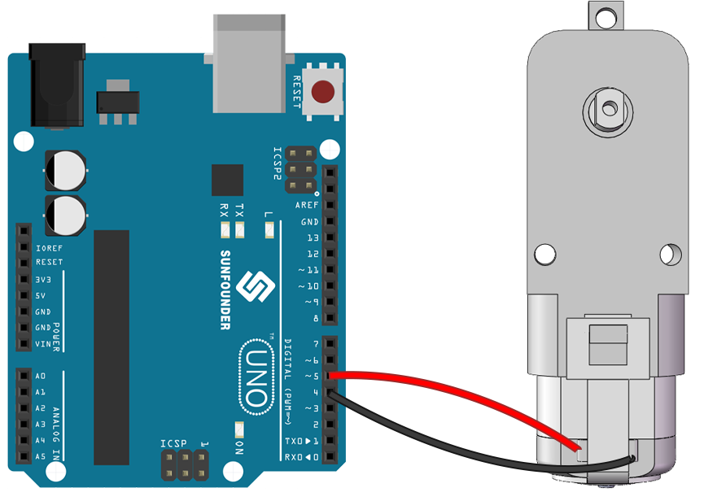
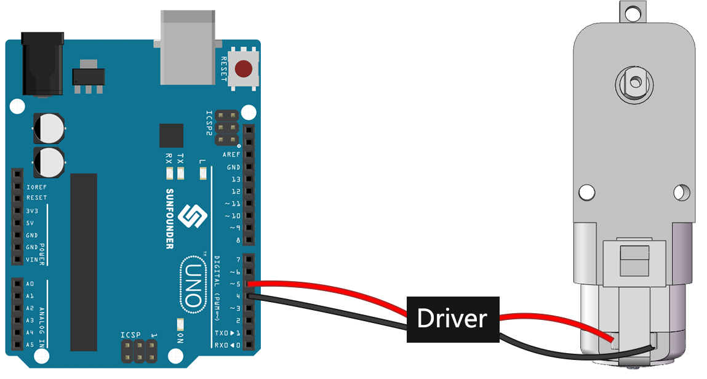
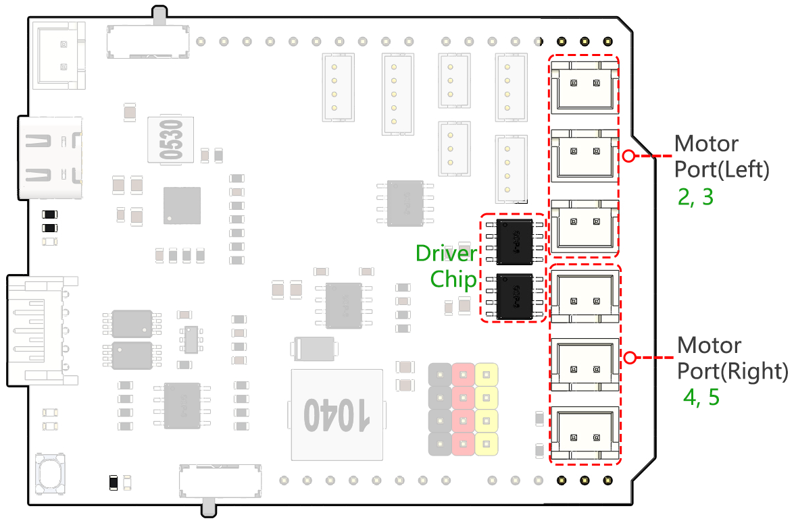
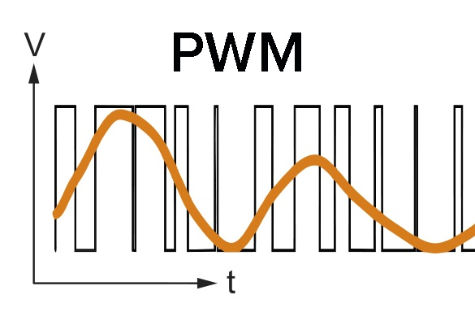

Lesson 4: Mastering the TT Motor
=================================

In the previous lessons, we explored Mars rovers, their suspension systems, and delved into knowledge about Arduino. 

In this exciting course, we'll explore the workings of motors, a key component that drives Mars rovers. 
We'll understand the principles that power these motors and learn to control them using SunFounder R3 board and a GalaxyRVR Shield. 

By the end of this course, you'll have a solid understanding of motor operation and hands-on experience in motor control. 

Let's dive in!

.. raw:: html

    <video width="600" loop autoplay muted>
        <source src="_static/video/left_1.mp4" type="video/mp4">
        Your browser does not support the video tag.
    </video>

.. note::

    If you are learning this course after fully assembling the GalaxyRVR, you need to move this switch to the right before uploading the code.

    .. image:: img/camera_upload.png
        :width: 500
        :align: center

Course Objectives
----------------------
* Understand the basic principles of motors and the characteristics of the TT motor.
* Learn how to control the direction and speed of the TT motor.
* Understand how the GalaxyRVR Shield controls six motors.

Course Materials
-----------------------

* SunFounder R3 Board
* TT Motor
* GalaxyRVR Shield
* Battery
* USB Cable
* Arduino IDE
* Computer

Course Steps
------------------

**Step 1: What is a Motor?**

Motors play an integral part in our daily lives. They're everywhere! From the electric fans that cool us on hot days, the mixers that help us make delicious cakes, to the electric cars that whizz by on the streets – motors make things move!

A motor is like the heart of a machine. It converts electrical energy into mechanical energy, making our toys, appliances, and even big vehicles come to life!

The magic behind a motor isn't magic at all - it's science, specifically the principle of electromagnetic induction. Here's how it works: when electricity is supplied to a motor, it generates a magnetic field. This magnetic field then interacts with other magnets within the motor, causing the motor to spin. This spin, like spinning a top, can then be used to move wheels, propellers, or any other moving parts of a machine.

.. image:: img/motor_rotate.gif
    :align: center

The type of motor we're focusing on in our GalaxyRVR is a specific kind called a TT Gear Motor. 

.. image:: img/tt_motor_xh.jpg
    :align: center
    :width: 400

This is essentially a regular motor combined with a series of gears, all encased within a plastic shell.

As the motor spins, the gears translate this spin to the wheels of our rover. The use of gears provides a crucial benefit - it increases torque, enabling the motor to move larger, heavier loads.

.. image:: img/motor_internal.gif
    :align: center
    :width: 600

Isn't it fascinating to see how science and engineering principles come to life? Motors are a perfect example of these principles in action. By understanding how motors work, we can dream up and invent a wide array of machines. Let's dive deeper into the world of motors and unleash our creativity!

**Step 2: Exploring Motor Functioning and Operation**

Having understood what a motor is and its broad spectrum of applications, it's time we venture into the heart of motor operation.

In essence, a motor works on the principle of electromagnetism. When an electric current passes through a wire, it generates a magnetic field around it. This magnetic field can interact with other magnetic fields, causing motion.

Consider a simple experiment where we connect a motor directly to a battery. The current from the battery flows into the motor, triggering the internal mechanism of the motor to start spinning. This spinning action is due to the magnetic forces inside the motor.

    .. image:: img/motor_battery.png

Interestingly, if you reverse the connections to the battery, the motor spins in the opposite direction! This happens because the direction of current flow changes, altering the direction of the magnetic field and consequently the direction of the motor's spin.

Now we know that connecting the motor directly to a battery can make it spin, but often we want to control its movement with code, so we include an Arduino board between them. But what would happen if we tried to connect the motor directly to the signal pins on the Arduino board?

If you guessed that the motor would not spin, you are correct! But why is that so?

The answer lies in the current output of the Arduino board. The signal pins on a typical Arduino board can output only about 20mA of current, which is insufficient to drive a motor.

So, how can we control motors using our Arduino? This is where a crucial component comes into the picture - a motor driver. Think of a motor driver as a bridge between the Arduino and the motor. It takes the low-current control signal from the Arduino, amplifies it, and sends it to the motor, thus enabling the motor to spin.

In our next step, we'll dive into the specifics of the motor driver and understand how we can effectively use it with our Arduino board to control a motor. Stay tuned for more exciting learning!

**Step 3: How the Motor is controlled by the Motor Driver**

Our GalaxyRVR Shield, included in the kit, serves as the control center for our Mars Rover. It is the hub where we connect all our sensors, motors, and power supply. It consists of several components that allow us to control and power our Rover effectively.

On the right side of the shield, you'll notice six motor ports. However, they are grouped into two sets, each controlled by a separate motor drive chip. Three ports marked "Left" are controlled by one chip, and the other three ports marked "Right" are controlled by another.

Let's learn how these two drive chips control the six motors through hands-on experience:

* **1. Connecting the Circuit**

    #. Plug the GalaxyRVR Shield into the R3 board, connect a motor, and finally plug in the battery to provide power to the expansion board.

        .. raw:: html

            <video width="600" loop autoplay muted>
                <source src="_static/video/connect_shield.mp4" type="video/mp4">
                Your browser does not support the video tag.
            </video>

    #. When first used or when the battery cable is unplugged, the GalaxyRVR Shield activates its over-discharge protection circuitry. You’ll need to plug in the Type-C cable for about 5 seconds to release the protection. If the power indicator lights up, it means the protection status has been released. Check the battery indicators at this point - if both are off, keep the Type-C cable plugged in to charge the battery.

        .. raw:: html

            <video width="600" loop autoplay muted>
                <source src="_static/video/plug_usbc.mp4" type="video/mp4">
                Your browser does not support the video tag.
            </video>

* **2. Writing and Uploading Code**

    #. Open the Arduino IDE and input the following code:

        .. code-block:: arduino

            void setup() {
                pinMode(2, OUTPUT);
                pinMode(3, OUTPUT);
            }

            void loop() {
                digitalWrite(2, LOW);
                digitalWrite(3, HIGH);
            }
    
        * ``pinMode()``: This function sets a pin as INPUT or OUTPUT, akin to deciding whether a character in our story speaks (OUTPUT) or listens (INPUT).
        * ``digitalWrite()``: This function can set a pin HIGH (on) or LOW (off), much like switching a magic light on and off.

    #. Once you've selected the correct board(Arduino Uno) and port, click on the **Upload** button. It's like putting a letter in a mailbox - you're sending your instructions off to Arduino!

        .. image:: img/motor_upload.png
        
    #. Once the code has been successfully uploaded, you will see the motor start to rotate clockwise.

        .. raw:: html

            <video width="600" loop autoplay muted>
                <source src="_static/video/left_1.mp4" type="video/mp4">
                Your browser does not support the video tag.
            </video>
    
* **3. About Circuit Internal Connection**

    #. You can plug two more motors into the "Left" marked motor ports. You will see them rotate simultaneously.

    #. Now, let's understand the simple principle of how the two drive chips control the six motors. Pins 2 and 3 on the Arduino board output signals to the motor drive chip, and the other end of the chip is connected to three motors in parallel. Similarly, pins 4 and 5 output signals to another drive chip, which in turn is connected to another three motors in parallel.

        .. image:: img/motor_driver.png
            :width: 500

    #. If you want to test another drive chip, you just need to change the pins to ``4`` and ``5``.

        .. code-block:: arduino
            :emphasize-lines: 10,11

            const int in3 = 4;
            const int in4 = 5;

            void setup() {
                pinMode(in3, OUTPUT);
                pinMode(in4, OUTPUT);
            }

            void loop() {
                digitalWrite(in3, LOW);
                digitalWrite(in4, HIGH);
            }

        Here, we define two variables to represent pins 4 and 5. By using variables, we can easily manage and adjust our pin assignments throughout our code.

        Think of it as if we're assigning a specific role or duty to each pin number. When we decide to reassign the roles, instead of going through the entire script and changing every instance, we just update the assignment at the beginning of the script (where the variable is initially defined).

* **4. About Drive Logic**

    #. In the previous tests, you would have noticed that the motors all spin in one direction. How do we make it spin in the opposite direction? Someone might suggest swapping the HIGH and LOW of the two pins. That's correct.

        .. code-block:: arduino
            :emphasize-lines: 1,2

            const int in3 = 4;
            const int in4 = 5;

            void setup() {
                pinMode(in3, OUTPUT);
                pinMode(in4, OUTPUT);
            }

            void loop() {
                digitalWrite(in3, HIGH);
                digitalWrite(in4, LOW);
            }

        Once you've written your code and uploaded it to your Arduino board, the motor will behave as instructed.

        .. raw:: html

            <video width="600" loop autoplay muted>
                <source src="_static/video/right_cc.mp4" type="video/mp4">
                Your browser does not support the video tag.
            </video>

    #. Let's now look at the internal driving logic of the drive chip.

        .. list-table::
            :widths: 25 25 50
            :header-rows: 1

            * - INA
              - INB
              - Motor
            * - L
              - L
              - Standby
            * - L
              - H
              - Clockwise
            * - H
              - L
              - Counterclockwise
            * - H
              - H
              - Brake
    
    #. Now, let's try to make the motor rotate clockwise for 2 seconds, counterclockwise for 2 seconds, and then stop.

        .. code-block:: arduino
            :emphasize-lines: 10,11,12,13,14,15,16,17,18

            const int in3 = 4;
            const int in4 = 5;
            
            void setup() {
                pinMode(in3, OUTPUT);
                pinMode(in4, OUTPUT);
            }
            
            void loop() {
                digitalWrite(in3, LOW);
                digitalWrite(in4, HIGH);
                delay(2000);
                digitalWrite(in3, HIGH);
                digitalWrite(in4, LOW);
                delay(2000);
                digitalWrite(in3, HIGH);
                digitalWrite(in4, HIGH);
                delay(5000);
            }

        * Here we use the ``delay()`` function to make the Arduino pause for a certain amount of time, much like taking a short nap in the middle of our story.
        * In the code, we use the "Brake" state to stop the motor, and you'll notice that the motor stops abruptly. Try setting both pins to LOW to test the "Standby" state, and you'll find that the motor gradually slows down to a stop.

Now that you should have a better understanding of how the motor driver chip controls the motors through the GalaxyRVR Shield and how we can use Arduino code to manipulate the motor's movements. Isn't it fascinating how a few lines of code can dictate the behavior of a physical object like our motor?

Consider the following questions as you move forward:

* If we move all the code from the ``loop()`` function into the ``setup()`` function, how would the behavior of the motor change?
* How would you modify the code to control six motors simultaneously?

Remember, the more you experiment and play around with your code, the more you learn. Feel free to tweak, modify, and optimize your code as you deem fit. Happy coding!

**Step 4: Controlling Motor Speed**

In the previous step, we controlled the motor’s direction by simply setting its pins HIGH or LOW. 
This is like giving the motor full power to drive it, similar to pressing the accelerator pedal to the floor in a car. 
But in many situations, we might want to adjust the motor speed to suit different scenarios, 
just like we adjust the speed of a car depending on whether we're driving in a city or on a highway. 
This is where Pulse Width Modulation (PWM) comes in.

PWM is a technique used to create the effect of variable voltage output by rapidly switching the output between HIGH and LOW. 
With PWM, we can simulate the effect of an analogue signal while only actually outputting digital signals.

You might be finding this hard to understand, and that's okay! We'll be learning how to adjust motor speed using PWM through coding in the following sections.

Note that although the SunFounder R3 board has some pins with built-in PWM functionality, we can’t use them for our motor because they're already serving other functions. Thus, we're connecting the driver chips to pins 2, 3, 4, and 5, and using the Arduino’s SoftPWM library to enable PWM on these pins.

Here's what we'll do next:

#. Open Arduino IDE, search for ``softpwm`` in the **LIBRARY MANAGER** and install it.

    .. raw:: html

        <video width="600" loop autoplay muted>
            <source src="_static/video/install_softpwm.mp4" type="video/mp4">
            Your browser does not support the video tag.
        </video>

#. Enter the following code into Arduino IDE. After uploading the code successfully, the motor will rotate clockwise.

    .. code-block:: arduino
        :emphasize-lines: 1, 7,11,12

        #include <SoftPWM.h>

        const int in1 = 2;
        const int in2 = 3;

        void setup() {
            SoftPWMBegin();
        }

        void loop() {
            SoftPWMSet(in1, 0);
            SoftPWMSet(in2, 255);

        }

    * In the code above, we first add ``SoftPWM.h`` to the top of the code, enabling us to use the functions in the ``SoftPWM`` library directly.
    * Then, initialize the ``SoftPWM`` library with ``SoftPWMBegin()`` function.
    * Finally, in the ``loop()`` function, we use ``SoftPWMSet()`` to assign different values to ``in1`` and ``in2``, setting the motor in motion. You will notice the effect is similar to directly using ``LOW`` and ``HIGH``, but here we use numerical values within a range of ``0~255``.
    * Remember, in the world of Arduino, speed is expressed as a value between 0 (like a car at a stop sign) and 255 (zooming down the highway!). So, when we say ``SoftPWMSet(in2, 255)``, we're telling that motor to go full speed ahead!

#. Now, let's enter other values and observe any differences in motor speed.

    .. code-block:: arduino
        :emphasize-lines: 12,13,14,15

        #include <SoftPWM.h>

        const int in1 = 2;
        const int in2 = 3;

        void setup() {
            SoftPWMBegin();
        }

        void loop() {
            SoftPWMSet(in1, 0);
            for (int i = 0; i <= 255; i++) {
                SoftPWMSet(in2, i);
                delay(100);
        }
            delay(1000);
        }
    
    In the code above, we use a ``for`` loop to increment a variable ``i`` up to ``255``. The ``for`` loop in C language is used to iterate over a part of the program several times. It consists of three parts:

    .. image:: img/motor_for123.png
        :width: 400
        :align: center

    * **Initialization**: This step is executed first and only once when we enter the loop for the first time. It allows us to declare and initialize any loop control variables.
    * **Condition**: This is the next step after initialization. If it's true, the body of the loop is executed. If it's false, the body of the loop does not execute and the flow of control goes outside of the for loop.
    * **Increment or Decrement**: After executing the Initialization and Condition steps and the loop body code, the Increment or Decrement step is executed. This statement allows us to update any loop control variables.
    
    The flowchart for the for loop is shown below:

    .. image:: img/motor_for.png

    So, after running the above code, you will see the motor speed gradually increasing. It stops for a second, and then starts again from 0 and gradually increases.

    .. raw:: html

        <video width="600" loop autoplay muted>
            <source src="_static/video/left_speed.mp4" type="video/mp4">
            Your browser does not support the video tag.
        </video>

In this step, we have learned about Pulse Width Modulation (PWM), a technique for controlling the speed of our motor. By using the Arduino's SoftPWM library, we can adjust the speed of the motor, allowing us to simulate analogue signals while only outputting digital signals. This provides us with finer control over our rover's movements, and prepares us for more complex maneuvers in the future.

**Step 5: Reflect and Improve**

Having completed this lesson, you should now be familiar with the working principles of motors, as well as how to control their direction and speed through programming.

Let's test your understanding with these challenges:

* How would you modify the for loop to gradually decrease the motor speed?
* How would you control the motor to accelerate or decelerate while rotating counterclockwise?

You can experiment with the provided code to answer these questions. Feel free to adjust the code according to your hypotheses and observe the changes in the motor's behavior.

Your hands-on experiments and reflections on these questions will deepen your understanding and enhance your problem-solving skills. It is through challenges like these that real learning occurs. Always remember, there is no "right" or "wrong" in your exploratory journey – this is all about learning and discovery!

