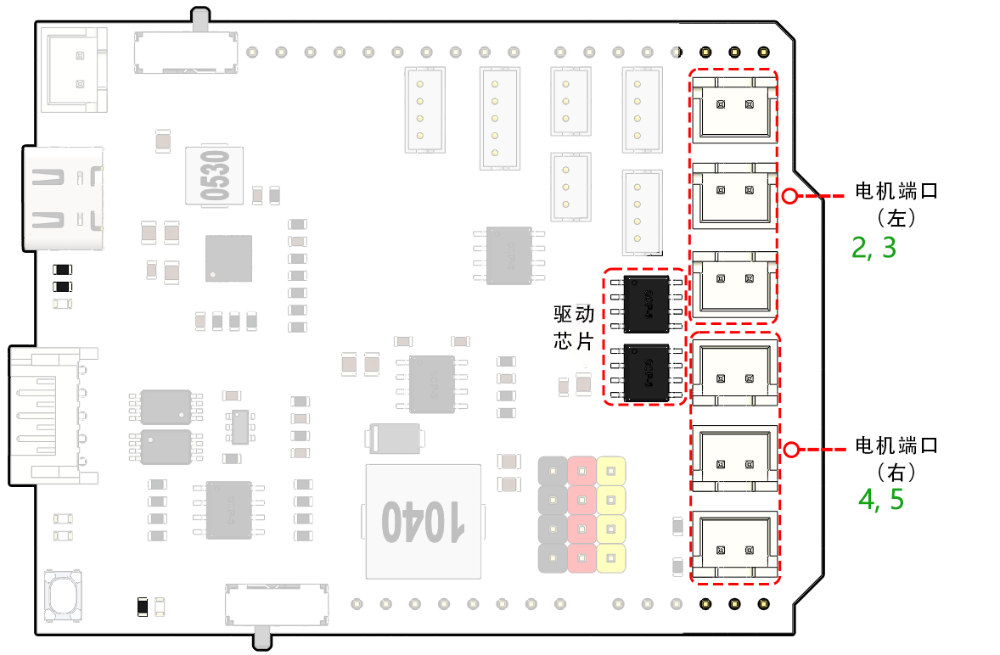

第四课 掌握 TT 电机
=================================

在之前的课程中，我们探讨了火星车、悬挂系统以及 Arduino 的基础知识。

在本次课程中，我们将探索电机的工作原理，这是一项驱动火星车的关键技术。我们将理解推动这些电机的基本原理，并学会如何通过 SunFounder R3 开发板和 GalaxyRVR Shield 来控制它们。

通过本课程，你将对电机的操作有一个扎实的理解，并且获得实际的电机控制经验。

让我们开始吧！

.. raw:: html

    <video width="600" loop autoplay muted>
        <source src="_static/video/left_1.mp4" type="video/mp4">
        Your browser does not support the video tag.
    </video>

.. note::

    如果你是在完全组装好 GalaxyRVR 后学习本课程，请确保在上传代码之前，将此开关拨到右侧。

    .. image:: img/camera_upload.png
        :width: 500
        :align: center

课程目标
----------------------
* 了解电机的基本原理以及 TT 电机的特点。
* 学习如何控制 TT 电机的方向和速度。
* 理解 GalaxyRVR Shield 如何控制六个电机的工作原理。

课程材料
-----------------------

* SunFounder R3 开发板
* TT 电机
* GalaxyRVR Shield
* 电池
* USB 数据线
* Arduino IDE
* 计算机

课程步骤
------------------

**步骤 1：什么是电机？**

电机在我们的日常生活中扮演着不可或缺的角色。它们无处不在！从炎热天气里为我们降温的电风扇，到帮助我们制作美味蛋糕的搅拌机，再到街头疾驰而过的电动汽车——电机使得一切能够运转！

.. image:: img/motor_application.jpg

电机就像机器的“心脏”。它将电能转化为机械能，使我们的玩具、家电，甚至大型车辆充满活力！

电机背后的“魔力”并不是魔法，而是科学，尤其是电磁感应原理。其原理是，当电流流过电机时，它会产生一个磁场。这个磁场与电机内部的其他磁铁相互作用，促使电机转动。电机的转动，就像陀螺转动一样，可以用来驱动轮子、螺旋桨或机器的其他移动部件。

.. image:: img/motor_rotate.gif
    :align: center

我们在 GalaxyRVR 中使用的电机是一个特定类型，叫做 TT 齿轮电机。

.. image:: img/tt_motor_xh.jpg
    :align: center
    :width: 400

它本质上是一个普通的电机，结合了一组齿轮，并被封装在塑料外壳中。

当电机旋转时，齿轮将这种旋转传递给火星车的车轮。齿轮的使用带来了一个关键的好处——它增加了扭矩，使电机能够推动更大、更重的负载。

.. image:: img/motor_internal.gif
    :align: center
    :width: 600

看到科学和工程原理如何在电机中得到应用，是不是很有趣？电机是这些原理在实践中的完美体现。理解电机的工作原理后，我们可以构思和发明各种机器。让我们深入电机的世界，激发我们的创造力吧！

**步骤 2：探索电机的工作原理与操作**

在了解了电机的基本概念和广泛应用后，现在让我们深入探讨电机的工作原理。

本质上，电机的工作原理基于电磁学。当电流通过导线时，它会在导线周围产生一个磁场。这个磁场会与其他磁场相互作用，导致物体产生运动。

例如，我们将电机直接连接到电池。电池中的电流流入电机，启动电机内部的机制，使其开始旋转。这种旋转动作是由电机内部的磁力所驱动的。

有趣的是，如果反转电池的连接，电机将会反向旋转！这是因为电流方向发生了变化，磁场方向也随之改变，从而改变了电机旋转的方向。

现在我们知道，直接将电机连接到电池可以让它旋转，但我们通常希望通过代码来控制电机的运动，因此我们需要在电机和电池之间加入一个 Arduino 开发板。假设我们直接将电机连接到 Arduino 开发板的信号引脚，会发生什么呢？

.. image:: img/motor_uno.png
    :width: 600
    :align: center

如果你猜测电机不会转动，那你猜对了！但为什么会这样呢？

答案在于 Arduino 开发板的电流输出。典型的 Arduino 开发板信号引脚每个只能输出大约 20mA 的电流，这远远不足以驱动电机。

那么，如何通过 Arduino 控制电机呢？这时，一个关键组件——电机驱动器就派上用场了。可以把电机驱动器看作是 Arduino 和电机之间的桥梁。它接收来自 Arduino 的低电流控制信号，将其放大后传送给电机，驱动电机旋转。

.. image:: img/motor_uno2.png

接下来的步骤中，我们将深入了解电机驱动器，并学习如何有效地与 Arduino 开发板一起使用它来控制电机。敬请期待更多精彩内容！

**步骤 3：电机驱动器如何控制电机**

GalaxyRVR 套件中的 Shield 是火星车的控制中心。它是连接所有传感器、电机和电源的核心部分。该 Shield 包含多个组件，使我们能够高效地控制和供电火星车。

在 Shield 的右侧，你会看到六个电机接口。这些接口分为两组，每组三个接口，由两个独立的电机驱动芯片控制。标记为“Left”的三组接口由一个芯片控制，而标记为“Right”的三组接口由另一个芯片控制。

让我们通过实践了解这两个驱动芯片如何控制六个电机：

* **1. 连接电路**

    #. 将 GalaxyRVR Shield 插入 R3 开发板，连接一个电机，并最后插入电池为扩展板供电。

        .. raw:: html

            <video width="600" loop autoplay muted>
                <source src="_static/video/connect_shield.mp4" type="video/mp4">
                Your browser does not support the video tag.
            </video>

    #. 第一次使用时，建议插入 Type-C USB 数据线先给电池充电。然后打开电源。

        .. raw:: html

            <video width="600" loop autoplay muted>
                <source src="_static/video/plug_usbc.mp4" type="video/mp4">
                Your browser does not support the video tag.
            </video>

* **2. 编写并上传代码**

    #. 打开 Arduino IDE 并输入以下代码：

        .. code-block:: arduino

            void setup() {
                pinMode(2, OUTPUT);
                pinMode(3, OUTPUT);
            }

            void loop() {
                digitalWrite(2, LOW);
                digitalWrite(3, HIGH);
            }

        * ``pinMode()``：此函数将引脚设置为输入（INPUT）或输出（OUTPUT），类似于决定故事中的角色是否发言（OUTPUT）或聆听（INPUT）。
        * ``digitalWrite()``：此函数可以将引脚设置为高电平（HIGH）或低电平（LOW），就像开关灯一样简单。

    #. 选择正确的开发板（Arduino Uno）和端口后，点击 **Upload** 按钮。这就像把信件投入邮箱——你在将指令发送到 Arduino！

        .. image:: img/motor_upload.png
        
    #. 代码上传成功后，你会看到电机开始顺时针旋转。

        .. raw:: html

            <video width="600" loop autoplay muted>
                <source src="_static/video/left_1.mp4" type="video/mp4">
                Your browser does not support the video tag.
            </video>

* **3. 电路内部连接**

    #. 你可以将两个电机插入标有“Left”的电机接口，它们将会同时旋转。

    #. 接下来，让我们理解两个驱动芯片如何控制六个电机的基本原理。Arduino 开发板的 2 号和 3 号引脚向电机驱动芯片输出信号，芯片的另一端连接三个电机并行工作。同样，4 号和 5 号引脚向另一个驱动芯片输出信号，后者控制另外三个电机。

        .. image:: img/motor_driver.png
            :width: 500

    #. 如果你想测试另一个驱动芯片，只需将引脚更改为 ``4`` 和 ``5``。

        .. code-block:: arduino
            :emphasize-lines: 10,11

            const int in3 = 4;
            const int in4 = 5;

            void setup() {
                pinMode(in3, OUTPUT);
                pinMode(in4, OUTPUT);
            }

            void loop() {
                digitalWrite(in3, LOW);
                digitalWrite(in4, HIGH);
            }

        这里我们定义了两个变量来表示 4 号和 5 号引脚。通过使用变量，我们可以轻松管理和调整代码中的引脚分配。

        可以把它看作是为每个引脚分配一个特定的角色或职责。当我们决定重新分配这些角色时，我们只需要在脚本开头更新变量定义，而不是在整个脚本中逐一修改。

* **4. 关于驱动逻辑**

    #. 在之前的测试中，你可能注意到电机始终朝一个方向旋转。那么，如何让它朝相反方向旋转呢？有人可能会建议交换两个引脚的 HIGH 和 LOW 信号，这是正确的做法。

        .. code-block:: arduino
            :emphasize-lines: 1,2

            const int in3 = 4;
            const int in4 = 5;

            void setup() {
                pinMode(in3, OUTPUT);
                pinMode(in4, OUTPUT);
            }

            void loop() {
                digitalWrite(in3, HIGH);
                digitalWrite(in4, LOW);
            }

        当你编写并上传代码到 Arduino 开发板后，电机将按照指令运行。

        .. raw:: html

            <video width="600" loop autoplay muted>
                <source src="_static/video/right_cc.mp4" type="video/mp4">
                Your browser does not support the video tag.
            </video>

    #. 现在，让我们看看驱动芯片的内部驱动逻辑。

        .. list-table::
            :widths: 25 25 50
            :header-rows: 1

            * - INA
              - INB
              - 电机
            * - L
              - L
              - 待机
            * - L
              - H
              - 顺时针
            * - H
              - L
              - 逆时针
            * - H
              - H
              - 制动

    #. 现在，让我们尝试让电机顺时针旋转 2 秒，逆时针旋转 2 秒，然后停止。

        .. code-block:: arduino
            :emphasize-lines: 10,11,12,13,14,15,16,17,18

            const int in3 = 4;
            const int in4 = 5;
            
            void setup() {
                pinMode(in3, OUTPUT);
                pinMode(in4, OUTPUT);
            }
            
            void loop() {
                digitalWrite(in3, LOW);
                digitalWrite(in4, HIGH);
                delay(2000);
                digitalWrite(in3, HIGH);
                digitalWrite(in4, LOW);
                delay(2000);
                digitalWrite(in3, HIGH);
                digitalWrite(in4, HIGH);
                delay(5000);
            }

        * 在这里，我们使用了 ``delay()`` 函数来让 Arduino 暂停一段时间，就像在故事的中途小憩片刻一样。
        * 在代码中，我们使用了“制动”状态来停止电机，你会发现电机突然停止。如果你将两个引脚都设置为 LOW 来测试“待机”状态，你会发现电机逐渐减速直到停下。

现在，你应该对如何通过 GalaxyRVR Shield 控制电机驱动芯片，并通过 Arduino 代码操控电机的运动有了更深入的了解。看似简短的几行代码如何控制一个物理物体（如电机）的行为，真是令人着迷，不是吗？

在继续之前，可以思考以下问题：

* 如果我们将所有代码从 ``loop()`` 函数移到 ``setup()`` 函数中，电机的行为会有什么变化？
* 如何修改代码来同时控制六个电机？

记住，你越是进行实验和尝试，学到的东西就越多。随时调整、修改和优化你的代码吧。编程愉快！

**步骤 4：控制电机速度**

在前一步中，我们通过简单地设置引脚为 HIGH 或 LOW 来控制电机的方向。
这就像是给电机提供全力驱动，就像汽车将油门踏板踩到底一样。
但在许多情况下，我们可能需要根据不同的情境来调整电机的速度，就像我们在城市中和高速公路上驾驶时会根据情况调整车速一样。
这时，脉宽调制（PWM）就派上了用场。

.. image:: img/motor_pwm.jpg

PWM 是一种通过快速切换 HIGH 和 LOW 来产生可变电压输出的技术。
通过 PWM，我们可以模拟模拟信号的效果，同时实际上输出的是数字信号。

你可能会觉得这个概念有点难理解，没关系！接下来的部分，我们将通过编码学习如何使用 PWM 调整电机的速度。

需要注意的是，虽然 SunFounder R3 开发板上有一些引脚具备内建的 PWM 功能，但我们无法直接使用它们控制电机，因为这些引脚已经被分配给其他功能。因此，我们将电机驱动芯片连接到 2、3、4 和 5 号引脚，并使用 Arduino 的 SoftPWM 库来在这些引脚上启用 PWM 功能。

接下来，我们要做的是：

#. 打开 Arduino IDE，在 **库管理器** 中搜索 ``softpwm`` 并进行安装。

    .. raw:: html

        <video width="600" loop autoplay muted>
            <source src="_static/video/install_softpwm.mp4" type="video/mp4">
            Your browser does not support the video tag.
        </video>

#. 在 Arduino IDE 中输入以下代码。成功上传代码后，电机将顺时针旋转。

    .. code-block:: arduino
        :emphasize-lines: 1, 7,11,12

        #include <SoftPWM.h>

        const int in1 = 2;
        const int in2 = 3;

        void setup() {
            SoftPWMBegin();
        }

        void loop() {
            SoftPWMSet(in1, 0);
            SoftPWMSet(in2, 255);

        }

    * 在上述代码中，我们首先将 ``SoftPWM.h`` 添加到代码顶部，这样就可以直接使用 ``SoftPWM`` 库中的函数。
    * 然后，使用 ``SoftPWMBegin()`` 函数初始化 ``SoftPWM`` 库。
    * 最后，在 ``loop()`` 函数中，我们通过 ``SoftPWMSet()`` 给 ``in1`` 和 ``in2`` 分配不同的值，使电机开始旋转。你会发现这种效果类似于直接使用 ``LOW`` 和 ``HIGH``，但这里我们使用的是 0 到 255 之间的数值。
    * 记住，在 Arduino 的世界里，速度是通过一个介于 0（像车停在停车标志前一样）和 255（像在高速公路上飞驰一样）的值来表示的。所以，当我们写 ``SoftPWMSet(in2, 255)`` 时，我们实际上是在告诉电机全速前进！

#. 现在，让我们输入其他值并观察电机速度的变化。

    .. code-block:: arduino
        :emphasize-lines: 12,13,14,15

        #include <SoftPWM.h>

        const int in1 = 2;
        const int in2 = 3;

        void setup() {
            SoftPWMBegin();
        }

        void loop() {
            SoftPWMSet(in1, 0);
            for (int i = 0; i <= 255; i++) {
                SoftPWMSet(in2, i);
                delay(100);
            }
            delay(1000);
        }

    在上述代码中，我们使用了一个 ``for`` 循环，将变量 ``i`` 从 0 增加到 255。C 语言中的 ``for`` 循环用于多次执行程序中的一部分，它由三个部分组成：

    .. image:: img/motor_for1230.png
        :width: 400
        :align: center

    * **初始化**：这是在第一次进入循环时执行的操作，只会执行一次。它允许我们声明和初始化任何控制循环的变量。
    * **条件判断**：这是在初始化后执行的步骤。如果条件为真，循环体会执行；如果为假，循环体不执行，控制流将跳出循环。
    * **增量或减量**：在执行完初始化、条件判断以及循环体代码后，增量或减量步骤会执行。这个步骤允许我们更新任何控制循环的变量。

    下面是 ``for`` 循环的流程图：

    .. image:: img/motor_for1.png

    所以，运行上述代码后，你会看到电机的速度逐渐增加。然后它会停顿一秒钟，再从 0 开始，逐渐加速。

    .. raw:: html

        <video width="600" loop autoplay muted>
            <source src="_static/video/left_speed.mp4" type="video/mp4">
            Your browser does not support the video tag.
        </video>

在这一步，我们学习了脉宽调制（PWM）技术，这是控制电机速度的一种方法。通过使用 Arduino 的 SoftPWM 库，我们可以调节电机的速度，模拟模拟信号的效果，而实际上输出的仍然是数字信号。这为我们提供了对火星车运动的更精细控制，并为未来更加复杂的操作打下了基础。

**步骤 5：反思与改进**

完成本节后，你应该已经熟悉了电机的工作原理，以及如何通过编程控制其方向和速度。

通过以下挑战测试你的理解：

* 如何修改 ``for`` 循环，使电机的速度逐渐减慢？
* 如何在电机逆时针旋转的同时控制其加速或减速？

你可以通过实验提供的代码来回答这些问题。根据你的假设调整代码，并观察电机行为的变化。

通过这些动手实验和对问题的反思，你的理解将更深入，解决问题的能力也会得到提升。正是通过这样的挑战，真正的学习才会发生。记住，在探索的旅程中，没有“对”或“错”，这一切都是关于学习和发现！
