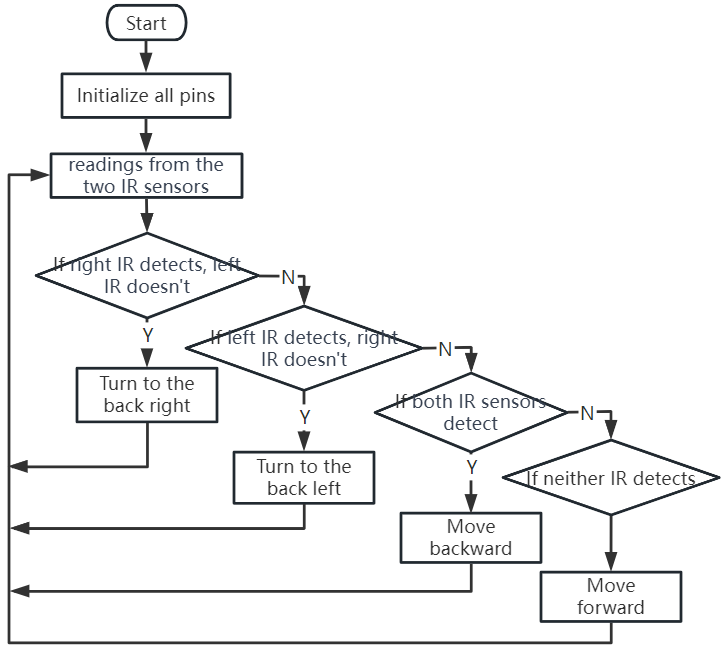

Lesson 6: Exploring the Obstacle Avoidance Module
==============================================================

We're diving into the world of the Infrared Obstacle Avoidance Module. Tucked at the sides of our Mars Rover, these sensors act as the rover's "eyes," helping it dodge side obstacles and safely navigate the Martian landscape.

We'll learn how to integrate these modules with our rover, unravel the magic behind their functioning, and develop code to make our rover smartly sidestep any hurdles it comes across.

Get ready to gear up our rover with some Martian obstacle-dodging intelligence! Let's get rolling!

.. raw:: html

   <video width="600" loop autoplay muted>
      <source src="_static/video/car_ir1.mp4" type="video/mp4">
      Your browser does not support the video tag.
   </video>

.. note::

    If you are learning this course after fully assembling the GalaxyRVR, you need to move this switch to the right before uploading the code.

    .. image:: img/camera_upload.png
        :width: 500
        :align: center

Learning Objectives
----------------------

* Understand the working principle and application of the infrared obstacle avoidance module.
* Learn to use Arduino to control the infrared obstacle avoidance module.
* Practice designing and building an automatic obstacle avoidance system based on infrared obstacle avoidance.

Materials Needed
---------------------

* Obstacle Avoidance Modules
* Basic tools and accessories (e.g. screwdriver, screws, wires etc.)
* Mars Rover Model (Equipped with rocker-bogie system, main boards, motors)
* USB Cable
* Arduino IDE
* Computer

Steps
-------------
**Step 1: Install the Obstacle Avoidance Module**

Now we will install the two obstacle avoidance modules onto the rover.

.. raw:: html

    <iframe width="600" height="400" src="https://www.youtube.com/embed/UWEj_ROYAt0" title="YouTube video player" frameborder="0" allow="accelerometer; autoplay; clipboard-write; encrypted-media; gyroscope; picture-in-picture; web-share" allowfullscreen></iframe>

The assembly steps were simple, weren't they? In the following steps, we will learn about the working principle of these modules, and how they help our Mars Rover to avoid obstacles. Stay tuned!

**Step 2: Demystifying the Module**

Meet the Infrared Obstacle Avoidance Module - our rover's smart sidekick. This little device is a pack of wonders. Let's take a tour:

.. image:: img/ir_avoid.png
    :width: 300
    :align: center

Here are the pin definitions:

* **GND**: This is like the module's anchor, connecting it to the ground or common point in the circuit.
* **+**: Here's where the module gets its energy, needing a power supply of 3.3 to 5V DC.
* **Out**: This is the module's communicator. By default, it stays high and only goes low when it spots an obstacle.
* **EN**: Meet the module's controller. This **enable** pin decides when the module should work. By default, it is connected to GND, meaning the module is always on the job.

Curious about how this tiny module works? It's quite interesting! It uses a pair of IR components - a transmitter and a receiver. The transmitter is like the module's flashlight, emitting infrared light. 
When an obstacle appears, the infrared light bounces back and gets caught by the receiver. The module then gives a low signal, alerting our rover of the obstacle.

.. image:: img/ir_receive.png
    :align: center

Our little module is quite robust, spotting obstacles within a range of 2-40cm and boasting excellent anti-interference abilities. 
However, the color of objects does impact its sensing. Darker objects, especially black ones, are detected at a shorter range. 
Against a white wall, the sensor is most efficient, sensing within the 2-30cm range.

The **EN** pin's low-level state activates the module, with the jumper cap securing the **EN** pin to the GND. If you wish to control the **EN** pin via code, the jumper cap needs to be removed.

.. image:: img/ir_cap.png
    :width: 400
    :align: center

There are two potentiometers on the module, one for adjusting the transmitting power and one for adjusting the transmitting frequency, and by adjusting these two potentiometers you can adjust its effective distance.

.. image:: img/ir_avoid_pot.png
    :width: 400
    :align: center 

That's quite a bit about our little module. In the next step, we'll learn how to integrate it with our rover and control it using the Arduino. Stay tuned!

**Step 3: Read from the 2 Modules**

Just like curious space explorers, let's dive into the universe of codes and sensors!

#. Our Mars Rover is equipped with two special "Alien-Eye" sensors, perched neatly on pins 7 (right) and 8 (left). These "Alien-Eye" sensors are actually our infrared obstacle avoidance modules, always vigilant to dodge any "space rocks" (obstacles) in our Rover's interstellar journey!

    .. image:: img/ir_shield.png

#. Next, we'll need to communicate with our Rover using the universal language of Arduino code.

    First things first, let's give a unique name to each eye of the Rover. Let's call them ``IR_RIGHT`` and ``IR_LEFT``, this way we won't mix them up.

        .. code-block:: arduino

            #define IR_RIGHT 7
            #define IR_LEFT 8

    Now, we let our Rover know that these are its special eyes - they will feed information from the world outside into the Rover's electronic brain.

        .. code-block:: arduino

            pinMode(IR_RIGHT, INPUT);
            pinMode(IR_LEFT, INPUT);

    To make sure our Rover shares its findings with us, we establish a secret line of communication, like spies in a sci-fi movie. This next line kicks off a serial conversation at the speed of 9600 bits per second - that's lightning fast chatter!
    
        .. code-block:: arduino

            Serial.begin(9600);

    Now, our Rover scans its surroundings with its "Alien-Eyes" and relays the findings back to us. If it spots an obstacle, the value will be 0; if the path is clear, the value will be 1. It keeps sending these messages to us, keeping us in the loop.

        .. code-block:: arduino

            int rightValue = digitalRead(IR_RIGHT);
            int leftValue = digitalRead(IR_LEFT);
            Serial.print("Right IR: ");
            Serial.println(rightValue);
            Serial.print("Left IR: ");
            Serial.println(leftValue);

    Finally, the Rover pauses for a moment (about 200 milliseconds) after each transmission. This tiny break gives us the chance to interpret the Rover's message before it sends another one.

        .. code-block:: arduino

            delay(200);

    Here is the complete code:

    .. raw:: html
        
        <iframe src=https://create.arduino.cc/editor/sunfounder01/98546821-5f4b-42ae-bc9f-e7ec15544c8b/preview?embed style="height:510px;width:100%;margin:10px 0" frameborder=0></iframe>

#. Once your code is ready, select the correct board and port, and beam up the code to your Mars Rover. Then, tune into our secret communication line (the Serial Monitor) by clicking on its icon in the top right corner.

    .. image:: img/ir_open_serial.png

#. Before you start receiving the Rover's messages, make sure your secret communication line is tuned at the same speed (9600 baud) as your Rover. And there you have it - live updates from your Mars Rover!

    .. image:: img/ir_serial.png

#. To put our system to the test, wave a "space rock" (your hand) in front of one of the sensors. You'll see the value flip to 0, and the corresponding LED on the module lights up. That's the Rover saying, "Look out, space rock on my right!"

    .. code-block::

        Right IR: 0
        Left IR: 1
        Right IR: 0
        Left IR: 1
        Right IR: 0
        Left IR: 1

By now, you've not just journeyed through space but also deciphered Martian! Can't wait to see what interstellar secrets we unveil in our next mission!

**Step 4: Adjusting the Detection Distance**

We have arrived at an essential step, which is to adjust the detection distances of our sensors based on our current environment. The factory settings may not be optimal.

If the detection distance of the two infrared modules is too short, the Mars Rover might collide with obstacles. If it's too far, the Rover might start turning while still a significant distance from an obstacle, potentially impacting its movement.

Here's how you can make adjustments:

#. Start by adjusting the right obstacle avoidance module. During transportation, collisions may cause the transmitter and receiver on the infrared module to tilt. Therefore, you need to manually straighten them.

    .. raw:: html

        <video width="600" loop autoplay muted>
            <source src="_static/video/ir_adjust1.mp4" type="video/mp4">
            Your browser does not support the video tag.
        </video>

#. Place an obstacle about 20 cm directly in front of the right module. The box in which our Rover kit came is a good choice for this! Now, turn the potentiometer on the module until the indicator light on the module just lights up. Then, keep moving the obstacle back and forth to check if the indicator light comes on at the desired distance. If the light doesn't turn on at the correct distance or if it remains on without going out, you'll need to adjust the other potentiometer.

    .. raw:: html

        <video width="600" loop autoplay muted>
            <source src="_static/video/ir_adjust2.mp4" type="video/mp4">
            Your browser does not support the video tag.
        </video>

#. Repeat the same process for another module.

Now that our sensors are fully prepared, let's embark on the next journey!

**Step 5: Design an Automatic Obstacle Avoidance System**

Now, let's take a big leap in our space exploration and make use of these messages from the Rover. 
We're going to create an automatic obstacle avoidance system!

Here's our plan: If the right sensor detects an obstacle, the Rover will turn to the back right. If the left sensor detects an obstacle, the Rover will turn to the back left. If both sensors detect an obstacle, the Rover will move backward. If no obstacles are detected, the Rover will continue moving straight ahead.

Let's visualize this in a flowchart to make it even more clear. Flowcharts are a great way to logically outline a plan, especially when it comes to programming!

Let's whisper this plan to our Rover in its language(Arduino code):

.. raw:: html

    <iframe src=https://create.arduino.cc/editor/sunfounder01/af6539d4-7b4b-4e74-a04a-9fa069391d4d/preview?embed style="height:510px;width:100%;margin:10px 0" frameborder=0></iframe>

In this code, we are using ``if...else`` statement in the ``loop()`` function.

    The ``if...else`` statement is used to execute a block of code among two alternatives. 
    However, when we need to choose among more than two alternatives, we use the ``if...else if...else`` statement.

    The syntax of the ``if...else if...else`` statement is:

    .. code-block:: arduino

        if (condition1) {
        // code block 1
        }
        else if (condition2){
        // code block 2
        }
        else if (condition3){
        // code block 3
        }
        else {
        // code block 4
        }
    
    Here,

    * If condition1 is true, code block 1 is executed.
    * If condition1 is false, then condition2 is evaluated.
    * If condition2 is true, code block 2 is executed.
    * If condition2 is false, then condition3 is evaluated.
    * If condition3 is true, code block 3 is executed.
    * If condition3 is false, code block 4 is executed.

Now that we've designed our automatic obstacle avoidance system, it's time for the exciting part - putting it to the test!

* You can observe if the Rover moves as you expected.
* Or, place it in different lighting conditions to see how its movements change.

By integrating science into our engineering project, we're becoming space detectives, solving the mysteries of our Rover's behavior. 
This isn't just about correcting errors but optimizing performance, making our Rover the best it can be! Keep up the fantastic work, space detectives!

**Step 6: Reflection and Summary**

In the testing phase, you might have noticed an interesting behavior of our Mars Rover: while it expertly avoids obstacles to its left and right, it might struggle to detect smaller obstacles straight ahead.

How can we solve this challenge?

Stay tuned for the next lesson, where we'll continue our exploration into the fascinating world of coding, sensors, and obstacle detection.

Remember, every challenge is an opportunity for learning and innovation. And as we continue our space exploration journey, there's so much more to discover and learn!

