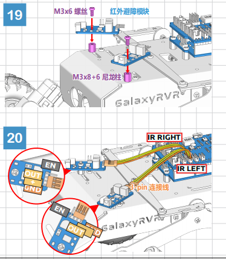

第六课 探索避障模块
==============================================================

我们将深入了解红外避障模块。这个小巧的传感器安装在火星车两侧，充当火星车的“眼睛”，帮助它避开侧面障碍，安全穿越火星地形。

我们将学习如何将这些模块与火星车集成，揭开它们的工作原理，并编写代码让我们的火星车聪明地避开障碍。

准备好让火星车拥有避障智能了吗？让我们开始吧！

.. raw:: html

   <video width="600" loop autoplay muted>
      <source src="_static/video/car_ir1.mp4" type="video/mp4">
      Your browser does not support the video tag.
   </video>

.. note::

    如果你是在完全组装好 GalaxyRVR 后学习本课程，请在上传代码前，将开关切换到右侧。

    .. image:: img/camera_upload.png
        :width: 500
        :align: center

学习目标
----------------------

* 理解红外避障模块的工作原理和应用。
* 学习如何使用 Arduino 控制红外避障模块。
* 实践设计并构建基于红外避障的自动避障系统。

所需材料
---------------------

* 避障模块
* 基本工具和配件（如螺丝刀、螺丝、电线等）
* 火星车模型（配有摇臂-摆臂系统、主板、电机）
* USB 数据线
* Arduino IDE
* 电脑

步骤
-------------

**步骤 1：安装避障模块**

现在，我们将把两个避障模块安装到火星车上。

组装步骤很简单，对吧？接下来，我们将学习这些模块的工作原理，以及它们如何帮助火星车避开障碍。敬请期待！

**步骤 2：揭开模块的神秘面纱**

介绍一下红外避障模块——我们火星车的智能“小助手”。这个小设备充满了神奇的功能，让我们一起来看看：

.. image:: img/ir_avoid.png
    :width: 300
    :align: center

模块的引脚定义如下：

* **GND**：这是模块的地线，连接电路中的共同点。
* **+**：为模块提供电源，电压要求在 3.3V 到 5V 之间。
* **Out**：这是模块的输出信号引脚。默认情况下，它保持高电平，只有当模块检测到障碍物时才会变为低电平。
* **EN**：这是模块的使能引脚，决定模块是否启用。默认连接到 GND，表示模块始终处于工作状态。

想知道这个小模块是如何工作的？其实非常有趣！
它使用了一对红外元件——一个发射器和一个接收器。
发射器像手电筒一样发射红外光。当障碍物出现时，红外光反射回来并被接收器捕捉到。
模块随后发出低电平信号，提醒火星车前方有障碍。

这个小模块非常强大，能够在 2 到 40 厘米的范围内检测障碍物，并且具有很强的抗干扰能力。
然而，物体的颜色会影响传感器的检测效果。
特别是黑色物体，检测范围较短；而在白色墙面前，传感器的检测效果最佳，能够在 2 到 30 厘米的范围内准确工作。

**EN** 引脚的低电平状态会激活模块，通过跳线帽将 **EN** 引脚与 GND 连接。如果你希望通过代码控制 **EN** 引脚，需要移除跳线帽。

.. image:: img/ir_cap1.png
    :width: 400
    :align: center

模块上有两个电位器，一个用来调节发射功率，另一个用来调节发射频率。通过调整这两个电位器，你可以改变模块的有效检测距离。

.. image:: img/ir_avoid_pot.png
    :width: 400
    :align: center

关于我们的小模块就讲到这里。在下一步中，我们将学习如何将它与火星车集成，并使用 Arduino 来控制它。敬请期待！

**步骤 3：读取两个模块的数据**

就像好奇的太空探险家一样，让我们进入代码和传感器的世界吧！

#. 我们的火星车配备了两个特殊的“外星眼”传感器，分别安装在第 7 引脚（右侧）和第 8 引脚（左侧）。这些“外星眼”传感器实际上就是红外避障模块，它们时刻警惕，帮助火星车避开任何“太空岩石”（障碍物）。

    .. image:: img/ir_shield.png

#. 接下来，我们将使用 Arduino 代码来与火星车通信。

    首先，为了避免混淆，我们给火星车的左右两个“眼睛”起个名字，分别叫做 ``IR_RIGHT`` 和 ``IR_LEFT``。

        .. code-block:: arduino

            #define IR_RIGHT 7
            #define IR_LEFT 8

    然后，告诉火星车这两个引脚是它的特别“眼睛”，它们将向火星车的大脑传输外界信息。

        .. code-block:: arduino

            pinMode(IR_RIGHT, INPUT);
            pinMode(IR_LEFT, INPUT);

    为了确保火星车能够把它的发现传递给我们，我们建立了一条秘密通信线，就像科幻电影中的间谍一样。这一行代码开启了一个串行通信，传输速度为 9600 波特率——这可是闪电般的快讯！

        .. code-block:: arduino

            Serial.begin(9600);

    现在，火星车开始用“外星眼”扫描周围的环境，并将结果传送给我们。如果检测到障碍物，返回的值为 0；如果路径畅通，返回的值为 1。它会持续发送这些信息，保持我们在循环中。

        .. code-block:: arduino

            int rightValue = digitalRead(IR_RIGHT);
            int leftValue = digitalRead(IR_LEFT);
            Serial.print("Right IR: ");
            Serial.println(rightValue);
            Serial.print("Left IR: ");
            Serial.println(leftValue);

    最后，每次传输后，火星车会稍作停顿（大约 200 毫秒），以便我们解读它传送的信息，然后再发送下一个数据。

        .. code-block:: arduino

            delay(200);

    完整代码如下：

    .. raw:: html
        
        <iframe src=https://create.arduino.cc/editor/sunfounder01/98546821-5f4b-42ae-bc9f-e7ec15544c8b/preview?embed style="height:510px;width:100%;margin:10px 0" frameborder=0></iframe>

#. 代码上传完成后，选择正确的板子和端口，将代码上传到火星车中。然后，点击串口监视器图标，查看火星车的实时信息。

    .. image:: img/ir_open_serial.png

#. 在接收火星车信息之前，请确保串口监视器的波特率设置为 9600，与火星车保持一致。现在，你就可以看到火星车的实时更新了！

    .. image:: img/ir_serial.png

#. 为了测试我们的系统，可以在传感器前挥动一个“太空岩石”（比如你的手）。你会看到返回的值变为 0，同时对应的 LED 灯亮起。这就是火星车发出的“警告，右侧有障碍物！”信号。

    .. code-block::

        Right IR: 0
        Left IR: 1
        Right IR: 0
        Left IR: 1
        Right IR: 0
        Left IR: 1

到现在，你不仅仅是进行了一次太空之旅，还解读了火星语言！迫不及待想知道接下来会揭开哪些星际奥秘吗？

**步骤 4：调整检测距离**

我们来到了一个关键步骤，需要根据当前的环境调整传感器的检测距离。出厂设置可能并不适合所有情况。

如果两个红外模块的检测距离过短，火星车可能会与障碍物碰撞；如果距离过远，火星车可能在距离障碍物较远时就开始转向，从而影响其运动。

你可以通过以下方式进行调整：

1. 先调整右侧的避障模块。在运输过程中，模块上的发射器和接收器可能会被碰撞造成倾斜，因此你需要手动调整它们，使其保持水平。

    .. raw:: html

        <video width="600" loop autoplay muted>
            <source src="_static/video/ir_adjust1.mp4" type="video/mp4">
            Your browser does not support the video tag.
        </video>

2. 在右侧模块前放置一个大约 20 厘米的障碍物，可以使用火星车包装盒进行测试。接着，调整模块上的电位器，直到模块的指示灯刚刚亮起。然后，不断移动障碍物，检查指示灯是否在预定的距离内亮起。如果灯光没有在正确的距离内亮起，或者一直亮着不熄灭，可能需要调整另一个电位器。

    .. raw:: html

        <video width="600" loop autoplay muted>
            <source src="_static/video/ir_adjust2.mp4" type="video/mp4">
            Your browser does not support the video tag.
        </video>

3. 对另一个模块重复相同的调整过程。

现在我们的传感器已经准备就绪，接下来我们开始下一步的旅程！

**步骤 5：设计自动避障系统**

接下来，让我们在太空探索的过程中，利用这些来自火星车的信息，设计一个自动避障系统！

我们的计划是：如果右侧传感器检测到障碍物，火星车将向右后方转；如果左侧传感器检测到障碍物，火星车将向左后方转；如果两个传感器都检测到障碍物，火星车将向后移动；如果没有检测到障碍物，火星车将继续前进。

让我们用流程图来可视化这个计划。流程图是一种很好的逻辑规划工具，尤其适合编程！

.. image:: img/ir_flowchart.png

现在，让我们通过 Arduino 代码向火星车传达这个计划：

.. raw:: html

    <iframe src=https://create.arduino.cc/editor/sunfounder01/af6539d4-7b4b-4e74-a04a-9fa069391d4d/preview?embed style="height:510px;width:100%;margin:10px 0" frameborder=0></iframe>

在这段代码中，我们在 ``loop()`` 函数中使用了 ``if...else`` 语句。

    ``if...else`` 语句用于在两个选项之间执行代码块。
    如果需要选择多个选项，我们则使用 ``if...else if...else`` 语句。

    语法格式为：

    .. code-block:: arduino

        if (condition1) {
        // code block 1
        }
        else if (condition2){
        // code block 2
        }
        else if (condition3){
        // code block 3
        }
        else {
        // code block 4
        }

    这里，

    * 如果 condition1 为真，执行代码块 1；
    * 如果 condition1 为假，则检查 condition2；
    * 如果 condition2 为真，执行代码块 2；
    * 如果 condition2 为假，则检查 condition3；
    * 如果 condition3 为真，执行代码块 3；
    * 如果 condition3 为假，执行代码块 4。

现在，我们的自动避障系统设计完成，接下来是激动人心的部分——测试它！

* 你可以观察火星车是否按预期移动。
* 你也可以将其放置在不同的光照条件下，看看它的运动变化。

通过将科学融入到工程项目中，我们已经成为太空侦探，解开了火星车行为背后的谜团。
这里不仅仅是在修正错误，而是在优化性能，让我们的火星车变得更完美！继续加油，太空侦探们！

**步骤 6：反思与总结**

在测试阶段，你可能会注意到火星车有一个有趣的表现：它能够巧妙地避开左右两侧的障碍，但对于正前方的较小障碍物，它可能会感知较为困难。

我们该如何解决这个问题呢？

敬请期待下一课，我们将继续探索编码、传感器和避障检测的精彩世界。

记住，每一个挑战都是学习和创新的机会。在继续我们的太空探索之旅时，还有许多奥秘等待着我们去发现和学习！
