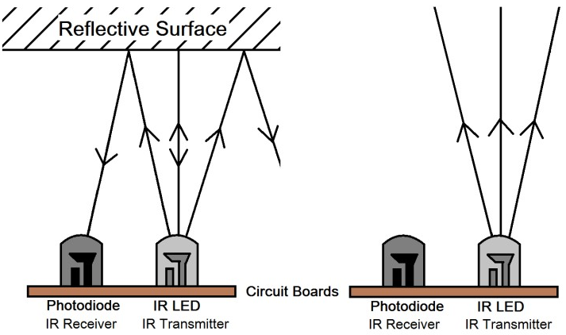

.. note::

    こんにちは、SunFounderのRaspberry Pi & Arduino & ESP32愛好家コミュニティへようこそ！Facebook上でRaspberry Pi、Arduino、ESP32についてもっと深く掘り下げ、他の愛好家と交流しましょう。

    **参加する理由は？**

    - **エキスパートサポート**：コミュニティやチームの助けを借りて、販売後の問題や技術的な課題を解決します。
    - **学び＆共有**：ヒントやチュートリアルを交換してスキルを向上させましょう。
    - **独占的なプレビュー**：新製品の発表や先行プレビューに早期アクセスしましょう。
    - **特別割引**：最新製品の独占割引をお楽しみください。
    - **祭りのプロモーションとギフト**：ギフトや祝日のプロモーションに参加しましょう。

    👉 私たちと一緒に探索し、創造する準備はできていますか？[|link_sf_facebook|]をクリックして今すぐ参加しましょう！

レッスン6：赤外線障害物回避モジュールの探究
==============================================================

ここでは、赤外線障害物回避モジュールの世界に飛び込んでいきます。私たちの火星ローバーの側面に配置されたこれらのセンサーは、ローバーの「目」として機能し、横方向の障害物を回避し、火星の地形を安全にナビゲートするのに役立ちます。

これらのモジュールをローバーに統合する方法、その機能の裏にある魔法を解き明かし、ローバーが出くわす障害物を巧みに避けるためのコードを開発する方法を学びます。

火星の障害物回避インテリジェンスでローバーを整える準備をしましょう！さあ、出発しましょう！

.. raw:: html

   <video width="600" loop autoplay muted>
      <source src="_static/video/car_ir1.mp4" type="video/mp4">
      お使いのブラウザーはビデオタグをサポートしていません。
   </video>

.. note::

    GalaxyRVRを組み立てた後にこのコースを学習する場合、コードをアップロードする前にこのスイッチを右に移動させる必要があります。

    .. image:: img/camera_upload.png
        :width: 500
        :align: center

学習目標
----------------------

* 赤外線障害物回避モジュールの動作原理と応用を理解する。
* Arduinoを使って赤外線障害物回避モジュールを制御する方法を学ぶ。
* 赤外線障害物回避に基づいた自動障害物回避システムの設計と構築を実践する。

材料
---------------------

* 障害物回避モジュール
* 基本的なツールとアクセサリー（例：ドライバー、ネジ、ワイヤーなど）
* 火星ローバーモデル（ロッカーボギーシステム、メインボード、モーター装備）
* USBケーブル
* Arduino IDE
* コンピューター

手順
-------------
**ステップ1：障害物回避モジュールの取り付け**

これから、二つの障害物回避モジュールをローバーに取り付けます。

.. raw:: html

    <iframe width="600" height="400" src="https://www.youtube.com/embed/UWEj_ROYAt0" title="YouTube video player" frameborder="0" allow="accelerometer; autoplay; clipboard-write; encrypted-media; gyroscope; picture-in-picture; web-share" allowfullscreen></iframe>

組み立て手順は簡単でしたね？次のステップでは、これらのモジュールの動作原理と、火星ローバーが障害物を回避するのにどのように役立つかについて学びます。お楽しみに！

**ステップ2：モジュールの解明**

赤外線障害物回避モジュール、我々のローバーの賢い助手と会いましょう。この小さなデバイスは驚きのパックです。見てみましょう：

.. image:: img/ir_avoid.png
    :width: 300
    :align: center

ピン定義はこちらです：

* **GND**：これはモジュールのアンカーのようなもので、回路内の接地点または共通点に接続します。
* **+**：モジュールがエネルギーを得る場所で、3.3～5V DCの電源が必要です。
* **Out**：これがモジュールのコミュニケーターです。デフォルトでは高い状態を保ち、障害物を検出したときのみ低下します。
* **EN**：モジュールのコントローラーに会いましょう。この **enable** ピンは、モジュールが作動すべき時を決定します。デフォルトではGNDに接続されており、モジュールは常に作業を行っています。

この小さなモジュールがどのように機能するのか気になりますか？とても興味深いですよ！赤外線コンポーネントのペア、つまり送信機と受信機を使用しています。送信機はモジュールの懐中電灯のようなもので、赤外線を放射します。
障害物が現れると、赤外線が反射して受信機に捉えられます。その後、モジュールは低い信号を出し、ローバーに障害物を知らせます。

この小さなモジュールはかなり頑丈で、2〜40cmの範囲内で障害物を発見し、優れた干渉防止能力を誇っています。
しかし、物体の色は感知に影響します。特に黒い暗い物体は、より短い範囲で検出されます。
白い壁に対しては、センサーは最も効率的で、2〜30cmの範囲内で感知します。

**EN** ピンの低レベル状態がモジュールを活性化し、ジャンパーキャップで **EN** ピンをGNDに固定します。コードで **EN** ピンを制御したい場合、ジャンパーキャップを外す必要があります。

.. image:: img/ir_cap.png
    :width: 400
    :align: center

モジュールには、送信パワーを調整するためのポテンショメータと送信周波数を調整するためのものが2つあります。これら2つのポテンショメータを調整することで、有効距離を調整できます。

.. image:: img/ir_avoid_pot.png
    :width: 400
    :align: center 

私たちの小さなモジュールについてはこれくらいです。次のステップでは、ローバーに統合し、Arduinoを使用して制御する方法を学びます。お楽しみに！

**ステップ3：2つのモジュールからの読み取り**

好奇心旺盛な宇宙探査家のように、コードとセンサーの宇宙に飛び込みましょう！

#. 私たちの火星ローバーは、特別な「エイリアンアイ」センサーを2つ搭載しています。これらは7番ピン（右）と8番ピン（左）にきちんと取り付けられています。これらの「エイリアンアイ」センサーは、実際には私たちの赤外線障害物回避モジュールで、ローバーの星間旅行中に「宇宙の岩」（障害物）を回避するために常に警戒しています！

    .. image:: img/ir_shield.png

#. 次に、Arduinoコードの普遍的な言語を使用してローバーと通信する必要があります。

    最初に、ローバーの各目に固有の名前を付けましょう。それらを ``IR_RIGHT`` と ``IR_LEFT`` と呼ぶことにしましょう。そうすれば、混乱することはありません。

        .. code-block:: arduino

            #define IR_RIGHT 7
            #define IR_LEFT 8

    次に、これらがローバーの特別な目であることをローバーに知らせます。これらは、外の世界からの情報をローバーの電子脳に送る役割を果たします。

        .. code-block:: arduino

            pinMode(IR_RIGHT, INPUT);
            pinMode(IR_LEFT, INPUT);

    ローバーが発見したことを私たちと共有するために、SF映画のスパイのような秘密の通信ラインを確立しましょう。次の行は、秒間9600ビットの速度でシリアル通信を開始します。それは稲妻のように速い会話です！
    
        .. code-block:: arduino

            Serial.begin(9600);

    続いて、ローバーは「エイリアンアイ」で周囲をスキャンし、その結果を私たちに伝えます。障害物を見つけた場合、値は0になります。道がクリアなら、値は1になります。これらのメッセージを私たちに送り続け、常に情報を共有してくれます。

        .. code-block:: arduino

            int rightValue = digitalRead(IR_RIGHT);
            int leftValue = digitalRead(IR_LEFT);
            Serial.print("Right IR: ");
            Serial.println(rightValue);
            Serial.print("Left IR: ");
            Serial.println(leftValue);

    最後に、ローバーは各送信の後に短い休憩（約200ミリ秒）を取ります。この小さな休憩は、ローバーが次のメッセージを送る前に、私たちがそのメッセージを解釈する機会を与えてくれます。

        .. code-block:: arduino

            delay(200);

    以下が完全なコードです：

    .. raw:: html
        
        <iframe src=https://create.arduino.cc/editor/sunfounder01/98546821-5f4b-42ae-bc9f-e7ec15544c8b/preview?embed style="height:510px;width:100%;margin:10px 0" frameborder=0></iframe>

#. コードが準備できたら、正しいボードとポートを選択し、コードを火星ローバーに送信します。次に、右上隅にあるアイコンをクリックして、私たちの秘密の通信ライン（シリアルモニター）にチューニングしてください。

    .. image:: img/ir_open_serial.png

#. ローバーからのメッセージを受信し始める前に、秘密の通信ラインがローバーと同じ速度（9600ボー）でチューニングされていることを確認してください。これで、火星ローバーからのライブアップデートが得られます！

    .. image:: img/ir_serial.png

#. システムをテストするために、「宇宙の岩」（あなたの手）をセンサーの前に振ってみてください。値が0に変わり、モジュールの対応するLEDが点灯します。これはローバーが「注意、私の右に宇宙の岩がある！」と言っているようなものです。

    .. code-block::

        Right IR: 0
        Left IR: 1
        Right IR: 0
        Left IR: 1
        Right IR: 0
        Left IR: 1

これで、あなたは宇宙を旅するだけでなく、火星語も解読したことになります！次のミッションでどんな星間の秘密を解き明かすか、待ちきれません！

**ステップ4：検出距離の調整**

現在の環境に基づいてセンサーの検出距離を調整する、重要なステップに到達しました。工場出荷時の設定が最適でない場合があります。

赤外線モジュールの2つの検出距離が短すぎると、火星ローバーは障害物に衝突する可能性があります。距離が遠すぎると、障害物からまだかなりの距離があるにもかかわらず、ローバーが旋回し始める可能性があり、その動きに影響を与えることがあります。

調整する方法は次のとおりです：

#. 右の障害物回避モジュールの調整から始めます。輸送中の衝突により、赤外線モジュール上の送信機と受信機が傾く可能性があるため、手動で直してください。

    .. raw:: html

        <video width="600" loop autoplay muted>
            <source src="_static/video/ir_adjust1.mp4" type="video/mp4">
            お使いのブラウザーはビデオタグをサポートしていません。
        </video>

#. 約20cmの距離で直接、右のモジュールの前に障害物を置きます。ローバーキットが届いた箱がこれには最適です！次に、モジュール上のポテンショメータを回して、モジュールのインジケーターライトがちょうど点灯するまで調整します。それから、障害物を前後に動かして、インジケーターライトが望む距離で点灯するかどうかを確認します。ライトが正しい距離で点灯しない場合、または消えずに点灯し続ける場合は、もう一方のポテンショメータを調整する必要があります。

    .. raw:: html

        <video width="600" loop autoplay muted>
            <source src="_static/video/ir_adjust2.mp4" type="video/mp4">
            お使いのブラウザーはビデオタグをサポートしていません。
        </video>

#. 同じプロセスをもう一つのモジュールに対して繰り返します。

センサーが完全に準備できたので、次の旅に出発しましょう！

**ステップ5：自動障害物回避システムの設計**

さて、宇宙探査で大きな一歩を踏み出し、ローバーからのメッセージを活用しましょう。
自動障害物回避システムを作成します！

計画は次のとおりです。右センサーが障害物を検出した場合、ローバーは右後ろに回転します。左センサーが障害物を検出した場合、ローバーは左後ろに回転します。両方のセンサーが障害物を検出した場合、ローバーは後退します。障害物が検出されない場合、ローバーはまっすぐ進み続けます。

この計画をフローチャートで視覚化して、さらに明確にしましょう。フローチャートは、特にプログラミングの際に計画を論理的に概要化するのに最適です！

.. image:: img/ir_flowchart.png

この計画をローバーの言語（Arduinoコード）でささやきましょう：

.. raw:: html

    <iframe src=https://create.arduino.cc/editor/sunfounder01/af6539d4-7b4b-4e74-a04a-9fa069391d4d/preview?embed style="height:510px;width:100%;margin:10px 0" frameborder=0></iframe>

このコードでは、 ``loop()`` 関数内で ``if...else`` ステートメントを使用しています。

    ``if...else`` ステートメントは、2つの選択肢のうち1つのコードブロックを実行するために使用されます。
    ただし、2つ以上の選択肢から選ぶ必要がある場合は、 ``if...else if...else`` ステートメントを使用します。

    ``if...else if...else`` ステートメントの構文は以下の通りです：

    .. code-block:: arduino

        if (condition1) {
        // code block 1
        }
        else if (condition2){
        // code block 2
        }
        else if (condition3){
        // code block 3
        }
        else {
        // code block 4
        }
    
    ここで、

    * condition1が真の場合、code block 1が実行されます。
    * condition1が偽の場合、condition2が評価されます。
    * condition2が真の場合、code block 2が実行されます。
    * condition2が偽の場合、condition3が評価されます。
    * condition3が真の場合、code block 3が実行されます。
    * condition3が偽の場合、code block 4が実行されます。

自動障害物回避システムを設計したので、ワクワクする部分、テストに取り掛かりましょう！

* ローバーが期待通りに動くか観察できます。
* または、異なる照明条件下でローバーの動きがどのように変わるかを確認します。

科学をエンジニアリングプロジェクトに統合することで、私たちは宇宙探偵となり、ローバーの行動の謎を解明します。
これは単なるエラーの修正ではなく、パフォーマンスの最適化に関するもので、ローバーを最高の状態にします！素晴らしい仕事を続けてください、宇宙探偵の皆さん！

**ステップ6：振り返りとまとめ**

テストフェーズでは、火星ローバーの興味深い挙動に気づかれたかもしれません：左右の障害物を巧みに回避する一方で、真正面の小さな障害物の検出に苦労することがあります。

この課題をどのように解決できるでしょうか？

次のレッスンで、コーディング、センサー、障害物検出の魅力的な世界への探索を続けます。お楽しみに！

覚えておいてください、すべての課題は学習とイノベーションの機会です。宇宙探査の旅を続ける中で、まだまだ多くのことを発見し、学ぶことがあります！

