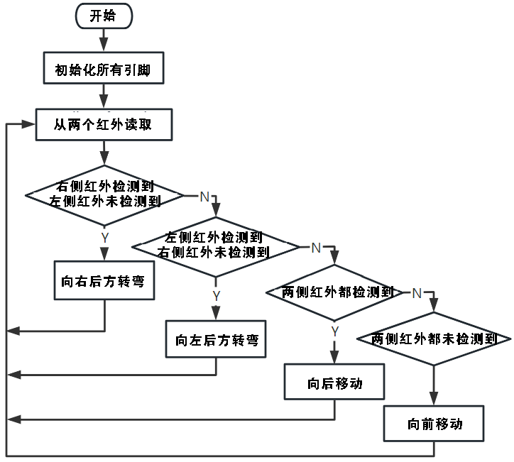

.. note::

    Ciao, benvenuto nella community di appassionati di SunFounder Raspberry Pi & Arduino & ESP32 su Facebook! Approfondisci Raspberry Pi, Arduino ed ESP32 insieme a noi.

    **Perché unirsi a noi?**

    - **Supporto tecnico**: Risolvi i problemi post-vendita e le sfide tecniche con l'aiuto della nostra community e del nostro team.
    - **Impara e Condividi**: Scambia consigli e tutorial per migliorare le tue competenze.
    - **Anteprime Esclusive**: Accedi in anteprima ai nuovi annunci sui prodotti.
    - **Sconti speciali**: Approfitta di sconti esclusivi sui nostri prodotti più recenti.
    - **Promozioni e Giveaway Festivi**: Partecipa a promozioni festive e concorsi a premi.

    👉 Pronto per esplorare e creare con noi? Clicca [|link_sf_facebook|] e unisciti oggi!

Lezione 6: Esplorare il Modulo di Evitamento Ostacoli
==============================================================

Stiamo per esplorare il mondo del Modulo a Infrarossi per l'Evitamento degli Ostacoli. Montati ai lati del nostro Mars Rover, questi sensori agiscono come gli "occhi" del rover, aiutandolo a evitare ostacoli laterali e a navigare in sicurezza sul suolo marziano.

Impareremo come integrare questi moduli con il nostro rover, scopriremo il funzionamento che c'è dietro e svilupperemo del codice per far sì che il nostro rover eviti in modo intelligente qualsiasi ostacolo incontri.

Preparati a dotare il nostro rover di una straordinaria intelligenza per evitare ostacoli marziani! Cominciamo!

.. raw:: html

   <video width="600" loop autoplay muted>
      <source src="_static/video/car_ir1.mp4" type="video/mp4">
      Your browser does not support the video tag.
   </video>

.. note::

    Se stai seguendo questo corso dopo aver assemblato completamente il GalaxyRVR, devi spostare questo interruttore verso destra prima di caricare il codice.

    .. image:: img/camera_upload.png
        :width: 500
        :align: center

Obiettivi di Apprendimento
-----------------------------

* Comprendere il principio di funzionamento e l'applicazione del modulo a infrarossi per l'evitamento degli ostacoli.
* Imparare a usare Arduino per controllare il modulo a infrarossi.
* Progettare e costruire un sistema di evitamento automatico degli ostacoli basato su infrarossi.

Materiali necessari
------------------------

* Moduli di evitamento ostacoli
* Strumenti e accessori di base (es. cacciavite, viti, fili, ecc.)
* Modello Mars Rover (con sistema rocker-bogie, schede principali, motori)
* Cavo USB
* Arduino IDE
* Computer

Passaggi
-------------

**Passo 1: Installare il Modulo di Evitamento Ostacoli**

Ora installeremo i due moduli di evitamento ostacoli sul rover.

.. raw:: html

    <iframe width="600" height="400" src="https://www.youtube.com/embed/UWEj_ROYAt0" title="YouTube video player" frameborder="0" allow="accelerometer; autoplay; clipboard-write; encrypted-media; gyroscope; picture-in-picture; web-share" allowfullscreen></iframe>

I passaggi per l'assemblaggio sono stati semplici, vero? Nei passaggi successivi, apprenderemo il principio di funzionamento di questi moduli e come aiutano il nostro Mars Rover a evitare ostacoli. Resta sintonizzato!

**Passo 2: Scoprire il Modulo**

Incontriamo il Modulo a Infrarossi per l'Evitamento degli Ostacoli: il nostro piccolo assistente intelligente. Questo dispositivo è pieno di meraviglie. Facciamo un tour:

.. image:: img/ir_avoid.png
    :width: 300
    :align: center

Ecco i pin del modulo:

* **GND**: È come l'ancora del modulo, collegandolo a terra o al punto comune nel circuito.
* **+**: Qui il modulo riceve energia, con un'alimentazione da 3,3 a 5V DC.
* **Out**: Questo è il comunicatore del modulo. Di default, resta alto e scende a basso solo quando rileva un ostacolo.
* **EN**: Questo è il controllore del modulo. Il pin **enable** decide quando il modulo deve funzionare. Di default, è collegato a GND, il che significa che il modulo è sempre in funzione.

Ti incuriosisce come funziona questo piccolo modulo? È piuttosto interessante! Utilizza una coppia di componenti a infrarossi: un trasmettitore e un ricevitore. Il trasmettitore è come una torcia che emette luce a infrarossi. Quando appare un ostacolo, la luce infrarossa viene riflessa e catturata dal ricevitore. Il modulo quindi invia un segnale basso, avvisando il rover dell'ostacolo.

.. image:: img/ir_receive.png
    :align: center

Il nostro piccolo modulo è piuttosto robusto, rilevando ostacoli entro un raggio 
di 2-40 cm e vantando eccellenti capacità anti-interferenza. Tuttavia, il colore 
degli oggetti influisce sulla sua capacità di rilevamento. Oggetti più scuri, 
soprattutto neri, vengono rilevati a una distanza più breve. Contro un muro bianco, 
il sensore è più efficiente, rilevando entro una distanza di 2-30 cm.

Il pin **EN** attiva il modulo quando è in stato basso, con il ponticello che collega il pin **EN** al GND. Se desideri controllare il pin **EN** tramite codice, il ponticello deve essere rimosso.

.. image:: img/ir_cap.png
    :width: 400
    :align: center

Ci sono due potenziometri sul modulo, uno per regolare la potenza di trasmissione e uno per regolare la frequenza di trasmissione, e regolando questi due potenziometri è possibile regolare la distanza di rilevamento.

.. image:: img/ir_avoid_pot.png
    :width: 400
    :align: center

Abbiamo scoperto molto su questo piccolo modulo. Nel prossimo passaggio impareremo come integrarlo con il nostro rover e controllarlo usando Arduino. Resta sintonizzato!

**Passo 3: Leggere dai 2 Moduli**

Come curiosi esploratori spaziali, tuffiamoci nell'universo dei codici e dei sensori!

#. Il nostro Mars Rover è dotato di due speciali sensori, posizionati sui pin 7 (destra) e 8 (sinistra). Questi sensori a infrarossi evitano costantemente "rocce spaziali" (ostacoli) nel viaggio interstellare del nostro Rover!

    .. image:: img/ir_shield.png

#. Successivamente, comunicheremo con il nostro Rover utilizzando il linguaggio universale del codice Arduino.

    Per prima cosa, diamo un nome a ciascun "occhio" del Rover. Chiamiamoli ``IR_RIGHT`` e ``IR_LEFT``, così non li confonderemo.

        .. code-block:: arduino

            #define IR_RIGHT 7
            #define IR_LEFT 8

    Ora, facciamo sapere al nostro Rover che questi sono i suoi occhi speciali, che forniranno informazioni dal mondo esterno al cervello elettronico del Rover.

        .. code-block:: arduino

            pinMode(IR_RIGHT, INPUT);
            pinMode(IR_LEFT, INPUT);

    Per assicurarci che il Rover condivida le sue scoperte con noi, avviamo una comunicazione seriale alla velocità di 9600 bit al secondo: un dialogo ultra veloce!

        .. code-block:: arduino

            Serial.begin(9600);

    Ora, il nostro Rover scandaglia l'ambiente circostante con i suoi "occhi alieni" e ci comunica le sue scoperte. Se rileva un ostacolo, il valore sarà 0; se il percorso è libero, sarà 1. Continua a inviarci questi messaggi, tenendoci aggiornati.

        .. code-block:: arduino

            int rightValue = digitalRead(IR_RIGHT);
            int leftValue = digitalRead(IR_LEFT);
            Serial.print("Right IR: ");
            Serial.println(rightValue);
            Serial.print("Left IR: ");
            Serial.println(leftValue);

    Infine, il Rover si prende una pausa di 200 millisecondi tra ogni trasmissione, permettendoci di interpretare i suoi messaggi prima che ne invii un altro.

        .. code-block:: arduino

            delay(200);

    Ecco il codice completo:

    .. raw:: html
        
        <iframe src=https://create.arduino.cc/editor/sunfounder01/98546821-5f4b-42ae-bc9f-e7ec15544c8b/preview?embed style="height:510px;width:100%;margin:10px 0" frameborder=0></iframe>

#. Una volta pronto il codice, seleziona la scheda corretta e la porta, e carica il codice sul tuo Mars Rover. Poi, sintonizzati sulla comunicazione segreta (il Monitor Seriale) cliccando sull'icona in alto a destra.

    .. image:: img/ir_open_serial.png

#. Prima di ricevere i messaggi del Rover, assicurati che la linea di comunicazione sia sintonizzata alla stessa velocità (9600 baud) del Rover. Ed ecco che arrivano gli aggiornamenti in diretta!

    .. image:: img/ir_serial.png

#. Per testare il sistema, fai passare una "roccia spaziale" (la tua mano) davanti a uno dei sensori. Vedrai il valore cambiare a 0 e il LED corrispondente sul modulo si accenderà. È il Rover che dice: "Attenzione, roccia spaziale alla mia destra!"

    .. code-block::

        Right IR: 0
        Left IR: 1
        Right IR: 0
        Left IR: 1
        Right IR: 0
        Left IR: 1

Ora, non solo abbiamo viaggiato nello spazio, ma abbiamo anche decifrato il linguaggio marziano! Non vedo l'ora di scoprire i segreti interstellari nella nostra prossima missione!**Passo 4: Regolare la Distanza di Rilevamento**

**Passo 4: Regolazione della Distanza di Rilevamento**

Siamo arrivati a un passaggio cruciale: regolare la distanza di rilevamento dei nostri sensori in base all'ambiente circostante. Le impostazioni di fabbrica potrebbero non essere ottimali.

Se la distanza di rilevamento dei due moduli a infrarossi è troppo breve, il Mars Rover potrebbe urtare contro gli ostacoli. Se invece è troppo lunga, il Rover potrebbe iniziare a sterzare troppo presto, mentre è ancora a una notevole distanza dall'ostacolo, influenzando il suo movimento.

Ecco come puoi fare le regolazioni:

#. Inizia regolando il modulo di evitamento ostacoli destro. Durante il trasporto, gli urti potrebbero far inclinare il trasmettitore e il ricevitore del modulo a infrarossi. Pertanto, sarà necessario raddrizzarli manualmente.

    .. raw:: html

        <video width="600" loop autoplay muted>
            <source src="_static/video/ir_adjust1.mp4" type="video/mp4">
            Your browser does not support the video tag.
        </video>

#. Posiziona un ostacolo a circa 20 cm direttamente davanti al modulo destro. La scatola del nostro kit Rover è una buona scelta per questo! Ora, ruota il potenziometro sul modulo fino a quando la spia sul modulo si accende. Poi, continua a muovere l'ostacolo avanti e indietro per controllare se la spia si accende alla distanza desiderata. Se la luce non si accende alla distanza corretta o rimane accesa senza spegnersi, dovrai regolare l'altro potenziometro.

    .. raw:: html

        <video width="600" loop autoplay muted>
            <source src="_static/video/ir_adjust2.mp4" type="video/mp4">
            Your browser does not support the video tag.
        </video>

#. Ripeti lo stesso processo per l'altro modulo.

Ora che i nostri sensori sono completamente regolati, siamo pronti per intraprendere la prossima avventura!

**Passo 5: Progettare un Sistema di Evitamento Ostacoli Automatico**

Ora facciamo un grande passo nella nostra esplorazione spaziale e utilizziamo questi segnali dal Rover. Creeremo un sistema automatico di evitamento ostacoli!

Ecco il nostro piano: se il sensore destro rileva un ostacolo, il Rover si girerà 
all'indietro verso destra. Se il sensore sinistro rileva un ostacolo, il Rover si 
girerà all'indietro verso sinistra. Se entrambi i sensori rilevano un ostacolo, il 
Rover si muoverà all'indietro. Se non vengono rilevati ostacoli, il Rover continuerà a muoversi in avanti.

Visualizziamo questo piano in un diagramma di flusso per renderlo ancora più chiaro.
 I diagrammi di flusso sono un ottimo modo per delineare logicamente un piano, 
 soprattutto quando si tratta di programmazione!

Comunichiamo questo piano al nostro Rover nel suo linguaggio (codice Arduino):

.. raw:: html

    <iframe src=https://create.arduino.cc/editor/sunfounder01/af6539d4-7b4b-4e74-a04a-9fa069391d4d/preview?embed style="height:510px;width:100%;margin:10px 0" frameborder=0></iframe>

In questo codice, stiamo utilizzando l'istruzione ``if...else`` nella funzione ``loop()``.

    L'istruzione ``if...else`` viene utilizzata per eseguire un blocco di codice tra due alternative.
    Tuttavia, quando dobbiamo scegliere tra più di due alternative, usiamo l'istruzione ``if...else if...else``.

    La sintassi dell'istruzione ``if...else if...else`` è la seguente:

    .. code-block:: arduino

        if (condizione1) {
        // blocco di codice 1
        }
        else if (condizione2){
        // blocco di codice 2
        }
        else if (condizione3){
        // blocco di codice 3
        }
        else {
        // blocco di codice 4
        }

    Here,

    * If condition1 is true, code block 1 is executed.
    * If condition1 is false, then condition2 is evaluated.
    * If condition2 is true, code block 2 is executed.
    * If condition2 is false, then condition3 is evaluated.
    * If condition3 is true, code block 3 is executed.
    * If condition3 is false, code block 4 is executed.

Ora che abbiamo progettato il nostro sistema automatico di evitamento ostacoli, è tempo della parte più emozionante: metterlo alla prova!

* Puoi osservare se il Rover si muove come ti aspettavi.
* Oppure, posizionalo in diverse condizioni di illuminazione per vedere come cambiano i suoi movimenti.

Integrando la scienza nel nostro progetto ingegneristico, stiamo diventando detective spaziali, risolvendo i misteri del comportamento del nostro Rover. Non si tratta solo di correggere errori, ma di ottimizzare le prestazioni, rendendo il nostro Rover il migliore possibile! Continua così, detective spaziali!

**Passo 6: Riflessione e Sintesi**

Nella fase di test, potresti aver notato un comportamento interessante del nostro Mars Rover: mentre evita ostacoli a sinistra e a destra con maestria, potrebbe avere difficoltà a rilevare piccoli ostacoli direttamente davanti.

Come possiamo risolvere questa sfida?

Resta sintonizzato per la prossima lezione, dove continueremo la nostra esplorazione nel mondo affascinante della programmazione, dei sensori e del rilevamento degli ostacoli.

Ricorda, ogni sfida è un'opportunità per imparare e innovare. E mentre continuiamo il nostro viaggio di esplorazione spaziale, c'è ancora tanto da scoprire e imparare!

