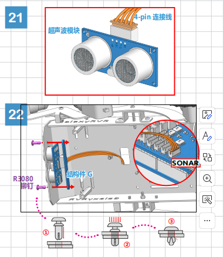
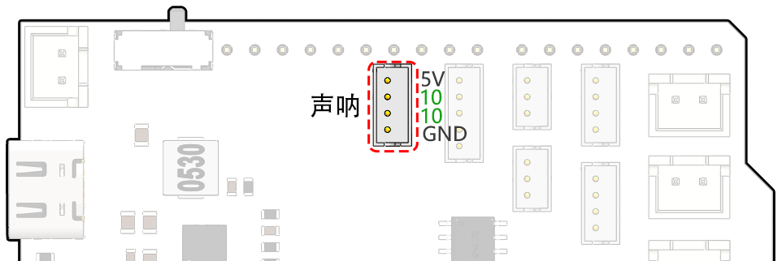

第七课 使用超声波模块增强漫游车导航
=============================================================

在上一次的冒险中，我们为火星漫游车装备了“侧眼”，构建了一个基本的避障系统。然而，正前方仍然存在盲点——这是我们即将克服的挑战！

今天，在本课程中，我们将赋予漫游车新的“视力”。我们将安装一个超声波传感器模块，作为一对“中央眼睛”，帮助我们的漫游车检测正前方的障碍物。

我们将深入探讨超声波的工作原理，了解它如何增强漫游车在复杂地形中的导航能力。有了这个新模块，我们的火星漫游车将变得更加敏锐和灵活，准备开展更加雄心勃勃的探险任务。

跟随我们一起迈进这个激动人心的STEAM之旅，让我们的火星漫游车在探索未知领域时变得更加得心应手！

.. raw:: html

   <video width="600" loop autoplay muted>
      <source src="_static/video/ultrasonic_avoid.mp4" type="video/mp4">
      Your browser does not support the video tag.
   </video>

.. note::

    如果你是在完成银河漫游车的组装后学习本课程，需要在上传代码之前将开关移至右侧。

    .. image:: img/camera_upload.png
        :width: 500
        :align: center

课程目标
--------------------------

* 理解超声波距离测量原理。
* 学习如何使用Arduino和超声波模块进行距离测量。
* 实践应用超声波模块进行火星漫游车的避障操作。

所需材料
---------------------

* 超声波模块
* 基本工具和配件（如螺丝刀、螺丝、导线等）
* 火星漫游车模型（配有摇杆-博基系统、主板、电机、避障模块）
* USB线
* Arduino IDE
* 计算机

课程步骤
--------------------

**步骤1：组装超声波传感器模块**

现在我们已经准备好为火星漫游车增添一项强大的“视力”，是时候将超声波传感器模块组装起来了。

好了！我们的火星漫游车现在已经装配好了完整的超声波传感器模块，准备帮助它以前所未有的方式进行导航。你是不是已经迫不及待想看看它如何提升漫游车的障碍物检测能力呢？让我们深入了解吧！

**步骤2：了解超声波模块**

让我们一起来认识一下HC-SR04这款强大的超声波距离传感器。这个小巧的设备能够精确地测量从2厘米到400厘米的距离，全程无需接触！是不是很神奇？它就像拥有了一种超级能力！通过超声波，它能够“看见”距离，就像蝙蝠在夜间通过回声进行导航一样。

它的“超能力”来源于四个引脚：

.. image:: img/ultrasonic_pic.png
    :width: 400
    :align: center

* **TRIG（触发脉冲输入）** - 这是我们的超级英雄的启动按钮，告诉它：“嘿，准备发射超声波啦！”
* **ECHO（回波脉冲输出）** - 这是我们的超级英雄用来听回波的方式。
* **VCC** - 就像超级英雄也需要能量一样，我们将它连接到5V电源。
* **GND** - 这是接地引脚，就像超级英雄需要保持与现实的连接！

想象一下我们的超级英雄——HC-SR04超声波传感器，正在山谷中玩回声游戏。

.. image:: img/ultrasonic_prin.jpg
    :width: 800

* 首先，超级英雄的大脑——微控制器（MCU）发出“准备，开始！”的信号，向它发出一个高电平信号，持续至少10微秒。这就像我们在大喊之前聚集能量。
* 听到“开始！”信号后，超级英雄会快速发出8次超声波。这些超声波以40kHz的速度发射出去，同时启动计时器，准备接收回波。
* 如果前方有障碍物，超声波会撞到它并反射回来。听到回波后，超级英雄会停止计时并记录下时间，同时发出一个高电平信号告诉MCU它收到了回波。
* 最后，超级英雄用一个简单的公式来计算障碍物的距离。它将记录的时间除以2，再乘以声音的传播速度（340米/秒）。这样就得到了障碍物的距离！

这就是我们的超级英雄传感器如何判断路径上是否有障碍物以及它的距离。是不是很棒？接下来，我们将学习如何将这个超级能力应用到我们的火星漫游车上！

**步骤3：编写代码控制超级英雄传感器**

现在我们已经组装好了超级英雄传感器，并了解了它如何使用超能力，是时候让这些能力付诸实践了！我们将编写Arduino代码，让超声波传感器测量距离并输出结果。

我们的超级英雄传感器将按照以下步骤执行：

* 我们将TRIG和ECHO引脚都连接到GalaxyRVR扩展板上的第10号引脚。这样，我们就可以通过一个Arduino引脚控制信号的发送和接收。

.. code-block:: arduino

    // 定义超声波模块引脚
    #define ULTRASONIC_PIN 10

* **准备**：首先，我们在9600波特率下建立串行通信，以便在串行监视器中查看超级英雄的测量结果。

.. code-block:: arduino

    void setup() {
        // 启动串行通信
        Serial.begin(9600);
    }

* **发出信号！**：我们将 ``ULTRASONIC_PIN`` 设置为 ``OUTPUT`` 引脚，发送一个10微秒的脉冲，命令我们的超声波超级英雄发射强大的超声波（声波）！

.. code-block:: arduino

    // 必须延迟4ms，否则读取结果可能为0
    delay(4);

    // 设置为OUTPUT发送信号
    pinMode(ULTRASONIC_PIN, OUTPUT);

    // 清除触发引脚
    digitalWrite(ULTRASONIC_PIN, LOW);
    delayMicroseconds(2);

    // 触发传感器，发送高脉冲，持续10微秒
    digitalWrite(ULTRASONIC_PIN, HIGH);
    delayMicroseconds(10);

    // 将触发引脚设置为低电平
    digitalWrite(ULTRASONIC_PIN, LOW);

* **等待与倾听**：接下来，将 ``ULTRASONIC_PIN`` 设置为输入。这时，超级英雄传感器准备好听回波了。如果前方有障碍物，回波就会响起。超级英雄会记录时间并发出高电平信号告知MCU它收到了回波。

.. code-block:: arduino

    pinMode(ULTRASONIC_PIN, INPUT);
    float duration = pulseIn(ULTRASONIC_PIN, HIGH);

* **超强数学**：回波返回后，传感器通过声音速度计算障碍物的距离。由于回波时间包括了声波的发射和接收，我们需要将回波时间除以2。

.. code-block:: arduino

    float distance = duration * 0.034 / 2;

* **报告结果**：超级英雄传感器将把测量结果打印到串行监视器，让我们看到距离。

.. code-block:: arduino

    // 打印距离到串行监视器
    Serial.print("The distance is: ");
    Serial.print(distance);
    Serial.println(" cm");

* **休息与准备**：每个超级英雄都需要休息，所以传感器会暂停片刻，准备好迎接下一个任务。

.. code-block:: arduino

    delay(200);

这段完整代码将把我们的传感器转变成一个超级英雄：

.. raw:: html

  <iframe src=https://create.arduino.cc/editor/sunfounder01/35bddbcf-145c-4e4f-b3ea-21e8210af4a6/preview?embed style="height:510px;width:100%;margin:10px 0" frameborder=0></iframe>

**步骤4：编程超声波模块控制火星漫游车**

现在我们已经为火星漫游车配备了超声波传感器模块，是时候编程使它根据传感器的测量结果做出反应。

* 为了方便读取，我们创建了一个名为 ``readSensorData()`` 的函数。这个函数封装了读取超声波传感器数据所需的所有代码。

  .. code-block:: arduino

    float readSensorData() {
        // 必须延迟4ms，否则读取结果可能为0
        delay(4);
      
        // 设置为OUTPUT发送信号
        pinMode(ULTRASONIC_PIN, OUTPUT);
      
        // 清除触发引脚
        digitalWrite(ULTRASONIC_PIN, LOW);
        delayMicroseconds(2);
      
        // 触发传感器，发送高脉冲，持续10微秒
        digitalWrite(ULTRASONIC_PIN, HIGH);
        delayMicroseconds(10);
      
        // 将触发引脚设置为低电平
        digitalWrite(ULTRASONIC_PIN, LOW);
      
        // 设置为INPUT读取
        pinMode(ULTRASONIC_PIN, INPUT);
      
        // pulseIn返回脉冲的持续时间
        float duration = pulseIn(ULTRASONIC_PIN, HIGH);
      
        // 根据声音速度计算距离（单位为cm）
        float distance = duration * 0.034 / 2;
      
        return distance;
    }

* 在 ``loop()`` 函数中，我们调用 ``readSensorData()`` 并将返回值存储在 ``distance`` 变量中。

  .. code-block:: arduino

    float distance = readSensorData();

* 根据距离，漫游车将决定前进、后退或停止。

  .. code-block:: arduino
  
    // 根据距离控制漫游车
    if (distance > 50) {  // 如果前方足够安全
      moveForward(200);
    } else if (distance < 15) {  // 如果障碍物太近
      moveBackward(200);
      delay(500);  // 等待片刻再尝试转弯
      backLeft(150);
      delay(1000);
    } else {  // 对于中等距离，谨慎前进
      moveForward(150);
    }

  * 如果路径清晰（障碍物超过50cm），我们的漫游车将大胆前进。
  * 如果障碍物较近（距离在50cm到15cm之间），漫游车将以较低速度前进。
  * 如果障碍物非常接近（小于15cm），火星漫游车将后退，并向左转。

  .. image:: img/ultrasonic_flowchart1.png

以下是完整代码，你可以将其上传到R3板上，查看是否达到了预期效果。你还可以根据实际环境调整检测距离，使避障系统更加完美。

.. raw:: html

  <iframe src=https://create.arduino.cc/editor/sunfounder01/cded6408-1469-4289-b79b-7d445b56352b/preview?embed style="height:510px;width:100%;margin:10px 0" frameborder=0></iframe>

通过增强这些能力，火星漫游车将更好地识别路径中的障碍物，精确测量距离，并做出明智的决策来绕过障碍。这将大大降低碰撞或其他可能影响漫游车探索任务的危险。

凭借超感官能力，火星漫游车可以更加自信和高效地操作，深入探索火星的奥秘，并为地球上的研究人员收集宝贵的科学数据。

**步骤5：总结与反思**

在本课中，我们深入了解了超声波波的工作原理，以及如何通过编码将回波时间转化为可测量的距离。

接着，我们利用超声波波动设计了避障系统。这个系统会根据即将到来的障碍物距离来调整反应。

现在，让我们通过几个问题来反思一下本课内容：

* 超声波模块如何检测距离？能否阐述其基本原理？
* 本课的避障系统与前一个系统有何不同？各自的优缺点是什么？
* 是否可以将这两种避障系统结合起来？

思考这些问题将帮助我们巩固理解，并促使我们将这些概念应用到其他项目中。期待我们下次的冒险！
