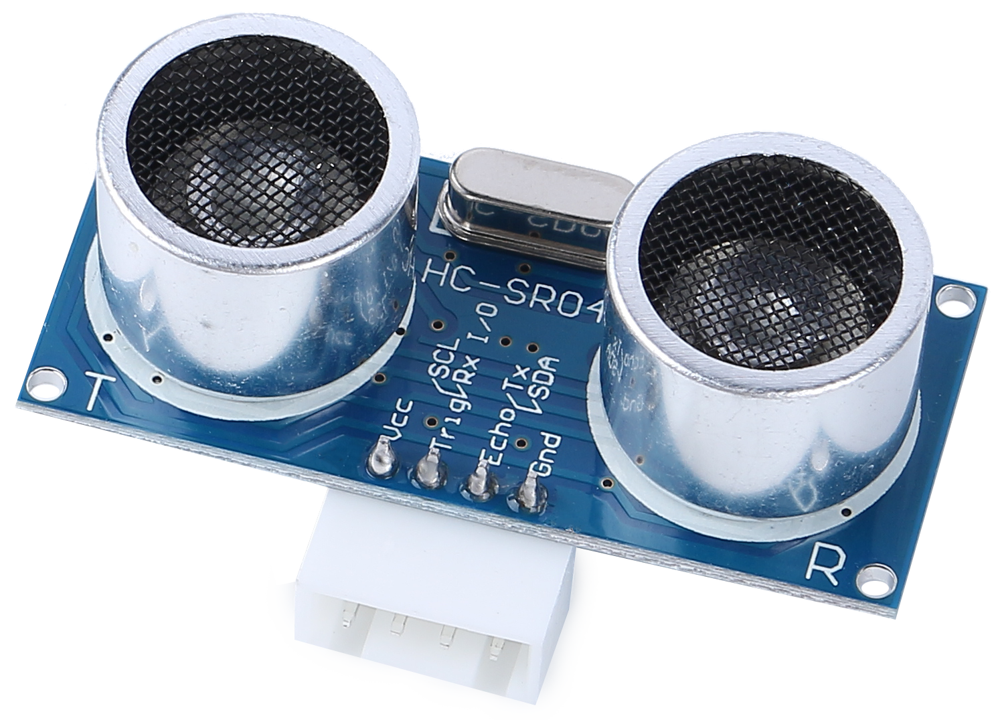
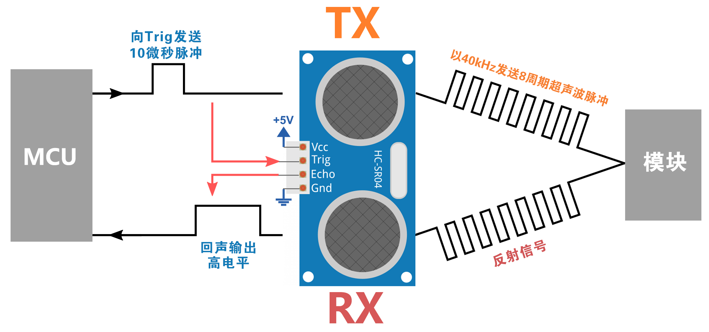
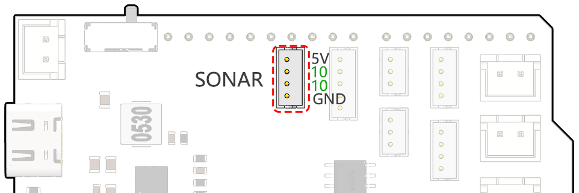

Lesson 7: Enhancing Rover Navigation with Ultrasonic Module
=============================================================

In our last adventure, we equipped our Mars Rover with "eyes" on its sides, creating a basic obstacle avoidance system. Yet, there's a blind spot right in front – a challenge we're ready to overcome!

Today, in this lesson, we're going to give our Rover a new sense of "sight." We'll install an ultrasonic sensor module, acting as a pair of central eyes, which will help our rover detect obstacles directly ahead.

We will delve into the fascinating mechanics of ultrasonic waves and explore how they enhance our Rover's ability to navigate complex terrains. With this addition, our Mars Rover will be more perceptive and agile, ready to embark on more ambitious exploratory missions.

Join us as we take a step further into this exciting STEAM journey, making our Mars Rover even more adept at exploring the uncharted territories!

.. raw:: html

   <video width="600" loop autoplay muted>
      <source src="_static/video/ultrasonic_avoid.mp4" type="video/mp4">
      Your browser does not support the video tag.
   </video>

.. note::

    If you are learning this course after fully assembling the GalaxyRVR, you need to move this switch to the right before uploading the code.

    .. image:: img/camera_upload.png
        :width: 500
        :align: center

Course Objectives
--------------------------

* Understand the principle of ultrasonic distance measurement.
* Learn how to use Arduino and ultrasonic module for distance measurement.
* Practice applying the ultrasonic module for obstacle avoidance on the Mars Rover model.

Materials Needed
---------------------

* Ultrasonic Module
* Basic tools and accessories (e.g. screwdriver, screws, wires etc.)
* Mars Rover Model (Equipped with rocker-bogie system, main boards, motors, obstacle avoidance module)
* USB Cable
* Arduino IDE
* Computer

Course Steps
--------------------
**Step 1: Assemble the Ultrasonic Sensor Module**

Now that we've got our eyes set on equipping our Mars Rover with a powerful new sense of "sight", it's time to put together the ultrasonic sensor module.

.. raw:: html

  <iframe width="600" height="400" src="https://www.youtube.com/embed/c_xWAVapGic?si=ovuxheXdGVpHopPa" title="YouTube video player" frameborder="0" allow="accelerometer; autoplay; clipboard-write; encrypted-media; gyroscope; picture-in-picture; web-share" allowfullscreen></iframe>

And there we have it! Our Mars Rover now has a fully-assembled ultrasonic sensor module, ready to help it navigate like never before. Are you excited to see how it changes our Rover's obstacle detection abilities? Let's dive right into it!

**Step 2: Exploring the Ultrasonic Module**

Let's get to know the HC-SR04, a powerful ultrasonic distance sensor. This tiny device can accurately measure distances from 2 cm up to 400 cm, all without touching a thing! Amazing, right? It's like having a superhero power! It can "see" the distances just by using sound waves, like how a bat navigates at night.

It uses four superpowers, or rather, four pins to do its magic:

* **TRIG (Trigger Pulse Input)** - It's the start button for our superhero. It tells our superhero, "Hey, it's time to send out a super sonic wave!"
* **ECHO (Echo Pulse Output)** - This is how our superhero listens to the echo of the sound wave it sent out.
* **VCC** - Even superheroes need some energy. We connect it to a 5V power supply.
* **GND** - It's the ground connection. Just like how superheroes need to stay connected to reality!

Imagine our superhero, the HC-SR04 Ultrasonic Sensor, playing a game of echo in the mountains.

* First, our superhero's brain, the MCU, says, "Ready, Set, Go!" by sending out a high-level signal for at least 10 microseconds to our superhero. This is like when we gather our energy before we yell into a valley.
* On hearing "Go!", our superhero shouts out loud 8 times very quickly. This super-sonic shout is sent out at a speed of 40 kHz. The superhero also starts a stopwatch and keeps an ear out for any returning shouts.
* If there is an obstacle in front, the shout will hit it and echo back. On hearing the echo, our superhero stops the stopwatch and notes the time. It also sends out a high-level signal to let the MCU know it heard an echo.
* Lastly, to find out how far away the obstacle is, our superhero uses a simple formula. It takes the time it recorded on the stopwatch, divides it by 2, and multiplies it by the speed of sound (340m/s). The result is the distance to the obstacle!

That's how our superhero sensor can figure out if there's an obstacle in its path and how far away it is. Amazing, isn't it? Next, we'll learn how we can use this superhero power in our Mars Rover!

**Step 3: Coding Our Superhero Sensor**

Having assembled our superhero sensor and understood how it uses its superpowers, it's time to put those powers into action! Let's write an Arduino sketch to allow our ultrasonic sensor to measure distances and then show us those measurements.

Here are the key steps that our superhero sensor will follow:

* We have connected both the TRIG and ECHO pins to pin 10 on the GalaxyRVR Shield. This allows us to control both signal transmission and reception of the ultrasonic module using a single Arduino pin.

.. code-block:: arduino

    // Define the pin for the ultrasonic module
    #define ULTRASONIC_PIN 10

* **Preparation**: To start, we establish serial communication at a 9600 baud rate so we can see the superhero's measurements in our Serial Monitor.

.. code-block:: arduino

    void setup() {
        // Start the serial communication
        Serial.begin(9600);
    }

* **Shout Out!**: We set the ``ULTRASONIC_PIN`` as an ``OUTPUT`` pin to send a 10-microsecond pulse, which is like commanding our ultrasonic superhero to emit a powerful shout (ultrasonic sound waves)!

.. code-block:: arduino

    // A 4ms delay is required, otherwise the reading may be 0
    delay(4);

    //Set to OUTPUT to send signal
    pinMode(ULTRASONIC_PIN, OUTPUT);

    // Clear the trigger pin
    digitalWrite(ULTRASONIC_PIN, LOW);
    delayMicroseconds(2);

    // Trigger the sensor by sending a high pulse for 10us
    digitalWrite(ULTRASONIC_PIN, HIGH);
    delayMicroseconds(10);

    // Set the trigger pin back to low
    digitalWrite(ULTRASONIC_PIN, LOW);

* **Wait and Listen**: Set the ``ULTRASONIC_PIN`` as INPUT. This way, our superhero sensor is now ready to listen for the echo of its shout. If there is an obstacle in front, the shout will hit it and echo back. On hearing the echo, our superhero stops the stopwatch and notes the time. It also sends out a high-level signal to let the MCU know it heard an echo.

.. code-block:: arduino

    pinMode(ULTRASONIC_PIN, INPUT);
    float duration = pulseIn(ULTRASONIC_PIN, HIGH);

* **Super Math**: With the echo returned, our sensor uses the speed of sound to calculate the distance to the object. We divide the total echo time by 2 because the time includes both the shout out and the wait for the echo.

.. code-block:: arduino

    float distance = duration * 0.034 / 2;

* **Report the Findings**: Our superhero sensor then reveals the result of its mission, printing the distance to the Serial Monitor for us to see.

.. code-block:: arduino

    // Print the distance to the serial monitor
    Serial.print("The distance is: ");
    Serial.print(distance);
    Serial.println(" cm");

* **Rest & Ready**: Every superhero needs a rest, so our sensor takes a short pause before the next mission. This allows the sensor to "reset" before we ask it to start another measurement.

.. code-block:: arduino

    delay(200);

Here's the complete code that turns our sensor into a superhero:

.. raw:: html

  <iframe src=https://create.arduino.cc/editor/sunfounder01/35bddbcf-145c-4e4f-b3ea-21e8210af4a6/preview?embed style="height:510px;width:100%;margin:10px 0" frameborder=0></iframe>

**Step 4: Programming the Ultrasonic Module to Drive the Mars Rover**

Now that we've equipped our Mars Rover with an ultrasonic sensor module, it's time to program it to respond based on the sensor's measurements. 

* For easier reading, we have created a function called ``readSensorData()``. This function encapsulates all the code required to read the distance from the ultrasonic sensor.

  .. code-block:: arduino

    float readSensorData() {
        // A 4ms delay is required, otherwise the reading may be 0
        delay(4);
      
        //Set to OUTPUT to send signal
        pinMode(ULTRASONIC_PIN, OUTPUT);
      
        // Clear the trigger pin
        digitalWrite(ULTRASONIC_PIN, LOW);
        delayMicroseconds(2);
      
        // Trigger the sensor by sending a high pulse for 10us
        digitalWrite(ULTRASONIC_PIN, HIGH);
        delayMicroseconds(10);
      
        // Set the trigger pin back to low
        digitalWrite(ULTRASONIC_PIN, LOW);
      
        //Set to INPUT to read
        pinMode(ULTRASONIC_PIN, INPUT);
      
        // pulseIn returns the duration of the pulse on the pin
        float duration = pulseIn(ULTRASONIC_PIN, HIGH);
      
        // Calculate the distance (in cm) based on the speed of sound (340 m/s or 0.034 cm/us)
        float distance = duration * 0.034 / 2;
      
        return distance;
    }

* In the ``loop()`` function, we call ``readSensorData()`` and stores its returned value in the ``distance`` variable.

  .. code-block:: arduino

    float distance = readSensorData();

* Depending on this distance, the Rover will move forward, move backward, or stop.

  .. code-block:: arduino
  
    // Control rover based on distance reading
    if (distance > 50) {  // If it's safe to move forward
      moveForward(200);
    } else if (distance < 15) {  // If there's an obstacle close
      moveBackward(200);
      delay(500);  // Wait for a while before attempting to turn
      backLeft(150);
      delay(1000);
    } else {  // For distances in between, proceed with caution
      moveForward(150);
    }

  * If the path is clear (the obstacle is more than 50 cm away), our Rover boldly moves forward.
  * And if an obstacle is getting close (less than 50 cm but more than 15 cm away), our Rover will move forward at a lower speed.
  * If an obstacle is too close for comfort (less than 15 cm away), the Mars rover will move backward and then turn to the left.

  .. image:: img/ultrasonic_flowchart.png

Below is the complete code. You can upload this code to the R3 board and see if it achieves the desired effect. You can also modify the detection distance based on the actual environment to make this obstacle avoidance system more perfect.

.. raw:: html

  <iframe src=https://create.arduino.cc/editor/sunfounder01/cded6408-1469-4289-b79b-7d445b56352b/preview?embed style="height:510px;width:100%;margin:10px 0" frameborder=0></iframe>

By leveraging these enhanced capabilities, the Mars Rover would be better equipped to identify potential obstacles in its path, measure distances accurately, and make informed decisions to navigate around them. This would significantly reduce the likelihood of collisions or other hazards that could hinder the rover's exploration mission.

With its super-senses, the Mars Rover can operate with greater confidence and efficiency, enabling it to delve deeper into the mysteries of Mars and gather valuable scientific data for researchers back on Earth.

**Step 5: Summary and Reflection**

In this lesson, we delved into the workings of ultrasonic waves and how to translate their return time to the sensor into measurable distance via coding.

Subsequently, we leveraged ultrasonic waves to devise an obstacle-avoidance system. This particular system varies its responses based on the distance to the impending obstacle.

Now, let's prompt some introspection on this lesson through a handful of questions:

* How does an ultrasonic module detect distance? Can you elucidate the underlying concept?
* How does the obstacle-avoidance system of this lesson differ from that of the previous one? What are their respective advantages and drawbacks?
* Is it feasible to amalgamate these two obstacle-avoidance systems?

Reflecting upon these queries will aid in solidifying our comprehension and prompt us to contemplate the application of these concepts to other projects. Looking forward to our next venture!