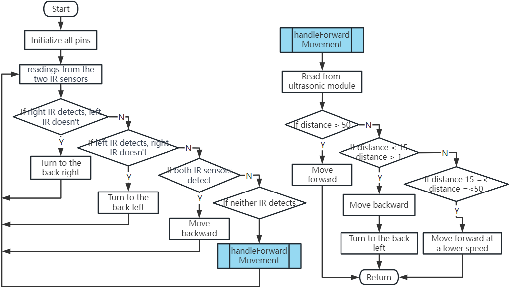
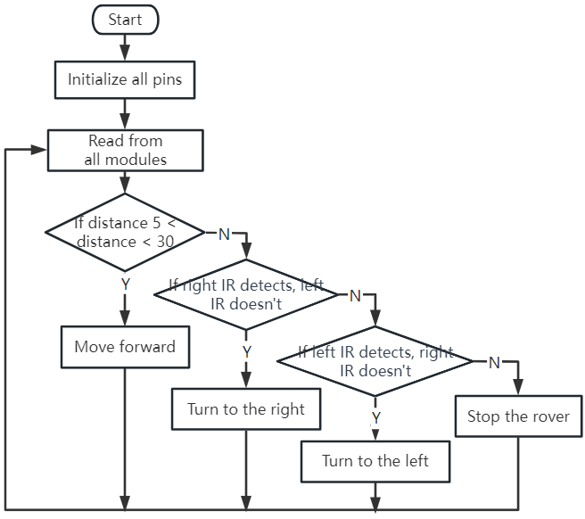

.. note::

    你好，欢迎加入SunFounder Raspberry Pi、Arduino与ESP32爱好者社区！与志同道合的朋友们一起深入探讨Raspberry Pi、Arduino和ESP32的世界。

    **为什么加入？**

    - **专家支持**：在社区和团队的帮助下解决售后问题和技术挑战。
    - **学习与分享**：交流技巧与教程，提升你的技能。
    - **独家预览**：抢先体验新品发布和抢先预告。
    - **专属折扣**：享受我们最新产品的独家折扣。
    - **节日促销和赠品**：参与赠品活动和节日促销。

    👉 准备好与我们一起探索和创造了吗？点击[|link_sf_facebook|]，立即加入！

第八课 高级避障与智能跟随系统
=======================================================

在今天的课程中，我们将进一步提升我们的STEAM技能。我们将结合避障模块与超声波传感器，创建一个更为高级的避障系统。同时，我们还将为火星漫游车实现一个智能跟随系统。

在本课结束时，我们的火星漫游车将不仅能够避开路径中的障碍物，还能跟随移动的物体。试想一下，一只迷你机器人宠物在你周围跟随！是不是很激动人心？那我们就开始吧。

.. raw:: html

    <video width="600" loop autoplay muted>
        <source src="_static/video/ultrasonic_ir_avoid.mp4" type="video/mp4">
        您的浏览器不支持视频标签。
    </video>

.. note::

    如果您在完成银河漫游车组装后学习本课程，在上传代码之前需要将开关移至右侧。

    .. image:: img/camera_upload.png
        :width: 500
        :align: center

课程目标
--------------------------

* 学习如何将避障模块与超声波模块结合，以提升导航能力。
* 理解高级避障系统背后的原理和功能。
* 学习如何在火星漫游车上实现智能跟随系统。

所需材料
---------------------

* 火星漫游车模型（我们在之前课程中已组装完成）
* USB线
* Arduino IDE
* 计算机
* 当然，还有你的创造力！

课程步骤
--------------------

**步骤1：理解概念**

顾名思义，避障模块帮助我们的火星漫游车避开障碍物。
它通过发射红外信号并接收从物体反射回来的信号来检测障碍物。
如果模块前方有障碍物，红外信号就会被反射回来，模块便能检测到。

现在，加入超声波传感器可以进一步提升这一系统。
超声波传感器通过发射特定频率的声波并监听回波，测量与物体之间的距离。
通过记录声波发射到回波返回之间的时间差，我们可以计算出传感器与物体之间的距离。

将这两者结合起来，我们就拥有了一个可靠、高效且多功能的避障系统！

**步骤2：构建高级避障系统**

在之前的课程中，我们学习了如何使用红外传感器进行基本的避障操作，也了解了超声波模块的工作原理。
现在，我们将把这些知识整合起来，构建一个高级的避障系统！

我们改进后的火星漫游车将同时使用超声波和红外传感器来导航其周围环境。

我们来设想一下红外传感器和超声波模块如何协同工作。为了帮助我们理清逻辑，使用流程图会更直观。学习如何绘制流程图是编程过程中的一个重要步骤，它能帮助你理顺思路，并系统化地规划方案。

现在，让我们将这个流程图转化为实际代码，让我们的火星漫游车动起来。

.. raw:: html

    <iframe src=https://create.arduino.cc/editor/sunfounder01/53d72ee5-a4c8-4524-92f8-4b0f4760c015/preview?embed style="height:510px;width:100%;margin:10px 0" frameborder=0></iframe>

请注意， ``handleForwardMovement()`` 函数中已整合了超声波传感器的行为。我们从传感器读取距离数据，并根据这个数据决定火星漫游车的运动。

在将代码上传到R3板后，开始测试系统。确保火星漫游车能够有效地检测并避开障碍物。
记住，你可能需要根据实际环境调整代码中的检测距离，以使系统更加完善。

**步骤3：编写智能跟随系统代码**

现在我们的火星漫游车已经具备了避障能力，接下来我们将进一步改进它，使其能够跟随物体。我们的目标是修改现有代码，让火星漫游车能够向移动物体靠近。

你有没有想过，跟随系统和避障系统之间有什么不同？

关键在于，跟随系统要求我们的火星漫游车对检测到的物体做出反应，而避障系统则是为了避免障碍物。

让我们来设想一下理想的工作流程：

* 如果超声波传感器检测到物体距离在5-30厘米之间，火星漫游车应朝着物体移动。
* 如果左侧红外传感器检测到物体，火星漫游车应向左转。
* 如果右侧红外传感器检测到物体，火星漫游车应向右转。
* 在其他情况下，火星漫游车应保持静止。

现在，我们开始编写代码。

.. raw:: html

    <iframe src=https://create.arduino.cc/editor/sunfounder01/75662c17-4b0a-4494-b18b-089cc2b32311/preview?embed style="height:510px;width:100%;margin:10px 0" frameborder=0></iframe>

完成代码后，测试火星漫游车是否能跟随你的动作。

与避障系统相似，测试智能跟随系统并解决可能出现的问题也至关重要。准备好开始了吗？

**步骤4：总结与反思**

今天，你完成了一项了不起的任务。你将不同的模块和概念结合起来，成功创建了一个高级避障和跟随系统。记住，学习永无止境——继续探索、创新，并将你新学到的技能应用到其他项目中。

在学习过程中，反思是非常重要的。请思考以下问题：

* 为什么我们在避障系统中先使用了避障模块，而在跟随系统中则是先使用超声波传感器？
* 如果我们交换这些模块在代码中的检查顺序，会产生什么不同的效果？

挑战和问题是STEAM学习过程的一部分，它们为我们的进步提供了宝贵的机会。不要畏惧故障排除——它本身就是一种强大的学习工具！

在你继续前进的旅程中，记住，每一个克服的障碍都让你离掌握STEAM技能更近一步。继续前行，享受这段旅程吧！
