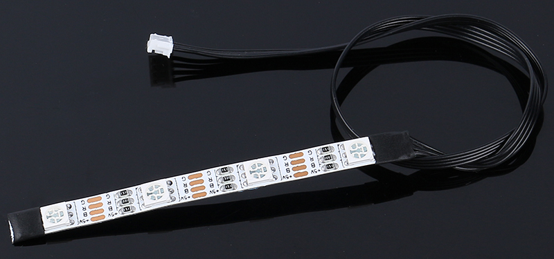
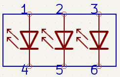
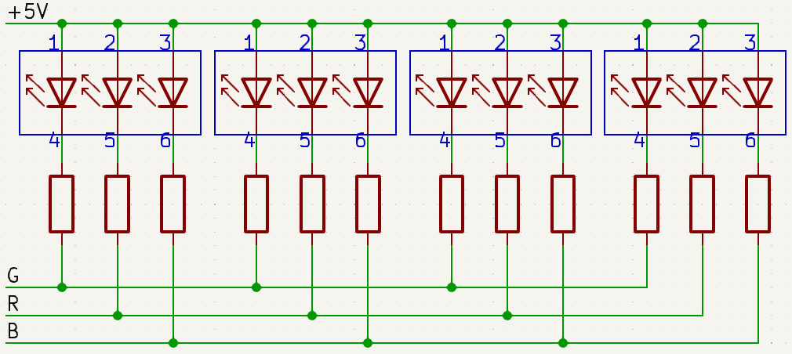
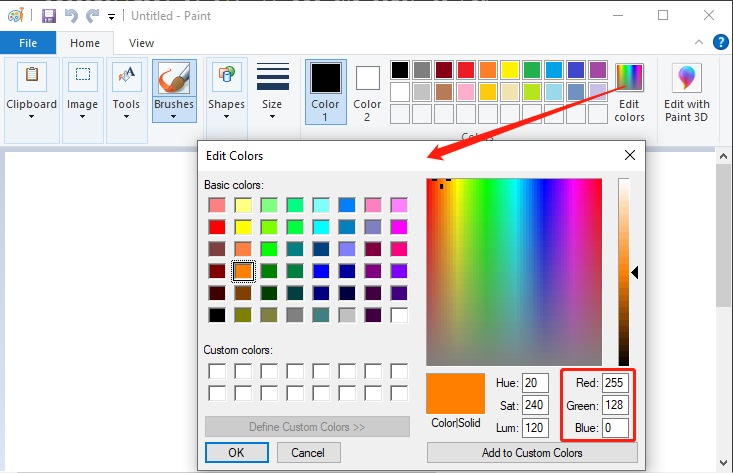

.. note:: 

    你好，欢迎加入SunFounder Raspberry Pi、Arduino和ESP32爱好者社区！与其他爱好者一起深入探索Raspberry Pi、Arduino和ESP32的世界。

    **为什么加入？**

    - **专家支持**：在售后问题和技术挑战中，得到我们社区和团队的帮助。
    - **学习与分享**：交流技巧和教程，提升你的技能。
    - **独家预览**：抢先体验新产品的发布和预览。
    - **特别折扣**：享受我们最新产品的专属折扣。
    - **节日促销与赠品**：参与赠品活动和节庆促销。

    👉 准备好与我们一起探索和创造了吗？点击[|link_sf_facebook|]，今天就加入我们吧！

第九课 用RGB LED灯带照亮前方
============================================================

在我们之前的学习中，我们已经将火星漫游车改造成了一台智能探险者，能够熟练地绕过障碍物。它已经能够很好地在我们为它设置的类似火星的地形中行驶。

但是，假如我们能为它增添一些色彩，如何让它既实用又充满个性呢？让我们赋予火星漫游车通过色彩和光线表达自我的能力。我们将使用RGB LED灯带，这个酷炫的功能能够让我们的漫游车在最黑暗的环境中也能照亮前方。

想象一下，漫游车留下的将是彩色编码的信号，让我们更容易理解它的动作。前进时是绿色光芒，停止时是严肃的红色，急转弯时则是闪烁的黄色。甚至可以根据需要显示各种颜色，仅仅是为了好玩！

本课的目标是了解RGB LED灯带的工作原理，学习如何控制它们的颜色和亮度，然后将这些控制与漫游车的运动同步。到课程结束时，我们的火星漫游车将不仅仅是一个机器，它将成为一个光彩夺目的、不断变化颜色的存在，指引着我们在广阔的火星地貌中前行！

.. raw:: html

    <video width="600" loop autoplay muted>
        <source src="_static/video/car_rgb.mp4" type="video/mp4">
        Your browser does not support the video tag.
    </video>

.. note::

    如果你在完全组装好GalaxyRVR后学习本课程，在上传代码之前需要将开关移到右侧。

    .. image:: img/camera_upload.png
        :width: 500
        :align: center

目标
-------------

* 了解RGB LED灯带的工作原理及应用。
* 学习如何使用Arduino编程控制RGB LED灯带的颜色和亮度。
* 练习在火星漫游车模型上安装和使用RGB LED灯带作为指示灯。

所需材料
-------------------------
* RGB LED灯带（每条灯带包含8颗RGB LED，总共两条）
* 基本工具和配件（如螺丝刀、螺丝、导线等）
* 火星漫游车模型（配备摇杆系统、主板、电机、障碍物避让模块、超声波模块）
* USB数据线
* Arduino IDE
* 电脑

课程步骤
------------------
**步骤1：安装RGB LED灯带到火星漫游车上**

首先，将两条RGB灯带固定在火星漫游车的底部两侧。它们由一组引脚控制，因此在布线过程中无需区分。

.. raw:: html

    <iframe width="600" height="400" src="https://www.youtube.com/embed/v4YGjNwPOJE" title="YouTube video player" frameborder="0" allow="accelerometer; autoplay; clipboard-write; encrypted-media; gyroscope; picture-in-picture; web-share" allowfullscreen></iframe>

**步骤2：探索RGB LED灯带的光彩魔力**

你还记得上次看到彩虹是什么样的吗？那七种鲜艳的颜色如何装点了天空？你想不想在我们的火星漫游车上也创造出自己的彩虹？让我们通过RGB LED灯带来探索光的魔力吧！

你会注意到，我们的RGB LED灯带有四个引脚，分别标注如下：

* **+5V**：这是三颗小灯泡（LED）中的“正极”或“阳极”。它需要连接到DC 5V电源，为小灯泡提供电能。
* **B**：这是蓝色LED的“负极”或“阴极”。
* **R**：这是红色LED的“负极”或“阴极”。
* **G**：这是绿色LED的“负极”或“阴极”。

你还记得在美术课上学过的三种原色——红、绿、蓝吗？就像艺术家在调色板上混合这些颜色以创造新的色调一样，我们的灯带包含了四颗“5050”LED，可以通过混合这些原色来创造几乎任何颜色！每颗“5050”LED就像一个小型艺术工作室，里面装有这三种彩色灯泡。

这些小小的艺术工作室通过灵活的电路板智能连接——就像一条迷你的电气高速公路！所有LED的“正极”（阳极）连接在一起，而“负极”（阴极）则分别连接到相应的颜色通道（G接G，R接R，B接B）。

最酷的部分是，凭借我们的命令，这条灯带上的所有LED灯可以同时改变颜色！就像拥有一个随时可用的灯光乐团！

接下来，我们就开始让灯带“奏响”灯光交响乐吧！在下一步中，我们将学习如何控制这些LED灯带，展示我们想要的颜色。

**步骤3：点亮秀场 - 编程控制RGB LED灯带**

我们已经踏入了色彩的世界，现在是时候让我们的火星漫游车焕发光彩。准备好用RGB LED灯带为黑暗的环境涂上一抹色彩吧！把它当作是将火星漫游车变成一场移动迪斯科派对的机会！

* 在开始编程之前，我们要明白，虽然我们有两条LED灯带，但它们都由同一组引脚控制。可以把它想象成两位舞者的完美同步表演！

    .. image:: img/rgb_shield.png

* 现在是时候召唤编程魔法了。我们将通过Arduino代码来初始化这些引脚。

    .. code-block:: arduino

        #include <SoftPWM.h>

        // 定义RGB灯带的引脚号
        const int bluePin = 11;
        const int redPin = 12;
        const int greenPin = 13;

* 引脚设置好后，我们将使用 ``SoftPWMSet()`` 函数来控制这些引脚。为了让RGB灯带显示红色，我们只需开启红色LED，关闭其他颜色。

    .. code-block:: arduino

        void setup() {
            // 在所有引脚上初始化软件PWM
            SoftPWMBegin();
        }

        void loop() {
            // 通过开启红色LED并关闭其他LED来显示红色
            SoftPWMSet(redPin, 255); // 255是最大亮度
            SoftPWMSet(greenPin, 0); // 0为关闭
            SoftPWMSet(bluePin, 0);  // 0为关闭
            delay(1000); // 等待1秒
        }

在上述代码中，我们只展示了如何显示单一颜色。

如果我们希望展示多种颜色，代码可能会变得非常繁琐。因此，为了让代码更加简洁和可维护，我们可以创建一个函数，方便地为三个引脚分配PWM值。然后在``loop()``函数中，我们可以轻松地设置各种颜色。

.. raw:: html

  <iframe src=https://create.arduino.cc/editor/sunfounder01/cac90501-04c1-44c2-a1d7-4f863e50f186/preview?embed style="height:510px;width:100%;margin:10px 0" frameborder=0></iframe>

上传代码到R3板后，你可能会发现橙色和黄色看起来有点不对劲。 
这是因为灯带上的红色LED相比其他两个LED较暗。
因此，你需要在代码中引入偏移值来修正这种颜色偏差。

.. raw:: html

  <iframe src=https://create.arduino.cc/editor/sunfounder01/60ec867f-5637-44bd-b72d-4709fc4f5349/preview?embed style="height:510px;width:100%;margin:10px 0" frameborder=0></iframe>

现在，RGB LED灯带应该能够显示正确的颜色。如果你仍然发现偏差，可以手动调整 ``R_OFFSET`` 、 ``G_OFFSET`` 和 ``B_OFFSET`` 的值。

现在你可以自由地尝试并在LED灯带上显示任何你想要的颜色了。只需要输入RGB值，设定你所需的颜色。

这里有个小贴士：你可以使用电脑上的画图工具来确定你想要的颜色的RGB值。

既然我们已经掌握了颜色设置的艺术，接下来，我们将把这些光彩夺目的显示效果与火星漫游车的运动结合起来。接下来会更加激动人心！

**步骤4：通过颜色指示控制漫游车的运动**

现在，我们将在火星漫游车的运动中加入颜色指示。例如，可以使用绿色表示前进，红色表示后退，黄色表示左转或右转。

为此，我们将在代码中加入控制机制，根据漫游车的运动设置LED灯带的颜色。这将涉及修改我们漫游车的控制代码，增加颜色控制函数。

下面是一个如何操作的示例：

.. raw:: html

  <iframe src=https://create.arduino.cc/editor/sunfounder01/5412eebe-75b8-4f98-a348-f0889e8a7fde/preview?embed style="height:510px;width:100%;margin:10px 0" frameborder=0></iframe>

在 ``loop()`` 函数中，我们通过调用不同的函数命令漫游车执行一系列动作。
每个动作都有对应的颜色显示——绿色表示前进，红色表示后退，黄色表示转弯。
通过 ``setColor()`` 函数，我们控制了RGB色道的亮度，展示了每种颜色。

在停止动作时，我们加入了一个有趣的元素——红色和蓝色灯光的呼吸效果。
通过在 ``stopMove()`` 函数中周期性地调整红色和蓝色通道的亮度，LED灯带在停止时展现了红蓝交替的动态视觉效果。

现在，我们的火星漫游车拥有了自己的绚丽色彩效果，留下了色彩编码的信号，每个信号代表着不同的动作。

通过这个项目，我们发现，STEAM学科可以融合在一起，为一台普通的机器注入生命，将其转变成一个充满活力、互动性强且富有趣味的学习工具。

**步骤5：总结与反思**

今天的课程中，我们深入探索了RGB LED灯带的世界，学习了如何操控它们展示多彩的颜色。这些光辉灿烂的色彩为我们的火星漫游车注入了新的生命，将它从一台普通的机器转变为一个光彩夺目的奇观。

现在，我邀请你思考一下——如果你坐在驾驶座上，你会如何利用这些颜色来增强你的火星漫游车？你希望它展示哪些独特的效果？

此外，通过这个过程，我希望你对如何将STEAM概念交织在一起有了更直观的理解，帮助你拓宽其实际应用的视野。

我们下次冒险再见！
