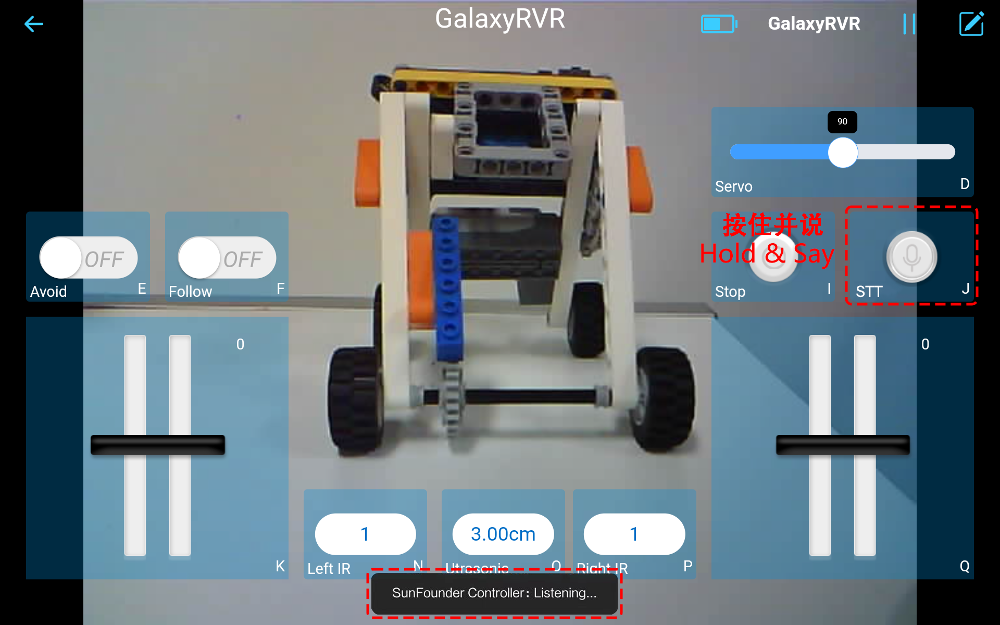

.. note::

    Ciao, benvenuto nella Community SunFounder Raspberry Pi & Arduino & ESP32 Enthusiasts su Facebook! Immergiti più a fondo in Raspberry Pi, Arduino ed ESP32 insieme ad altri appassionati.

    **Perché unirti?**

    - **Supporto esperto**: Risolvi i problemi post-vendita e le sfide tecniche con l'aiuto della nostra comunità e del nostro team.
    - **Impara e condividi**: Scambia consigli e tutorial per migliorare le tue competenze.
    - **Anteprime esclusive**: Ottieni l'accesso anticipato agli annunci di nuovi prodotti e anteprime esclusive.
    - **Sconti speciali**: Approfitta di sconti esclusivi sui nostri prodotti più recenti.
    - **Promozioni festive e giveaway**: Partecipa a giveaway e promozioni festive.

    👉 Pronto per esplorare e creare con noi? Clicca su [|link_sf_facebook|] e unisciti oggi stesso!

.. _play_mode:

Modalità Play
=========================

Non vedi l'ora di iniziare subito il tuo viaggio su Marte? La Modalità Play è perfetta per chi non può aspettare di immergersi nell'azione. Dotata di codice preinstallato in fabbrica, puoi entrare subito in azione dopo aver assemblato il tuo GalaxyRVR. Usa l'app SunFounder Controller facile da usare per esplorare le sue numerose funzioni, inclusa la guida in prima persona, il passaggio tra la modalità di evitamento ostacoli e follow, e persino il controllo vocale.

.. raw:: html
    
    <video width="600" loop autoplay muted>
        <source src="_static/video/play_mode.mp4" type="video/mp4">
        Your browser does not support the video tag.
    </video>

Ma prima di partire per esplorare il Pianeta Rosso, assicuriamoci che tu sia completamente attrezzato e pronto per l'avventura. Ecco una Guida Rapida che ti assisterà in questo emozionante viaggio!

.. note::

    * Se la tua scheda R3 ha già caricato un altro codice, ma vuoi continuare a usare la Modalità Play, dovrai scaricare il codice pertinente.

        * :download:`GalaxyRVR Codes <https://github.com/sunfounder/galaxy-rvr/archive/refs/heads/main.zip>`

    * Installa |link_download_arduino|, quindi :ref:`install_lib`

    * Quindi, apri il file ``galaxy-rvr.ino`` situato nella directory ``galaxy-rvr-main\galaxy-rvr``.
    
    .. note:: Nel programma di esempio, ti verrà chiesto di connettere il tuo dispositivo mobile all'hotspot rilasciato da GalaxyRVR, impedendoti di utilizzare contemporaneamente reti esterne. Puoi :ref:`ap_to_sta`. Dopo aver impostato la modalità STA, finché il tuo dispositivo e GalaxyRVR sono nella stessa WLAN, puoi controllare GalaxyRVR.

    * Sposta l'interruttore a destra e poi clicca su **Upload**.

    .. image:: img/camera_upload.png
        :width: 400
        :align: center

Guida Rapida
---------------------

#. Avviamo il GalaxyRVR.

    * Alla prima accensione del tuo GalaxyRVR, ti consigliamo di collegare un cavo USB Type-C per caricare completamente la batteria. Poi accendi l'alimentazione.
    
        .. raw:: html

            <video width="600" loop autoplay muted>
                <source src="_static/video/play_start.mp4" type="video/mp4">
                Your browser does not support the video tag.
            </video>

    * Per attivare l'ESP32 CAM, sposta l'interruttore della modalità sulla posizione **Run** e premi il pulsante **reset** per riavviare la scheda R3. Vedrai quindi una luce ciano lampeggiare sulla striscia inferiore.

        .. raw:: html

            <video width="600" loop autoplay muted>
                <source src="_static/video/play_reset.mp4" type="video/mp4">
                Your browser does not support the video tag.
            </video>

#. Installa `SunFounder Controller <https://docs.sunfounder.com/projects/sf-controller/en/latest/>`_ da **APP Store(iOS)** o **Google Play(Android)**. 

#. Connettiti alla rete ``GalaxyRVR``.

    Per una comunicazione ottimale tra il tuo dispositivo mobile e il Rover, dovrai collegarli alla stessa rete locale (LAN) fornita da GalaxyRVR.

    * Trova ``GalaxyRVR`` nell'elenco delle reti disponibili sul tuo dispositivo mobile (tablet o smartphone), inserisci la password ``12345678`` e connettiti.

        .. image:: img/app/camera_lan.png

    * La modalità di connessione predefinita è **modalità AP**. Dopo esserti connesso, potrebbe apparire un avviso che segnala l'assenza di accesso a internet su questa rete. Se accade, seleziona "Rimani connesso".

        .. image:: img/app/camera_stay.png

    

#. Configura un controller.

    * Per creare un controller su SunFounder Controller, tocca l'icona **+**.

        .. image:: img/app/app1.png

    * Sono disponibili controller predefiniti per alcuni prodotti. Qui scegliamo **GalaxyRVR**. Dagli un nome, oppure tocca semplicemente **Conferma**.

        .. image:: img/app/play_preset.jpg
    
    * Una volta all'interno, l'app cercherà automaticamente il GalaxyRVR. Dopo qualche istante, vedrai un messaggio che dice "Connessione riuscita".

        .. image:: img/app/auto_connect.jpg

        .. note::

            * Se non riesci a connetterti, assicurati che il tuo Wi-Fi sia connesso a ``GalaxyRVR``.
            * Puoi anche toccare il pulsante |app_connect| per connetterti manualmente. Dopo un breve periodo, dovresti vedere comparire ``GalaxyRVR(IP)``. Toccalo per stabilire la connessione.

            .. image:: img/app/camera_connect.png
                :width: 300
                :align: center

    * Ora, toccando il pulsante |app_run| potrai visualizzare il video in diretta dalla fotocamera e controllare il Rover utilizzando i widget forniti. 

        .. image:: img/app/play_run_view.jpg

#. Esploriamo ora le funzioni di ciascun widget:

        * **Servo(D)**: Controlla il meccanismo di inclinazione della fotocamera del Rover, permettendoti di osservare un'area più ampia.

        * :ref:`app_avoid`: Passa alla modalità di evitamento ostacoli. Le distanze di rilevamento impostate in fabbrica per ogni modulo di evitamento ostacoli possono variare. È necessario un aggiustamento manuale.

        * :ref:`app_follow`: Attiva la modalità follow del Rover. Anche in questo caso, potrebbero essere necessari aggiustamenti manuali per le distanze di rilevamento dei moduli di evitamento ostacoli.

        * **Stop(I)**: Ferma immediatamente tutti i movimenti del Rover.

        * :ref:`app_speech_control`: Premi questo widget per attivare il riconoscimento vocale e far eseguire al Rover le azioni corrispondenti.

        * **HeadLamp(M)**: Accende/spegne il LED sulla ESP32 CAM.
        * **Throttle Widgets su K e Q**: Il widget throttle nell'area K controlla i motori sinistri del Rover, mentre quello nell'area Q controlla i motori destri. Coordinando entrambi i widget, puoi far muovere GalaxyRVR in qualsiasi direzione.

        * **Left IR(N)**: Mostra le letture del modulo di evitamento ostacoli sinistro.

        * **Ultrasonic(O)**: Mostra la distanza misurata dal modulo a ultrasuoni.

        * **Right IR(P)**: Mostra le letture del modulo di evitamento ostacoli destro.

.. _app_avoid:

Avoid(E)
------------------------

Tocca il widget **Avoid(E)** per attivare la modalità di evitamento ostacoli.

Prima di attivare questa modalità, potresti dover regolare i campi di rilevamento dei sensori in base all'ambiente circostante, poiché le impostazioni di fabbrica potrebbero non essere ottimali per tutte le situazioni.

Se il campo di rilevamento dei due moduli a infrarossi è troppo corto, il Mars Rover potrebbe urtare contro gli ostacoli. Al contrario, se il campo è troppo lungo, il Rover potrebbe deviare troppo da un ostacolo, compromettendo la sua navigazione.

Ecco come puoi ottimizzare le impostazioni:

#. Inizia regolando il modulo di evitamento ostacoli destro. Durante il trasporto, gli urti possono causare l'inclinazione del trasmettitore e del ricevitore sul modulo a infrarossi. Pertanto, è necessario raddrizzarli manualmente.

    .. raw:: html

        <video width="600" loop autoplay muted>
            <source src="_static/video/ir_adjust1.mp4" type="video/mp4">
            Your browser does not support the video tag.
        </video>

#. Posiziona un ostacolo a circa 20 cm direttamente davanti al modulo destro. La scatola in cui è arrivato il nostro kit Rover è una buona scelta per questo! Ora, ruota il potenziometro sul modulo finché la spia non si accende. Poi, continua a spostare l'ostacolo avanti e indietro per verificare se la spia si accende alla distanza desiderata. Se la luce non si accende alla distanza corretta o rimane accesa senza spegnersi, dovrai regolare l'altro potenziometro.

    .. raw:: html

        <video width="600" loop autoplay muted>
            <source src="_static/video/ir_adjust2.mp4" type="video/mp4">
            Your browser does not support the video tag.
        </video>

#. Ripeti lo stesso processo per l'altro modulo.

.. _app_follow:

Follow(F)
------------

Quando sei pronto per attivare la modalità follow, tocca semplicemente il widget **Follow(F)**. Se non hai precedentemente regolato la distanza di rilevamento dei moduli di evitamento ostacoli, dovrai seguire prima i passaggi descritti in :ref:`app_avoid`.

Una volta in modalità follow, il GalaxyRVR si muoverà verso un oggetto davanti a sé o girerà a sinistra o a destra per seguirne il movimento.

.. _app_speech_control:

STT(J)
-------------------

STT sta per Speech to Text. L'app SunFounder Controller si integra con il motore di riconoscimento vocale del tuo dispositivo mobile. Quindi, quando tocchi e tieni premuto il widget **STT(J)** su SunFounder Controller e parli nel tuo dispositivo mobile,

Il dispositivo catturerà il tuo discorso, lo convertirà in testo e lo invierà al GalaxyRVR. Se questo testo corrisponde ai comandi preimpostati nel tuo codice, il Rover eseguirà le azioni corrispondenti.

Di seguito sono riportati i comandi attualmente preimpostati nel codice. Pronuncia uno di questi comandi e osserva come risponde il GalaxyRVR.

* ``stop``: Tutti i movimenti del rover si fermano.
* ``forward``: Il rover si muove in avanti.
* ``backward``: Il rover si muove all'indietro.
* ``left``: Il rover gira a sinistra.
* ``right``: Il rover gira a destra.

.. note::

    La funzione STT (Speech to Text) richiede una connessione internet e i servizi Google sui dispositivi Android. Tuttavia, ciò non funziona con la modalità predefinita AP (Access Point) su GalaxyRVR. 
    
    In modalità AP, GalaxyRVR crea una rete Wi-Fi locale a cui il tuo dispositivo mobile può connettersi, ma non fornisce accesso a internet.
    
    Per utilizzare la funzione STT su Android, passa il codice del Rover da AP a STA come descritto in :ref:`stt_android`.

.. note::

    I dispositivi iOS, utilizzando un motore di riconoscimento vocale offline, funzionano bene sia in modalità AP che STA. 
    
