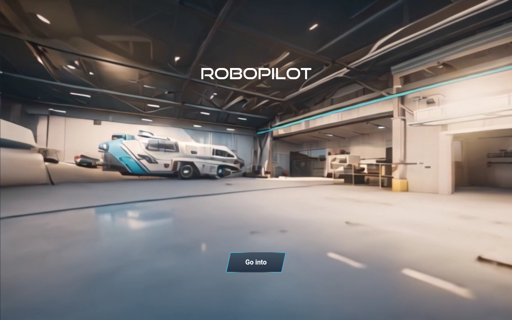
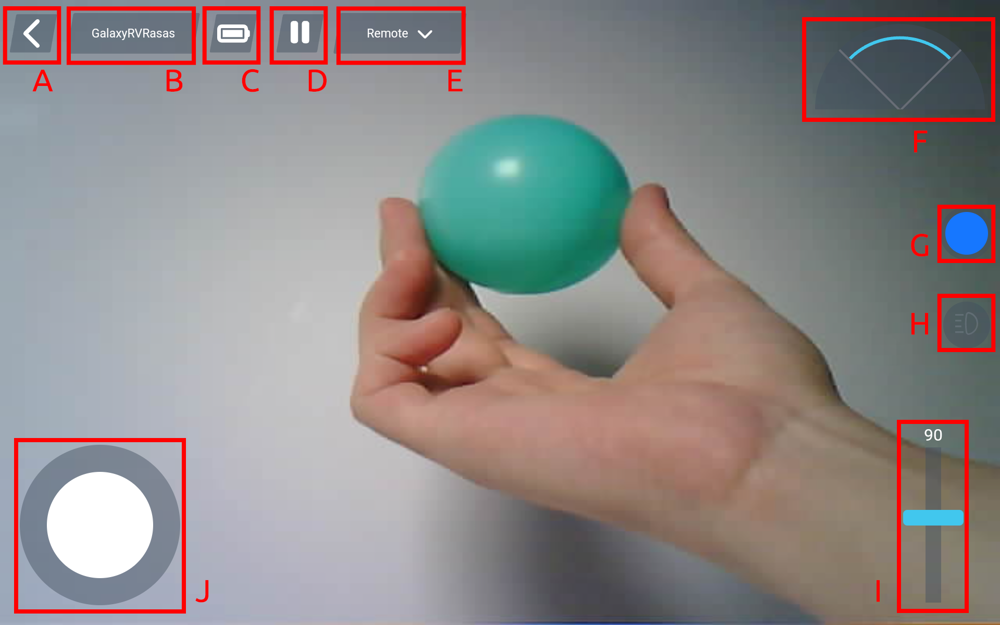
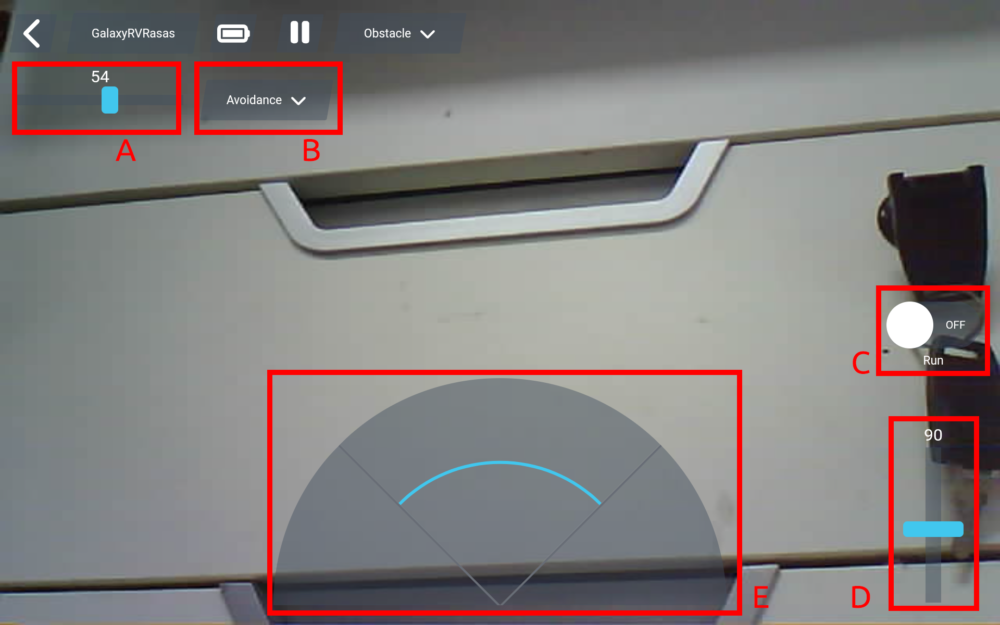
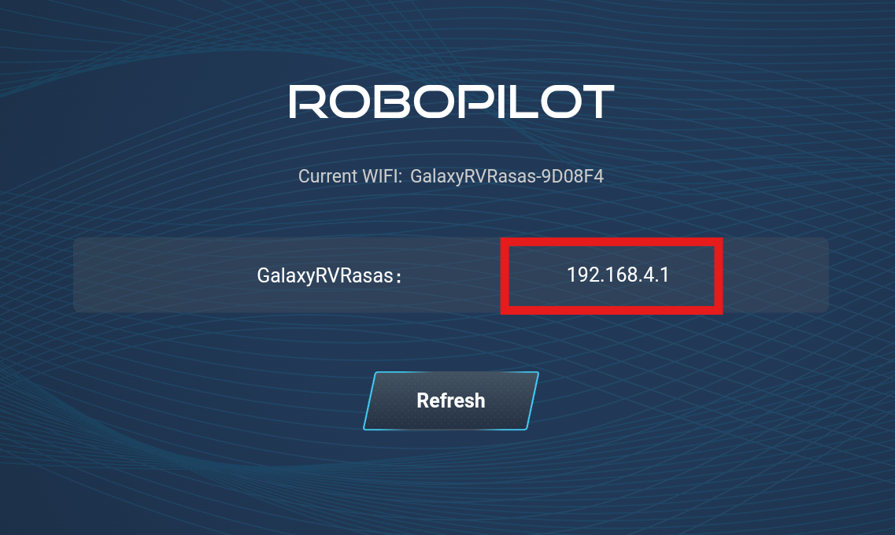

.. note::

    Hello, welcome to the SunFounder Raspberry Pi & Arduino & ESP32 Enthusiasts Community on Facebook! Dive deeper into Raspberry Pi, Arduino, and ESP32 with fellow enthusiasts.

    **Why Join?**

    - **Expert Support**: Solve post-sale issues and technical challenges with help from our community and team.
    - **Learn & Share**: Exchange tips and tutorials to enhance your skills.
    - **Exclusive Previews**: Get early access to new product announcements and sneak peeks.
    - **Special Discounts**: Enjoy exclusive discounts on our newest products.
    - **Festive Promotions and Giveaways**: Take part in giveaways and holiday promotions.

    👉 Ready to explore and create with us? Click [|link_sf_facebook|] and join today!

.. _play_robopilot:

Play RoboPilot
=========================

Are you eager to kick-start your Martian journey right away? 
Our Play Mode is perfectly tailored for those of you who just can't wait to dive in. 
Equipped with factory-preloaded code, you can jump straight into the action after assembling your GalaxyRVR. 
Use the user-friendly RoboPilot app to explore its myriad of functions including first-person driving, 
switching between obstacle avoidance and follow modes.

But before you set off to explore the Red Planet, let's make sure you are fully equipped and ready for the adventure. 
Below is a Quick Guide to assist you in this exciting journey!

.. note::

    * If your R3 board has already been uploaded with other code, but you want to continue using Play Mode, you will need to download the relevant code.

        * :download:`GalaxyRVR Codes <https://github.com/sunfounder/galaxy-rvr/archive/refs/heads/scratch.zip>`

    * Install |link_download_arduino|, then :ref:`install_lib`

    * Then, open the ``galaxy-rvr.ino`` file located in the ``galaxy-rvr-scratch\galaxy-rvr`` directory.
    
    .. note:: In the sample program, it will require you to connect your mobile device to the hotspot released by GalaxyRVR, which will prevent you from using external networks at the same time. You can :ref:`ap_to_sta`. After setting it to STA mode, as long as your device and GalaxyRVR are in the same WLAN, you can control GalaxyRVR.

    * Move the switch to the right and then click **Upload**.

    .. image:: img/camera_upload.png
        :width: 400
        :align: center

Quick Guide
---------------------

#. Let's start the GalaxyRVR.

    * The first time you use your GalaxyRVR, it is recommended that you plug in a Type-C USB cable to fully charge the battery first. Then turn the power on.
    
        .. raw:: html

            <video width="600" loop autoplay muted>
                <source src="_static/video/play_start.mp4" type="video/mp4">
                Your browser does not support the video tag.
            </video>

    * To activate the ESP32 CAM, move the mode switch to the **Run** position, and press the **reset** button to reboot the R3 board. You will then observe a cyan light flashing on the bottom strip.

        .. raw:: html

            <video width="600" loop autoplay muted>
                <source src="_static/video/play_reset.mp4" type="video/mp4">
                Your browser does not support the video tag.
            </video>

#. Install **RoboPilot** from **APP Store(iOS)** or **Google Play(Android)**.

#. Connect to the ``GalaxyRVR`` Network.

    For optimal communication between your mobile device and the Rover, you'll need to connect them to the same local area network (LAN) provided by GalaxyRVR.

    * Find ``GalaxyRVR`` on the list of available networks on your mobile device (tablet or smartphone), enter the password ``12345678``, and connect to it.

        .. image:: img/app/camera_lan.png

    * The default connection mode is **AP mode**. After you've connected, there might be a prompt warning that there is no internet access on this network. If so, choose "Stay connected".

        .. image:: img/app/camera_stay.png

#. Open RoboPilot. Click 'Go into' to enter the control interface.

Remote Control
----------------------------------------------

Upon entering the control interface, you will see the following screen.
The background shows the view captured by the GalaxyRVR's camera, with remote control widgets overlaid.

Here are the controls:

A. Back
B. Settings: Here you can change the device name, WiFi settings, **adjust the camera angle**, and disconnect.

    .. image:: img/robopilot/rp3_setting.png

C. Battery level indicator
D. Pause program
E. Mode selection: Choose between obstacle and remote modes here. The default setting is Remote Mode.

    .. image:: img/robopilot/rp4_mode.png

F. Obstacle monitor: This module is divided into three areas, with the left and right sides showing the results from the obstacle modules, and the central area displaying the ultrasonic sensor's findings.
G. Color selector: Choose the lighting color for the chassis here.

    .. image:: img/robopilot/rp5_color.png

H. Camera LED switch.
I. Adjust the gimbal angle, ranging from 0-135°. At 0°, it looks up at the sky.
J. Move the joystick to control the movement of GalaxyRVR. A gentle push will make the GalaxyRVR move slowly.

0bstacle Detect
-------------------------------

When you switch to Obstacle, you will see the following interface.
Again, the background displays the view from the GalaxyRVR's camera, overlaid with obstacle mode controls.

Here are the controls:

A. Adjust the GalaxyRVR's speed.
B. Switch between **Avoid** and **Follow** modes here.
C. Start/stop the GalaxyRVR's automatic movement.
D. Adjust the gimbal angle, ranging from 0-135°. At 0°, it looks up at the sky.
E. Obstacle monitor: This module is divided into three areas, with the left and right sides showing the results from the obstacle modules, and the central area displaying the ultrasonic sensor's findings.

**Avoid**

.. Tap the **Avoid(E)** widget to activate the obstacle avoidance mode.

Before enabling this mode, you may need to adjust the detection ranges of the sensors according to your current environment, as the factory settings may not be ideal for all situations.

If the detection range of the two infrared modules is too short, the Mars Rover might bump into obstacles. Conversely, if the range is too long, the Rover might start swerving too far away from an obstacle, potentially disrupting its navigation.

Here's how you can fine-tune the settings:

#. Start by adjusting the right obstacle avoidance module. During transportation, collisions may cause the transmitter and receiver on the infrared module to tilt. Therefore, you need to manually straighten them.

    .. raw:: html

        <video width="600" loop autoplay muted>
            <source src="_static/video/ir_adjust1.mp4" type="video/mp4">
            Your browser does not support the video tag.
        </video>

#. Place an obstacle about 20 cm directly in front of the right module. The box in which our Rover kit came is a good choice for this! Now, turn the potentiometer on the module until the indicator light on the module just lights up. Then, keep moving the obstacle back and forth to check if the indicator light comes on at the desired distance. If the light doesn't turn on at the correct distance or if it remains on without going out, you'll need to adjust the other potentiometer.

    .. raw:: html

        <video width="600" loop autoplay muted>
            <source src="_static/video/ir_adjust2.mp4" type="video/mp4">
            Your browser does not support the video tag.
        </video>

#. Repeat the same process for the other module.

**Follow**

If you haven't previously adjusted the detection distance of the obstacle avoidance modules, 
you will need to follow the steps in **Avoid** first.

Once in follow mode, 
the GalaxyRVR will move towards an object in front of it or turn left or right to follow the object's movement.

Re-connect
-------------------------------

If your network fails or disconnects, you will be directed to this page.

At this point, please reset your network settings, then click on the IP corresponding to your GalaxyRVR to reconnect.
