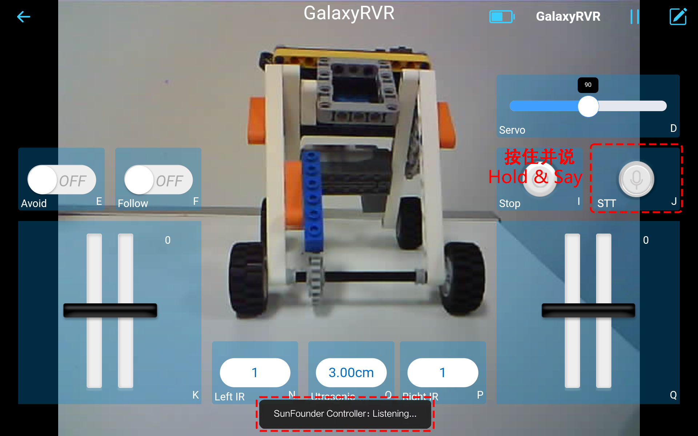

.. note::

    ¡Hola! Bienvenido a la comunidad de entusiastas de SunFounder Raspberry Pi, Arduino y ESP32 en Facebook. Sumérgete en el mundo de Raspberry Pi, Arduino y ESP32 junto a otros apasionados.

    **¿Por qué unirte?**

    - **Soporte experto**: Resuelve problemas postventa y desafíos técnicos con la ayuda de nuestra comunidad y equipo.
    - **Aprende y comparte**: Intercambia consejos y tutoriales para mejorar tus habilidades.
    - **Avances exclusivos**: Accede anticipadamente a nuevos anuncios de productos y adelantos.
    - **Descuentos especiales**: Disfruta de descuentos exclusivos en nuestros productos más recientes.
    - **Promociones festivas y sorteos**: Participa en sorteos y promociones durante las festividades.

     👉 ¿Listo para explorar y crear con nosotros? ¡Haz clic en [|link_sf_facebook|] y únete hoy!

.. _quick_start:

Juego Rápido con la APP
=========================

¡Sumérgete directamente en tu aventura marciana! Con el código preinstalado de fábrica, puedes empezar a usar tu GalaxyRVR justo después del ensamblaje. Explora funciones como conducción en primera persona, evasión de obstáculos, modos de seguimiento y control por voz, todo a través de la aplicación SunFounder Controller. ¡Comienza tu viaje hoy!

.. raw:: html
    
    <video width="600" loop autoplay muted>
        <source src="_static/video/play_mode.mp4" type="video/mp4">
        Your browser does not support the video tag.
    </video>

.. note::  

    Si tu placa R3 tiene otro código cargado y deseas controlar el GalaxyRVR mediante la app, sigue los pasos en :ref:`upload_galaxy_code`.

Guía Rápida
---------------------

#. Encendamos el GalaxyRVR.

   * La primera vez que uses tu GalaxyRVR, se recomienda que conectes un cable USB Tipo-C para cargar completamente la batería. Luego, enciende el dispositivo.
    
     .. raw:: html

        <video width="600" loop autoplay muted>
            <source src="_static/video/play_start.mp4" type="video/mp4">
            Your browser does not support the video tag.
        </video>

   * Para activar la ESP32 CAM, mueve el interruptor de modo a la posición **Run** y presiona el botón **reset** para reiniciar la placa R3. Luego, observarás una luz cian parpadeando en la tira inferior.

     .. raw:: html

        <video width="600" loop autoplay muted>
            <source src="_static/video/play_reset.mp4" type="video/mp4">
            Your browser does not support the video tag.
        </video>

#. Instala `SunFounder Controller <https://docs.sunfounder.com/projects/sf-controller/en/latest/>`_ desde la **APP Store (iOS)** o **Google Play (Android)**.

#. Conéctate a la red ``GalaxyRVR``.

   Para una comunicación óptima entre tu dispositivo móvil y el Rover, necesitarás conectarlos a la misma red de área local (LAN) proporcionada por GalaxyRVR.

   * Encuentra ``GalaxyRVR`` en la lista de redes disponibles en tu dispositivo móvil (tableta o smartphone), introduce la contraseña ``12345678`` y conéctate.

     .. note::

        * La conexión actual es al punto de acceso del GalaxyRVR, por lo que no hay acceso a internet. Si se te solicita cambiar de red, elige "Permanecer conectado".
        * :ref:`ap_to_sta`

     .. image:: img/app/camera_lan.png
        :width: 500

#. Configura un controlador.

   * Para crear un controlador en SunFounder Controller, toca el icono **+**.

     .. image:: img/app/app1.png

   * Hay controladores preconfigurados disponibles para algunos productos; aquí elegimos **GalaxyRVR**. Dale un nombre o simplemente toca **Confirmar**.

     .. image:: img/app/play_preset.jpg
    
   * Una vez dentro, la app buscará automáticamente el GalaxyRVR. Después de un momento, verás un mensaje diciendo "Conectado exitosamente".

     .. image:: img/app/auto_connect.jpg

     .. note::

       * Si no está conectado, confirma que tu Wi-Fi esté conectado a ``GalaxyRVR``.
       * También puedes tocar el botón |app_connect| para conectarte manualmente. Después de un breve tiempo, debería aparecer ``GalaxyRVR(IP)``. Toca sobre él para establecer la conexión.
     
       .. image:: img/app/camera_connect.png
           :width: 300
           :align: center

   * Ahora, toca el botón |app_run| para habilitar la vista de video en vivo de la cámara y controlar el rover usando los widgets proporcionados.

     .. image:: img/app/play_run_view.jpg

#. Exploremos ahora las funciones de cada widget:

   * **Servo(D)**: Controla el mecanismo de inclinación de la cámara del Rover, permitiéndote observar un rango más amplio.
   * :ref:`app_avoid`: Cambia el Rover al modo de evasión de obstáculos. Es posible que se requiera ajustar manualmente las distancias de detección establecidas de fábrica.
   * :ref:`app_follow`: Activa el modo de seguimiento en el Rover. También puede necesitar ajustes manuales.
   * **Stop(I)**: Detiene inmediatamente todos los movimientos del Rover.
   * :ref:`app_speech_control`: Presiona este widget para iniciar el reconocimiento de voz y hacer que el Rover realice acciones correspondientes.
   * **HeadLamp(M)**: Enciende/apaga el LED en la ESP32 CAM.
   * **Throttle Widgets on K and Q**: El widget de aceleración en el área K controla los motores izquierdos del Rover, mientras que el de la zona Q controla los motores derechos. Coordinar ambos widgets permite que el GalaxyRVR se mueva en cualquier dirección.
   * **Left IR(N)**: Muestra las lecturas del módulo de evasión de obstáculos izquierdo.
   * **Ultrasonic(O)**: Indica la distancia medida por el módulo ultrasónico.
   * **Right IR(P)**: Muestra las lecturas del módulo de evasión de obstáculos derecho.

.. _app_avoid:

Evitar(E)
------------------------

Toca el widget **Evitar(E)** para activar el modo de evasión de obstáculos.

Antes de habilitar este modo, es posible que necesites ajustar los rangos de detección de los sensores según tu entorno actual, ya que los ajustes de fábrica pueden no ser ideales para todas las situaciones.

Si el rango de detección de los dos módulos infrarrojos es demasiado corto, el Rover podría chocar con obstáculos. Por el contrario, si el rango es demasiado largo, el Rover podría desviarse demasiado de un obstáculo, interrumpiendo su navegación.

Aquí tienes cómo ajustar las configuraciones:

#. Comienza ajustando el módulo de evasión de obstáculos derecho. Durante el transporte, las colisiones pueden causar que el transmisor y el receptor en el módulo infrarrojo se inclinen. Por lo tanto, debes enderezarlos manualmente.

   .. raw:: html

        <video width="600" loop autoplay muted>
            <source src="_static/video/ir_adjust1.mp4" type="video/mp4">
            Your browser does not support the video tag.
        </video>

#. Coloca un obstáculo a unos 20 cm directamente frente al módulo derecho. La caja en la que vino nuestro kit Rover es una buena opción. Ahora, gira el potenciómetro en el módulo hasta que la luz indicadora encienda. Luego, mueve el obstáculo hacia adelante y hacia atrás para verificar si la luz indicadora se enciende a la distancia deseada. Si la luz no se enciende a la distancia correcta o si permanece encendida, ajusta el otro potenciómetro.

   .. raw:: html

        <video width="600" loop autoplay muted>
            <source src="_static/video/ir_adjust2.mp4" type="video/mp4">
            Your browser does not support the video tag.
        </video>

#. Repite el mismo proceso para el otro módulo.

.. _app_follow:

Seguir(F)
------------

Cuando estés listo para activar el modo de seguimiento, simplemente toca el widget **Seguir(F)**. Si no ajustaste previamente la distancia de detección de los módulos de evasión de obstáculos, sigue los pasos en :ref:`app_avoid`.

Una vez en el modo de seguimiento, el GalaxyRVR se moverá hacia un objeto frente a él o girará a la izquierda o derecha para seguir el movimiento del objeto.

.. _app_speech_control:

STT(J)
-------------------

STT significa "Speech to Text" (Voz a Texto). La aplicación SunFounder Controller se integra con el motor de reconocimiento de voz de tu dispositivo móvil. Al tocar y mantener presionado el widget **STT(J)** en el SunFounder Controller y hablar a tu dispositivo móvil,

Este capturará tu voz, la convertirá en texto y la enviará al GalaxyRVR. Si este texto coincide con los comandos preestablecidos en tu código, el Rover ejecutará las acciones correspondientes.

Los siguientes son los comandos actualmente preestablecidos en el código. Di cualquiera de estos comandos y observa cómo responde el GalaxyRVR.

* ``stop``: Detiene todos los movimientos del Rover.
* ``forward``: Hace que el Rover avance.
* ``backward``: Hace que el Rover retroceda.
* ``left``: Hace que el Rover gire a la izquierda.
* ``right``: Hace que el Rover gire a la derecha.

.. note::

    La función STT (Speech to Text) requiere una conexión a internet y servicios de Google en dispositivos Android. Sin embargo, esto no funciona con el modo AP (Punto de Acceso) preconfigurado en el GalaxyRVR. 
    
    En el modo AP, el GalaxyRVR crea una red Wi-Fi local a la que tu dispositivo móvil puede conectarse, pero no proporciona acceso a internet.
    
    Para usar la función STT en Android, cambia el código del Rover de AP a STA como se describe en :ref:`stt_android`.

.. note::

    Los dispositivos iOS, que utilizan un motor de reconocimiento de voz offline, funcionan bien en ambos modos, AP y STA.
