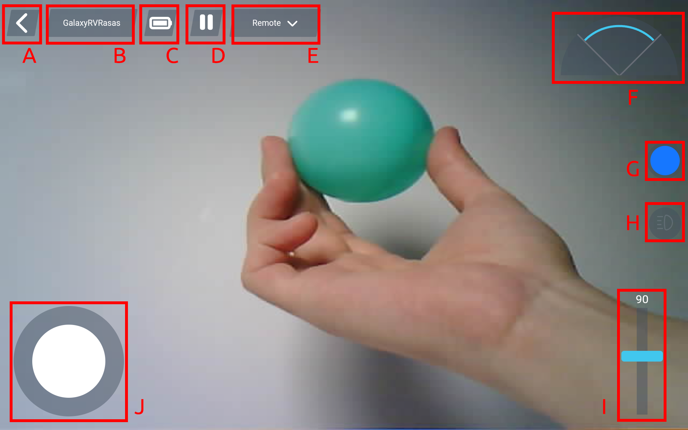
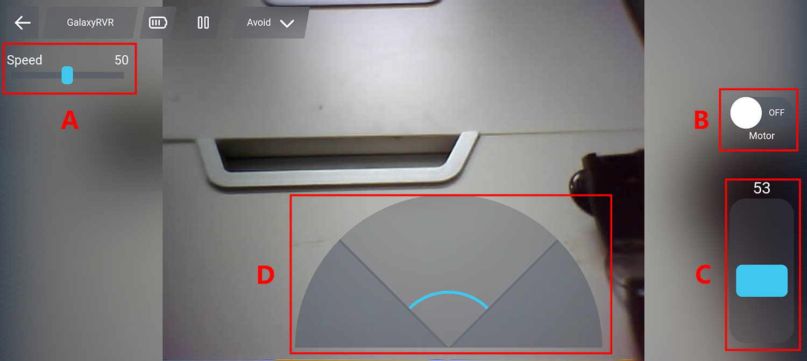
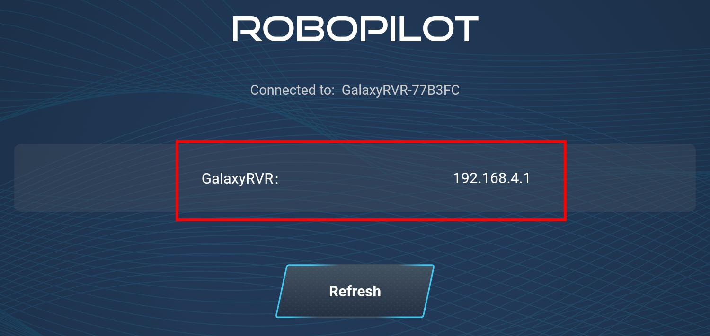

.. note::

    Hello, welcome to the SunFounder Raspberry Pi & Arduino & ESP32 Enthusiasts Community on Facebook! Dive deeper into Raspberry Pi, Arduino, and ESP32 with fellow enthusiasts.

    **Why Join?**

    - **Expert Support**: Solve post-sale issues and technical challenges with help from our community and team.
    - **Learn & Share**: Exchange tips and tutorials to enhance your skills.
    - **Exclusive Previews**: Get early access to new product announcements and sneak peeks.
    - **Special Discounts**: Enjoy exclusive discounts on our newest products.
    - **Festive Promotions and Giveaways**: Take part in giveaways and holiday promotions.

    👉 Ready to explore and create with us? Click [|link_sf_facebook|] and join today!

Quick Play with APP
=========================

Ready to start your Mars adventure?  
With the RoboPilot App’s quick-start feature, you can begin exploring as soon as your GalaxyRVR is assembled.

With RoboPilot, you can:

- Drive the rover from a first-person perspective  
- Switch between three control modes: **Remote**, **Avoid**, and **Follow**  
  

.. note::

    * The GalaxyRVR’s R3 board comes with firmware that supports the RoboPilot App and Mammoth Coding.
    * If you have overwritten the firmware and need to restore communication, follow :ref:`update_r3_firmware`.

Quick Guide
---------------------

#. Before using the GalaxyRVR for the first time, fully charge the battery with the supplied Type-C USB cable. After charging, turn the power on.
    
   .. raw:: html

        <video width="600" loop autoplay muted>
            <source src="../_static/video/play_start.mp4" type="video/mp4">
            Your browser does not support the video tag.
        </video>

#. To start the ESP32 CAM, switch the mode to **Run** and press the **Reset** button on the R3 board. The bottom light strip will begin flashing to indicate a successful startup.

   .. note::

      * If the bottom light strip shows a **flashing light of any color other than green**, your GalaxyRVR needs a firmware update. Please refer to :ref:`update_firmware`.

   .. raw:: html

        <video width="600" loop autoplay muted>
            <source src="../_static/video/play_reset_green.mp4" type="video/mp4">
            Your browser does not support the video tag.
        </video>
      

#. Install **RoboPilot** from **APP Store(iOS)** or **Google Play(Android)**.

#. Connect your mobile device to the GalaxyRVR's WiFi network.

   * The network name (SSID) is ``GalaxyRVR`` and the password is ``12345678``.  
   * If you see a warning stating "No Internet access," please choose the option to **"Stay connected."**

     .. image:: ../img/camera_lan.png
        :width: 500

#. Open RoboPilot. Click 'Go into' to enter the control interface.

   .. image:: img/rp1_inter.png

Remote Mode
----------------------------------------------

Upon entering the control interface, you will see the following screen.
The background shows the view captured by the GalaxyRVR's camera, with remote control widgets overlaid.

Here are the controls:

A. Back
B. Settings: Here you can change the name and password of the AP (hotspot), set up WiFi, flip the image, and disconnect.
    
   .. image:: img/rp3_setting.jpg

C. Battery level indicator
D. Pause/Run the APP
E. Mode Selection: Here you can choose between Remote Mode, Avoid Mode, and Follow Mode. The default setting is **Remote Mode**.

   .. image:: img/rp4_mode.jpg

F. Obstacle monitor: This module is divided into three areas, with the left and right sides showing the results from the obstacle modules, and the central area displaying the ultrasonic sensor's findings.
G. Color selector: Choose the lighting color for the chassis here.

   .. image:: img/rp5_color.png

H. Camera LED switch.
I. Adjust the gimbal angle, ranging from 0-130°. At 0°, it looks up at the sky.
J. Move the joystick to control the movement of GalaxyRVR. A gentle push will make the GalaxyRVR move slowly.

Avoid Mode & Follow Mode
----------------------------------------------

* **Avoid Mode**: the GalaxyRVR will move forward and avoid obstacles in its path.
* **Follow Mode**: the GalaxyRVR will move towards an object in front of it or turn left or right to follow the object's movement.

When you select **Avoid Mode** or **Follow Mode**, you'll see the interface below. The live camera view from GalaxyRVR forms the background, with control options overlaid on top.

**Interface Controls:**

A. **Speed Control** - Adjust GalaxyRVR's movement speed
B. **Motor Control** - Start or stop GalaxyRVR's movement
C. **Gimbal Control** - Adjust camera angle from 0° (facing sky) to 130°
D. **Obstacle Monitor** - Visual feedback from sensors:

   - Left/right sections: Infrared obstacle detection
   - Center section: Ultrasonic distance measurements

**Adjusting Obstacle Detection Range**

Before using this mode, calibrate the sensor detection range to fit your environment. Factory settings may not be optimal.

- Too short: Rover may hit obstacles
- Too long: Rover may steer unnecessarily

Calibration steps:

1. **Start with right module**

   - Ensure transmitter/receiver are properly aligned
   - Straighten if bent during transport

   .. raw:: html

        <video width="600" loop autoplay muted>
            <source src="../_static/video/ir_adjust1.mp4" type="video/mp4">
        </video>

2. **Test and adjust sensitivity**

   - Place obstacle 20cm away (use Rover box)
   - Turn potentiometer until indicator lights up
   - Verify consistent activation at desired distance
   - Use second potentiometer if needed

   .. raw:: html

        <video width="600" loop autoplay muted>
            <source src="../_static/video/ir_adjust2.mp4" type="video/mp4">
        </video>

3. **Repeat for left module**

Re-connect
-------------------------------

If your network fails or disconnects, you will be directed to this page.

At this point, please reset your network settings, then click on the IP corresponding to your GalaxyRVR to reconnect.
