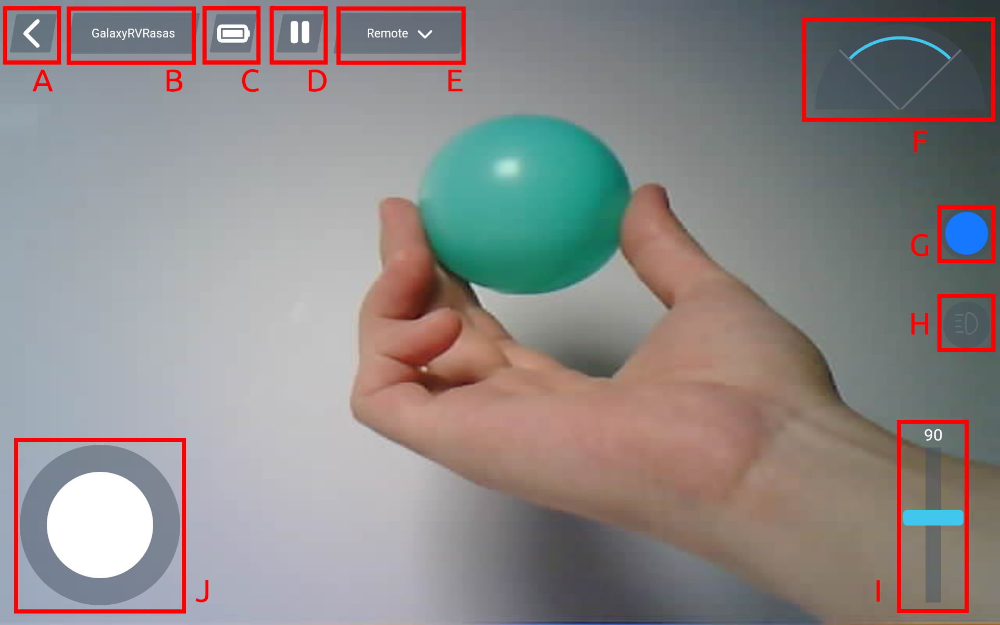
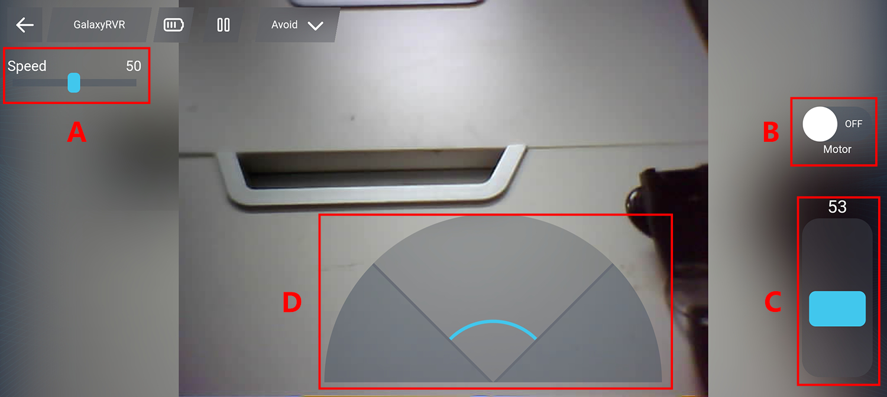
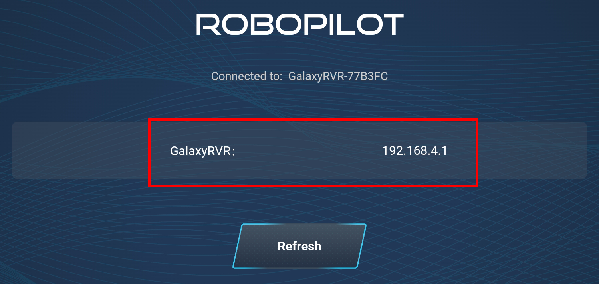

.. include:: /index.rst
   :start-after: start_hello_message
   :end-before: end_hello_message

クイックプレイ with APP
=========================

火星の冒険を始める準備はできましたか？
RoboPilot アプリのクイックスタート機能を使えば、GalaxyRVR の組み立てが完了したらすぐに探索を開始できます。

RoboPilot では、以下のことができます：

- 一人称視点でローバーを運転
- **リモート** 、 **回避** 、 **追従** の 3 つの制御モードを切り替え

.. note::

    * ファームウェアを上書きしてしまい、通信を復元する必要がある場合は、:ref:`update_r3_firmware` に従ってください。

クイックガイド
---------------------

#. GalaxyRVR を初めて使用する前に、付属の Type-C USB ケーブルでバッテリーを完全に充電してください。充電後、電源をオンにします。

   .. raw:: html

        <video width="600" loop autoplay muted>
            <source src="../_static/video/play_start.mp4" type="video/mp4">
            お使いのブラウザはこのビデオタグをサポートしていません。
        </video>

#. ESP32 CAM を起動するには、モードを **Run** に切り替え、R3 ボードの **Reset** ボタンを押します。底部のライトストリップが点滅し、起動成功を示します。

   .. note::

      * 底部のライトストリップが **緑色以外の色で点滅** している場合、GalaxyRVR のファームウェア更新が必要です。:ref:`update_firmware` を参照してください。

   .. raw:: html

        <video width="600" loop autoplay muted>
            <source src="../_static/video/play_reset_green.mp4" type="video/mp4">
            お使いのブラウザはこのビデオタグをサポートしていません。
        </video>

#. **APP Store(iOS)** または **Google Play(Android)** から **RoboPilot** をインストールします。

#. モバイルデバイスを GalaxyRVR の WiFi ネットワークに接続します。

   * ネットワーク名（SSID）は ``GalaxyRVR`` 、パスワードは ``12345678`` です。
   * 「インターネットなし」という警告が表示された場合は、 **「接続したままにする」** を選択してください。

     .. image:: ../img/camera_lan.png
        :width: 500

#. RoboPilot を開きます。「Go into」をクリックしてコントロールインターフェースに入ります。

   .. image:: img/rp1_inter.png

リモートモード
----------------------------------------------

コントロールインターフェースに入ると、以下の画面が表示されます。
背景には GalaxyRVR のカメラで撮影された映像が表示され、リモートコントロールウィジェットが重なっています。

以下がコントロールです：

A. 戻る
B. 設定：ここで AP（ホットスポット）の名前とパスワードを変更したり、WiFi の設定、画像の反転、切断を行うことができます。

   .. image:: img/rp3_setting.jpg

C. バッテリー残量インジケーター
D. アプリの一時停止/実行
E. モード選択：ここでリモートモード、回避モード、追従モードを選択できます。デフォルトは **リモートモード** です。

   .. image:: img/rp4_mode.jpg

F. 障害物モニター：このモジュールは 3 つのエリアに分かれており、左右のエリアは障害物モジュールの結果を表示し、中央のエリアは超音波センサーの検出結果を表示します。
G. カラーセレクター：ここでシャーシの照明色を選択します。

   .. image:: img/rp5_color.png

H. カメラ LED スイッチ
I. ジンバル角度の調整（0〜130 °）。0 ° では空を見上げます。
J. ジョイスティックを動かして GalaxyRVR の動きを制御します。軽く押すと GalaxyRVR はゆっくり動きます。

回避モード & 追従モード
----------------------------------------------

* **回避モード** ：GalaxyRVR は前方に進み、進路上の障害物を回避します。
* **追従モード** ：GalaxyRVR は前方の物体に向かって移動するか、左右に旋回して物体の動きに追従します。

**回避モード** または ** 追従モード** を選択すると、以下のインターフェースが表示されます。GalaxyRVR のライブカメラ映像が背景となり、その上にコントロールオプションが重なっています。

**インターフェースコントロール：**

A. **速度制御** - GalaxyRVR の移動速度を調整します
B. **モーター制御** - GalaxyRVR の動きを開始または停止します
C. **ジンバル制御** - カメラ角度を 0 ° （空向き）から 130 ° まで調整します
D. **障害物モニター** - センサーからの視覚的フィードバック：

   - 左/右セクション：赤外線障害物検出
   - 中央セクション：超音波距離測定

**障害物検出範囲の調整**

このモードを使用する前に、センサーの検出範囲を環境に合わせて調整してください。工場出荷時の設定は最適ではない場合があります。

- 短すぎる：ローバーが障害物に衝突する可能性があります
- 長すぎる：ローバーが不必要にステアリング操作を行う可能性があります

調整手順：

1. **右モジュールから開始**

   - 送信機と受信機が正しく位置合わせされていることを確認します
   - 輸送中に曲がった場合はまっすぐにします

   .. raw:: html

        <video width="600" loop autoplay muted>
            <source src="../_static/video/ir_adjust1.mp4" type="video/mp4">
        </video>

2. **感度をテストして調整**

   - 障害物を 20cm 離して配置します（ローバーの箱を使用）
   - インジケーターが点灯するまでポテンショメーターを回します
   - 希望の距離で一貫して作動することを確認します
   - 必要に応じて 2 つ目のポテンショメーターを使用します

   .. raw:: html

        <video width="600" loop autoplay muted>
            <source src="../_static/video/ir_adjust2.mp4" type="video/mp4">
        </video>

3. **左モジュールでも繰り返します**

再接続
-------------------------------

ネットワークが切断または失敗した場合、このページに移動します。

この場合、ネットワーク設定をリセットし、GalaxyRVR に対応する IP をクリックして再接続してください。
