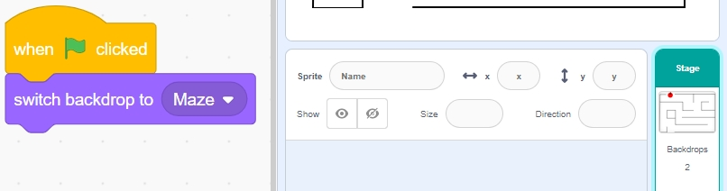


趣味4 吃苹果
===========================

在这个项目中，我们使用红外避障模块引导甲虫精灵到达苹果处。

点击绿旗后，快速将手扫过左侧避障模块（遮挡后迅速将手从模块前移开），启动甲虫的旋转。当它对准方向后，再次挥手扫过模块，让甲虫向前移动，确保它避开地图上的黑线。如果需要调整或转弯，再次挥手扫过模块，将甲虫旋转到所需角度。重复这些步骤，直到甲虫精灵到达苹果处。

.. raw:: html

   <video loop autoplay muted style = "max-width:70%">
      <source src="../../_static/video/sc_eat_apple.mp4" type="video/mp4">
      您的浏览器不支持此视频标签。
   </video>

以下是实现该项目的步骤。建议先按照这些步骤操作，熟悉后可以根据需要修改效果。

1. 绘制 **迷宫** 背景
-------------------------------------

首先，我们将绘制一个带有红苹果的地图背景。

* 首先，选择一个空白背景。

  .. image:: img/apple_click_backdrop.png

* 点击 **背景** 开始绘制地图背景。首先，将背景命名为 **Maze** 。

  .. image:: img/apple_open_backdrop.png

* 使用 **线段** 工具，设置颜色为黑色，宽度为4，开始绘制地图。你可以根据自己的想法设计地图，不必和我的一样。

  .. image:: img/apple_paint_bk_maze2.png
    :width: 90%

* 现在，画一个苹果。使用 **圆形** 工具，画一个红色椭圆或圆形，没有轮廓线。

  .. image:: img/apple_paint_bk_maze3.png

  .. note::

    您可以点击 **轮廓** 窗口，然后使用 ** 移除** 工具来移除轮廓线。

    .. image:: img/apple_paint_bk_maze4.png

* 选择 **画笔** 工具，选择合适的颜色和宽度，完成苹果的绘制。

  .. image:: img/apple_paint_bk_maze5.png

2. 绘制 **胜利** 背景
---------------------------------

现在开始绘制；参考以下步骤，或根据自己的创意绘制背景，确保它代表胜利。

* 点击底部添加新背景的按钮，选择 **绘制** ，并将此背景命名为 **Win** 。

  .. image:: img/apple_paint_bk_win.png

* 使用 **圆形** 工具，画一个红色椭圆，没有轮廓线。

  .. image:: img/apple_paint_bk_win2.png
    :width: 90%

* 然后，使用 **文本** 工具写上 "WIN!"。设置字体颜色为黑色，调整文本的大小和位置。

  .. image:: img/apple_paint_bk_cus2.png
    :width: 90%

3. 为 **迷宫** 背景编写脚本
--------------------------------------

确保每次游戏开始时背景都切换到 **Maze** 。

4. 选择 **甲虫** 精灵
-----------------------------------------

* 删除默认精灵，选择 **Beetle** 精灵。

  .. image:: img/apple_choose_sprite.png

* 将 **Beetle** 精灵放在 ** 迷宫** 背景的入口处，记下此位置的 x、y 坐标值，并将精灵大小调整为 40%。

  .. image:: img/apple_place_sprite.png

5. 为 **甲虫** 精灵编写脚本
-----------------------------------------------

现在，为 **Beetle** 精灵编写脚本，使其在左侧避障模块的控制下向前移动和改变方向。

* 当绿旗被点击时，将 **Beetle** 的角度设置为 90，位置设置为 (-124, -113)，或使用你放置的坐标值。

  .. image:: img/apple_point_in.png
    :width: 90%

* 创建变量 **flag** 并将其初始值设置为 -1。

  .. image:: img/apple_vable_flag.png

接下来，在 [重复执行] 积木块内，使用四个 [如果] 积木块来管理不同的场景。

* 如果左侧红外被遮挡，使用 [`mod <https://en.scratch-wiki.info/wiki/Boolean_Block>`_] 积木块在 0 和 1 之间切换变量 **flag** （本次按下为 0，下一次为 1）。

   .. image:: img/apple_read_ir.png

* 如果 flag 为 0（左侧红外被遮挡），让 **Beetle** 精灵顺时针旋转。如果 flag 为 1（左侧红外再次被遮挡）， **Beetle** 向前移动。否则，继续顺时针旋转。

  .. image:: img/apple_read_flag.png

* 如果 **Beetle** 精灵碰到黑色（** 迷宫** 背景上的黑线），游戏结束，脚本停止运行。

  .. image:: img/apple_touch_black1.png

  .. note::

    点击 [碰到颜色] 积木块中的颜色区域，选择取色工具拾取舞台上黑线的颜色。如果随意选择一种黑色，此 [碰到颜色] 积木块将无法正常工作。

    .. image:: img/apple_touch_black.png

* 如果甲虫碰到红色（也使用取色工具拾取苹果的红色），背景切换到 **Win** ，表示游戏成功，脚本停止运行。

  .. image:: img/apple_touch_red.png

编程完成，现在你可以点击绿旗运行脚本，看看是否达到了预期效果。

  .. raw:: html

    <video loop autoplay muted style = "max-width:70%">
        <source src="../../_static/video/sc_eat_apple.mp4"  type="video/mp4">
        您的浏览器不支持此视频标签。
    </video>
