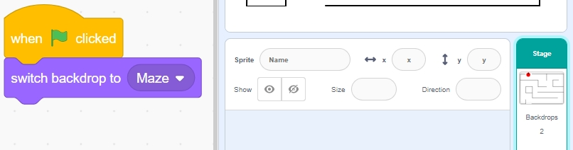

.. include:: /index.rst
   :start-after: start_hello_message
   :end-before: end_hello_message

Projet ludique 4 : Manger la pomme
==================================

Dans ce projet, nous utilisons un module infrarouge anti-obstacle pour guider le sprite Beetle vers une pomme.

Après avoir cliqué sur le drapeau vert, passez rapidement votre main devant le module anti-obstacle gauche (bloquez et retirez rapidement votre main de devant le module) pour lancer la rotation du Beetle. Une fois qu'il est bien aligné, passez à nouveau votre main devant le module pour faire avancer le Beetle, en veillant à ce qu'il évite les lignes noires sur la carte. Si des ajustements ou des virages sont nécessaires, passez à nouveau votre main devant le module pour faire pivoter le Beetle à l'angle souhaité. Répétez ces étapes jusqu'à ce que le sprite Beetle atteigne la pomme.

.. raw:: html

   <video loop autoplay muted style = "max-width:70%">
      <source src="../../_static/video/sc_eat_apple.mp4" type="video/mp4">
      Votre navigateur ne prend pas en charge la balise vidéo.
   </video>

Voici les étapes pour réaliser ce projet. Il est conseillé de les suivre dans l'ordre, et une fois familiarisé, vous pourrez modifier les effets à votre guise.

1. Dessiner l'arrière-plan **Maze**
-----------------------------------

Ici, nous allons dessiner un arrière-plan de carte avec une pomme rouge dessus.

* D'abord, sélectionnez un arrière-plan vierge.

  .. image:: img/apple_click_backdrop.png

* Cliquez sur **Arrière-plans** pour commencer à dessiner l'arrière-plan de la carte. Renommez d'abord l'arrière-plan en **Maze**.

  .. image:: img/apple_open_backdrop.png

* Utilisez l'outil **Ligne**, définissez la couleur sur noir, la largeur sur 4, et commencez à dessiner la carte. Vous pouvez concevoir votre carte selon vos idées ; elle n'a pas besoin d'être comme la mienne.

  .. image:: img/apple_paint_bk_maze2.png
    :width: 90%

* Maintenant, dessinez une pomme. Avec l'outil **Cercle**, dessinez une ellipse ou un cercle en rouge sans contour.

  .. image:: img/apple_paint_bk_maze3.png

  .. note::

    Vous pouvez supprimer le contour en cliquant sur la fenêtre **Contour**, puis en utilisant l'outil **Supprimer**.

    .. image:: img/apple_paint_bk_maze4.png

* Sélectionnez l'outil **Pinceau** et choisissez une couleur et une largeur pour finir de dessiner la pomme.

  .. image:: img/apple_paint_bk_maze5.png

2. Dessiner l'arrière-plan **Win**
----------------------------------

Maintenant, commencez à dessiner ; référez-vous aux étapes ci-dessous, ou dessinez votre arrière-plan selon votre créativité, en veillant à ce qu'il représente une victoire.

* Cliquez sur le bouton pour ajouter un nouvel arrière-plan en bas, sélectionnez **Dessiner** et nommez cet arrière-plan **Win**.

  .. image:: img/apple_paint_bk_win.png

* Avec l'outil **Cercle**, dessinez une ellipse en rouge sans contour.

  .. image:: img/apple_paint_bk_win2.png
    :width: 90%

* Ensuite, utilisez l'outil **Texte** pour écrire « GAGNÉ ! ». Définissez la couleur de police sur noir et ajustez la taille et la position du texte.

  .. image:: img/apple_paint_bk_cus2.png
    :width: 90%

3. Programmer l'arrière-plan **Maze**
-------------------------------------

Assurez-vous que l'arrière-plan passe à **Maze** à chaque démarrage du jeu.

4. Sélectionner le sprite **Beetle**
------------------------------------

* Supprimez le sprite par défaut et sélectionnez le sprite **Beetle**.

  .. image:: img/apple_choose_sprite.png

* Placez le sprite **Beetle** à l'entrée de l'arrière-plan **Maze**, notez les valeurs de coordonnées x, y à ce point, et redimensionnez le sprite à 40 %.

  .. image:: img/apple_place_sprite.png

5. Programmer le sprite **Beetle**
----------------------------------

Maintenant, écrivez un script pour le sprite **Beetle** afin qu'il avance et change de direction sous le contrôle du module anti-obstacle gauche.

* Lorsque le drapeau vert est cliqué, définissez l'angle du **Beetle** à 90 et la position à (-124, -113), ou utilisez les valeurs de coordonnées de votre placement.

  .. image:: img/apple_point_in.png
    :width: 90%

* Créez la variable **flag** et définissez sa valeur initiale à -1.

  .. image:: img/apple_vable_flag.png

Ensuite, dans le bloc [forever], utilisez quatre blocs [if] pour gérer différents scénarios.

* Si le capteur infrarouge gauche est bloqué, utilisez le bloc ``mod`` pour basculer la variable **flag** entre 0 et 1 (en alternant entre 0 pour cette pression et 1 pour la suivante).

   .. image:: img/apple_read_ir.png

* Si flag est 0 (infrarouge gauche bloqué), faites tourner le sprite **Beetle** dans le sens des aiguilles d'une montre. Si flag est 1 (infrarouge gauche bloqué à nouveau), le **Beetle** avance. Sinon, il continue de tourner dans le sens des aiguilles d'une montre.

  .. image:: img/apple_read_flag.png

* Si le sprite **Beetle** touche du noir (la ligne noire de l'arrière-plan **Maze**), le jeu se termine et le script s'arrête.

  .. image:: img/apple_touch_black1.png

  .. note::

    Cliquez sur la zone de couleur dans le bloc [Touch color] et sélectionnez l'outil pipette pour prélever la couleur de la ligne noire sur la scène. Si vous choisissez un noir aléatoire, ce bloc [Touch color] ne fonctionnera pas correctement.

    .. image:: img/apple_touch_black.png

* Si le Beetle touche du rouge (utilisez également l'outil pipette pour prélever la couleur rouge de la pomme), l'arrière-plan passe à **Win**, indiquant que le jeu est réussi, et le script s'arrête.

  .. image:: img/apple_touch_red.png

Programmation terminée, vous pouvez maintenant cliquer sur le drapeau vert pour exécuter le script et voir s'il produit l'effet souhaité.

  .. raw:: html

    <video loop autoplay muted style = "max-width:70%">
        <source src="../../_static/video/sc_eat_apple.mp4"  type="video/mp4">
        Votre navigateur ne prend pas en charge la balise vidéo.
    </video>
