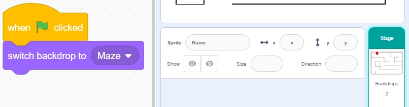

.. note:: 

    你好，欢迎加入 SunFounder 树莓派、Arduino 和 ESP32 爱好者社区！与其他爱好者一起，深入探索树莓派、Arduino 和 ESP32。

    **为什么加入？**

    - **专家支持**：通过社区和团队的帮助解决售后问题和技术挑战。
    - **学习与分享**：交流技巧和教程，提升你的技能。
    - **独家预览**：提前体验新产品发布和独家内容。
    - **专属折扣**：享受最新产品的专属优惠。
    - **节庆促销与赠品**：参与节日促销和赠品活动。

    👉 准备好与我们一起探索和创造了吗？点击 [|link_sf_facebook|] 即刻加入！

扩展项目 4：吃苹果
===========================

在这个项目中，我们使用红外避障模块来引导甲虫角色到达苹果位置。

点击绿色旗帜后，迅速把手放在左侧红外避障模块上（遮挡并快速移开手）以启动甲虫旋转。等甲虫对准目标后，再次快速挥手通过模块让甲虫前进，确保它避开地图上的黑线。如果需要调整或转向，可以再次挥手触发模块，旋转甲虫到所需角度。重复这些步骤，直到甲虫角色到达苹果位置。

.. raw:: html

   <video loop autoplay muted style = "max-width:70%">
      <source src="../../_static/video/sc_eat_apple.mp4" type="video/mp4">
      Your browser does not support the video tag.
   </video>

以下是实现项目的步骤，建议先按照这些步骤操作，熟悉后你可以自由修改效果。

1. 绘制 **迷宫** 背景
-------------------------------------

在这里，我们将绘制一个有红苹果的迷宫背景。

* 首先，选择一个空白背景。

  .. image:: img/apple_click_backdrop.png

* 点击 **背景** 开始绘制迷宫背景，首先将背景命名为 **Maze**。

  .. image:: img/apple_open_backdrop.png

* 使用 **线条** 工具，设置颜色为黑色，宽度为 4，开始绘制迷宫地图。你可以根据自己的想法设计地图，完全不必照着我的样式。

  .. image:: img/apple_paint_bk_maze2.png
    :width: 90%

* 接着，绘制一个苹果。使用 **圆形** 工具，绘制一个红色的椭圆或圆形，去掉轮廓。

  .. image:: img/apple_paint_bk_maze3.png

  .. note::

    你可以通过点击 **轮廓** 窗口并使用 **删除** 工具来去除轮廓。

    .. image:: img/apple_paint_bk_maze4.png

* 选择 **画笔** 工具，设置合适的颜色和宽度，完成苹果的绘制。

  .. image:: img/apple_paint_bk_maze5.png

2. 绘制 **胜利** 背景
---------------------------------

现在开始绘制胜利背景，可以参考以下步骤，或者根据你的创意来绘制，确保它表现出游戏胜利的氛围。

* 点击底部的按钮添加新背景，选择 **绘画**，并将此背景命名为 **Win**。

  .. image:: img/apple_paint_bk_win.png

* 使用 **圆形** 工具，绘制一个红色的椭圆，去掉轮廓。

  .. image:: img/apple_paint_bk_win2.png
    :width: 90%

* 然后，使用 **文本** 工具输入 "WIN!"，将字体颜色设置为黑色，并调整文本的大小和位置。

  .. image:: img/apple_paint_bk_cus2.png
    :width: 90%

3. 为 **迷宫** 背景编写脚本
--------------------------------------

确保每次游戏开始时，背景都切换到 **Maze** 背景。

4. 选择 **甲虫** 角色
-----------------------------------------

* 删除默认角色，选择 **甲虫** 角色。

  .. image:: img/apple_choose_sprite.png

* 将 **甲虫** 角色放置在 **迷宫** 背景的入口处，记下此时的 x 和 y 坐标，并将角色缩放至 40%。

  .. image:: img/apple_place_sprite.png

5. 为 **甲虫** 角色编写脚本
-----------------------------------------------

现在，编写一个脚本，让 **甲虫** 角色在左侧红外避障模块的控制下前进并改变方向。

* 点击绿色旗帜时，将 **甲虫** 的角度设为 90，位置设为 (-124, -113)，或者使用你放置时的坐标值。

  .. image:: img/apple_point_in.png
    :width: 90%

* 创建变量 **flag**，并将其初始值设置为 -1。

  .. image:: img/apple_vable_flag.png

接下来，在 [永远] 块中，使用四个 [如果] 块来处理不同的情况。

* 如果左侧红外被遮挡，使用 [`mod <https://en.scratch-wiki.info/wiki/Boolean_Block>`_]  块来在 0 和 1 之间切换变量  **flag** （每次遮挡后，flag 值交替为 0 或 1）。

   .. image:: img/apple_read_ir.png

* 如果 flag 为 0（左侧红外被遮挡），让 **甲虫** 角色顺时针旋转；如果 flag 为 1（左侧红外再次被遮挡），则 **甲虫** 前进。否则，继续顺时针旋转。

  .. image:: img/apple_read_flag.png

* 如果 **甲虫** 角色接触到黑色（迷宫背景上的黑线），游戏结束，脚本停止运行。

  .. image:: img/apple_touch_black1.png

  .. note::

    点击 [触摸颜色] 块中的颜色区域，使用吸管工具选取舞台上黑线的颜色。如果随便选择黑色，这个 [触摸颜色] 块就无法正常工作。

    .. image:: img/apple_touch_black.png

* 如果 **甲虫** 接触到红色（同样使用吸管工具选取苹果的红色），则背景切换到 **Win**，表示游戏成功，脚本停止运行。

  .. image:: img/apple_touch_red.png

编程完成后，你可以点击绿色旗帜运行脚本，看看是否达到了预期效果。

  .. raw:: html

    <video loop autoplay muted style = "max-width:70%">
        <source src="../_static/video/sc_eat_apple.mp4"  type="video/mp4">
        Your browser does not support the video tag.
    </video>