.. note::

    Hello, welcome to the SunFounder Raspberry Pi & Arduino & ESP32 Enthusiasts Community on Facebook! Dive deeper into Raspberry Pi, Arduino, and ESP32 with fellow enthusiasts.

    **Why Join?**

    - **Expert Support**: Solve post-sale issues and technical challenges with help from our community and team.
    - **Learn & Share**: Exchange tips and tutorials to enhance your skills.
    - **Exclusive Previews**: Get early access to new product announcements and sneak peeks.
    - **Special Discounts**: Enjoy exclusive discounts on our newest products.
    - **Festive Promotions and Giveaways**: Take part in giveaways and holiday promotions.

    👉 Ready to explore and create with us? Click [|link_sf_facebook|] and join today!

Lesson 10 Lighting the Way with RGB LED Strips
===============================================================

In our journey so far, we've transformed our Mars Rover into a smart explorer, capable of skillfully maneuvering around obstacles. It's become quite adept at navigating the Mars-like terrains we've set up for it.

But, what if we could add a bit of flair to its practicality? Let's give our Rover the ability to express itself through a spectacle of colors and light. We're talking about incorporating RGB LED strips - a cool feature that would allow our Rover to illuminate its path, even in the darkest conditions.

Picture this - the Rover leaves a trail of color-coded signals, making it easier for us to understand its moves. A green glow when it's on the go, a stern red when it halts, or a flashy yellow during those swift turns. It could even light up in an array of colors just for the sheer fun of it!

Our goal in this lesson is to understand the principles of RGB LED strips, learn to control their color and brightness, and then synchronize this with the Rover's movements. By the end, our Mars Rover will be more than a machine. It'll be a luminous, color-changing entity, leading the way in the vast Martian landscape!

.. raw:: html

    <video width="600" loop autoplay muted>
        <source src="../_static/video/car_rgb.mp4" type="video/mp4">
        Your browser does not support the video tag.
    </video>

Objective
-------------

* Introduce the working principles and programming control methods of RGB LED strips.
* Utilize RGB LED strips with Mammoth Coding to achieve color control and simple lighting effects.
* Create a Mammoth Coding project to simulate light changes in a Mars environment or signal lights for Mars exploration missions.

Materials Needed
-------------------------

* RGB LED strip and controller
* Mammoth Coding APP
* Computer or tablet

Explore the Magic of Light with RGB LED Strips
-------------------------------------------------------------

Do you remember the last time you saw a rainbow? How it made the sky colorful with seven vibrant hues? How would you like to create your own rainbow, right here in our little Martian rover? Let's dive into the magic of light with RGB LED strips!

.. image:: ../img/4_rgb_strip.jpg

You might notice that our RGB LED Strip has four pins labeled as follows:

* **+5V**: This is the common "positive" end or the "anode" of the three tiny light bulbs (LEDs) inside our strip. It needs to connect to DC 5V, a kind of electric juice that powers our tiny bulbs!
* **B**: This is the "negative" end or the "cathode" of the blue LED.
* **R**: This is the "cathode" of the red LED.
* **G**: This is the "cathode" of the green LED.

.. image:: ../img/rgb_5050.jpg

Do you remember the three primary colors - Red, Blue, and Green - that we learned in our art class? Just like an artist mixes these colors on his palette to create new shades, our strip contains 4 "5050" LEDs that can mix these primary colors to create virtually any color! Each "5050" LED is like a tiny art studio that houses these three colored bulbs.

.. image:: ../img/rgb_5050_sche.png

These tiny art studios are then connected in a smart way on a flexible circuit board - kind of like a mini electric highway! The "positive" ends of all LEDs (anodes) are connected together, while the "negative" ends (cathodes) are connected to their corresponding color lanes (G to G, R to R, B to B).

.. image:: ../img/rgb_strip_sche.png

And the coolest part? With our command, all the LEDs on this strip can change their colors at once! It's like having our own light orchestra at the tip of our fingers!

Light Up the Show
------------------------------

1. Let's try lighting up the GalaxyRVR with colors! Drag out a display color block.

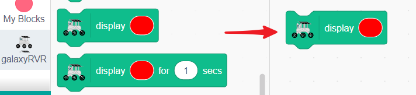

2. Choose your favorite color.

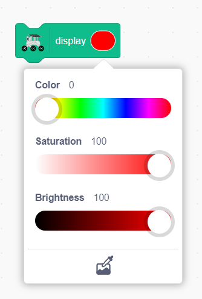

3. Click it, and you'll see the GalaxyRVR light up in the corresponding color.

**Using the Stage to Control GalaxyRVR**

Next, let's create an interactive project to get familiar with the lighting functions of GalaxyRVR. We'll click on the stage sprite to change the color of the GalaxyRVR.

1. Delete the existing sprite.

.. image:: img/6_animate_delete.png

2. Choose a Ball sprite. The reason for choosing this sprite is that it has many costumes, each corresponding to a different color.

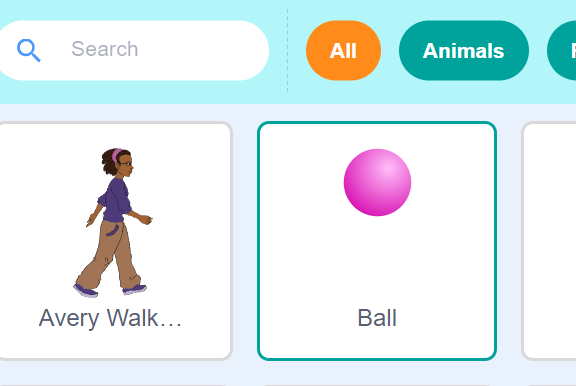

3. Drag a when this sprite clicked block, which triggers an action when the stage sprite is clicked.

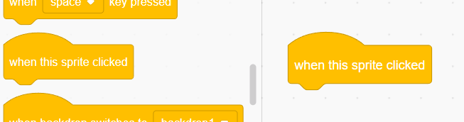

4. Drag a display block to make the GalaxyRVR light up.

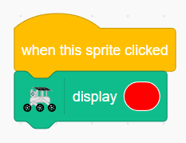

5. If you're using a small screen device, click the eye button beside it to ensure the stage preview window is on the same interface.

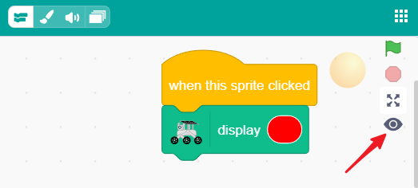

6. Click the color on the display block. At the bottom of the pop-up window, there is a color picker button. Click it.

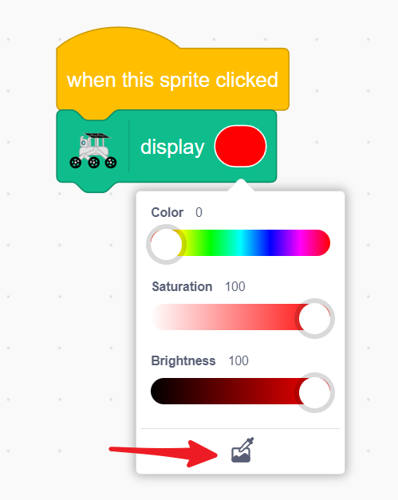

7. Hold down on the stage area. A magnifying glass will appear at your fingertip for color picking. Release it on the Ball sprite to pick its color for the display block.

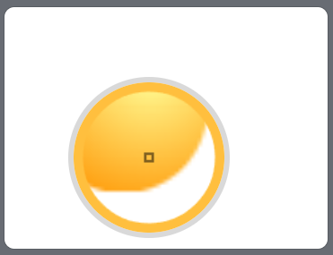

8. Long press the Ball sprite on the stage to duplicate it.

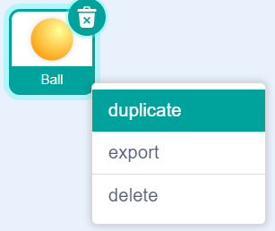

9. In the costumes interface, switch to the next color.

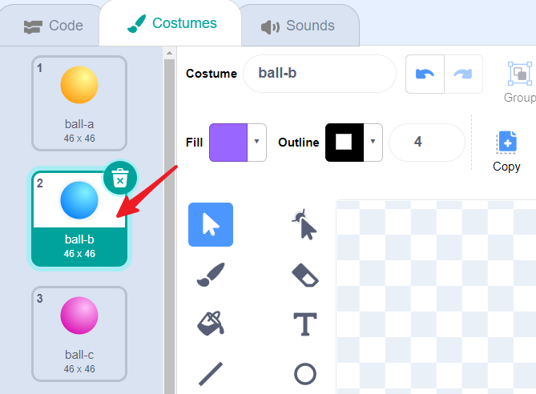

10. Return to the Code interface and pick the color to match the current sprite.

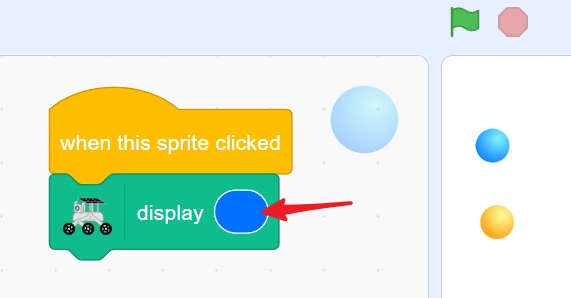

11. Repeat steps 8-10 until all five colors are set.

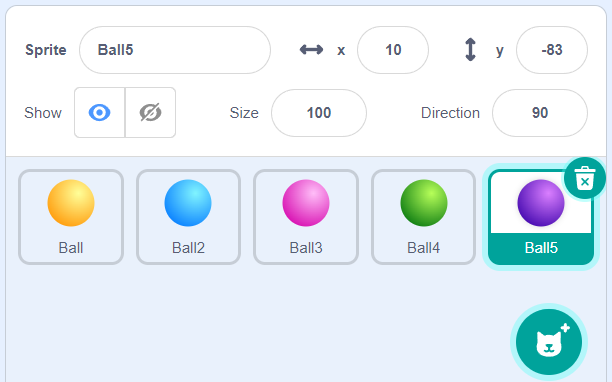

Now, you can click on the Ball sprite in the stage area to make the GalaxyRVR light up in different colors.

.. _rgb_move:

GalaxyRVR Signal Lights in Action
----------------------------------------------------------------

**Directional Indicator Lights**

Now that we know how to make the GalaxyRVR emit colors, let's combine this function with :ref:`rvr_move`.

1. Create a new project.

2. First, set up the key event blocks and move blocks for the four directions.

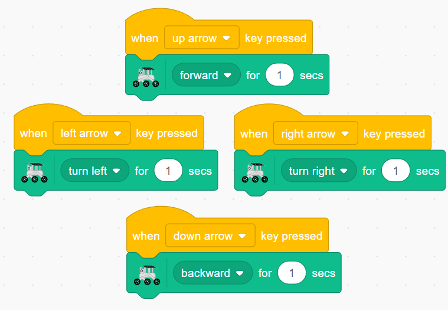

3. Add color displays to each event: green for forward.

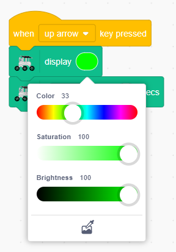

4. Yellow for turning left and right.

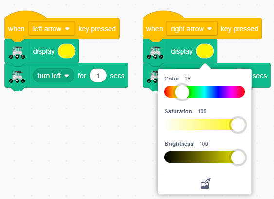

5. Red for moving backward.

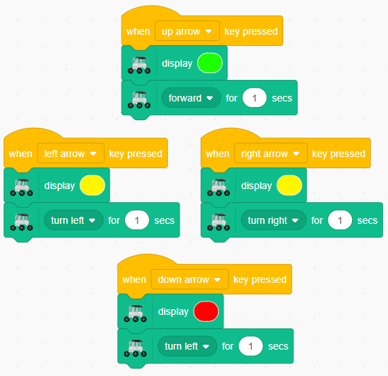

Now, when you click the direction keys in the stage area, you'll see the GalaxyRVR move and light up in the corresponding color.

**Breathing Light**

A breathing light is an effect where the light gradually brightens and dims, similar to the rhythm of breathing. Next, let's add a breathing light effect when the GalaxyRVR is stationary.

1. Create a new broadcast message named stop. This will tell your program that the GalaxyRVR is in a stopped state.

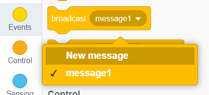

.. note:: If your sprite has many actions to perform but needs to start certain actions at specific times or under certain conditions, the broadcast block can help you manage this. This way, your sprite can execute different actions in the desired order without cluttering the code, making it clearer and easier to understand.

2. Add this broadcast after each directional key event.

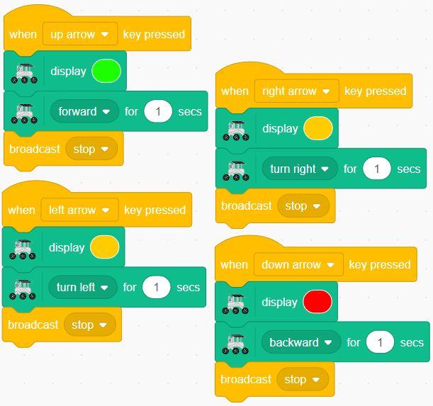

3. Drag out a when I receive [stop] block.

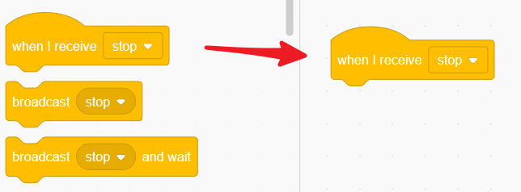

4. Set the brightness to 0%, starting our breathing light from 0 brightness.

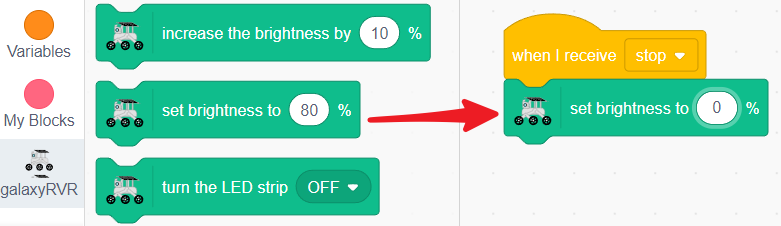

5. Use a repeat 10 block to create a gradual change in brightness. Here, we use the blue light, increasing the brightness by 10% every 0.2 seconds.

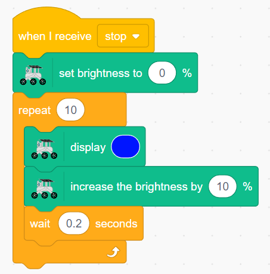

6. Follow it with a block to decrease the brightness by 10% every 0.2 seconds, completing one breathing cycle.

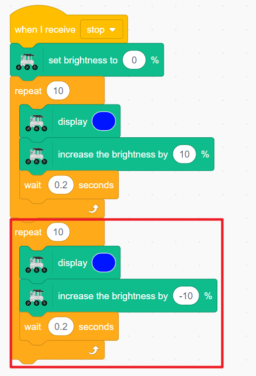

7. Broadcast stop again at the end to create a continuous breathing effect.

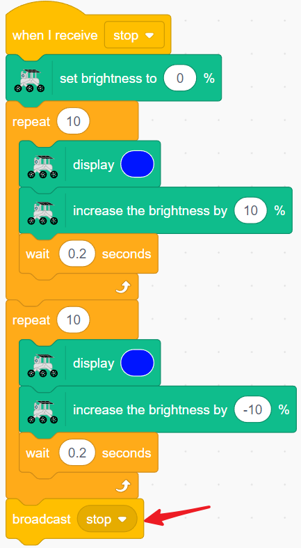

8. If you control the GalaxyRVR directly at this point, you may find the colors and brightness are out of sync. Therefore, add a stop other scripts in sprite block at the end of each key event.

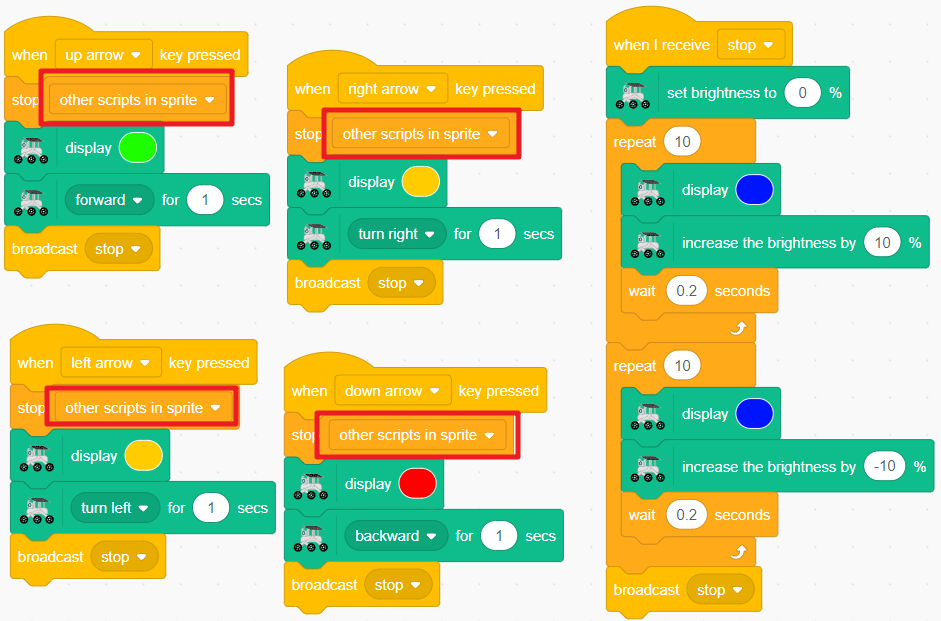

9. Since the brightness changes in the stop event, reset the light brightness in each key event.

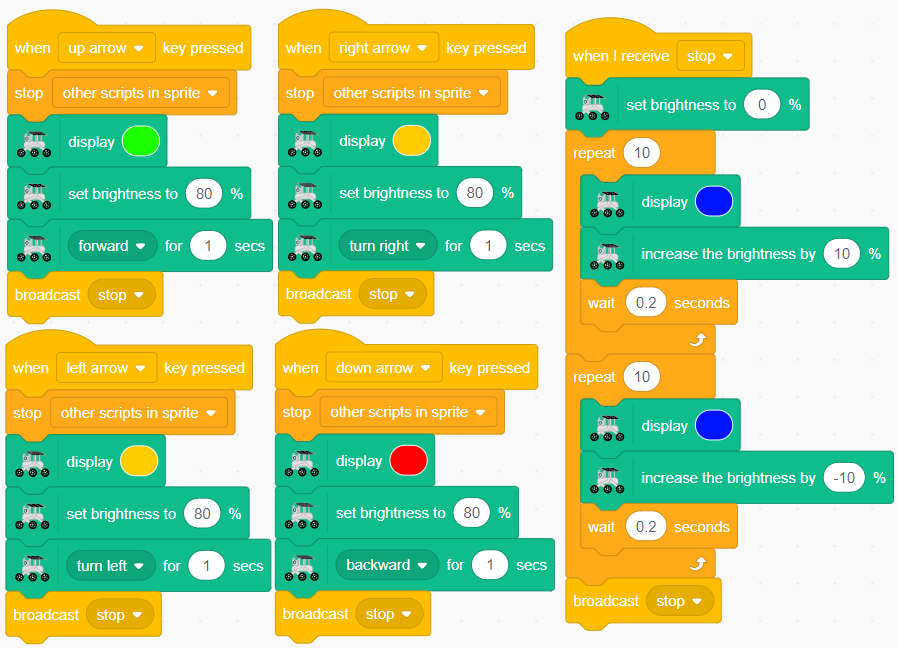

Now, when you press the direction keys on the stage, the GalaxyRVR will move and light up in the corresponding color. When you stop controlling it, it will remain stationary and slowly breathe light.

RGB Module Related Blocks
-------------------------------

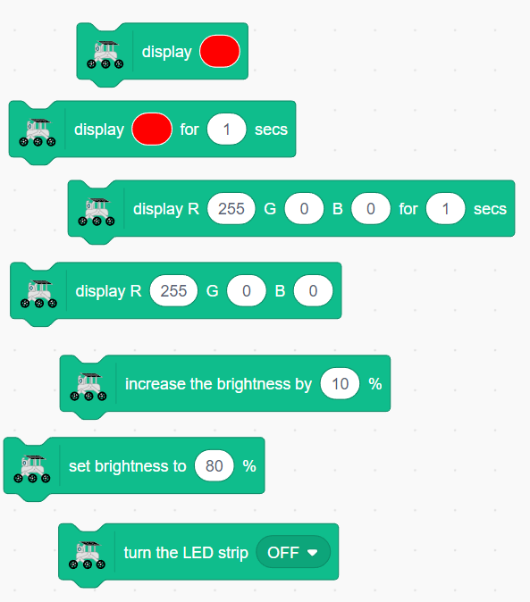

