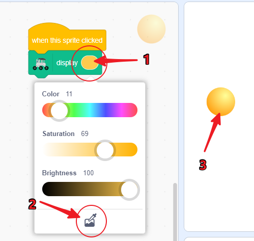
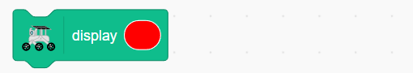
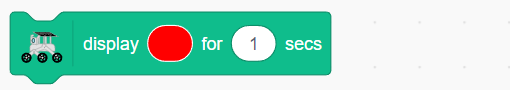
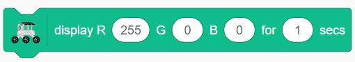

.. note::

    你好，欢迎加入 SunFounder Raspberry Pi & Arduino & ESP32 爱好者社区！在这里，你可以与其他爱好者一起深入探索 Raspberry Pi、Arduino 和 ESP32。

    **为什么加入？**

    - **专家支持**：在售后问题和技术挑战上，得到社区和团队的帮助。
    - **学习与分享**：交流技巧和教程，共同提升技能。
    - **独家预览**：抢先体验新产品的发布和预告。
    - **专属折扣**：享受最新产品的独家折扣。
    - **节日促销与赠品**：参与赠品活动和节日促销。

    👉 准备好与我们一起探索和创造了吗？点击 [|link_sf_facebook|] 今天就加入我们吧！

第十课 用 RGB LED 灯带点亮前行的路
===============================================================

到目前为止，我们已经将火星车转变为一个智能探险者，能够熟练地绕过障碍物。在我们为它设定的类火星地形中，它已经变得相当擅长导航。

但是，如果我们能为它增添一些色彩呢？让我们为火星车赋予表达自己的能力，通过一场色彩与光的盛宴来点缀它的实用性。今天，我们将为火星车加入 RGB LED 灯带——这一酷炫功能让它即使在最黑暗的环境下也能照亮前行的路。

想象一下——火星车在前行时会留下一条颜色编码的信号轨迹，这样我们就能更轻松地理解它的动作。当它启动时是绿色的光芒，停止时是严肃的红色，快速转弯时是闪亮的黄色，甚至还可以为了好玩而展示多彩的灯光！

本课的目标是理解 RGB LED 灯带的工作原理，学习如何控制它们的颜色和亮度，然后将其与火星车的动作同步。到最后，我们的火星车不仅仅是一台机器，它将成为一个充满光彩、变化多端的存在，引领我们穿越广袤的火星大地！

.. raw:: html

    <video width="600" loop autoplay muted>
        <source src="../_static/video/car_rgb.mp4" type="video/mp4">
        Your browser does not support the video tag.
    </video>

学习目标
-------------
* 介绍 RGB LED 灯带的工作原理和编程控制方法。
* 使用 Mammoth Coding 利用 RGB LED 灯带实现颜色控制和简单的灯光效果。
* 创建一个 Mammoth Coding 项目，模拟火星环境中的灯光变化或火星探索任务中的信号灯。

所需材料
-------------------------
* RGB LED 灯带及控制器
* Mammoth Coding 应用
* 计算机或平板

探索 RGB LED 灯带的光魔法
-------------------------------------------------------------

你还记得上次看到彩虹时的情景吗？那七种鲜艳的色彩如何让天空变得五彩斑斓？你是否也想在我们的小火星车上创造属于自己的彩虹？让我们一起通过 RGB LED 灯带来探索光的魔力吧！

.. image:: ../img/4_rgb_strip.jpg

你可能注意到，我们的 RGB LED 灯带有四个引脚，标记如下：

* **+5V**：这是灯带内三颗小灯泡（LED）的公共“正极”端或“阳极”。它需要连接到 DC 5V，这是为我们的微小灯泡提供电源的电压！
* **B**：这是蓝色 LED 的“负极”端或“阴极”。
* **R**：这是红色 LED 的“负极”端。
* **G**：这是绿色 LED 的“负极”端。

.. image:: ../img/rgb_5050.jpg

你还记得我们在美术课上学到的三种原色——红色、蓝色和绿色吗？就像艺术家在调色板上混合这些颜色来创造新的色调一样，我们的灯带内有 4 个“5050” LED，它们可以将这三种原色混合成几乎任何颜色！每一个“5050” LED 就像是一个小型的艺术工作室，里面装着这三种颜色的灯泡。

.. image:: ../img/rgb_5050_sche.png

这些微小的艺术工作室巧妙地连接在一块柔性电路板上——就像一条迷你电路高速公路！所有 LED 的“正极”端（阳极）连接在一起，而“负极”端（阴极）则分别连接到对应的颜色线路（G 对 G，R 对 R，B 对 B）。

.. image:: ../img/rgb_strip_sche.png

最酷的部分是什么呢？在我们的指令下，这条灯带上的所有 LED 可以同时改变颜色！就像我们拥有一个属于自己的光之交响乐团，尽在指尖！

点亮展示
------------------------------

1. 让我们尝试用颜色点亮 GalaxyRVR！拖出一个显示颜色的代码块。

.. image:: img/9_rgb_block.png

2. 选择你最喜欢的颜色。

.. image:: img/9_rgb_color.png

3. 点击它，你将看到 GalaxyRVR 点亮成对应的颜色。

**通过舞台控制 GalaxyRVR**

接下来，让我们创建一个互动项目，熟悉 GalaxyRVR 的灯光功能。我们将通过点击舞台角色来改变 GalaxyRVR 的颜色。

1. 删除现有的角色。

.. image:: img/6_animate_delete.png

2. 选择一个球形角色。选择这个角色的原因是它有许多服装，每种服装对应不同的颜色。

.. image:: img/9_animate_rgb_ball.png

3. 拖出一个“当这个角色被点击”块，用于在点击舞台角色时触发一个动作。

.. image:: img/9_animate_rgb_when.png

4. 拖出一个显示块，令 GalaxyRVR 点亮。

.. image:: img/9_animate_rgb_display.png

5. 如果你使用的是小屏设备，请点击旁边的眼睛按钮，确保舞台预览窗口与主界面一致。

.. image:: img/9_animate_rgb_eye.png

6. 点击显示块中的颜色。在弹出的窗口底部，你会看到一个颜色选择器按钮，点击它。

.. image:: img/9_animate_rgb_pick.png

7. 在舞台区域按住鼠标，屏幕上会出现一个放大镜，用于选择颜色。松开鼠标，选择球形角色的颜色用于显示块。

8. 长按舞台上的球形角色，复制它。

.. image:: img/9_animate_rgb_duplicate.png

9. 在服装界面，切换到下一个颜色。

.. image:: img/9_animate_rgb_change_costume.png

10. 返回代码界面，选择与当前角色匹配的颜色。

.. image:: img/9_animate_rgb_pick_blue.png

11. 重复步骤 8-10，直到设置完五种颜色。

.. image:: img/9_animate_rgb_ball5.png

现在，你可以点击舞台区域中的球形角色，让 GalaxyRVR 在不同颜色中闪烁。

.. _rgb_move:

GalaxyRVR 信号灯演示
----------------------------------------------------------------

**方向指示灯**

现在我们知道了如何让 GalaxyRVR 发出颜色信号，让我们将这个功能与 :ref:`rvr_move` 结合起来。

1. 创建一个新项目。

2. 首先，为四个方向设置关键事件块和移动块。

.. image:: img/9_rgb_move.png

3. 为每个事件添加颜色显示：前进时为绿色。

.. image:: img/9_rgb_green.png

4. 左右转弯时为黄色。

.. image:: img/9_rgb_yellow.png

5. 后退时为红色。

.. image:: img/9_rgb_red.png

现在，当你点击舞台区域中的方向键时，你会看到 GalaxyRVR 移动并点亮相应的颜色。

**呼吸灯效果**

呼吸灯是一种灯光逐渐变亮和变暗的效果，类似于呼吸的节奏。接下来，让我们在 GalaxyRVR 停止时加入呼吸灯效果。

1. 创建一个新的广播消息，命名为 stop。这将告诉程序 GalaxyRVR 处于停止状态。

.. image:: img/9_rgb_new_message.png

.. note:: 如果你的角色有许多动作需要执行，但需要在特定时间或条件下启动某些动作，广播块可以帮助你管理这一过程。这样，你的角色可以按照需要的顺序执行不同的动作，避免代码混乱，使其更清晰、易懂。

2. 在每个方向键事件后添加这个广播。

.. image:: img/9_rgb_new_boardcast.png

3. 拖出一个“当我收到 [stop]”块。

.. image:: img/9_rgb_when_receive.png

4. 将亮度设置为 0%，让呼吸灯从 0 亮度开始。

.. image:: img/9_rgb_set_bright.png

5. 使用重复 10 次块来创建亮度逐渐变化的效果。在这里，我们使用蓝光，每 0.2 秒增加 10% 的亮度。

.. image:: img/9_rgb_increase.png

6. 接着添加一个块，每 0.2 秒减少 10% 的亮度，完成一次呼吸周期。

.. image:: img/9_rgb_decrease.png

7. 在结束时再次广播 stop，创建连续的呼吸效果。

.. image:: img/9_rgb_stopagain.png

8. 如果此时你直接控制 GalaxyRVR，可能会发现颜色和亮度不同步。因此，在每个方向键事件的末尾添加“停止其他脚本”块。

.. image:: img/9_rgb_stop.png

9. 由于亮度会在 stop 事件中发生变化，因此在每个方向键事件中重置光线亮度。

.. image:: img/9_rgb_set_bright_each.png

现在，当你按下舞台上的方向键时，GalaxyRVR 会移动并点亮相应的颜色。当你停止控制它时，它会保持静止并缓慢呼吸灯光。

RGB 模块相关代码块
-------------------------------

用你选择的颜色点亮 GalaxyRVR 下的 RGB 灯带。你可以：

    * 点击颜色块选择你想要的颜色。

用你选择的颜色点亮 GalaxyRVR 下的 RGB 灯带，持续 1 秒。你可以：

    * 点击颜色块选择你想要的颜色。
    * 修改数字来改变灯光显示的持续时间。

用你选择的 RGB 值来点亮 GalaxyRVR 下的 RGB 灯带。你可以：

    * 修改 R 值来调整红色灯光的亮度，范围是 0-255。
    * 修改 G 值来调整绿色灯光的亮度，范围是 0-255。
    * 修改 B 值来调整蓝色灯光的亮度，范围是 0-255。

用你选择的 RGB 值来点亮 GalaxyRVR 下的 RGB 灯带，持续 1 秒。你可以：

    * 修改 R 值来调整红色灯光的亮度，范围是 0-255。
    * 修改 G 值来调整绿色灯光的亮度，范围是 0-255。
    * 修改 B 值来调整蓝色灯光的亮度，范围是 0-255。
    * 修改持续时间来改变灯光显示的时长。

此块用于设置灯光的亮度，范围从 0 到 100。

此块用于增加（或减少）灯光的亮度，数值可以为负数。

打开（或关闭）GalaxyRVR 下的 RGB 灯带。
