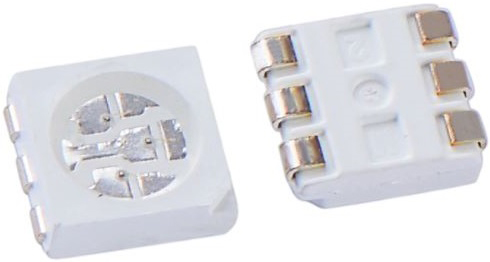

.. note::

    Hello, welcome to the SunFounder Raspberry Pi & Arduino & ESP32 Enthusiasts Community on Facebook! Dive deeper into Raspberry Pi, Arduino, and ESP32 with fellow enthusiasts.

    **Why Join?**

    - **Expert Support**: Solve post-sale issues and technical challenges with help from our community and team.
    - **Learn & Share**: Exchange tips and tutorials to enhance your skills.
    - **Exclusive Previews**: Get early access to new product announcements and sneak peeks.
    - **Special Discounts**: Enjoy exclusive discounts on our newest products.
    - **Festive Promotions and Giveaways**: Take part in giveaways and holiday promotions.

    👉 Ready to explore and create with us? Click [|link_sf_facebook|] and join today!

Lesson 10: Lighting the Way with RGB LED Strips
===============================================================

Our Mars Rover has become a skilled explorer, but now it's time to add some colorful personality! In this lesson, we'll transform our rover with RGB LED strips that can glow in any color imaginable.

Imagine your GalaxyRVR lighting up its path like a spaceship from a sci-fi movie:

- Green glow when moving forward
- Red light when stopping  
- Yellow flashes when turning
- Beautiful color shows just for fun!

We'll learn how to program these amazing lights and sync them with your rover's movements. Get ready to create your own light-up Mars explorer!

.. raw:: html

    <video width="600" loop autoplay muted>
        <source src="../_static/video/car_rgb.mp4" type="video/mp4">
        Your browser does not support the video tag.
    </video>

Learning Objectives
-------------------

* Discover how RGB LED strips work and how to program them
* Learn to control colors and create lighting effects using Mammoth Coding
* Design light signals and colors for your Mars exploration missions

Explore the Magic of Light with RGB LED Strips
-------------------------------------------------------------

Have you ever wanted to create your own rainbow? Now you can! With RGB LED strips, you can make your Mars rover glow with any color you can imagine. Let's discover the magic of colorful lights!

.. image:: img/4_rgb_strip.jpg

Meet the four important pins on your LED strip:

* **+5V** - The power pin that gives energy to all the lights (needs 5V electricity)
* **B** - Controls the blue lights
* **R** - Controls the red lights  
* **G** - Controls the green lights

Remember learning about primary colors in art class? Just like mixing paint, each LED can blend red, blue, and green light to create amazing colors! Each "5050" LED is like a tiny color factory containing all three colors.

.. image:: img/rgb_5050_sche.png

All these color factories are connected together on a flexible circuit - like a colorful electric highway! The power pins connect together, while the color pins each have their own special path.

.. image:: img/rgb_strip_sche.png

The most exciting part? You can program ALL the LEDs to change colors at the same time! Imagine creating your own light show with just a few code blocks. Get ready to light up your Mars rover adventure!

Light Up the Show
------------------------------

#. First, :ref:`app_connect`.

#. Now, let's make your GalaxyRVR glow! Drag out a "display color" block to start.

   .. image:: img/9_rgb_block.png

#. Choose any color you like from the color menu.

   .. image:: img/9_rgb_color.png

#. Click the block and watch your GalaxyRVR light up with your chosen color!

**Create a Color Controller**

Now let's build an interactive color controller! We'll create colorful buttons on the stage that change your GalaxyRVR's lights when you tap them.

1. First, delete any existing sprites to start fresh.

   .. image:: img/6_animate_delete.png

2. Add a Ball sprite from the library. This sprite is perfect because it comes with multiple color costumes.

   .. image:: img/9_animate_rgb_ball.png

3. Add a "when this sprite clicked" block - this will make things happen when you tap the ball.

   .. image:: img/9_animate_rgb_when.png

4. Connect a "display color" block to light up your GalaxyRVR.

   .. image:: img/9_animate_rgb_display.png

5. On small screens, make sure you can see the stage by clicking the eye button.

   .. image:: img/9_animate_rgb_eye.png

6. Click the color box in the display block, then click the color picker button at the bottom.

   .. image:: img/9_animate_rgb_pick.png

7. Press and hold on the stage area - a magnifying glass will appear! Release it over the ball sprite to copy its color.

   .. image:: img/9_animate_rgb_pick_color_n.png

8. Make more color buttons by long-pressing the ball sprite to duplicate it.

   .. image:: img/9_animate_rgb_duplicate.png

9. Change each duplicate to a different color by switching its costume.

   .. image:: img/9_animate_rgb_change_costume.png

10. For each new color, use the color picker to match the display block to the sprite's current color.

   .. image:: img/9_animate_rgb_pick_blue.png

11. Repeat until you have five different color buttons!

   .. image:: img/9_animate_rgb_ball5.png

Now tap any colored ball on the stage and watch your GalaxyRVR glow with that color! Create your own light show with just a tap.

.. _rgb_move:

GalaxyRVR Signal Lights in Action
----------------------------------------------------------------

**Directional Indicator Lights**

Let's combine light colors with movement to create signal lights for your GalaxyRVR! Just like a car has turn signals, your rover will light up in different colors when it moves.

#. First, :ref:`app_connect`.

#. Now, set up direction keys with movement blocks for all four directions.

   .. image:: img/9_rgb_move.png

#. Add color displays to each direction:
   
   - Green light for moving forward
   
   .. image:: img/9_rgb_green.png
   
   - Yellow lights for turning left and right
   
   .. image:: img/9_rgb_yellow.png
   
   - Red light for moving backward
   
   .. image:: img/9_rgb_red.png

Now when you press the direction keys, your GalaxyRVR will move and glow with the matching color!

**Breathing Light Effect**

Let's create a cool breathing light that slowly brightens and dims when your rover is resting, just like it's breathing!

1. Create a new broadcast message called "stop" to signal when the rover isn't moving.

   .. image:: img/9_rgb_new_message.png

   .. note:: Broadcast messages help organize your code by triggering specific actions at the right time, making your programs cleaner and easier to understand.

2. Add this broadcast after each movement command.

   .. image:: img/9_rgb_new_boardcast.png

3. Create a "when I receive [stop]" block to start the breathing light.

   .. image:: img/9_rgb_when_receive.png

4. Set brightness to 0% to start from completely dark.

   .. image:: img/9_rgb_set_bright.png

5. Use a repeat loop to gradually increase blue light brightness by 10% every 0.2 seconds.

   .. image:: img/9_rgb_increase.png

6. Then gradually decrease the brightness to complete one breathing cycle.

   .. image:: img/9_rgb_decrease.png

7. Broadcast "stop" again to keep the breathing effect continuous.

   .. image:: img/9_rgb_stopagain.png

8. Add "stop other scripts" at the end of each key event to prevent color conflicts.

   .. image:: img/9_rgb_stop.png

9. Reset the light brightness in each direction key event.

   .. image:: img/9_rgb_set_bright_each.png

Now your GalaxyRVR will light up with colored signals when moving, and gently pulse with a breathing blue light when resting!

RGB Module Related Blocks
-------------------------------

* Light up your GalaxyRVR with any color you choose.

  - Click the color patch to pick your favorite color

  .. image:: img/block/rgb_display.png

* Light up your GalaxyRVR for a specific amount of time.

  - Choose any color
  - Set how long the light stays on
  
  .. image:: img/block/rgb_display_1s.png

* Create custom colors by mixing red, green, and blue light - perfect for color fading projects!

  - R: Red brightness (0-255)
  - G: Green brightness (0-255) 
  - B: Blue brightness (0-255)
  
  .. image:: img/block/rgb_display_RGB.png

* Show custom RGB colors for a set time.

  - Adjust red, green, and blue values (0-255)
  - Set the display duration
  
  .. image:: img/block/rgb_display_RGB_1s.png

* Set how bright the lights should be (0-100%).

  .. image:: img/block/rgb_set_brightness.png

* Make the lights brighter or dimmer. Use negative numbers to decrease brightness.

  .. image:: img/block/rgb_increase_brightness.png

* Turn the RGB lights on or off.

  .. image:: img/block/rgb_turn_on.png
