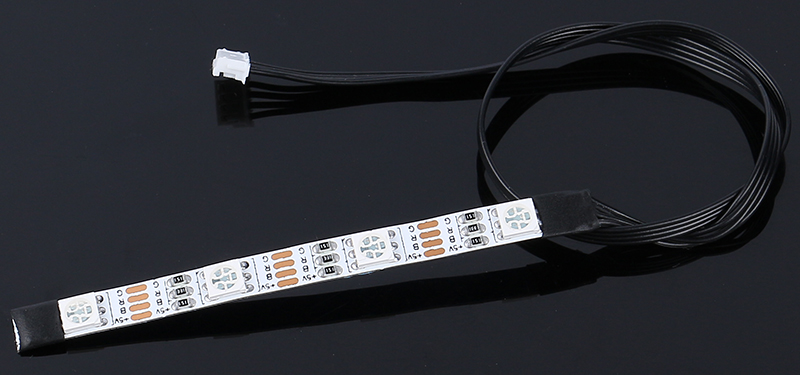

.. include:: /index.rst
   :start-after: start_hello_message
   :end-before: end_hello_message

Lektion 10: Den Weg mit RGB-LED-Streifen beleuchten
====================================================================

Unser Mars Rover ist zu einem erfahrenen Entdecker geworden, aber jetzt wird es Zeit, etwas bunte Persönlichkeit hinzuzufügen! In dieser Lektion werden wir unseren Rover mit RGB-LED-Streifen ausstatten, die in jeder erdenklichen Farbe leuchten können.

Stellen Sie sich vor, Ihr GalaxyRVR beleuchtet seinen Weg wie ein Raumschiff aus einem Science-Fiction-Film:

- Grünes Leuchten bei Vorwärtsfahrt
- Rotes Licht beim Anhalten
- Gelbe Blinker beim Abbiegen
- Wunderschöne Farbshows, nur zum Spaß!

Wir werden lernen, wie man diese erstaunlichen Lichter programmiert und sie mit den Bewegungen Ihres Rovers synchronisiert. Machen Sie sich bereit, Ihren eigenen leuchtenden Mars-Entdecker zu erschaffen!

.. raw:: html

    <video width="600" loop autoplay muted>
        <source src="../_static/video/car_rgb.mp4" type="video/mp4">
        Ihr Browser unterstützt das Video-Tag nicht.
    </video>

Lernziele
---------

* Entdecken Sie, wie RGB-LED-Streifen funktionieren und wie man sie programmiert
* Lernen Sie, Farben zu steuern und Lichteffekte mit Mammoth Coding zu erzeugen
* Entwerfen Sie Lichtsignale und Farben für Ihre Mars-Erkundungsmissionen

Entdecken Sie die Magie des Lichts mit RGB-LED-Streifen
---------------------------------------------------------------------

Haben Sie schon einmal davon geträumt, Ihren eigenen Regenbogen zu erschaffen? Jetzt können Sie es! Mit RGB-LED-Streifen können Sie Ihren Mars Rover in jeder erdenklichen Farbe leuchten lassen. Entdecken Sie die Magie der bunten Lichter!

Lernen Sie die vier wichtigen Pins Ihres LED-Streifens kennen:

* **+5V** - Der Strompin, der alle Lichter mit Energie versorgt (benötigt 5V Strom)
* **B** - Steuert die blauen Lichter
* **R** - Steuert die roten Lichter
* **G** - Steuert die grünen Lichter

.. image:: img/rgb_5050.jpg

Erinnern Sie sich an die Grundfarben aus dem Kunstunterricht? Genau wie beim Mischen von Farben kann jede LED rotes, blaues und grünes Licht mischen, um erstaunliche Farben zu erzeugen! Jede „5050"-LED ist wie eine winzige Farbfabrik, die alle drei Farben enthält.

.. image:: img/rgb_5050_sche.png

All diese Farbfabriken sind auf einer flexiblen Leiterplatte miteinander verbunden – wie eine bunte elektrische Autobahn! Die Strompins sind miteinander verbunden, während die Farbpins jeweils ihren eigenen speziellen Weg haben.

.. image:: img/rgb_strip_sche.png

Das Aufregendste daran? Sie können ALLE LEDs gleichzeitig programmieren, um die Farben zu wechseln! Stellen Sie sich vor, Sie erschaffen Ihre eigene Lichtshow mit nur wenigen Code-Blöcken. Machen Sie sich bereit, Ihr Mars-Rover-Abenteuer zum Leuchten zu bringen!

Die Show zum Leuchten bringen
---------------------------------------

#. Zunächst: :ref:`app_connect`.

#. Lassen Sie uns nun Ihren GalaxyRVR zum Leuchten bringen! Ziehen Sie einen „display color"-Block heraus, um zu beginnen.

   .. image:: img/9_rgb_block.png

#. Wählen Sie eine beliebige Farbe aus dem Farbmenü.

   .. image:: img/9_rgb_color.png

#. Klicken Sie auf den Block und beobachten Sie, wie Ihr GalaxyRVR in Ihrer gewählten Farbe aufleuchtet!

**Einen Farb-Controller erstellen**

Jetzt bauen wir einen interaktiven Farb-Controller! Wir erstellen bunte Schaltflächen auf der Bühne, die die Lichter Ihres GalaxyRVR ändern, wenn Sie sie antippen.

1. Löschen Sie zunächst alle vorhandenen Sprites, um neu zu beginnen.

   .. image:: img/6_animate_delete.png

2. Fügen Sie ein Ball-Sprite aus der Bibliothek hinzu. Dieses Sprite ist perfekt, da es mehrere farbige Kostüme hat.

   .. image:: img/9_animate_rgb_ball.png

3. Fügen Sie einen „when this sprite clicked"-Block hinzu – dieser bewirkt, dass etwas passiert, wenn Sie den Ball antippen.

   .. image:: img/9_animate_rgb_when.png

4. Verbinden Sie einen „display color"-Block, um Ihren GalaxyRVR zum Leuchten zu bringen.

   .. image:: img/9_animate_rgb_display.png

5. Stellen Sie auf kleinen Bildschirmen sicher, dass Sie die Bühne sehen können, indem Sie auf die Augentaste klicken.

   .. image:: img/9_animate_rgb_eye.png

6. Klicken Sie auf das Farbfeld im Anzeigeblock und dann unten auf die Farbpipette.

   .. image:: img/9_animate_rgb_pick.png

7. Halten Sie den Finger auf den Bühnenbereich – eine Lupe erscheint! Lassen Sie sie über dem Ball-Sprite los, um dessen Farbe zu übernehmen.

   .. image:: img/9_animate_rgb_pick_color_n.png

8. Erstellen Sie weitere Farbtasten, indem Sie das Ball-Sprite lange drücken, um es zu duplizieren.

   .. image:: img/9_animate_rgb_duplicate.png

9. Ändern Sie jedes Duplikat in eine andere Farbe, indem Sie dessen Kostüm wechseln.

   .. image:: img/9_animate_rgb_change_costume.png

10. Verwenden Sie für jede neue Farbe die Farbpipette, um den Anzeigeblock an die aktuelle Farbe des Sprites anzupassen.

   .. image:: img/9_animate_rgb_pick_blue.png

11. Wiederholen Sie dies, bis Sie fünf verschiedene Farbtasten haben!

   .. image:: img/9_animate_rgb_ball5.png

Tippen Sie nun auf einen beliebigen farbigen Ball auf der Bühne und beobachten Sie, wie Ihr GalaxyRVR in dieser Farbe leuchtet! Erstellen Sie Ihre eigene Lichtshow mit nur einem Tippen.

.. _rgb_move:

GalaxyRVR Signalleuchten in Aktion
-----------------------------------------------

**Richtungsanzeiger**

Kombinieren wir nun Lichtfarben mit Bewegung, um Signalleuchten für Ihren GalaxyRVR zu erstellen! Genau wie ein Auto Blinker hat, leuchtet Ihr Rover in verschiedenen Farben, wenn er sich bewegt.

#. Zunächst: :ref:`app_connect`.

#. Richten Sie nun Richtungstasten mit Bewegungsblöcken für alle vier Richtungen ein.

   .. image:: img/9_rgb_move.png

#. Fügen Sie jeder Richtung Farbanzeigen hinzu:

   - Grünes Licht für Vorwärtsfahrt

   .. image:: img/9_rgb_green.png

   - Gelbe Lichter zum Links- und Rechtsabbiegen

   .. image:: img/9_rgb_yellow.png

   - Rotes Licht für Rückwärtsfahrt

   .. image:: img/9_rgb_red.png

Wenn Sie nun die Pfeiltasten drücken, bewegt sich Ihr GalaxyRVR und leuchtet in der passenden Farbe!

**Atmender Lichteffekt**

Erstellen wir ein cooles Atemlicht, das langsam heller und dunkler wird, wenn Ihr Rover ruht – ganz so, als würde er atmen!

1. Erstellen Sie eine neue Broadcast-Nachricht namens „stop", um zu signalisieren, dass der Rover sich nicht bewegt.

   .. image:: img/9_rgb_new_message.png

   .. note:: Broadcast-Nachrichten helfen dabei, Ihren Code zu organisieren, indem sie bestimmte Aktionen zum richtigen Zeitpunkt auslösen, was Ihre Programme sauberer und verständlicher macht.

2. Fügen Sie diesen Broadcast nach jedem Bewegungsbefehl hinzu.

   .. image:: img/9_rgb_new_boardcast.png

3. Erstellen Sie einen „when I receive [stop]"-Block, um das Atemlicht zu starten.

   .. image:: img/9_rgb_when_receive.png

4. Setzen Sie die Helligkeit auf 0%, um mit völliger Dunkelheit zu beginnen.

   .. image:: img/9_rgb_set_bright.png

5. Verwenden Sie eine Wiederholungsschleife, um die Helligkeit des blauen Lichts schrittweise um 10% alle 0,2 Sekunden zu erhöhen.

   .. image:: img/9_rgb_increase.png

6. Verringern Sie dann schrittweise die Helligkeit, um einen vollständigen Atemzyklus abzuschließen.

   .. image:: img/9_rgb_decrease.png

7. Senden Sie erneut „stop", um den Atem-Effekt kontinuierlich fortzusetzen.

   .. image:: img/9_rgb_stopagain.png

8. Fügen Sie am Ende jedes Tastenereignisses „stop other scripts" hinzu, um Farbkonflikte zu vermeiden.

   .. image:: img/9_rgb_stop.png

9. Setzen Sie die Lichthelligkeit in jedem Richtungstasten-Ereignis zurück.

   .. image:: img/9_rgb_set_bright_each.png

Jetzt leuchtet Ihr GalaxyRVR beim Fahren mit farbigen Signalen auf und pulsiert im Ruhezustand sanft mit einem atmenden blauen Licht!

RGB-Modul-Bezogene Blöcke
-----------------------------------

* Lassen Sie Ihren GalaxyRVR in einer beliebigen Farbe Ihrer Wahl leuchten.

  - Klicken Sie auf das Farbfeld, um Ihre Lieblingsfarbe auszuwählen

  .. image:: img/block/rgb_display.png

* Lassen Sie Ihren GalaxyRVR für eine bestimmte Zeit leuchten.

  - Wählen Sie eine beliebige Farbe
  - Stellen Sie ein, wie lange das Licht leuchten soll

  .. image:: img/block/rgb_display_1s.png

* Erstellen Sie benutzerdefinierte Farben durch Mischen von rotem, grünem und blauem Licht – perfekt für Farbverlaufsprojekte!

  - R: Rote Helligkeit (0-255)
  - G: Grüne Helligkeit (0-255)
  - B: Blaue Helligkeit (0-255)

  .. image:: img/block/rgb_display_RGB.png

* Zeigen Sie benutzerdefinierte RGB-Farben für eine festgelegte Zeit an.

  - Passen Sie die Rot-, Grün- und Blauwerte an (0-255)
  - Stellen Sie die Anzeigedauer ein

  .. image:: img/block/rgb_display_RGB_1s.png

* Stellen Sie ein, wie hell die Lichter sein sollen (0-100%).

  .. image:: img/block/rgb_set_brightness.png

* Machen Sie die Lichter heller oder dunkler. Verwenden Sie negative Zahlen, um die Helligkeit zu verringern.

  .. image:: img/block/rgb_increase_brightness.png

* Schalten Sie die RGB-Lichter ein oder aus.

  .. image:: img/block/rgb_turn_on.png
