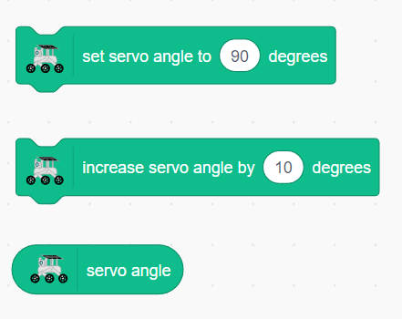

.. note::

    Hello, welcome to the SunFounder Raspberry Pi & Arduino & ESP32 Enthusiasts Community on Facebook! Dive deeper into Raspberry Pi, Arduino, and ESP32 with fellow enthusiasts.

    **Why Join?**

    - **Expert Support**: Solve post-sale issues and technical challenges with help from our community and team.
    - **Learn & Share**: Exchange tips and tutorials to enhance your skills.
    - **Exclusive Previews**: Get early access to new product announcements and sneak peeks.
    - **Special Discounts**: Enjoy exclusive discounts on our newest products.
    - **Festive Promotions and Giveaways**: Take part in giveaways and holiday promotions.

    👉 Ready to explore and create with us? Click [|link_sf_facebook|] and join today!

Lesson 11 Servo and Tilt Mechanism
===============================================================

Welcome back, young explorers! In today's adventure, we are going to delve into the fascinating world of the Mars Rover's visual system. Just like our eyes and neck work together to help us see and navigate our surroundings, our Rover too needs a similar system to navigate the treacherous Martian landscape. And that's exactly what we are going to build today!

The visual system of our Rover has two main parts: a camera that acts as its "eyes", and a tilt mechanism that acts like a "neck", allowing it to look up and down. By the end of this lesson, we'll give our Rover the ability to "see" and "nod"!

First, we'll build the tilt mechanism - a device that will hold our Rover's camera and let it rotate vertically. It's like giving our Rover a neck, so it can nod its "head" or camera up and down!

Next, we'll learn about the servo, the tiny yet powerful "muscle" that moves our tilt mechanism. We'll understand how it works and how we can control it using Arduino programming.

Just as our neck muscles move our head so our eyes can get a better view, the servo will move the tilt mechanism so the Rover's camera can better survey the Martian landscape.

So, buckle up, explorers, let's start our mission to equip our Rover with its very own visual system!

.. raw:: html

    <video width="600" loop autoplay muted>
        <source src="_static/video/servo_range.mp4" type="video/mp4">
        Your browser does not support the video tag.
    </video>

Learning Objectives
-------------------------

* Introduce the working principles of servo motors and their application in mechanical control.
* Learn how to easily set servo angles using Mammoth Coding, achieving precise control.
* Design interactive projects on the Mammoth Coding platform that enable physical interaction through servo motors.

Materials
--------------------

* Smartphone or tablet
* Mammoth Coding APP
* GalaxyRVR

What is a Servo?
----------------------------------------

Have you ever watched a puppet show? If you have, you might have marveled at how the puppeteer can make the puppet's arms, legs, and head move so smoothly, just by pulling on some strings. In a way, servo motors are like our puppeteers.

.. image:: ../img/puppet_show.png
    :width: 200
    :align: center

Servo motors are special types of motors that don't just spin around like a wheel. Instead, they can move to a specific position and hold that position. Imagine if you're playing a game of Simon says, and Simon says, "Raise your arm to a 90-degree angle!" You can do it, right? That's because, like a servo, you can control exactly how much to move your arm.

.. image:: ../img/servo.png
    :align: center

* Brown Line: GND
* Orange Line: Signal pin, connect to the PWM pin of the main board.
* Red wire: VCC

Just like you can control your arms to move to specific positions, we can use servo motors to control the exact position of objects in our projects. In our Mars Rover, we will use a servo to control the up and down movement of our tilt mechanism, just like how you can nod your head up and down.

In the next step, we will go on a fascinating journey inside a servo motor to understand how it works. Excited? Let's go!

How does a Servo Work?
-------------------------------------------

So how does a servo work its magic? Let's go on an exciting journey inside a servo!

If we were to peek inside a servo, we would see a few parts. At the heart of a servo is a regular motor, very similar to the motors that spin our Mars Rover's wheels. Wrapped around the motor, there is a big gear that is connected to a smaller gear on the motor shaft. This is how the motor's fast, circular motion gets transformed into slower but stronger motion.

.. image:: ../img/servo_internal.png
    :align: center

But that's not what makes a servo special. The magic happens in a tiny piece of electronics called a "potentiometer" and the "control circuitry". Here's how it works: when the servo moves, the potentiometer turns and changes its resistance. The control circuitry measures this change in resistance and knows exactly what position the servo is in. Clever, isn't it?

To control a servo, we send it a special kind of signal called a "pulse-width modulation" signal or PWM. By changing the width of these pulses, we can control exactly how much the servo moves and hold it in that position.

In the next step, we'll learn how to control a servo using an APP. Ready for some magic spells in the form of code? Let's go!

Exploring the Mars Rover Tilt System
-------------------------------------------------

**Setting the Gimbal Angle**

1. Check the servo angle, and you can see the current angle on the stage.

.. image:: img/10_servo_angle.png

2. Drag a ``set servo angle to 90 degrees`` block. Click it, and you'll see the GalaxyRVR face forward.

.. image:: img/10_servo_set_angle.png

3. Change the value to 45 and click it, you'll see the GalaxyRVR look up.

.. image:: img/10_servo_set_angle_45.png

4. Through multiple trials, you'll discover that the GalaxyRVR's gimbal can move between 0 and 135 degrees. As the angle increases, the gimbal lowers.

**Changing the Gimbal Angle**

4. The GalaxyRVR's servo gimbal system is a refined single-degree-of-freedom structure, so you only need to control its "reset," "move up," and "move down" functions.

5. Now let's create its reset button. Drag a ``when this sprite clicked`` block.

.. image:: img/10_servo_when_click.png

6. Embed a ``set servo angle to 90 degrees`` block to make the gimbal face forward.

.. image:: img/10_servo_when_90.png

7. Drag a ``when up arrow key pressed`` block.

.. image:: img/10_servo_when_up.png

8. Decrease the servo angle when the up arrow key is pressed.

.. image:: img/10_servo_when_up2.png

9. Similarly, add a down arrow key event to make the gimbal look down.

.. image:: img/10_servo_when_down.png

Now, click the full-screen button to enlarge the stage. Click up and down to adjust the gimbal angle, and click the sprite to reset the angle.

.. _tilt_system:

Touch the Stage Area to Adjust the Gimbal Angle
-------------------------------------------------------------

Next, we will use an arrow sprite to achieve smoother adjustments to the servo angle.

When we touch the arrow, we can drag the direction of the arrow sprite.

1. Delete the original sprite.

.. image:: img/6_animate_delete.png

2. Add an Arrow sprite. We will set the gimbal direction based on its orientation.

.. image:: img/10_servo_arrow.png

3. A ``when this sprite clicked`` block is exactly what we need.

.. image:: img/6_animate_when_touch.png

4. Let the program repeat until we release it, meaning we no longer touch the sprite.

.. image:: img/6_animate_repeat_touching.png

3. Drag a ``point towards touch_position`` block to make the sprite face the touch position.

.. image:: img/10_servo_arrow_point_toward.png

4. Drag a ``set servo angle to 90 degrees`` block and embed a ``direction`` block to align the gimbal angle with the arrow sprite's orientation. This way, when we change the arrow sprite's direction (i.e., touch the stage area), we can change the gimbal angle.

.. image:: img/10_servo_arrow_angle_direction.png

5. Add a limit check to ensure the arrow sprite's orientation does not exceed 135 degrees.

.. image:: img/10_servo_arrow_135.png

6. Similarly, ensure its orientation does not go below 0 degrees.

.. image:: img/10_servo_arrow_0.png

Touch the sprite, and it will change direction as you drag, altering the gimbal angle.

If you find it easy to slide your finger off the arrow sprite, you can increase the sprite's size accordingly.

Servo-Related Blocks
-------------------------------

