.. note::

    Ciao, benvenuto nella community di SunFounder Raspberry Pi & Arduino & ESP32 Enthusiasts su Facebook! Approfondisci Raspberry Pi, Arduino ed ESP32 insieme agli altri appassionati.

    **Perché unirsi?**

    - **Supporto esperto**: Risolvi i problemi post-vendita e le sfide tecniche con l'aiuto della nostra comunità e del nostro team.
    - **Impara e condividi**: Scambia consigli e tutorial per migliorare le tue competenze.
    - **Anteprime esclusive**: Accedi in anteprima agli annunci di nuovi prodotti e agli sneak peek.
    - **Sconti speciali**: Approfitta di sconti esclusivi sui nostri prodotti più recenti.
    - **Promozioni festive e omaggi**: Partecipa a concorsi e promozioni durante le festività.

    👉 Sei pronto a esplorare e creare con noi? Clicca su [|link_sf_facebook|] e unisciti oggi stesso!

Lezione 11 Servo e Meccanismo di Inclinazione
===============================================================

Bentornati, giovani esploratori! Nell'avventura di oggi, ci addentreremo nel mondo affascinante del sistema visivo del Rover marziano. Proprio come i nostri occhi e il nostro collo lavorano insieme per aiutarci a vedere e navigare nell'ambiente circostante, anche il nostro Rover ha bisogno di un sistema simile per esplorare il difficile paesaggio marziano. E questo è esattamente ciò che costruiremo oggi!

Il sistema visivo del nostro Rover ha due parti principali: una fotocamera che funge da "occhi" e un meccanismo di inclinazione che funge da "collo", permettendogli di guardare in alto e in basso. Alla fine di questa lezione, daremo al nostro Rover la capacità di "vedere" e "annuire"!

Per prima cosa, costruiremo il meccanismo di inclinazione: un dispositivo che sosterrà la fotocamera del Rover e le permetterà di ruotare verticalmente. È come dare al nostro Rover un collo, così potrà muovere la "testa" o la fotocamera su e giù!

Successivamente, impareremo a conoscere il servo, il piccolo ma potente "muscolo" che muove il nostro meccanismo di inclinazione. Capiremo come funziona e come possiamo controllarlo utilizzando la programmazione con Arduino.

Proprio come i muscoli del nostro collo muovono la testa per permettere agli occhi di avere una visuale migliore, il servo muoverà il meccanismo di inclinazione, consentendo alla fotocamera del Rover di esplorare meglio il paesaggio marziano.

Quindi, allacciate le cinture, esploratori, iniziamo la nostra missione per dotare il nostro Rover di un sistema visivo tutto suo!

.. raw:: html

    <video width="600" loop autoplay muted>
        <source src="../_static/video/servo_range.mp4" type="video/mp4">
        Your browser does not support the video tag.
    </video>

Obiettivi di apprendimento
------------------------------

* Introdurre i principi di funzionamento dei servomotori e la loro applicazione nel controllo meccanico.
* Imparare a impostare facilmente gli angoli dei servomotori utilizzando Mammoth Coding, ottenendo un controllo preciso.
* Progettare progetti interattivi sulla piattaforma Mammoth Coding che consentano l'interazione fisica tramite i servomotori.

Materiali
--------------------

* Smartphone o tablet
* APP Mammoth Coding
* GalaxyRVR

Cos'è un Servo?
----------------------------------------

Hai mai assistito a uno spettacolo di burattini? Se sì, probabilmente ti sei meravigliato di come il burattinaio riesca a muovere le braccia, le gambe e la testa dei burattini in modo così fluido, semplicemente tirando alcuni fili. In un certo senso, i servomotori sono come i nostri burattinai.

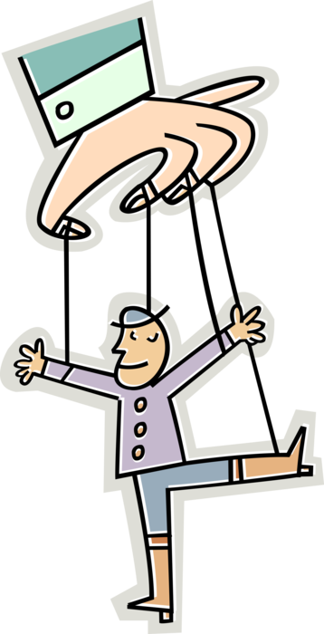

I servomotori sono motori speciali che non si limitano a ruotare come una ruota. Invece, possono muoversi in una posizione specifica e mantenere quella posizione. Immagina di giocare a "Simon dice", e Simon dice: "Alza il braccio ad un angolo di 90 gradi!" Puoi farlo, giusto? Questo perché, proprio come un servo, puoi controllare esattamente quanto muovere il tuo braccio.

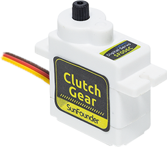

* Filo marrone: GND
* Filo arancione: Pin del segnale, da collegare al pin PWM della scheda principale.
* Filo rosso: VCC

Proprio come puoi controllare le tue braccia per muoverle in posizioni precise, possiamo usare i servomotori per controllare esattamente la posizione degli oggetti nei nostri progetti. Nel nostro Rover marziano, useremo un servo per controllare il movimento su e giù del meccanismo di inclinazione, proprio come quando annui con la testa su e giù.

Nel prossimo passaggio, faremo un affascinante viaggio all'interno di un servomotore per capire come funziona. Eccitante, vero? Andiamo!

Come Funziona un Servo?
-------------------------------------------

Quindi, come fa un servo a compiere la sua magia? Facciamo un entusiasmante viaggio all'interno di un servo!

Se potessimo dare un'occhiata all'interno di un servo, vedremmo alcune parti. Al cuore di un servo c'è un motore normale, molto simile ai motori che fanno girare le ruote del nostro Rover marziano. Avvolto attorno al motore, c'è un grande ingranaggio collegato a un ingranaggio più piccolo sull'albero del motore. Questo è il modo in cui il movimento veloce e circolare del motore viene trasformato in un movimento più lento ma più potente.

.. image:: ../img/servo_internal.png
    :align: center

Ma non è questo che rende speciale un servo. La magia avviene in un piccolo componente elettronico chiamato "potenziometro" e nella "circuiteria di controllo". Ecco come funziona: quando il servo si muove, il potenziometro ruota e cambia la sua resistenza. La circuiteria di controllo misura questo cambiamento di resistenza e sa esattamente in che posizione si trova il servo. Ingegnoso, vero?

Per controllare un servo, gli inviamo un tipo speciale di segnale chiamato "modulazione della larghezza di impulso" o PWM. Modificando la larghezza di questi impulsi, possiamo controllare esattamente quanto si muove il servo e mantenerlo in quella posizione.

Nel prossimo passaggio, impareremo a controllare un servo utilizzando un'APP. Pronti per qualche magia sotto forma di codice? Andiamo!

Esploriamo il Sistema di Inclinazione del Rover Marziano
-------------------------------------------------------------------

**Impostare l'Angolo del Gimbal**

1. Controlla l'angolo del servo e potrai vedere l'angolo attuale sul palcoscenico.

2. Trascina un blocco ``imposta angolo del servo a 90 gradi``. Cliccalo e vedrai il GalaxyRVR rivolto in avanti.

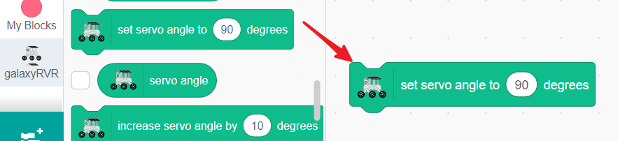

3. Modifica il valore a 45 e cliccalo, vedrai il GalaxyRVR guardare verso l'alto.

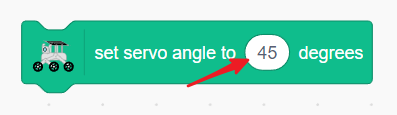

4. Attraverso più prove, scoprirai che il gimbal del GalaxyRVR può muoversi tra 0 e 135 gradi. Man mano che l'angolo aumenta, il gimbal si abbassa.

**Modificare l'Angolo del Gimbal**

1. Il sistema di gimbal del servo del GalaxyRVR è una struttura raffinata a un solo grado di libertà, quindi devi solo controllare le sue funzioni di "reset", "muovi verso l'alto" e "muovi verso il basso".

.. raw:: html

     

2. Ora creiamo il suo pulsante di reset. Trascina un blocco ``quando questo sprite viene cliccato``.

3. Incorpora un blocco ``imposta angolo del servo a 90 gradi`` per fare in modo che il gimbal si rivolga in avanti.

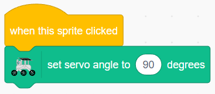

4. Trascina un blocco ``quando freccia su viene premuta``.

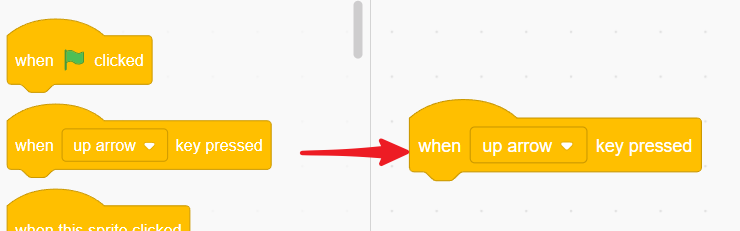

5. Diminuisci l'angolo del servo quando viene premuta la freccia su.

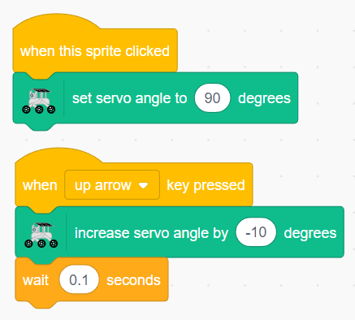

6. Allo stesso modo, aggiungi un evento per la freccia giù per far guardare il gimbal verso il basso.

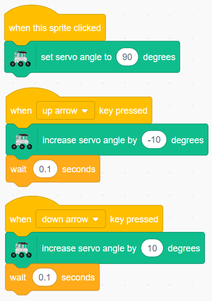

Ora, clicca il pulsante a schermo intero per ingrandire il palcoscenico. Premi su e giù per regolare l'angolo del gimbal e clicca sullo sprite per reimpostare l'angolo.

.. _tilt_system:

Tocca l'Area del Palcoscenico per Regolare l'Angolo del Gimbal
---------------------------------------------------------------------

Successivamente, utilizzeremo uno sprite a forma di freccia per ottenere regolazioni più fluide dell'angolo del servo.

Quando tocchiamo la freccia, possiamo trascinare la direzione dello sprite freccia.

1. Elimina lo sprite originale.

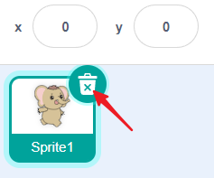

2. Aggiungi uno sprite Freccia. Imposteremo la direzione del gimbal in base al suo orientamento.

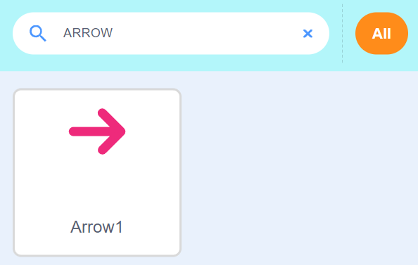

3. Un blocco ``quando questo sprite viene cliccato`` è esattamente ciò di cui abbiamo bisogno.

4. Lascia che il programma si ripeta finché non rilasciamo il tocco, il che significa che non tocchiamo più lo sprite.

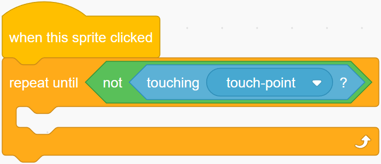

3. Trascina un blocco ``punta verso touch_position`` per fare in modo che lo sprite si rivolga verso la posizione toccata.

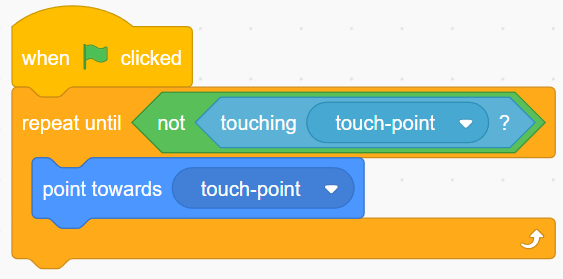

4. Trascina un blocco ``imposta angolo del servo a 90 gradi`` e incorpora un blocco ``direzione`` per allineare l'angolo del gimbal con l'orientamento dello sprite freccia. In questo modo, quando cambiamo la direzione dello sprite freccia (cioè tocchiamo l'area del palcoscenico), possiamo modificare l'angolo del gimbal.

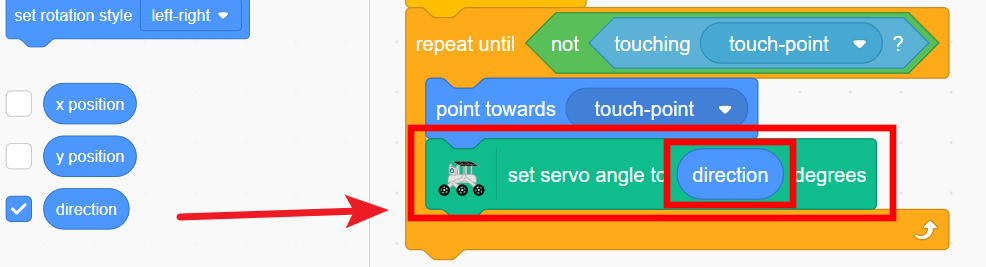

5. Aggiungi un controllo dei limiti per assicurarti che l'orientamento dello sprite freccia non superi i 135 gradi.

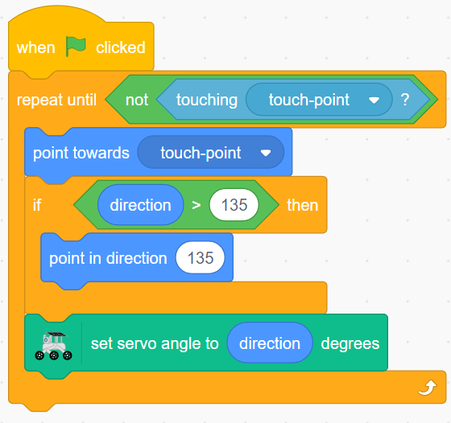

6. Allo stesso modo, assicurati che il suo orientamento non scenda sotto i 0 gradi.

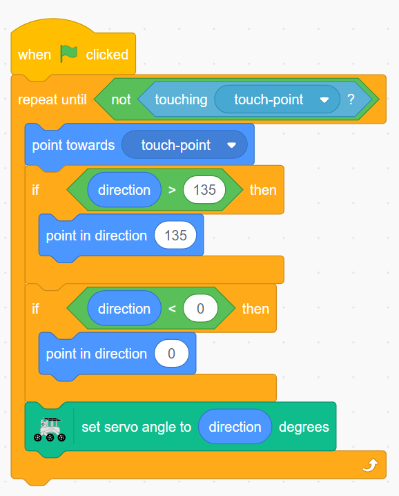

Tocca lo sprite e cambierà direzione man mano che lo trascini, modificando l'angolo del gimbal.

Se trovi facile scivolare via con il dito dallo sprite freccia, puoi aumentare di conseguenza le dimensioni dello sprite.

Blocchi Relativi ai Servomotori
----------------------------------------

Questo blocco viene utilizzato per impostare l'angolo del servo. L'intervallo è compreso tra 0 e 180 gradi (tuttavia, a causa delle limitazioni strutturali, l'intervallo effettivamente utilizzabile è 0-135 gradi).

Questo blocco aumenta (o diminuisce) l'angolo del servo. Il valore può essere negativo.

L'angolo attuale del servo.
