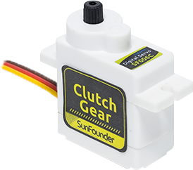
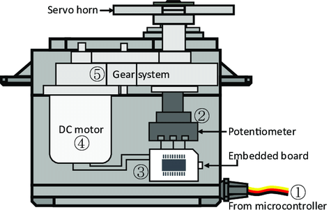

.. note::

    Ciao, benvenuto nella community SunFounder per appassionati di Raspberry Pi, Arduino e ESP32 su Facebook! Approfondisci la tua conoscenza di Raspberry Pi, Arduino e ESP32 con altri appassionati.

    **Perché unirsi?**

    - **Supporto esperto**: Risolvi problemi post-vendita e sfide tecniche con l'aiuto della nostra community e del nostro team.
    - **Impara e condividi**: Scambia consigli e tutorial per migliorare le tue competenze.
    - **Anteprime esclusive**: Ottieni accesso anticipato agli annunci di nuovi prodotti e anteprime.
    - **Sconti speciali**: Goditi sconti esclusivi sui nostri prodotti più recenti.
    - **Promozioni festive e omaggi**: Partecipa a omaggi e promozioni festive.

    👉 Pronto a esplorare e creare con noi? Clicca [|link_sf_facebook|] e unisciti oggi!

Lezione 11: Controllare l'inclinazione della fotocamera del tuo Rover
=====================================================================

Dai al tuo Mars Rover una fotocamera mobile! Proprio come puoi annuire con la testa su e giù, il tuo rover ora può inclinare la sua fotocamera per esplorare il paesaggio marziano da diverse angolazioni.

Useremo un motore speciale chiamato "servo" che può muoversi in posizioni esatte - perfetto per controllare l'inclinazione della fotocamera del tuo rover. Impara a programmare il servo per guardare in alto verso le montagne marziane o in basso verso rocce interessanti!

.. raw:: html

    <video width="600" loop autoplay muted>
        <source src="../_static/video/servo_range.mp4" type="video/mp4">
        Your browser does not support the video tag.
    </video>

Obiettivi di apprendimento
--------------------------

* Scoprire come funziona un servo
* Imparare a controllare gli angoli della fotocamera usando semplici blocchi di codice
* Creare progetti interattivi che ti permettono di inclinare la fotocamera con controlli touch

Cos'è un servo?
----------------------------------------

Ecco il servo - il muscolo mobile del tuo robot!

Proprio come puoi muovere il braccio esattamente nella posizione giusta, un servomotore può muoversi ad angoli specifici e mantenerli perfettamente. Pensalo come un motore intelligente che sa esattamente dove fermarsi.

**Connessioni semplici:**

- Cavo marrone: Massa (-)
- Cavo rosso: Alimentazione (+)
- Cavo arancione: Segnale (dice al servo dove muoversi)

Nel tuo Mars Rover, il servo funge da testa che annuisce - muovendo la fotocamera su e giù per catturare la visuale perfetta!

Come funziona un servo?
-------------------------------------------

All'interno di ogni servo, c'è un team intelligente che lavora insieme:

1. **Motore normale** - Gira veloce come le ruote del tuo rover
2. **Ingranaggi** - Rallentano il movimento e lo rendono più forte
3. **Circuito cervello** - Sa esattamente in quale posizione si trova il servo
4. **Sensore di posizione** - Riporta dove sta puntando il servo

Controlliamo i servi usando segnali speciali che dicono "muoviti a questo angolo esatto!" È come dire a un amico esattamente quanto girare la testa.

Pronto a far ballare il tuo servo? Iniziamo a programmare!

Controllare il sistema di inclinazione del tuo Rover
----------------------------------------------------

Impariamo a controllare il sistema di inclinazione del tuo Mars Rover - la parte che muove la fotocamera su e giù come una testa che annuisce!

**Impostazione dell'angolo della fotocamera**

1. Prima, :ref:`app_connect`.

2. Controlla l'angolo corrente del servo - lo vedrai visualizzato sullo stage.

   .. image:: img/10_servo_angle.png

3. Trascina un blocco ``set servo angle to 90 degrees``. Cliccalo per far guardare il tuo rover in avanti.

   .. image:: img/10_servo_set_angle.png

4. Cambia il valore a 45 e clicca - ora il tuo rover guarda verso il cielo marziano!

   .. image:: img/10_servo_set_angle_45.png

5. Sperimenta con diversi angoli! Scoprirai che il tuo rover può inclinarsi tra 0-135 gradi.

**Creazione dei controlli della fotocamera**

1. Costruiamo un pannello di controllo per la fotocamera del tuo rover:

2. Crea un pulsante di reset - trascina un blocco ``when this sprite clicked``.

   .. image:: img/10_servo_when_click.png

3. Aggiungi ``set servo angle to 90 degrees`` per far guardare di nuovo la fotocamera in avanti.

   .. image:: img/10_servo_when_90.png

4. Aggiungi controlli su/giù - trascina i blocchi ``when up arrow key pressed`` e ``when down arrow key pressed``.

   .. image:: img/10_servo_when_up.png

5. Programma la freccia su per diminuire l'angolo (guarda in alto).

   .. image:: img/10_servo_when_up2.png

6. Programma la freccia giù per aumentare l'angolo (guarda in basso).

   .. image:: img/10_servo_when_down.png

Ora clicca il pulsante a schermo intero e prendi il controllo! Usa i tasti freccia per regolare la visuale del tuo rover e clicca lo sprite per resettare. Sei l'operatore della fotocamera!

.. _tilt_system:

Controllo touch per l'angolo della fotocamera
-------------------------------------------------------------

Crea una fotocamera controllata al tocco! Trascina una freccia per puntare la fotocamera del tuo rover esattamente dove vuoi.

1. Pulisci lo stage eliminando qualsiasi sprite esistente.

   .. image:: img/6_animate_delete.png

2. Aggiungi uno sprite Arrow da usare come controller touch.

   .. image:: img/10_servo_arrow.png

3. Inizia con ``when this sprite clicked`` per avviare il controllo touch.

   .. image:: img/6_animate_when_touch.png
       :width: 200

4. Crea un ciclo che viene eseguito mentre tocchi la freccia.

   .. image:: img/6_animate_repeat_touching.png
       :width: 400

5. Fai puntare la freccia verso il tuo dito mentre trascini.

   .. image:: img/10_servo_arrow_point_toward.png
       :width: 400

6. Collega la direzione della freccia all'angolo della fotocamera - ruota la freccia, muovi la fotocamera!

   .. image:: img/10_servo_arrow_angle_direction.png
       :width: 800

7. Imposta limiti per mantenere la fotocamera tra 0-135 gradi.

   .. image:: img/10_servo_arrow_135.png
       :width: 400

   .. image:: img/10_servo_arrow_0.png
       :width: 400

Tocca e trascina la freccia per puntare la fotocamera del tuo rover! Fai muovere la freccia dolcemente e rispondere istantaneamente al tuo tocco per una sensazione di controllo realistica.

Blocchi di controllo servo
-------------------------------

* Imposta il servo a un angolo specifico (0-135 gradi)

  .. image:: img/block/servo_set_angle.png

* Aumenta o diminuisci l'angolo del servo (usa numeri negativi per diminuire)

  .. image:: img/block/servo_increase_angle.png

* Controlla l'angolo corrente del servo

  .. image:: img/block/servo_value.png