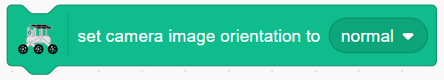

.. note::

    Ciao, benvenuto nella community di SunFounder Raspberry Pi & Arduino & ESP32 Enthusiasts su Facebook! Approfondisci Raspberry Pi, Arduino ed ESP32 insieme ad altri appassionati.

    **Perché unirsi?**

    - **Supporto Esperto**: Risolvi i problemi post-vendita e le sfide tecniche con l'aiuto della nostra comunità e del nostro team.
    - **Impara & Condividi**: Scambia suggerimenti e tutorial per migliorare le tue competenze.
    - **Anteprime Esclusive**: Accedi in anticipo agli annunci dei nuovi prodotti e alle anticipazioni.
    - **Sconti Speciali**: Approfitta di sconti esclusivi sui nostri prodotti più recenti.
    - **Promozioni e Giveaway Festivi**: Partecipa a concorsi e promozioni durante le festività.

    👉 Pronto a esplorare e creare con noi? Clicca su [|link_sf_facebook|] e unisciti oggi stesso!

Lezione 12 Sistema della Fotocamera
================================================

Bentornati, giovani esploratori! Nella scorsa lezione, abbiamo dotato il nostro GalaxyRVR della capacità di "annuire" grazie a un meccanismo di inclinazione. Ora è il momento di dare al nostro Rover gli "occhi" – la fotocamera!

In questo emozionante viaggio, ci immergeremo nell'installazione del sistema della fotocamera del Rover. Imparerai come trasmettere le immagini catturate dalla fotocamera del Rover all'APP, così da poter vedere in tempo reale ciò che vede il Rover. Immagina l'emozione di esplorare il paesaggio marziano dal punto di vista del Rover!

Questa funzione offre un'esperienza ancora più interattiva e coinvolgente con il nostro GalaxyRVR. Restate sintonizzati per altre avventure!

.. image:: img/11_camera_image.png

Obiettivi di apprendimento
------------------------------

* Imparare a vedere con precisione tutto ciò che vede il Mars Rover in tempo reale.
* Capire come combinare l'input della fotocamera e il controllo del servo per migliorare l'interattività del progetto.

Materiali
-------------

* Smartphone o tablet
* APP Mammoth Coding
* GalaxyRVR

Introduzione all'ESP32 CAM
-------------------------------------------------------

Nella nostra precedente avventura, abbiamo dotato il Mars Rover di una coppia di "occhi" integrando l'ESP32 CAM. Oggi, approfondiremo il suo funzionamento e lo faremo "vedere" realmente.

.. image:: ../img/esp32_cam.png
    :width: 400
    :align: center

L'ESP32 CAM, che funge da occhi del nostro Rover, è un piccolo ma potente modulo. Non solo integra funzionalità Wi-Fi e Bluetooth, ma dispone anche di una fotocamera compatta che aiuta il nostro Rover a catturare immagini dell'ambiente circostante.

Proprio come usiamo i nostri occhi per osservare il mondo, l'ESP32 CAM può "vedere" ciò che si trova davanti al Rover e inviare questi dati visivi al nostro smartphone o computer, permettendoci di vedere tutto in tempo reale!

È come se stessimo pilotando direttamente il Rover, osservando non solo il Rover stesso, ma anche il mondo che esplora! Incredibile, vero? Allora, esploriamolo più a fondo...

.. _camera_system:

Esploriamo il Sistema Visivo del Rover Marziano
----------------------------------------------------

1. Trascina un blocco ``accendi la fotocamera``. Cliccalo e vedrai lo sfondo del palcoscenico mostrare il feed della fotocamera.

.. image:: img/11_camera_on.png
.. :align: center

2. Se il feed della fotocamera appare invertito, un blocco ``imposta orientamento immagine fotocamera su invertito`` può aiutarti a correggerlo.

.. image:: img/11_camera_orientation.png
.. :align: center

3. Trascina un blocco ``accendi LED fotocamera``. Cliccalo e il LED accanto alla fotocamera del GalaxyRVR si illuminerà.

.. image:: img/11_camera_led.png
.. :align: center

**Clicca sullo Sprite per Accendere la Fotocamera**

1. Ora che sappiamo come controllare il modulo della fotocamera, crea quattro nuovi sprite per controllare la fotocamera e il suo LED. Regola le loro dimensioni per renderli armoniosi.

.. image:: img/11_camera_4.png
.. :align: center

2. Programma ogni sprite: cliccando su ball 1 si spegnerà la fotocamera.

.. image:: img/11_camera_1sp.png
.. :align: center

3. Cliccando su ball 2 si accenderà la fotocamera e si imposterà l'orientamento dell'immagine.

.. image:: img/11_camera_2sp.png
.. :align: center

4. Cliccando su ball 3 si accenderà il LED.

.. image:: img/11_camera_3sp.png
.. :align: center

5. Cliccando su ball 4 si spegnerà il LED.

.. image:: img/11_camera_4sp.png
.. :align: center

6. Per risparmiare spazio sul palcoscenico, impila ogni serie di controlli.

.. image:: img/11_camera_fold.png
.. :align: center

7. Aggiungi un blocco ``vai al livello posteriore`` per ogni sprite. Quando viene cliccato, lo sprite si sposterà al livello posteriore, rivelando lo sprite successivo, creando un effetto di alternanza.

.. image:: img/11_camera_layer.png
.. :align: center

Blocchi Relativi alla Fotocamera
------------------------------------

Accendi (o spegni) il modulo fotocamera. Una volta attivato, lo sfondo del palcoscenico cambierà per mostrare la visuale della fotocamera.

Accendi (o spegni) il LED supplementare sul modulo fotocamera.

Imposta l'opacità della visuale della fotocamera.

Imposta l'orientamento della visuale della fotocamera. Puoi usare questo blocco per capovolgere l'immagine.
