.. note::

    Hello, welcome to the SunFounder Raspberry Pi & Arduino & ESP32 Enthusiasts Community on Facebook! Dive deeper into Raspberry Pi, Arduino, and ESP32 with fellow enthusiasts.

    **Why Join?**

    - **Expert Support**: Solve post-sale issues and technical challenges with help from our community and team.
    - **Learn & Share**: Exchange tips and tutorials to enhance your skills.
    - **Exclusive Previews**: Get early access to new product announcements and sneak peeks.
    - **Special Discounts**: Enjoy exclusive discounts on our newest products.
    - **Festive Promotions and Giveaways**: Take part in giveaways and holiday promotions.

    👉 Ready to explore and create with us? Click [|link_sf_facebook|] and join today!

Lesson 12 Camera System
================================================

Welcome back, young explorers! In the last lesson, we equipped our GalaxyRVR with the ability to "nod" using a tilt mechanism. Now, it's time to give our Rover "eyes" - the camera!

In this thrilling journey, we'll dive into the setup of the Rover's camera system. You'll learn how to relay the visuals captured by the Rover's camera to the APP, so you can see exactly what the Rover sees in real-time. Imagine the excitement of experiencing the Martian landscape from the Rover's perspective!

This offers an even more interactive and engaging experience with our GalaxyRVR. Stay tuned for more adventures!

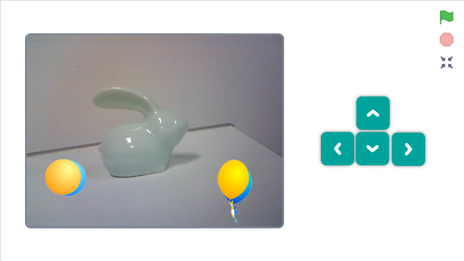

Learning Objectives
-------------------------

* Learn how to accurately see everything the Mars Rover sees in real-time.
* Understand how to combine camera input and servo control to enhance project interactivity.

Materials
-----------

* Smartphone or tablet
* Mammoth Coding APP
* GalaxyRVR

Introduction to ESP32 CAM
-------------------------------------------------------

In our previous adventure, we equipped our Mars Rover with a pair of "eyes" by integrating the ESP32 CAM. Today, we're going to learn more about it and actually make it "see."

.. image:: ../img/esp32_cam.png
    :width: 400
    :align: center

The ESP32 CAM, acting like the eyes of our Rover, is a small yet powerful module. Not only does it integrate Wi-Fi and Bluetooth functionalities, but it also comes with a compact camera. This camera helps our Rover capture images of its surroundings.

Just like we use our eyes to observe our environment, the ESP32 CAM can "see" what lies ahead for the Rover, then send these visual data to our smartphone or computer. This allows us to see everything the Rover sees in real-time!

It's as if we're piloting the Rover directly, observing not just the Rover itself, but also the world it explores! Incredible, isn't it? So, let's dive deeper into it...

.. _camera_system:

Exploring the Mars Rover Visual System
----------------------------------------------------

1. Drag a ``turn camera ON`` block. Click it, and you'll see the background of the stage display the camera's feed.

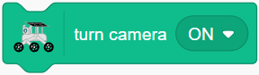

2. If you see the camera feed inverted, a ``set camera image orientation to inverted`` block can help you correct it.

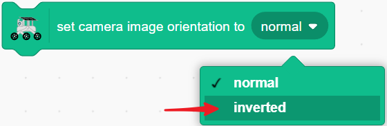

3. Drag a ``turn camera LED ON`` block. Click it, and the LED next to the GalaxyRVR camera will light up.

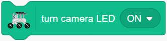

**Click the Sprite to Turn On the Camera**

4. Now that we know how to control the camera module, create four new sprites to control the camera and its LED. Adjust their sizes to make them look harmonious.

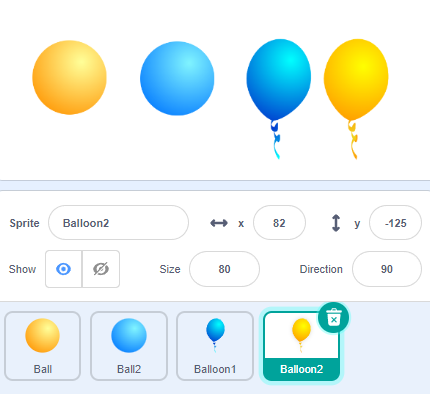

5. Program each sprite: clicking sprite 1 will turn off the camera.

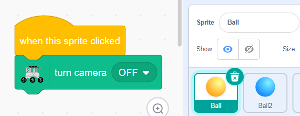

6. Clicking sprite 2 will turn on the camera and set the image orientation.

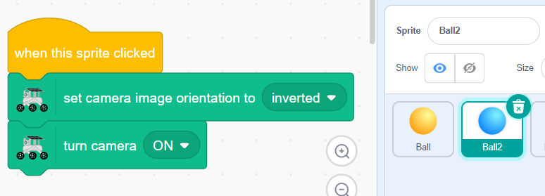

7. Clicking sprite 3 will turn on the LED.

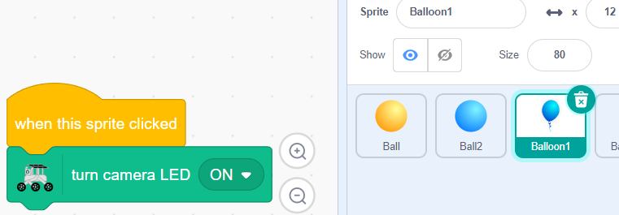

8. Clicking sprite 4 will turn off the LED.

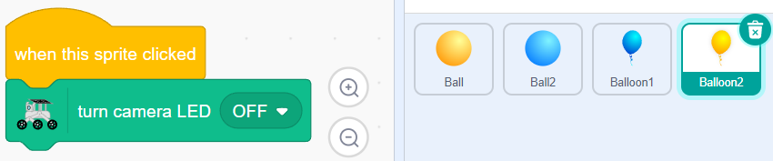

9. To save space on the stage, stack each set of controls.

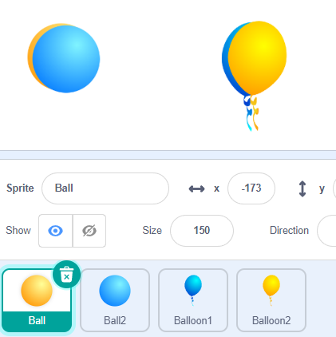

10. Add a ``go to back layer`` block for each sprite. When clicked, the sprite will move to the back layer, revealing the next sprite, creating a toggle effect.

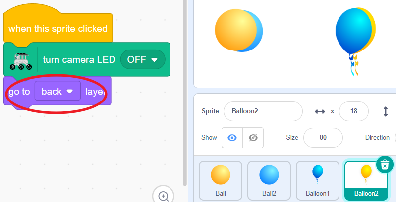

Camera-Related Blocks
-------------------------------

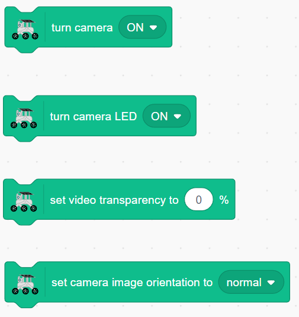

