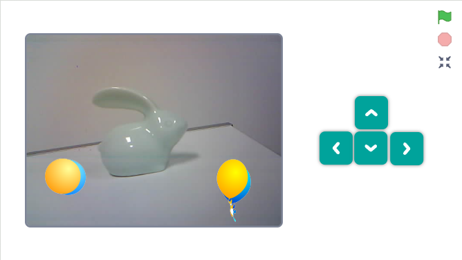
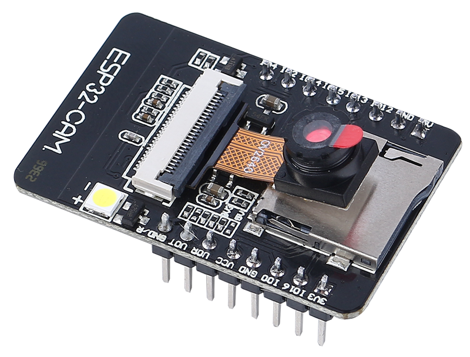

.. note::

    Hello, welcome to the SunFounder Raspberry Pi & Arduino & ESP32 Enthusiasts Community on Facebook! Dive deeper into Raspberry Pi, Arduino, and ESP32 with fellow enthusiasts.

    **Why Join?**

    - **Expert Support**: Solve post-sale issues and technical challenges with help from our community and team.
    - **Learn & Share**: Exchange tips and tutorials to enhance your skills.
    - **Exclusive Previews**: Get early access to new product announcements and sneak peeks.
    - **Special Discounts**: Enjoy exclusive discounts on our newest products.
    - **Festive Promotions and Giveaways**: Take part in giveaways and holiday promotions.

    👉 Ready to explore and create with us? Click [|link_sf_facebook|] and join today!

Lesson 12: See Through Your Rover's Eyes
================================================

Now that your rover can nod its camera, let's give it real vision! In this lesson, you'll learn how to see exactly what your Mars Rover sees through its camera.

Watch live video from your rover's perspective as it explores - see Martian landscapes, discover interesting rocks, and navigate like a real space explorer!

Learning Objectives
-------------------------

* View live camera footage from your Mars Rover in real-time
* Combine camera viewing with servo control for interactive exploration

Meet Your Rover's Eyes: ESP32 CAM
-------------------------------------------------------

Say hello to the ESP32 CAM - your rover's powerful vision system! This amazing module is like giving your rover super-smart eyes.

The ESP32 CAM does two incredible things:

1. **Takes photos and video** of whatever your rover is looking at
2. **Sends the video** directly to your phone or computer

It's like being right there on Mars with your rover! You'll see everything it sees, in real time. Ready to start exploring through your rover's eyes?

.. _camera_system:

Exploring Your Rover's Camera System
----------------------------------------------------

1. Drag a ``turn camera ON`` block and click it - watch the stage turn into a live camera view from your rover!

   .. image:: img/11_camera_on.png

2. If the camera view appears upside down, use ``set camera image orientation to inverted`` to fix it.

   .. image:: img/11_camera_orientation.png

3. Need more light? Use ``turn camera LED ON`` to activate the camera's built-in light.

   .. image:: img/11_camera_led.png

**Create Camera Control Buttons**

1. Let's build a camera control panel! Create four sprites and arrange them neatly.

   .. image:: img/11_camera_4.png

2. Program each button:

   - Ball 1: Turns camera OFF
   
   .. image:: img/11_camera_1sp.png
   
   - Ball 2: Turns camera ON and sets orientation
   
   .. image:: img/11_camera_2sp.png
   
   - Balloon 1: Turns LED ON
   
   .. image:: img/11_camera_3sp.png
   
   - Balloon 2: Turns LED OFF
   
   .. image:: img/11_camera_4sp.png

3. Save space by stacking the controls - they'll pop out when needed!

   .. image:: img/11_camera_fold.png

4. Add ``go to back layer`` to each sprite - clicking one button reveals the next, creating a cool toggle effect.

   .. image:: img/11_camera_layer.png

5. Click the stage expansion button to enter the full control mode.

   .. image:: img/11_camera_go_stage.png

6. You'll now watch live video from your rover's perspective as it explores - see Martian landscapes, discover interesting rocks, and navigate like a real space explorer!

   .. image:: img/11_camera_image.png

Camera Control Blocks
-------------------------------

* Turn the camera on or off. When on, the stage shows live video from your rover!

  .. image:: img/block/camera_turn.png

* Control the camera's LED light - perfect for dark explorations.

  .. image:: img/block/camera_led_turn.png

* Adjust how see-through the camera view appears.

  .. image:: img/block/camera_transp.png

* Flip the camera view if it appears upside down.

  .. image:: img/block/camera_orientation.png

