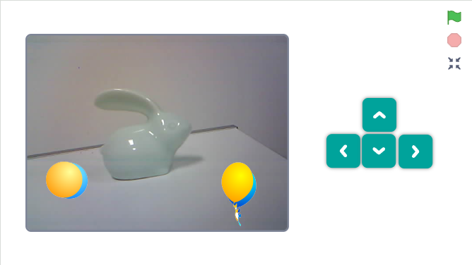
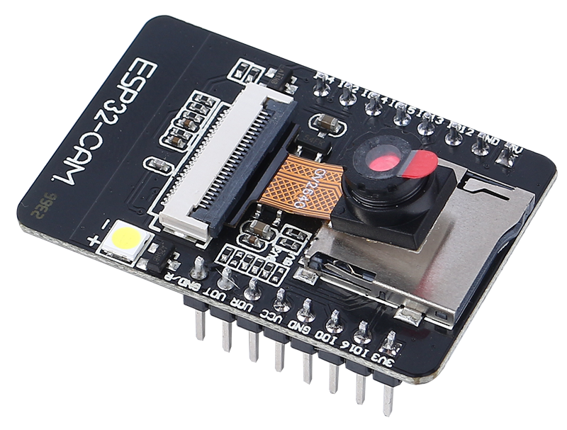

.. include:: /index.rst
   :start-after: start_hello_message
   :end-before: end_hello_message

Lección 12: Ve a Través de los Ojos de tu Rover
================================================

Ahora que tu rover puede mover su cámara, ¡vamos a darle visión real! En esta lección, aprenderás a ver exactamente lo que tu Mars Rover ve a través de su cámara.

Observa el video en vivo desde la perspectiva de tu rover mientras explora: mira paisajes marcianos, descubre rocas interesantes y navega como un verdadero explorador espacial.

Objetivos de Aprendizaje
-------------------------

* Ver imágenes de la cámara en vivo desde tu Mars Rover en tiempo real
* Combinar la visualización de la cámara con el control del servo para una exploración interactiva

Conoce los Ojos de tu Rover: ESP32 CAM
-------------------------------------------------------

¡Saluda al ESP32 CAM, el potente sistema de visión de tu rover! Este increíble módulo es como darle a tu rover ojos superinteligentes.

El ESP32 CAM hace dos cosas increíbles:

1. **Toma fotos y videos** de lo que tu rover está mirando
2. **Envía el video** directamente a tu teléfono o computadora

¡Es como estar allí en Marte con tu rover! Verás todo lo que él ve, en tiempo real. ¿Listo para empezar a explorar a través de los ojos de tu rover?

.. _camera_system:

Explorando el Sistema de Cámara de tu Rover
----------------------------------------------------

1. Arrastra un bloque ``turn camera ON`` y haz clic en él: ¡observa cómo el escenario se convierte en una vista de cámara en vivo desde tu rover!

   .. image:: img/11_camera_on.png

2. Si la vista de la cámara aparece al revés, usa ``set camera image orientation to inverted`` para corregirlo.

   .. image:: img/11_camera_orientation.png

3. ¿Necesitas más luz? Usa ``turn camera LED ON`` para activar la luz integrada de la cámara.

   .. image:: img/11_camera_led.png

**Crear Botones de Control de Cámara**

1. ¡Construyamos un panel de control de cámara! Crea cuatro objetos y organízalos ordenadamente.

   .. image:: img/11_camera_4.png

2. Programa cada botón:

   - Ball 1: Apaga la cámara (OFF)

   .. image:: img/11_camera_1sp.png

   - Ball 2: Enciende la cámara (ON) y configura la orientación

   .. image:: img/11_camera_2sp.png

   - Balloon 1: Enciende el LED (ON)

   .. image:: img/11_camera_3sp.png

   - Balloon 2: Apaga el LED (OFF)

   .. image:: img/11_camera_4sp.png

3. Ahorra espacio apilando los controles: ¡aparecerán cuando los necesites!

   .. image:: img/11_camera_fold.png

4. Agrega ``go to back layer`` a cada objeto: al hacer clic en un botón se revela el siguiente, creando un interesante efecto de alternancia.

   .. image:: img/11_camera_layer.png

5. Haz clic en el botón de expansión del escenario para entrar en el modo de control completo.

   .. image:: img/11_camera_go_stage.png

6. Ahora verás video en vivo desde la perspectiva de tu rover mientras explora: mira paisajes marcianos, descubre rocas interesantes y navega como un verdadero explorador espacial.

   .. image:: img/11_camera_image.png

Bloques de Control de Cámara
-------------------------------

* Enciende o apaga la cámara. Cuando está encendida, ¡el escenario muestra video en vivo desde tu rover!

  .. image:: img/block/camera_turn.png

* Controla la luz LED de la cámara, perfecta para exploraciones en la oscuridad.

  .. image:: img/block/camera_led_turn.png

* Ajusta la transparencia de la vista de la cámara.

  .. image:: img/block/camera_transp.png

* Voltea la vista de la cámara si aparece al revés.

  .. image:: img/block/camera_orientation.png
