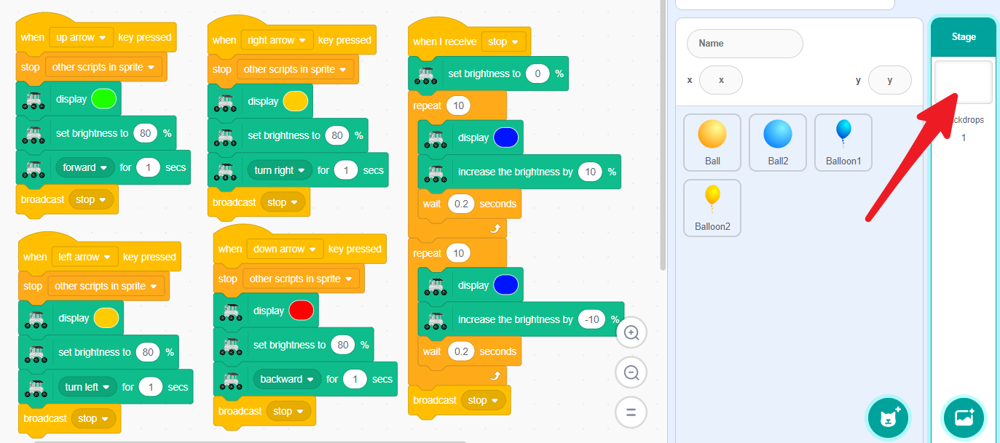
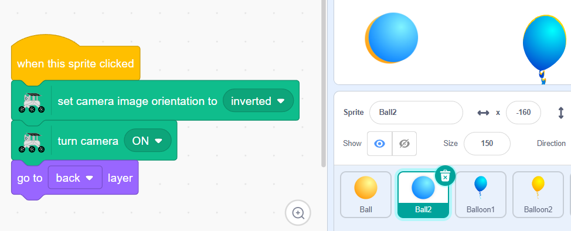

.. note::

    Hello, welcome to the SunFounder Raspberry Pi & Arduino & ESP32 Enthusiasts Community on Facebook! Dive deeper into Raspberry Pi, Arduino, and ESP32 with fellow enthusiasts.

    **Why Join?**

    - **Expert Support**: Solve post-sale issues and technical challenges with help from our community and team.
    - **Learn & Share**: Exchange tips and tutorials to enhance your skills.
    - **Exclusive Previews**: Get early access to new product announcements and sneak peeks.
    - **Special Discounts**: Enjoy exclusive discounts on our newest products.
    - **Festive Promotions and Giveaways**: Take part in giveaways and holiday promotions.

    👉 Ready to explore and create with us? Click [|link_sf_facebook|] and join today!

Lesson 13 Realtime Control
=======================================

We have now explored most of the features of the GalaxyRVR. To complete our journey and transform the GalaxyRVR into a fully functional robot, we need to combine the three main components we've covered.

1. :ref:`rgb_move` : This section includes movement and lighting effects.

2. :ref:`tilt_system` : This part involves adjusting the direction of the camera gimbal.

3. :ref:`camera_system` : This part includes the camera and LED control features.

**Move & RGB System**

Let's enhance the movement functionalities. We have already coded these in the :ref:`rgb_move` section.

We recommend placing these code blocks in the Backdrops. This way, modifying the sprite's code won't affect this functionality.

**Tilt System**

This part is the same as the :ref:`tilt_system`. Simply repeat the steps.

.. image:: img/10_servo_arrow_0.png
    :align: center

**Camera System**

For this part, repeat the steps from :ref:`camera_system`.

Now, you can click the sprites to turn the camera and LED on or off, and use the arrow keys to move the GalaxyRVR.

.. image:: img/13_camera_go_all2.png.png
    :align: center

