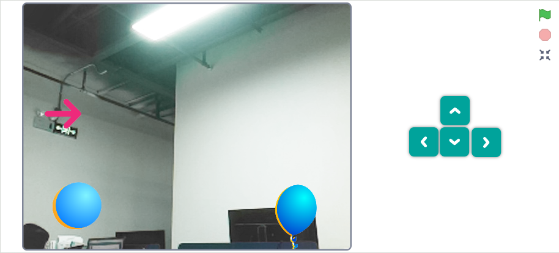
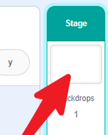
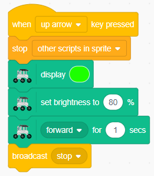
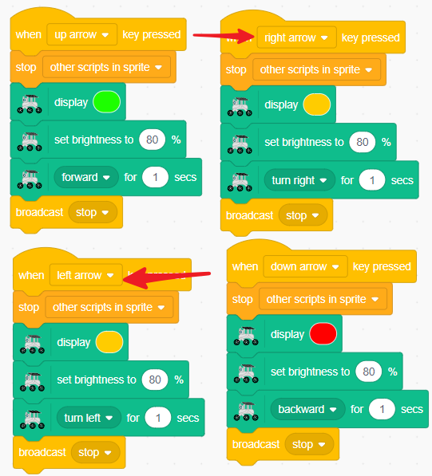
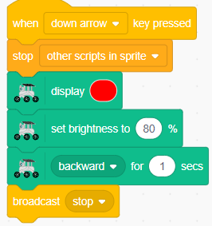
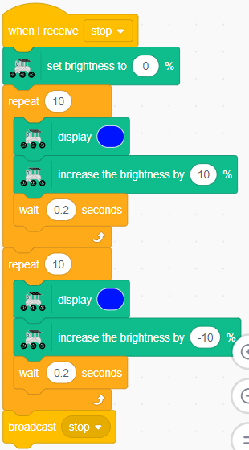

.. note::

    Bonjour et bienvenue dans la communauté des passionnés de SunFounder Raspberry Pi, Arduino et ESP32 sur Facebook ! Plongez plus profondément dans le monde du Raspberry Pi, de l'Arduino et de l'ESP32 avec d'autres passionnés.

    **Pourquoi nous rejoindre ?**

    - **Support d'experts** : Résolvez les problèmes après-vente et les défis techniques avec l'aide de notre communauté et de notre équipe.
    - **Apprendre & Partager** : Échangez des astuces et des tutoriels pour améliorer vos compétences.
    - **Aperçus exclusifs** : Accédez en avant-première aux annonces de nouveaux produits et aux aperçus.
    - **Réductions spéciales** : Profitez de réductions exclusives sur nos derniers produits.
    - **Promotions festives et concours** : Participez à des concours et des promotions pendant les fêtes.

    👉 Prêt à explorer et créer avec nous ? Cliquez sur [|link_sf_facebook|] et rejoignez-nous dès aujourd'hui !

Leçon 13 Contrôle en Temps Réel
=======================================

Nous avons maintenant exploré la plupart des fonctionnalités du GalaxyRVR. 
Pour compléter notre voyage et transformer le GalaxyRVR en un robot pleinement fonctionnel, 
nous devons combiner les trois parties principales que nous avons abordées.

    * :ref:`camera_system` : Cette partie comprend les fonctionnalités de contrôle de la caméra et de la LED.

    * :ref:`rgb_move` : Cette section inclut les mouvements et les effets d'éclairage.

    * :ref:`tilt_system` : Cette partie concerne le réglage de la direction du gimbal de la caméra.

Assemblez le tout et vous pourrez cliquer sur les sprites pour allumer ou éteindre la caméra et la LED, et utiliser les touches fléchées pour déplacer le GalaxyRVR.

**Système de Caméra**
------------------------------------

Pour cette partie, répétez les étapes de :ref:`camera_system`.

1. Créez quatre nouveaux sprites pour contrôler la caméra et sa LED. Ajustez leur taille pour qu'ils soient harmonieux.

.. image:: img/11_camera_4.png
.. :align: center

2. Programmez chaque sprite : cliquer sur la balle 1 éteindra la caméra.

.. image:: img/11_camera_1sp.png
.. :align: center

3. Cliquer sur la balle 2 allumera la caméra et réglera l'orientation de l'image.

.. image:: img/11_camera_2sp.png
.. :align: center

4. Cliquer sur le ballon 3 allumera la LED.

.. image:: img/11_camera_3sp.png
.. :align: center

5. Cliquer sur le ballon 4 éteindra la LED.

.. image:: img/11_camera_4sp.png
.. :align: center

6. Pour gagner de l'espace sur la scène, superposez chaque ensemble de contrôles.

.. image:: img/11_camera_fold.png
.. :align: center

7. Ajoutez un bloc ``aller à l'arrière-plan`` pour chaque sprite. Lorsqu'on clique dessus, le sprite se déplacera vers l'arrière-plan, révélant le sprite suivant, créant ainsi un effet de bascule.

.. image:: img/11_camera_layer.png
.. :align: center

**Système de Mouvement & RGB**
----------------------------------

Améliorons les fonctionnalités de mouvement. Nous les avons déjà programmées dans la section :ref:`rgb_move`.

Nous recommandons de placer ces blocs de code dans les Arrière-plans. De cette façon, la modification du code du sprite n'affectera pas cette fonctionnalité.

1. Configurez le GalaxyRVR pour allumer la lumière verte lorsqu'il avance.

2. Configurez le GalaxyRVR pour allumer la lumière rouge lorsqu'il recule.

3. Configurez le GalaxyRVR pour allumer la lumière jaune lorsqu'il tourne à gauche ou à droite.

4. Configurez le GalaxyRVR pour allumer la lumière respirante lorsqu'il est immobile.

Enfin, votre code devrait être comme suit. 
Veuillez noter que ces codes doivent être écrits dans les Arrière-plans.

.. image:: img/11_camera_backdrops.png

**Système d'Inclinaison**
----------------------------

Cette partie est identique à :ref:`tilt_system`. Il suffit de répéter les étapes.

1. Ajoutez un sprite en forme de flèche. Nous réglerons la direction du gimbal en fonction de son orientation.

.. image:: img/10_servo_arrow.png

2. Un bloc ``quand ce sprite cliqué`` est exactement ce dont nous avons besoin.

.. image:: img/6_animate_when_touch.png
    :width: 230

3. Faites en sorte que le programme se répète jusqu'à ce que nous relâchions le sprite, c'est-à-dire que nous ne touchions plus le sprite.

.. image:: img/6_animate_repeat_touching.png
    :width: 550

4. Faites glisser un bloc ``pointer vers position_toucher`` pour faire en sorte que le sprite fasse face à la position de touche.

.. image:: img/10_servo_arrow_point_toward.png

5. Faites glisser un bloc ``réglage angle servo à 90 degrés`` et intégrez un bloc ``direction`` pour aligner l'angle du gimbal avec l'orientation du sprite flèche. Ainsi, lorsque nous changeons la direction du sprite flèche (c'est-à-dire en touchant la zone de la scène), nous pouvons modifier l'angle du gimbal.

.. image:: img/10_servo_arrow_angle_direction.png

6. Ajoutez une vérification de limite pour garantir que l'orientation du sprite flèche ne dépasse pas 135 degrés.

.. image:: img/10_servo_arrow_135.png

7. De même, assurez-vous que son orientation ne tombe pas en dessous de 0 degrés.

.. image:: img/10_servo_arrow_0.png

Touchez le sprite, et il changera de direction au fur et à mesure que vous faites glisser, modifiant ainsi l'angle du gimbal.

Si vous trouvez qu'il est facile de faire glisser votre doigt hors du sprite flèche, vous pouvez augmenter la taille du sprite en conséquence.
